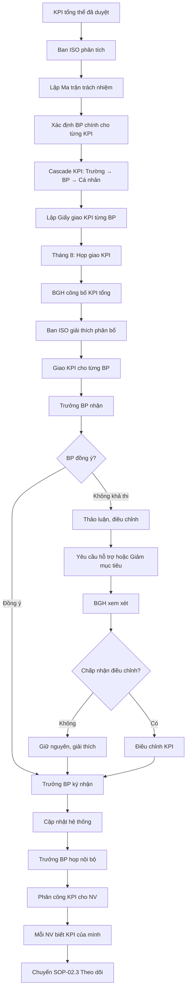

# SOP-02.2: PHÂN BỔ MỤC TIÊU THEO BỘ PHẬN

## 1. THÔNG TIN QUY TRÌNH

| **Thuộc tính** | **Nội dung** |
|---|---|
| Mã SOP | SOP-02.2 |
| Tên quy trình | Phân bổ mục tiêu theo bộ phận |
| Quy trình cha | SOP-02: Mục tiêu chất lượng |
| Phiên bản | 1.0 |
| Tần suất | Hàng năm (Sau khi mục tiêu tổng thể được duyệt) |

## 2. MỤC ĐÍCH

- **Cụ thể hóa trách nhiệm**: Mỗi BP biết rõ phải đạt KPI gì
- **Tạo động lực**: BP có mục tiêu riêng để phấn đấu
- **Dễ đo lường**: Đánh giá hiệu quả từng BP

## 3. PHẠM VI ÁP DỤNG

Tất cả bộ phận, khối lớp

## 4. QUY TRÌNH THỰC HIỆN

### 4.1. Phân tích và phân bổ

**Bước 1: Phân tích KPI tổng thể**

Ban ISO lập Ma trận trách nhiệm (QT04-D07):

| **KPI tổng thể** | **Bộ phận chịu trách nhiệm chính** | **BP phối hợp** |
|---|---|---|
| Điểm hài lòng PH ≥ 85 | **Ban ISO** (Tổ chức khảo sát) | Tất cả |
| % HS Giỏi ≥ 30% | **Phòng Học thuật** | GV các khối |
| Giữ chân NV ≥ 85% | **Phòng Nhân sự** | Các BP |
| Tuân thủ quy trình ≥ 95% | **Ban ISO** (Audit) | Tất cả |
| 10 dự án CI/năm | **Ban ISO** | Tất cả (Đề xuất) |

**Bước 2: "Cascade" (Phân rã) KPI từ trường → BP → Cá nhân**

**Ví dụ:** KPI "Điểm hài lòng PH ≥ 85/100"

**Cấp trường:**
- Điểm hài lòng tổng thể: ≥ 85/100

**Phân rã cho các BP:**

| **Bộ phận** | **Khía cạnh đo** | **Mục tiêu BP** |
|---|---|---|
| **Học thuật** | Hài lòng về chất lượng giảng dạy | ≥ 88/100 |
| **Hành chính** | Hài lòng về CSVC, môi trường | ≥ 82/100 |
| **Tuyển sinh** | Hài lòng về tư vấn, chăm sóc | ≥ 85/100 |
| **Bếp ăn** | Hài lòng về bữa ăn | ≥ 80/100 |
| **Xe đưa đón** | Hài lòng về an toàn, đúng giờ | ≥ 90/100 |

**Phân rã tiếp cho cá nhân:**
- GV chủ nhiệm: Điểm hài lòng PH lớp mình ≥ 85/100

**Bước 3: Lập Giấy giao KPI cho từng BP (QT04-D05)**

### 4.2. Họp giao KPI

**Bước 4: Tổ chức họp giao KPI (Tháng 8, trước năm học)**

**Thành phần:**
- Ban Giám hiệu
- Ban ISO
- Trưởng các bộ phận
- Tổ trưởng, Trưởng khối (nếu có)

**Nội dung:**
- Công bố KPI tổng thể
- Giải thích logic phân bổ
- Giao KPI cho từng BP
- Trưởng BP nhận KPI, giải thích cách đạt

**Bước 5: Thảo luận 2 chiều**

Trưởng BP có quyền:
- Đề xuất điều chỉnh nếu không khả thi
- Yêu cầu hỗ trợ (đào tạo, ngân sách, nhân sự...)
- Đề xuất cách đo khác (nếu hợp lý)

**Bước 6: Điều chỉnh cuối cùng (nếu có)**

**Bước 7: Trưởng BP ký nhận KPI**

Ký vào Giấy giao KPI = Cam kết đạt được

**Bước 8: Cập nhật vào hệ thống quản lý KPI**

- Dashboard hiển thị KPI từng BP
- Tự động nhắc nhở, cảnh báo

### 4.3. Truyền thông nội bộ BP

**Bước 9: Trưởng BP họp BP mình**

- Công bố KPI đã nhận
- Giải thích ý nghĩa, tầm quan trọng
- Phân công cụ thể cho từng người
- Lập kế hoạch hành động

**Bước 10: Mỗi NV trong BP biết rõ KPI của mình**

## 5. LƯU ĐỒ QUY TRÌNH



## 6. BIỂU MẪU LIÊN QUAN

| **Mã** | **Tên** |
|---|---|
| QT04-D07 | Ma trận trách nhiệm KPI |
| QT04-D05 | Giấy giao KPI bộ phận |
| QT04-F03 | Biên bản họp giao KPI |

## 7. TIÊU CHUẨN VÀ CHỈ TIÊU

| **Chỉ tiêu** | **Mục tiêu** |
|---|---|
| 100% BP nhận được KPI rõ ràng | 100% |
| Tỷ lệ BP đồng ý KPI lần đầu | ≥ 80% |
| Tỷ lệ NV hiểu rõ KPI của mình | ≥ 95% |

## 8. TRÁCH NHIỆM CỤ THỂ

| **Vai trò** | **Trách nhiệm** |
|---|---|
| **Ban ISO** | Phân tích, phân bổ, soạn giấy giao KPI |
| **BGH** | Chủ trì họp, giải thích, quyết định điều chỉnh |
| **Trưởng BP** | Nhận KPI, thảo luận, ký cam kết, phân công xuống NV |
| **NV** | Hiểu và thực hiện KPI được giao |

## 9. LƯU Ý QUAN TRỌNG

- ⚠️ **Công bằng**: Phân bổ dựa trên logic rõ ràng, không thiên vị
- ✅ **Tổng các BP = Tổng trường**: KPI BP phải hợp lại thành KPI tổng
- ✅ **Có hỗ trợ**: Giao KPI đi kèm nguồn lực (NS, đào tạo, công cụ...)
- ✅ **Gắn với đánh giá**: KPI BP gắn với đánh giá hiệu suất BP, Thưởng cuối năm
- 🔥 **Không giao KPI không đo được**: Nếu không có cách đo → Không giao

## 10. PHỤ LỤC

### 10.1. Ví dụ Giấy giao KPI

```
GIẤY GIAO MỤC TIÊU CHẤT LƯỢNG

Bộ phận: PHÒNG HỌC THUẬT
Năm học: 20XX-20XX
Trưởng bộ phận: [Họ tên]

Căn cứ Mục tiêu chất lượng năm học 20XX-20XX,
Ban Giám hiệu giao cho Phòng Học thuật các mục tiêu sau:

1. KPI VỀ KẾT QUẢ HỌC TẬP:
   • Tỷ lệ HS đạt + Giỏi: ≥ 85%
   • Tỷ lệ HS Giỏi: ≥ 30%
   • Điểm trung bình toàn trường: ≥ 8.0/10

2. KPI VỀ CHẤT LƯỢNG GIẢNG DẠY:
   • Điểm hài lòng PH về giảng dạy: ≥ 88/100
   • Tỷ lệ GV dạy giỏi cấp trường: ≥ 20%
   • Tỷ lệ giáo án đạt chuẩn: 100%

3. NGUỒN LỰC HỖ TRỢ:
   • Ngân sách đào tạo GV: 200 triệu
   • Ngân sách học liệu: 1.5 tỷ
   • Hỗ trợ: Mời chuyên gia, Quan sát lớp học

CAM KẾT:
Phòng Học thuật cam kết nỗ lực đạt các mục tiêu trên.

[Chữ ký Trưởng phòng Học thuật]         [Chữ ký Hiệu trưởng]
Ngày: ___/___/20XX
```

### 10.2. Ma trận phân rã KPI (Ví dụ)

**KPI cấp trường: "Tỷ lệ HS Giỏi ≥ 30%"**

**Phân rã cho Phòng Học thuật:**
- Mầm non: ≥ 25% (Khó đánh giá ở lứa tuổi nhỏ)
- Tiểu học: ≥ 32%
- THCS: ≥ 28%

**Phân rã tiếp cho GV:**
- Mỗi GV chủ nhiệm: ≥ 30% HS lớp mình đạt Giỏi

## 11. FAQ

**Q1: Nếu BP không nhận KPI vì cho là quá cao?**  
A: Thảo luận, đưa bằng chứng (dữ liệu năm trước, trường khác...). Nếu thật sự không khả thi, điều chỉnh. Nhưng không để BP "mặc cả" để hạ thấp.

**Q2: Có BP không có KPI riêng à?**  
A: Mọi BP đều có KPI. Nếu không liên quan KPI tổng, thì có KPI nội bộ (VD: Thủ kho - KPI: Sai sót kiểm kê = 0%).

**Q3: KPI BP có được công khai không?**  
A: Công khai nội bộ (Tất cả BP đều biết KPI của nhau). Không công khai ra ngoài.

---

**PHÊ DUYỆT**

| Trưởng Ban ISO | Phó Hiệu trưởng | Hiệu trưởng |
|---|---|---|
| [Họ tên] | [Họ tên] | [Họ tên] |
