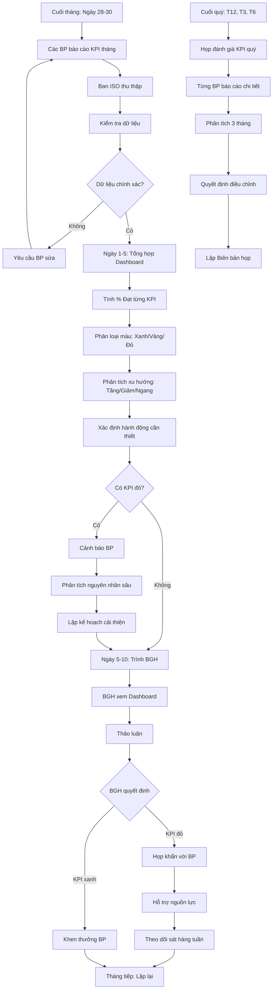
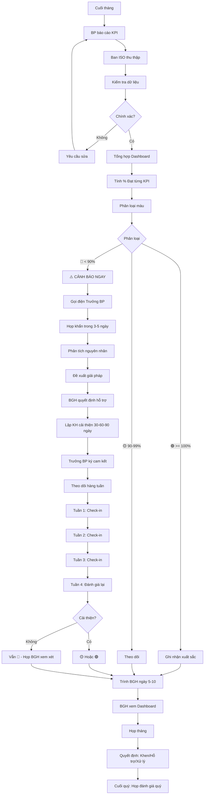

# SOP-02.3: THEO DÕI THỰC HIỆN MỤC TIÊU

## 1. THÔNG TIN QUY TRÌNH

| **Thuộc tính** | **Nội dung** |
|---|---|
| Mã SOP | SOP-02.3 |
| Tên quy trình | Theo dõi thực hiện mục tiêu |
| Quy trình cha | SOP-02: Mục tiêu chất lượng |
| Phiên bản | 1.0 |
| Tần suất | Hàng tháng (Báo cáo), Hàng quý (Họp đánh giá) |

## 2. MỤC ĐÍCH

- **Đo lường tiến độ**: Biết đang đạt bao nhiêu % mục tiêu
- **Phát hiện sớm**: Phát hiện khi chệch hướng, chưa muộn để điều chỉnh
- **Hỗ trợ kịp thời**: Giúp BP khó khăn đạt KPI
- **Ghi nhận thành công**: Khen thưởng BP đạt KPI tốt

## 3. PHẠM VI ÁP DỤNG

Tất cả KPI đã được giao

## 4. QUY TRÌNH THỰC HIỆN

### 4.1. Thu thập dữ liệu hàng tháng

**Bước 1: Cuối tháng - Các BP báo cáo KPI (Ngày 28-30)**

Mỗi BP điền Form báo cáo KPI tháng (QT04-F04):

| **KPI** | **Mục tiêu** | **Thực tế tháng này** | **Lũy kế từ đầu năm** | **% Đạt** | **Ghi chú** |
|---|---|---|---|---|---|
| % HS Giỏi (Học thuật) | ≥ 30% | - | 28% (Đến T12) | 93% | Cần cải thiện một số lớp yếu |

**Kèm theo:**
- Giải thích nguyên nhân (nếu không đạt)
- Kế hoạch cải thiện

**Bước 2: Ban ISO thu thập, kiểm tra**

- Số liệu có chính xác không?
- Có bằng chứng không? (Báo cáo, khảo sát, kết quả...)
- Nếu sai → Yêu cầu sửa

### 4.2. Tổng hợp và phân tích

**Bước 3: Ban ISO tổng hợp vào Dashboard KPI (Ngày 1-5 tháng sau)**

**Dashboard KPI tháng (QT04-R01) hiển thị:**

| **KPI** | **Trách nhiệm** | **Mục tiêu** | **Thực tế** | **% Đạt** | **Xu hướng** | **Tình trạng** |
|---|---|---|---|---|---|---|
| Điểm hài lòng PH | Ban ISO | ≥ 85 | 83 (T12) | 98% | ↗ +2 so với T6 | ⚠️ Gần đạt |
| % HS Giỏi | Học thuật | ≥ 30% | 28% | 93% | → Đi ngang | ⚠️ Cảnh báo |
| Giữ chân NV | Nhân sự | ≥ 85% | 88% | 103% | ✅ Tốt | ✅ Đạt |
| Tuân thủ QT | Ban ISO | ≥ 95% | 97% | 102% | ✅ Tốt | ✅ Đạt |

**Màu sắc:**
- 🟢 **Xanh** (≥ 100%): Đạt hoặc vượt
- 🟡 **Vàng** (90-99%): Gần đạt, cần theo dõi
- 🔴 **Đỏ** (< 90%): Nguy hiểm, cần hành động ngay

**Bước 4: Phân tích xu hướng**

- **Tăng** ↗: Tốt, duy trì
- **Giảm** ↘: Nguy hiểm, tìm nguyên nhân
- **Đi ngang** →: Cần đột phá

**Bước 5: Xác định hành động cần thiết**

| **Tình trạng** | **Hành động** |
|---|---|---|
| 🟢 **Đạt (≥ 100%)** | Duy trì, Khen thưởng, Chia sẻ kinh nghiệm |
| 🟡 **Gần đạt (90-99%)** | Theo dõi sát, Hỗ trợ nhẹ |
| 🔴 **Chưa đạt (< 90%)** | Họp khẩn, Lập kế hoạch cải thiện, Hỗ trợ mạnh |

### 4.3. Báo cáo và họp đánh giá

**Bước 6: Trình BGH (Ngày 5-10 tháng sau)**

Ban ISO trình Dashboard + Phân tích:
- Tổng quan: Đạt bao nhiêu KPI?
- Điểm sáng: KPI nào vượt trội?
- Điểm yếu: KPI nào đỏ?
- Nguyên nhân
- Đề xuất hành động

**Bước 7: BGH quyết định**

- KPI đỏ → Họp khẩn với BP đó
- Cần hỗ trợ → Phân bổ nguồn lực
- KPI xanh → Khen thưởng

**Bước 8: Theo dõi hành động cải thiện**

Nếu có KPI đỏ:
- Lập kế hoạch cải thiện (30 ngày, 60 ngày, 90 ngày)
- Theo dõi sát từng tuần
- Đánh giá lại sau 1 tháng

### 4.4. Đánh giá quý (Sau T12, T3, T6)

**Bước 9: Họp đánh giá KPI quý**

**Thành phần:**
- BGH
- Ban ISO
- Trưởng các bộ phận

**Nội dung:**
- Xem Dashboard 3 tháng
- Từng BP báo cáo chi tiết
- Phân tích sâu nguyên nhân
- Quyết định điều chỉnh (nếu cần)
- Khen thưởng BP đạt KPI tốt

**Bước 10: Lập Biên bản họp (QT04-D08)**

## 5. LƯU ĐỒ QUY TRÌNH



## 6. BIỂU MẪU LIÊN QUAN

| **Mã** | **Tên** |
|---|---|
| QT04-F04 | Form báo cáo KPI tháng (BP) |
| QT04-R01 | Dashboard/Báo cáo KPI tháng tổng hợp |
| QT04-D08 | Biên bản họp đánh giá KPI quý |
| QT04-F05 | Kế hoạch cải thiện KPI |

## 7. TIÊU CHUẨN VÀ CHỈ TIÊU

| **Chỉ tiêu** | **Mục tiêu** |
|---|---|
| BP báo cáo đúng hạn | ≥ 95% |
| Hoàn thành Dashboard trước ngày 5 | 100% |
| Phát hiện KPI đỏ trong tháng | 100% |
| Tỷ lệ KPI chuyển từ đỏ → xanh sau hỗ trợ | ≥ 70% |

## 8. TRÁCH NHIỆM CỤ THỂ

| **Vai trò** | **Trách nhiệm** |
|---|---|
| **Trưởng BP** | Đo lường, báo cáo KPI tháng, giải trình |
| **Ban ISO** | Thu thập, tổng hợp, Dashboard, phân tích |
| **BGH** | Xem xét, quyết định hành động, hỗ trợ |
| **Chủ KPI** | Thực hiện hành động cải thiện khi KPI đỏ |

## 9. LƯU Ý QUAN TRỌNG

- ⚠️ **Báo cáo trung thực**: Không được báo cáo sai để "đẹp số"
- ✅ **Theo dõi liên tục**: Không chỉ cuối tháng mới nhìn
- ✅ **Hỗ trợ, không phạt**: Mục đích là giúp đạt KPI, không phải tìm lỗi
- ✅ **Dashboard trực quan**: Dùng biểu đồ, màu sắc, dễ hiểu ngay
- 🔥 **Hành động nhanh**: Phát hiện KPI đỏ → Họp ngay trong tuần, không đợi cuối tháng

## 10. PHỤ LỤC

### 10.1. Mẫu Dashboard KPI (Trực quan)

```
═══════════════════════════════════════════════════════
        DASHBOARD MỤC TIÊU CHẤT LƯỢNG - THÁNG 12
═══════════════════════════════════════════════════════

1. TỔNG QUAN:
   Tổng KPI: 12
   🟢 Đạt: 8 KPI (67%)
   🟡 Gần đạt: 3 KPI (25%)
   🔴 Chưa đạt: 1 KPI (8%)

2. CHI TIẾT:

   🟢 Điểm hài lòng PH: 87/100 (Mục tiêu: 85) ✅ VƯỢT
      ├─ Xu hướng: ↗ +4 so với T6
      └─ Hành động: Duy trì

   🟡 % HS Giỏi: 28% (Mục tiêu: 30%) ⚠️ GẦN ĐẠT
      ├─ Xu hướng: → Đi ngang 3 tháng
      └─ Hành động: Tăng cường bồi dưỡng HS Khá

   🔴 Tuân thủ quy trình: 88% (Mục tiêu: 95%) ❌ CHƯA ĐẠT
      ├─ Xu hướng: ↘ Giảm so với T11
      └─ Hành động: HỌP KHẨN - Đào tạo lại quy trình

3. TOP 3 BP XUẤT SẮC:
   🥇 Phòng Nhân sự: 105% (Tất cả KPI xanh)
   🥈 Phòng Học thuật: 102%
   🥉 Bếp ăn: 101%

4. BP CẦN HỖ TRỢ:
   ⚠️ Phòng Hành chính: 85% (2 KPI vàng)
   🔴 Bảo vệ - An toàn: 82% (1 KPI đỏ)
```

### 10.2. Quy trình xử lý KPI đỏ (< 90%)

**NGAY KHI PHÁT HIỆN:**

**Ngày 1-2:** Gọi điện/Email cảnh báo Trưởng BP
**Ngày 3-5:** Họp khẩn (BGH + BP + Ban ISO)

**Nội dung họp:**
1. Trưởng BP trình bày tình hình
2. Phân tích nguyên nhân gốc rễ (Root cause)
3. Đề xuất giải pháp
4. BGH quyết định hỗ trợ
5. Lập Kế hoạch cải thiện 30-60-90 ngày (QT04-F05)
6. Ký cam kết

**Theo dõi:**
- Tuần 1: Check-in
- Tuần 2: Check-in
- Tuần 3: Check-in
- Tuần 4: Đánh giá lại → Xanh/Vàng/Đỏ?

## 5. LƯU ĐỒ QUY TRÌNH



## 6. BIỂU MẪU LIÊN QUAN

| **Mã** | **Tên** |
|---|---|
| QT04-F04 | Form báo cáo KPI tháng (BP) |
| QT04-R01 | Dashboard/Báo cáo KPI tháng |
| QT04-F05 | Kế hoạch cải thiện KPI (Khi KPI đỏ) |
| QT04-R03 | Báo cáo đánh giá KPI quý |

## 7. TIÊU CHUẨN VÀ CHỈ TIÊU

| **Chỉ tiêu** | **Mục tiêu** |
|---|---|
| BP báo cáo đúng hạn (cuối tháng) | ≥ 95% |
| Dashboard hoàn thành trước ngày 5 | 100% |
| Phát hiện KPI đỏ và họp khẩn | Trong 5 ngày |
| Tỷ lệ KPI chuyển từ đỏ sang vàng/xanh | ≥ 70% (sau 1 tháng hỗ trợ) |

## 8. TRÁCH NHIỆM CỤ THỂ

| **Vai trò** | **Trách nhiệm** |
|---|---|
| **Trưởng BP** | Đo, báo cáo KPI tháng, giải trình, cam kết cải thiện |
| **Ban ISO** | Thu thập, kiểm tra, Dashboard, phân tích, trình BGH |
| **BGH** | Xem xét, quyết định hỗ trợ, khen thưởng, xử lý |
| **Chủ KPI (BP đỏ)** | Lập kế hoạch cải thiện, thực hiện, báo cáo hàng tuần |

## 9. LƯU Ý QUAN TRỌNG

- ⚠️ **Không để cuối năm mới biết**: Theo dõi hàng tháng → Kịp thời điều chỉnh
- ✅ **Dữ liệu phải có bằng chứng**: Không chấp nhận báo cáo "bịa"
- ✅ **Hỗ trợ thật sự**: Không chỉ nói, phải cho NS, nhân lực, đào tạo cụ thể
- ✅ **Khen thưởng kịp thời**: KPI xanh 3 tháng liên tục → Khen thưởng ngay
- 🔥 **Công khai nội bộ**: Dashboard treo tại phòng BGH, mọi người thấy

## 10. PHỤ LỤC

### 10.1. Công cụ đo lường từng loại KPI

| **Loại KPI** | **Cách đo** | **Tần suất** |
|---|---|---|
| Kết quả học tập | Điểm thi, Xếp loại học lực | Học kỳ |
| Hài lòng PH | Khảo sát (Google Form, Survey) | 6 tháng (T12 + T6) |
| Hài lòng HS | Khảo sát (phù hợp lứa tuổi) | 6 tháng |
| Hài lòng NV | Khảo sát ẩn danh | 6 tháng |
| Tuân thủ quy trình | Audit nội bộ | 6 tháng |
| Số dự án CI | Đếm số dự án hoàn thành | Quý |
| Giữ chân HS/NV | (Số đầu kỳ - Số nghỉ) / Số đầu kỳ | Năm |

## 11. FAQ

**Q1: Nếu BP báo cáo đạt 100% nhưng thực tế không đúng?**  
A: Audit sẽ phát hiện. Xử lý nghiêm trọng vì gian lận số liệu.

**Q2: KPI đỏ liên tục 3 tháng, BP không cải thiện?**  
A: Xem xét thay Trưởng BP hoặc Điều chỉnh giảm KPI (nếu thật sự không khả thi).

**Q3: Có thể thưởng BP đạt KPI tốt không?**  
A: Nên thưởng! VD: BP đạt 100% KPI → Thưởng 10-20 triệu cuối năm.

**Q4: Dashboard có nên công khai cho phụ huynh không?**  
A: Chỉ công khai 2-3 KPI quan trọng (Hài lòng PH, Kết quả HS). KPI nội bộ giữ bí mật.

---

**PHÊ DUYỆT**

| Trưởng Ban ISO | Phó Hiệu trưởng | Hiệu trưởng |
|---|---|---|
| [Họ tên] | [Họ tên] | [Họ tên] |
