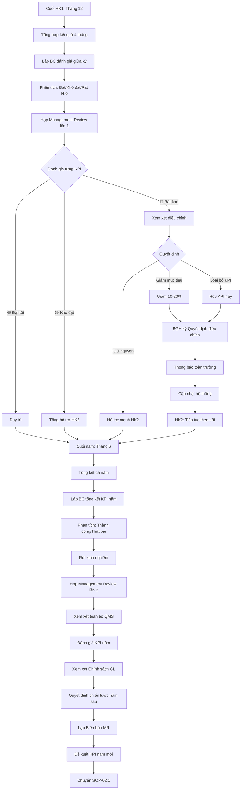
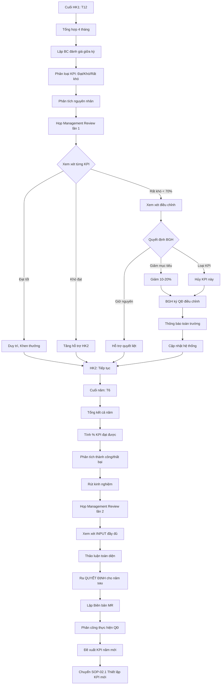

# SOP-02.4: ĐÁNH GIÁ VÀ ĐIỀU CHỈNH MỤC TIÊU

## 1. THÔNG TIN QUY TRÌNH

| **Thuộc tính** | **Nội dung** |
|---|---|
| Mã SOP | SOP-02.4 |
| Tên quy trình | Đánh giá và điều chỉnh mục tiêu |
| Quy trình cha | SOP-02: Mục tiêu chất lượng |
| Phiên bản | 1.0 |
| Tần suất | Cuối học kỳ (T12, T6), Cuối năm (T6) |

## 2. MỤC ĐÍCH

- **Đánh giá tổng thể**: Đạt được bao nhiêu KPI? Hiệu quả thế nào?
- **Điều chỉnh kịp thời**: KPI không phù hợp → Sửa ngay, đừng để cả năm
- **Rút kinh nghiệm**: Học hỏi từ thành công và thất bại
- **Cải tiến năm sau**: Đặt KPI tốt hơn cho năm tiếp theo

## 3. PHẠM VI ÁP DỤNG

Tất cả mục tiêu chất lượng đã thiết lập

## 4. QUY TRÌNH THỰC HIỆN

### 4.1. Đánh giá giữa kỳ (Cuối học kỳ 1 - Tháng 12)

**Bước 1: Tổng hợp kết quả 4 tháng (T9-T12)**

Ban ISO lập Báo cáo đánh giá giữa kỳ (QT04-R04):

| **KPI** | **Mục tiêu năm** | **Kết quả T12** | **% Dự kiến đạt cuối năm** | **Tình trạng** |
|---|---|---|---|---|
| % HS Giỏi | ≥ 30% | 28% | ~29% | 🟡 Khó đạt |
| Điểm hài lòng PH | ≥ 85 | 87 | ~86-87 | 🟢 Đạt |
| Giữ chân NV | ≥ 85% | 88% | ~87% | 🟢 Đạt |

**Bước 2: Phân tích sâu**

**Với KPI 🟢 (Đạt hoặc vượt):**
- Tại sao thành công?
- Nhân tố then chốt?
- Duy trì như thế nào?
- Chia sẻ kinh nghiệm cho BP khác

**Với KPI 🟡 (Khó đạt 85-95%):**
- Rào cản là gì?
- Cần hỗ trợ gì trong 6 tháng còn lại?
- Có khả năng đạt không?

**Với KPI 🔴 (Rất khó đạt < 85%):**
- Nguyên nhân gốc rễ?
- Có nên điều chỉnh giảm mục tiêu không?
- Hoặc tăng cường hỗ trợ quyết liệt?

**Bước 3: Họp đánh giá giữa kỳ (Management Review lần 1)**

**Thành phần:**
- BGH đầy đủ
- Ban ISO
- Trưởng các bộ phận

**Nội dung:**
- Xem Báo cáo giữa kỳ
- Từng BP trình bày KPI
- Thảo luận: Điều chỉnh hay Giữ nguyên?

**Bước 4: Quyết định điều chỉnh (nếu cần)**

| **Trường hợp** | **Quyết định** | **Ví dụ** |
|---|---|---|
| KPI quá khó (< 70% sau 4 tháng) | Giảm mục tiêu 10-20% | 30% → 27% |
| KPI quá dễ (Đạt 120% từ T10) | Tăng mục tiêu 10-20% | 85 → 90 |
| KPI không còn phù hợp | Loại bỏ hoặc Thay KPI khác | Do thay đổi chính sách |
| KPI OK | Giữ nguyên | Tiếp tục theo dõi |

**Bước 5: Điều chỉnh chính thức**

- BGH ký Quyết định điều chỉnh (QT04-D09)
- Thông báo toàn trường
- Cập nhật hệ thống

### 4.2. Đánh giá cuối năm (Tháng 6)

**Bước 6: Tổng kết cả năm**

Báo cáo tổng kết KPI năm (QT04-R05):

**A. Tổng quan:**
- Tổng số KPI: 12
- Đạt: 9 KPI (75%)
- Gần đạt: 2 KPI (17%)
- Không đạt: 1 KPI (8%)

**B. Chi tiết từng KPI:**

| **KPI** | **Mục tiêu** | **Thực tế** | **% Đạt** | **Đánh giá** |
|---|---|---|---|---|
| % HS Giỏi | ≥ 30% | 29.5% | 98% | ⚠️ Gần đạt - Điều chỉnh giảm năm sau |
| Điểm hài lòng PH | ≥ 85 | 88 | 104% | ✅ Vượt - Duy trì |
| Tuân thủ QT | ≥ 95% | 92% | 97% | ⚠️ Gần đạt - Tăng cường đào tạo |

**C. Phân tích nguyên nhân:**

**Thành công:**
- KPI "Điểm hài lòng PH" đạt 88 (vượt 85) do:
  - Cải tiến CSVC (Sửa nhà vệ sinh, sân chơi)
  - Tăng cường giao tiếp (Họp PH 2 tháng/lần)
  - Xử lý phản hồi nhanh (Trong 7 ngày)

**Thất bại:**
- KPI "Tuân thủ quy trình" chỉ đạt 92% (Mục tiêu 95%) do:
  - NV chưa quen quy trình mới
  - Một số quy trình quá phức tạp
  - Đào tạo chưa đủ

**D. Bài học kinh nghiệm:**
- Nên: Tăng cường đào tạo, Đơn giản hóa quy trình
- Không nên: Đặt quá nhiều KPI, Quy trình quá phức tạp

**E. Đề xuất cho năm sau:**
- Duy trì các KPI đạt tốt
- Điều chỉnh giảm KPI khó đạt
- Bổ sung KPI mới (nếu cần)

**Bước 7: Họp Management Review cuối năm (Tháng 6)**

**Nội dung quan trọng:**
- Xem xét toàn bộ QMS
- Đánh giá KPI năm
- Xem xét Chính sách CL (SOP-01.4)
- Quyết định chiến lược năm sau
- Ra Biên bản (QT04-D10 - Management Review Minutes)

**Bước 8: Quyết định điều chỉnh cho năm sau**

**Bước 9: Chuyển sang SOP-02.1 (Thiết lập KPI năm mới)**

## 5. LƯU ĐỒ QUY TRÌNH



## 6. BIỂU MẪU LIÊN QUAN

| **Mã** | **Tên** |
|---|---|
| QT04-R04 | Báo cáo đánh giá KPI giữa kỳ |
| QT04-R05 | Báo cáo tổng kết KPI năm |
| QT04-D09 | Quyết định điều chỉnh mục tiêu CL |
| QT04-D10 | Biên bản Management Review |

## 7. TIÊU CHUẨN VÀ CHỈ TIÊU

| **Chỉ tiêu** | **Mục tiêu** |
|---|---|
| Tỷ lệ KPI đạt mục tiêu cuối năm | ≥ 80% |
| Họp Management Review đúng hạn | 100% (2 lần/năm) |
| Tỷ lệ KPI điều chỉnh hợp lý | ≤ 30% |

## 8. TRÁCH NHIỆM CỤ THỂ

| **Vai trò** | **Trách nhiệm** |
|---|---|
| **Ban ISO** | Lập báo cáo đánh giá, phân tích, đề xuất |
| **BGH** | Xem xét, quyết định điều chỉnh |
| **HĐ quản trị** | Tham gia Management Review, cho ý kiến chiến lược |

## 9. LƯU Ý QUAN TRỌNG

- ⚠️ **Không hay điều chỉnh**: Điều chỉnh quá nhiều = Lập KPI không tốt
- ✅ **Phân biệt**: Không đạt do cố gắng chưa đủ vs Mục tiêu không khả thi
- ✅ **Management Review quan trọng**: Đây là yêu cầu bắt buộc của ISO 9001
- ✅ **Ghi chép đầy đủ**: Biên bản MR phải chi tiết, là bằng chứng cho kiểm định/audit
- 🔥 **Tham gia đầy đủ**: BGH, Trưởng BP, đại diện NV phải tham gia MR

## 10. PHỤ LỤC

### 10.1. Nội dung Management Review (Theo ISO 9001)

**INPUT (Đầu vào):**
1. Kết quả audit (nội bộ + bên ngoài)
2. Phản hồi khách hàng (PH, HS)
3. Hiệu suất quy trình và sản phẩm (KPI)
4. Tình trạng hành động khắc phục (CAR/PAR)
5. Kết quả cải tiến liên tục
6. Thay đổi ảnh hưởng QMS (Luật, chính sách, quy mô...)
7. Cơ hội cải tiến

**THẢO LUẬN:**
- Chính sách CL còn phù hợp?
- KPI còn phù hợp?
- QMS hoạt động hiệu quả không?
- Cần thay đổi gì?

**OUTPUT (Đầu ra - Quyết định):**
1. Cải tiến QMS
2. Cải tiến sản phẩm/dịch vụ
3. Nhu cầu nguồn lực
4. Điều chỉnh KPI (nếu cần)

### 10.2. Biên bản Management Review mẫu

```
BIÊN BẢN MANAGEMENT REVIEW
Lần 1/20XX - Học kỳ 1

Thời gian: [Ngày/Tháng/Năm]
Địa điểm: [Phòng họp]

THÀNH PHẦN THAM DỰ:
- Hiệu trưởng: [Tên] - Chủ trì
- Phó HT: [Tên]
- Đại diện quản lý (MR): [Tên]
- Trưởng Ban ISO: [Tên]
- Trưởng các BP: [Liệt kê]

NỘI DUNG:

I. XEM XÉT ĐẦU VÀO:
   1. Kết quả Audit nội bộ T11/20XX: 3 NC nhỏ, đã khắc phục
   2. Phản hồi PH: Điểm 87/100, tăng 4 điểm so với T6
   3. Hiệu suất KPI: 9/12 KPI đạt (75%)
   4. CAR/PAR: 15 CAR, 100% đã đóng
   5. Dự án CI: 8/10 dự án hoàn thành
   6. Thay đổi: Tăng 50 HS so với dự kiến
   7. Cơ hội: Áp dụng LMS mới

II. THẢO LUẬN:
   - Chính sách CL: Còn phù hợp, giữ nguyên
   - KPI "% HS Giỏi": Khó đạt 30%, đề xuất giảm 28%
   - QMS: Hoạt động tốt, một số quy trình cần đơn giản hóa
   
III. QUYẾT ĐỊNH:
   1. Điều chỉnh KPI "% HS Giỏi" từ 30% → 28%
   2. Tăng ngân sách bồi dưỡng HS: +100 triệu
   3. Đơn giản hóa quy trình chấm công
   4. Triển khai LMS từ T1/20XX
   5. Tăng cường đào tạo NV về tuân thủ quy trình

IV. PHÂN CÔNG:
   - Ban ISO: Cập nhật KPI điều chỉnh
   - Phòng NS: Đơn giản hóa quy trình chấm công
   - IT: Triển khai LMS
   - Hạn: 30 ngày

[Chữ ký Hiệu trưởng]
```

## 5. LƯU ĐỒ QUY TRÌNH



## 6. BIỂU MẪU LIÊN QUAN

| **Mã** | **Tên** |
|---|---|
| QT04-R04 | Báo cáo đánh giá KPI giữa kỳ |
| QT04-R05 | Báo cáo tổng kết KPI năm |
| QT04-D09 | Quyết định điều chỉnh mục tiêu CL |
| QT04-D10 | Biên bản Management Review |

## 7. TIÊU CHUẨN VÀ CHỈ TIÊU

| **Chỉ tiêu** | **Mục tiêu** |
|---|---|
| Tỷ lệ KPI đạt mục tiêu cuối năm | ≥ 80% |
| Họp MR đúng hạn | 100% (2 lần/năm: T12 + T6) |
| Tỷ lệ quyết định MR được thực hiện | ≥ 95% |

## 8. TRÁCH NHIỆM CỤ THỂ

| **Vai trò** | **Trách nhiệm** |
|---|---|
| **Ban ISO** | Chuẩn bị báo cáo, tài liệu MR, ghi Biên bản |
| **Đại diện quản lý** | Chủ trì MR, điều phối |
| **BGH** | Tham dự đầy đủ, thảo luận, ra quyết định |
| **Trưởng BP** | Báo cáo KPI BP, giải trình, đề xuất |

## 9. LƯU Ý QUAN TRỌNG

- ⚠️ **Management Review ≠ Họp thường**: Phải có cấu trúc, Input/Output rõ ràng
- ✅ **Ghi chép chi tiết**: Biên bản MR là bằng chứng quan trọng khi audit/kiểm định
- ✅ **Thành phần đầy đủ**: BGH phải tham dự đầy đủ, không được vắng
- ✅ **Theo dõi quyết định**: Các quyết định trong MR phải được thực hiện và theo dõi
- 🔥 **Không chỉ là hình thức**: MR phải thật sự xem xét sâu, ra quyết định quan trọng

## 10. PHỤ LỤC

### 10.1. Checklist chuẩn bị Management Review

**2 TUẦN TRƯỚC:**
- [ ] Lên lịch MR, mời thành phần
- [ ] Chuẩn bị Báo cáo KPI
- [ ] Tổng hợp Kết quả Audit
- [ ] Thu thập Phản hồi khách hàng
- [ ] Báo cáo CAR/PAR
- [ ] Báo cáo dự án CI
- [ ] Xác định thay đổi ảnh hưởng QMS

**TRONG BUỔI MR:**
- [ ] Chủ trì giới thiệu mục đích
- [ ] Trình bày từng INPUT
- [ ] Thảo luận mở
- [ ] Ghi chép đầy đủ
- [ ] Ra quyết định rõ ràng
- [ ] Phân công, hạn deadline

**SAU MR:**
- [ ] Hoàn thiện Biên bản trong 3 ngày
- [ ] BGH ký Biên bản
- [ ] Thông báo quyết định cho BP liên quan
- [ ] Theo dõi thực hiện quyết định

## 11. FAQ

**Q1: Bao lâu phải họp Management Review 1 lần?**  
A: Tối thiểu 1 lần/năm (ISO yêu cầu). Nhưng nên 2 lần/năm (giữa kỳ + cuối năm).

**Q2: Có thể điều chỉnh KPI nhiều lần trong năm không?**  
A: Có thể, nhưng hạn chế. Lý tưởng chỉ điều chỉnh 1 lần (giữa kỳ) nếu thật cần thiết.

**Q3: Nếu đạt 100% KPI?**  
A: Tuyệt vời! Nhưng xem xét: Có quá dễ không? Năm sau nâng cao hơn.

---

**PHÊ DUYỆT**

| Trưởng Ban ISO | Phó Hiệu trưởng | Hiệu trưởng |
|---|---|---|
| [Họ tên] | [Họ tên] | [Họ tên] |

---

✅ **HOÀN THÀNH SOP-02: MỤC TIÊU CHẤT LƯỢNG (4 files) - ĐẦY ĐỦ!**
