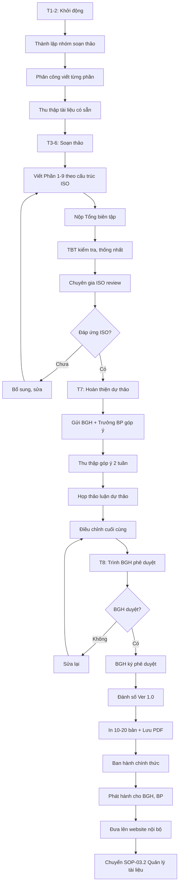

# SOP-03.1: XÂY DỰNG SỔ TAY CHẤT LƯỢNG

## 1. THÔNG TIN QUY TRÌNH

| **Thuộc tính** | **Nội dung** |
|---|---|
| Mã SOP | SOP-03.1 |
| Tên quy trình | Xây dựng sổ tay chất lượng |
| Quy trình cha | SOP-03: Sổ tay chất lượng |
| Phiên bản | 1.0 |
| Tần suất | Khi triển khai ISO lần đầu hoặc Thay đổi lớn hệ thống |

## 2. MỤC ĐÍCH

- **Mô tả QMS**: Tài liệu chính thức mô tả toàn bộ hệ thống quản lý chất lượng
- **Đáp ứng ISO 9001**: Chứng minh tuân thủ các yêu cầu ISO
- **Hướng dẫn vận hành**: Người mới đọc Sổ tay = Hiểu cách vận hành QMS
- **Phục vụ kiểm định**: Tổ chức kiểm định xem Sổ tay để đánh giá

## 3. PHẠM VI ÁP DỤNG

Sổ tay CL áp dụng cho toàn bộ hoạt động của trường

## 4. CẤU TRÚC SỔ TAY CHẤT LƯỢNG (Theo ISO 9001:2015)

### 4.1. Các phần bắt buộc

**Phần 1: GIỚI THIỆU (20-30 trang)**

| **Mục** | **Nội dung** | **Ghi chú** |
|---|---|---|
| 1.1. Giới thiệu trường | Lịch sử, Tầm nhìn, Sứ mệnh | |
| 1.2. Phạm vi QMS | Áp dụng cho hoạt động nào | "Cung cấp dịch vụ giáo dục MN-TH-THCS" |
| 1.3. Loại trừ | Điều khoản ISO nào không áp dụng | VD: Điều 8.3 Thiết kế sản phẩm (Nếu dùng chương trình có sẵn) |
| 1.4. Thuật ngữ | Định nghĩa các thuật ngữ trong Sổ tay | |
| 1.5. Mô hình QMS | Sơ đồ tổng thể hệ thống | |

**Phần 2: BỐI CẢNH TỔ CHỨC (10-15 trang)**

| **Mục** | **Nội dung (Điều 4 ISO)** |
|---|---|
| 2.1. Hiểu tổ chức và bối cảnh | Phân tích SWOT, PEST... |
| 2.2. Hiểu nhu cầu của các bên liên quan | PH, HS, NV, Nhà nước, NCC... mong đợi gì |
| 2.3. Phạm vi hệ thống QMS | Rõ ràng, cụ thể |
| 2.4. Hệ thống QMS và các quy trình | Sơ đồ các quy trình, tương tác |

**Phần 3: LÃNH ĐẠO (10-15 trang)**

| **Mục** | **Nội dung (Điều 5 ISO)** |
|---|---|
| 3.1. Lãnh đạo và cam kết | BGH cam kết gì với QMS |
| 3.2. Chính sách chất lượng | Toàn văn chính sách CL |
| 3.3. Vai trò, trách nhiệm, thẩm quyền | Sơ đồ tổ chức, Job description |

**Phần 4: HOẠCH ĐỊNH (15-20 trang)**

| **Mục** | **Nội dung (Điều 6 ISO)** |
|---|---|
| 4.1. Hành động đối phó rủi ro và cơ hội | Rà soát rủi ro, Kế hoạch đối phó |
| 4.2. Mục tiêu chất lượng | Bảng KPI chi tiết |
| 4.3. Hoạch định thay đổi | Khi thay đổi QMS, làm thế nào |

**Phần 5: HỖ TRỢ (20-30 trang)**

| **Mục** | **Nội dung (Điều 7 ISO)** |
|---|---|
| 5.1. Nguồn lực | Nhân sự, CSVC, Môi trường, Kiến thức... |
| 5.2. Năng lực | Yêu cầu năng lực, Đào tạo |
| 5.3. Nhận thức | NV hiểu QMS như thế nào |
| 5.4. Truyền thông | Truyền thông nội bộ, ngoại bộ |
| 5.5. Thông tin dạng văn bản | Kiểm soát tài liệu, hồ sơ |

**Phần 6: VẬN HÀNH (30-50 trang)**

| **Mục** | **Nội dung (Điều 8 ISO)** |
|---|---|
| 6.1. Hoạch định và kiểm soát vận hành | Các quy trình vận hành |
| 6.2. Yêu cầu sản phẩm/dịch vụ | Chương trình giảng dạy, Dịch vụ GD |
| 6.3. Thiết kế và phát triển | (Có thể loại trừ nếu dùng chương trình sẵn) |
| 6.4. Kiểm soát quy trình NCC | Chọn NCC, Đánh giá NCC |
| 6.5. Sản xuất và cung cấp dịch vụ | Quy trình giảng dạy, Chăm sóc HS |
| 6.6. Phát hành sản phẩm/dịch vụ | Tốt nghiệp, Cấp bằng |
| 6.7. Kiểm soát đầu ra không phù hợp | Xử lý HS yếu, Xử lý sai sót |

**Phần 7: ĐÁNH GIÁ HIỆU SUẤT (20-30 trang)**

| **Mục** | **Nội dung (Điều 9 ISO)** |
|---|---|
| 7.1. Giám sát, đo lường, phân tích, đánh giá | KPI, Dashboard, Báo cáo |
| 7.2. Audit nội bộ | Kế hoạch, Quy trình audit |
| 7.3. Xem xét của lãnh đạo | Management Review |

**Phần 8: CẢI TIẾN (15-20 trang)**

| **Mục** | **Nội dung (Điều 10 ISO)** |
|---|---|
| 8.1. Không phù hợp và hành động khắc phục | Xử lý NC, CAR |
| 8.2. Cải tiến liên tục | PDCA, Kaizen, Dự án CI |

**Phần 9: PHỤ LỤC (Tùy chọn)**
- Danh sách tài liệu QMS
- Danh sách biểu mẫu
- Sơ đồ quy trình
- Ma trận trách nhiệm

**TỔNG: Sổ tay CL thường dày 150-250 trang**

## 4. QUY TRÌNH XÂY DỰNG

### 4.1. Chuẩn bị (Tháng 1-2)

**Bước 1: Thành lập nhóm soạn thảo**

| **Vai trò** | **Người** | **Trách nhiệm** |
|---|---|---|
| Tổng biên tập | Đại diện quản lý / Trưởng Ban ISO | Điều phối, tổng hợp |
| Biên tập viên | 3-5 người | Viết từng phần |
| Tư vấn | Chuyên gia ISO (nếu thuê) | Hướng dẫn, kiểm tra |
| Phản biện | BGH, Trưởng BP | Góp ý, bổ sung |

**Bước 2: Phân công viết**

Mỗi người chịu trách nhiệm 1-2 phần

**Bước 3: Thu thập tài liệu có sẵn**
- Các QT, SOP đã viết
- Chính sách, quy chế
- Sơ đồ tổ chức
- Danh sách tài liệu

### 4.2. Soạn thảo (Tháng 3-6)

**Bước 4: Viết dự thảo theo cấu trúc ISO**

**Nguyên tắc viết:**
- Ngôn ngữ rõ ràng, chuyên nghiệp
- Câu ngắn (15-20 từ/câu)
- Dùng sơ đồ, bảng biểu
- Tham chiếu QT, SOP cụ thể

**Bước 5: Viết xong từng phần → Nộp Tổng biên tập**

**Bước 6: Tổng biên tập kiểm tra**
- Thống nhất văn phong
- Kiểm tra logic, liên kết
- Bổ sung thiếu sót

**Bước 7: Chuyên gia ISO kiểm tra (nếu có)**
- Đáp ứng ISO 9001:2015 chưa?
- Còn thiếu điều khoản nào?
- Góp ý cải thiện

### 4.3. Xin ý kiến và hoàn thiện (Tháng 7)

**Bước 8: Gửi dự thảo cho BGH + Trưởng BP**

**Bước 9: Thu thập góp ý (2 tuần)**

**Bước 10: Họp thảo luận dự thảo**

**Bước 11: Điều chỉnh cuối cùng**

### 4.4. Phê duyệt và ban hành (Tháng 8)

**Bước 12: Trình BGH phê duyệt**

**Bước 13: BGH ký phê duyệt**

**Bước 14: Đánh số phiên bản: "Version 1.0"**

**Bước 15: Ban hành chính thức**
- In 10-20 bản (Bìa cứng, đóng gáy)
- Lưu bản PDF (Dễ tìm kiếm, chia sẻ)
- Đưa lên website nội bộ

**Bước 16: Phát hành**
- BGH: Mỗi người 1 bản
- Trưởng BP: Mỗi BP 1 bản
- Phòng Ban ISO: 3-5 bản
- Lưu trữ: 2 bản

## 5. LƯU ĐỒ QUY TRÌNH



## 6. BIỂU MẪU LIÊN QUAN

| **Mã** | **Tên** |
|---|---|
| QT04-STL | Sổ tay chất lượng (Quality Manual) |
| QT04-D11 | Quyết định ban hành Sổ tay CL |
| QT04-F06 | Form góp ý Sổ tay CL |

## 7. TIÊU CHUẨN VÀ CHỈ TIÊU

| **Chỉ tiêu** | **Mục tiêu** |
|---|---|
| Hoàn thành trong 8 tháng | 100% |
| Đáp ứng 100% yêu cầu ISO 9001 | 100% |
| Được Chuyên gia ISO đánh giá Tốt | ≥ 8/10 |

## 8. TRÁCH NHIỆM CỤ THỂ

| **Vai trò** | **Trách nhiệm** |
|---|---|
| **Tổng biên tập** | Điều phối, kiểm tra, tổng hợp |
| **Biên tập viên** | Viết từng phần được giao |
| **Chuyên gia ISO** | Tư vấn, kiểm tra tuân thủ ISO |
| **BGH** | Góp ý, phê duyệt, ký ban hành |

## 9. LƯU Ý QUAN TRỌNG

- ⚠️ **Không copy**: Mỗi trường khác nhau, đừng copy Sổ tay trường khác
- ✅ **Thực tế**: Viết đúng những gì đang làm, không viết lý tưởng rồi không làm được
- ✅ **Ngắn gọn**: Không dài dòng, lan man. Mỗi phần 10-30 trang là đủ
- ✅ **Tham chiếu QT/SOP**: Không viết lại toàn bộ, chỉ tóm tắt và tham chiếu
- 🔥 **Kiểm soát chặt phiên bản**: Chỉ có bản được duyệt mới phát hành

## 10. PHỤ LỤC

### 10.1. Mục lục Sổ tay chất lượng mẫu

```
SỔ TAY CHẤT LƯỢNG
[Tên trường]

Phiên bản: 1.0
Ngày ban hành: [Ngày]
Phê duyệt: [Chữ ký HT]

═══════════════════════════════════════

MỤC LỤC

PHẦN 1: GIỚI THIỆU ........................................ 5
   1.1. Giới thiệu trường ................................. 6
   1.2. Phạm vi QMS ....................................... 8
   1.3. Loại trừ .......................................... 9
   1.4. Thuật ngữ ........................................ 10
   1.5. Mô hình QMS ...................................... 15

PHẦN 2: BỐI CẢNH TỔ CHỨC ................................. 20
   2.1. Hiểu tổ chức và bối cảnh ......................... 21
   2.2. Các bên liên quan ................................ 25
   2.3. Phạm vi hệ thống QMS ............................. 28
   2.4. Hệ thống QMS và quy trình ........................ 30

PHẦN 3: LÃNH ĐẠO ......................................... 40
   3.1. Lãnh đạo và cam kết .............................. 41
   3.2. Chính sách chất lượng ............................ 43
   3.3. Vai trò, trách nhiệm ............................. 45

[...]

PHẦN 9: PHỤ LỤC ........................................ 200
   9.1. Danh mục tài liệu QMS ........................... 201
   9.2. Danh mục biểu mẫu ............................... 210
   9.3. Sơ đồ quy trình ................................. 215
```

### 10.2. Ví dụ nội dung Phần 1.2 - Phạm vi QMS

```
1.2. PHẠM VI HỆ THỐNG QUẢN LÝ CHẤT LƯỢNG

Hệ thống Quản lý Chất lượng của [Tên trường] áp dụng cho:

• Cung cấp dịch vụ giáo dục và đào tạo cho học sinh từ 18 tháng đến 15 tuổi, bao gồm:
  - Giáo dục Mầm non (18 tháng - 5 tuổi)
  - Giáo dục Tiểu học (Lớp 1-5)
  - Giáo dục Trung học cơ sở (Lớp 6-9)

• Theo chương trình:
  - Chương trình Giáo dục phổ thông Việt Nam
  - Chương trình Quốc tế (Cambridge Primary & Secondary)
  - Chương trình Song ngữ

• Tại địa điểm:
  - Cơ sở 1: [Địa chỉ]
  - Cơ sở 2: [Địa chỉ] (Nếu có)

• Các hoạt động hỗ trợ:
  - Xe đưa đón
  - Bếp ăn
  - Y tế trường học
  - Hoạt động ngoại khóa
  - Tư vấn tâm lý

LOẠI TRỪ:
Điều khoản 8.3 (Thiết kế và phát triển) được loại trừ vì Nhà trường sử dụng chương trình giảng dạy chuẩn của Bộ GD&ĐT và Cambridge Assessment, không tự thiết kế chương trình.
```

## 11. FAQ

**Q1: Sổ tay CL có bắt buộc theo ISO không?**  
A: ISO 9001:2015 không bắt buộc. Nhưng nên có vì dễ quản lý, dễ audit, dễ kiểm định.

**Q2: Sổ tay CL khác gì với QT, SOP?**  
A: 
- **Sổ tay CL**: Tài liệu tổng quan, mô tả TOÀN BỘ QMS (Cấp 1)
- **QT**: Quy tắc cho 1 lĩnh vực (An toàn, Nhân sự...) (Cấp 2)
- **SOP**: Quy trình chi tiết 1 hoạt động (Cấp 3)
- **Biểu mẫu**: Form, checklist (Cấp 4)

**Q3: Mất bao lâu để viết Sổ tay CL?**  
A: 6-8 tháng nếu làm nghiêm túc. Nếu đã có QT, SOP sẵn → Nhanh hơn (3-4 tháng).

---

**PHÊ DUYỆT**

| Tổng biên tập | Đại diện quản lý | Hiệu trưởng |
|---|---|---|
| [Họ tên] | [Họ tên] | [Họ tên] |
