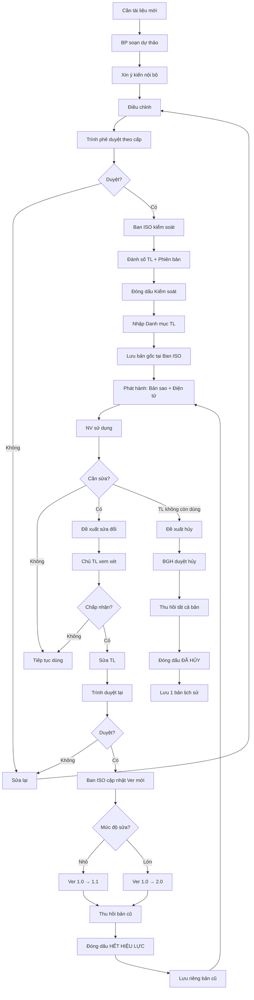
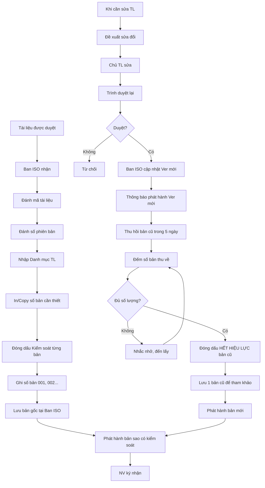

# SOP-03.2: QUẢN LÝ TÀI LIỆU HỆ THỐNG

## 1. THÔNG TIN QUY TRÌNH

| **Thuộc tính** | **Nội dung** |
|---|---|
| Mã SOP | SOP-03.2 |
| Tên quy trình | Quản lý tài liệu hệ thống |
| Quy trình cha | SOP-03: Sổ tay chất lượng |
| Phiên bản | 1.0 |
| Tần suất | Liên tục |

## 2. MỤC ĐÍCH

- **Kiểm soát tài liệu**: Đảm bảo dùng đúng bản, đúng phiên bản
- **Dễ tra cứu**: Tìm nhanh tài liệu cần thiết
- **Bảo mật**: Tài liệu nhạy cảm được kiểm soát
- **Tuân thủ ISO**: Đáp ứng Điều 7.5 ISO 9001

## 3. PHÂN CẤP TÀI LIỆU QMS

| **Cấp** | **Loại** | **Ví dụ** | **Ai kiểm soát** |
|---|---|---|---|
| **Cấp 1** | Sổ tay chất lượng | Quality Manual | Ban ISO |
| **Cấp 2** | Quy tắc (QT) | QT-01 An toàn, QT-02 Nhân sự... | Ban ISO + BP liên quan |
| **Cấp 3** | Quy trình (SOP) | SOP-01.1, SOP-01.2... | Chủ quy trình (Trưởng BP) |
| **Cấp 4** | Biểu mẫu, Checklist | Form, Phiếu, Checklist | BP sử dụng |
| **Cấp 5** | Hồ sơ (Records) | Biên bản, Báo cáo đã điền | BP lưu trữ |

## 4. QUY TRÌNH QUẢN LÝ

### 4.1. Tạo mới tài liệu

**Bước 1: BP có nhu cầu tài liệu mới**
- VD: Quy trình mới, Biểu mẫu mới

**Bước 2: Soạn thảo dự thảo**
- Theo template chuẩn (QT04-T01)
- Đúng format, cấu trúc

**Bước 3: Xin ý kiến**
- NV trong BP
- BP liên quan (nếu có)

**Bước 4: Điều chỉnh**

**Bước 5: Trình phê duyệt**

| **Cấp tài liệu** | **Người phê duyệt** |
|---|---|
| Cấp 1 (Sổ tay CL) | Hiệu trưởng |
| Cấp 2 (QT) | Hiệu trưởng |
| Cấp 3 (SOP) | Phó HT hoặc Trưởng BP |
| Cấp 4 (Form) | Trưởng BP |

**Bước 6: Sau khi duyệt → Ban ISO kiểm soát**

- Đánh số tài liệu (VD: SOP-05.7)
- Đánh số phiên bản (Ver 1.0)
- Đóng dấu "Kiểm soát" (QT04-S01)
- Nhập vào Danh mục tài liệu (QT04-S02)

**Bước 7: Phát hành**
- Bản gốc: Lưu Ban ISO
- Bản sao kiểm soát: Phát cho BP (Đóng dấu, số hóa)
- Bản điện tử: Lưu server, chỉ đọc

### 4.2. Sử dụng tài liệu

**Bước 8: NV chỉ dùng bản "Kiểm soát"**
- Có dấu kiểm soát
- Hoặc bản điện tử trên server chính thức

**KHÔNG dùng:**
- Bản photo không dấu
- Bản cũ
- Bản nháp chưa duyệt

**Bước 9: Nếu mất/hỏng → Xin cấp lại**

### 4.3. Sửa đổi tài liệu

**Bước 10: Khi cần sửa**
- Đề xuất sửa đổi (QT04-F07)
- Lý do, nội dung sửa

**Bước 11: Chủ tài liệu xem xét**

**Bước 12: Sửa, trình duyệt lại**

**Bước 13: Ban ISO cập nhật phiên bản**
- Ver 1.0 → Ver 1.1 (Sửa nhỏ)
- Ver 1.0 → Ver 2.0 (Sửa lớn)

**Bước 14: Thu hồi bản cũ**
- Đóng dấu "HẾT HIỆU LỰC"
- Lưu trữ riêng (Không lưu chung với bản mới)

**Bước 15: Phát hành bản mới → Giống Bước 7**

### 4.4. Hủy bỏ tài liệu

**Bước 16: Khi tài liệu không còn dùng**
- Đề xuất hủy
- BGH duyệt
- Thu hồi tất cả bản
- Đóng dấu "ĐÃ HỦY"
- Lưu trữ 1 bản để tham khảo lịch sử

## 5. LƯU ĐỒ QUY TRÌNH



## 6. BIỂU MẪU LIÊN QUAN

| **Mã** | **Tên** |
|---|---|
| QT04-T01 | Template tài liệu chuẩn |
| QT04-S01 | Con dấu "Kiểm soát" |
| QT04-S02 | Danh mục tài liệu QMS |
| QT04-F07 | Form đề xuất sửa đổi tài liệu |
| QT04-F08 | Form đề xuất hủy tài liệu |

## 7. TIÊU CHUẨN VÀ CHỈ TIÊU

| **Chỉ tiêu** | **Mục tiêu** |
|---|---|
| Tài liệu được kiểm soát | 100% |
| NV sử dụng đúng bản mới nhất | ≥ 98% |
| Tìm được tài liệu khi cần | ≤ 5 phút |
| Sử dụng bản cũ (hết hiệu lực) | 0% |

## 8. TRÁCH NHIỆM CỤ THỂ

| **Vai trò** | **Trách nhiệm** |
|---|---|
| **Ban ISO** | Kiểm soát tất cả tài liệu, Đánh số, Lưu bản gốc, Phát hành |
| **Chủ tài liệu** | Soạn, Sửa, Đề xuất phê duyệt/hủy |
| **Người phê duyệt** | Xem xét, Phê duyệt/Từ chối |
| **NV** | Sử dụng đúng bản kiểm soát |

## 9. LƯU Ý QUAN TRỌNG

- ⚠️ **Chỉ dùng bản kiểm soát**: Bản photo, không dấu = Không hợp lệ
- ✅ **Thu hồi bản cũ nhanh**: Khi có bản mới, thu hồi bản cũ trong 7 ngày
- ✅ **Kiểm soát cả bản điện tử**: Chỉ lưu trên server chính thức, set "Read-only"
- ✅ **Đánh số rõ ràng**: Mỗi tài liệu có mã riêng, không trùng
- 🔥 **Audit sẽ kiểm tra**: Auditor hỏi "Tài liệu này Ver bao nhiêu? Có kiểm soát không?"

## 10. PHỤ LỤC

### 10.1. Cách đánh số tài liệu

**Format:** [Loại]-[Nhóm].[Số]_[Tên]_Ver[X.Y]

**Ví dụ:**
- `QT-01_An_toan_Bao_mat_PCCC_Ver1.0.pdf`
- `SOP-01.3_Sang_loc_ho_so_Ver2.1.docx`
- `QT04-F01_Form_gop_y_Ver1.0.xlsx`

**Quy tắc đánh số phiên bản:**
- **Ver 1.0**: Phiên bản gốc
- **Ver 1.1, 1.2...**: Sửa nhỏ (Chỉnh sửa từ ngữ, bổ sung ít)
- **Ver 2.0**: Sửa lớn (Thay đổi quy trình, cấu trúc)
- **Ver 2.1, 2.2...**: Sửa nhỏ tiếp

### 10.2. Danh mục tài liệu QMS (QT04-S02)

| **Mã TL** | **Tên tài liệu** | **Phiên bản** | **Ngày ban hành** | **Người phê duyệt** | **Vị trí lưu bản gốc** | **Phát hành cho** |
|---|---|---|---|---|---|---|
| QT04-STL | Sổ tay CL | 1.0 | 01/09/2024 | HT | Tủ Ban ISO | BGH, BP |
| QT-01 | An toàn - Bảo mật - PCCC | 1.0 | 01/09/2024 | HT | Tủ Ban ISO | Tất cả |
| SOP-01.1 | Kiểm tra PCCC định kỳ | 2.0 | 15/10/2024 | Phó HT | Tủ Ban ISO | BP An toàn |

### 10.3. Con dấu kiểm soát

```
┌─────────────────────────────┐
│     TÀI LIỆU KIỂM SOÁT      │
│                             │
│  Số bản: 001/010            │
│  Phát hành cho: [BP]        │
│  Ngày: [DD/MM/YYYY]         │
│                             │
│  [Chữ ký Ban ISO]           │
└─────────────────────────────┘
```

### 10.4. Quy trình thu hồi bản cũ

**KHI CÓ PHIÊN BẢN MỚI:**

**Ngày 1:** Ban ISO thông báo (Email):
```
THÔNG BÁO PHIÊN BẢN MỚI

Tài liệu: SOP-01.3 Sàng lọc hồ sơ ứng viên
Phiên bản cũ: Ver 1.0
Phiên bản mới: Ver 2.0
Ngày hiệu lực: 01/11/2024

Vui lòng:
• Dừng sử dụng Ver 1.0 từ 01/11
• Trả bản cũ về Ban ISO trước 05/11
• Nhận bản mới Ver 2.0 tại Ban ISO

Liên hệ: [Email/SĐT Ban ISO]
```

**Ngày 2-5:** BP trả bản cũ, nhận bản mới

**Ngày 6:** Ban ISO kiểm tra
- Đã thu hồi hết chưa?
- Nếu chưa → Nhắc nhở, đến tận BP lấy

## 5. LƯU ĐỒ QUY TRÌNH



## 6. BIỂU MẪU LIÊN QUAN

| **Mã** | **Tên** |
|---|---|
| QT04-T01 | Template tài liệu chuẩn ISO |
| QT04-S01 | Con dấu "Kiểm soát" |
| QT04-S02 | Danh mục tài liệu QMS (Master List) |
| QT04-F07 | Form đề xuất sửa đổi tài liệu |
| QT04-F08 | Form đề xuất hủy tài liệu |
| QT04-D12 | Biên bản thu hồi tài liệu cũ |

## 7. TIÊU CHUẨN VÀ CHỈ TIÊU

| **Chỉ tiêu** | **Mục tiêu** |
|---|---|
| Tài liệu có mã, có phiên bản | 100% |
| NV sử dụng đúng bản kiểm soát | ≥ 98% |
| Thu hồi bản cũ trong 7 ngày | 100% |
| Danh mục TL luôn cập nhật | 100% |

## 8. TRÁCH NHIỆM CỤ THỂ

| **Vai trò** | **Trách nhiệm** |
|---|---|
| **Ban ISO** | Kiểm soát tất cả TL, Đánh mã, Phát hành, Thu hồi |
| **Chủ tài liệu (BP)** | Soạn, Sửa, Đề xuất |
| **Người phê duyệt** | Phê duyệt/Từ chối |
| **NV** | Sử dụng đúng bản, Trả bản cũ khi có bản mới |

## 9. LƯU Ý QUAN TRỌNG

- ⚠️ **Kiểm soát nghiêm**: Không ai được tự ý in, photo, sửa tài liệu
- ✅ **Bản điện tử cũng kiểm soát**: Chỉ lưu server chính thức, set quyền "Read-only"
- ✅ **Danh mục TL = Tim QMS**: Phải cập nhật real-time
- ✅ **Phát hiện bản không kiểm soát**: Thu hồi, tiêu hủy ngay
- 🔥 **Auditor sẽ check**: "Cho tôi xem SOP-02.3 bạn đang dùng. Ver bao nhiêu? Có dấu kiểm soát không?"

## 10. PHỤ LỤC

### 10.1. Checklist kiểm soát tài liệu

**TRƯỚC KHI PHÁT HÀNH:**
- [ ] Đã được phê duyệt (có chữ ký)
- [ ] Có mã tài liệu
- [ ] Có số phiên bản
- [ ] Có ngày ban hành
- [ ] Đã nhập Danh mục TL
- [ ] Đã đóng dấu Kiểm soát (nếu bản giấy)
- [ ] Đã ghi số bản (001, 002...)

**KHI THU HỒI BẢN CŨ:**
- [ ] Đã thông báo trước 3 ngày
- [ ] Đếm số bản phát hành lúc trước
- [ ] Thu về đủ số lượng
- [ ] Đóng dấu "Hết hiệu lực"
- [ ] Lưu 1 bản, hủy các bản còn lại

### 10.2. Vị trí lưu trữ tài liệu

**Bản gốc (Master Copy):**
- Tủ tài liệu Ban ISO
- Khóa an toàn
- Chỉ Ban ISO mở

**Bản sao kiểm soát (Controlled Copy):**
- Tại các bộ phận
- Tủ/Kệ riêng cho tài liệu ISO
- Dễ tiếp cận nhưng không mang ra ngoài

**Bản điện tử:**
- Server: `\\Server\ISO\Tai_lieu_hieu_luc\`
- Quyền: Tất cả Read, Chỉ Ban ISO Write
- Backup hàng tuần

**Bản cũ (Hết hiệu lực):**
- Server: `\\Server\ISO\Tai_lieu_cu\`
- Tủ riêng: "Tài liệu lưu trữ"

## 11. FAQ

**Q1: Nếu NV tự in tài liệu từ server, có là bản kiểm soát không?**  
A: Không! Phải nhận từ Ban ISO (có đóng dấu, ghi số bản). Hoặc xem trực tiếp trên server (không in).

**Q2: Tài liệu bên ngoài (ISO, Luật...) có kiểm soát không?**  
A: Có. Nhập vào Danh mục "Tài liệu bên ngoài", theo dõi phiên bản mới.

**Q3: Biểu mẫu trống (chưa điền) có kiểm soát không?**  
A: Có (Cấp 4). Biểu mẫu đã điền = Hồ sơ (Cấp 5) → Không kiểm soát phiên bản, nhưng lưu trữ.

---

**PHÊ DUYỆT**

| Trưởng Ban ISO | Đại diện quản lý | Hiệu trưởng |
|---|---|---|
| [Họ tên] | [Họ tên] | [Họ tên] |
