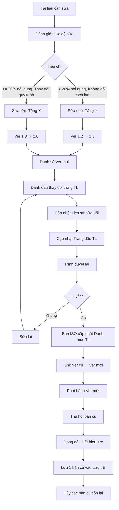

# SOP-03.3: KIỂM SOÁT PHIÊN BẢN TÀI LIỆU

## 1. THÔNG TIN QUY TRÌNH

| **Thuộc tính** | **Nội dung** |
|---|---|
| Mã SOP | SOP-03.3 |
| Tên quy trình | Kiểm soát phiên bản tài liệu |
| Quy trình cha | SOP-03: Sổ tay chất lượng |
| Phiên bản | 1.0 |
| Tần suất | Mỗi lần sửa đổi tài liệu |

## 2. MỤC ĐÍCH

- **Tránh nhầm lẫn**: Ai cũng dùng đúng phiên bản mới nhất
- **Truy vết được**: Biết tài liệu thay đổi gì, khi nào, tại sao
- **Tuân thủ ISO**: Yêu cầu bắt buộc của ISO 9001 (Điều 7.5.3)

## 3. QUY TẮC ĐÁNH SỐ PHIÊN BẢN

### 3.1. Nguyên tắc

**Format: Ver X.Y**
- **X**: Phiên bản chính (Major version)
- **Y**: Phiên bản phụ (Minor version)

| **Thay đổi** | **Cách đánh số** | **Ví dụ** |
|---|---|---|
| **Phát hành lần đầu** | Ver 1.0 | |
| **Sửa nhỏ** (Từ ngữ, Format, Bổ sung ít) | Tăng Y: 1.0 → 1.1 | Ver 1.0 → Ver 1.1 |
| **Sửa nhiều lần** | Tăng dần Y | Ver 1.1 → 1.2 → 1.3... |
| **Sửa LỚN** (Thay đổi quy trình, Cấu trúc, Logic) | Tăng X, reset Y về 0: 1.3 → 2.0 | Ver 1.3 → Ver 2.0 |

### 3.2. Ví dụ lịch sử phiên bản

**Tài liệu: SOP-01.3 Sàng lọc hồ sơ ứng viên**

| **Phiên bản** | **Ngày** | **Nội dung thay đổi** | **Lý do** | **Người duyệt** |
|---|---|---|---|---|
| Ver 1.0 | 01/09/2024 | Phát hành lần đầu | Triển khai ISO | HT |
| Ver 1.1 | 15/10/2024 | Sửa lỗi chính tả, bổ sung mẫu email | Hoàn thiện | Phó HT |
| Ver 1.2 | 01/12/2024 | Thêm bước "Reference check" | Cải tiến từ audit | Phó HT |
| Ver 2.0 | 01/03/2025 | Thay đổi tiêu chí chấm điểm CV (25→30 điểm cho kinh nghiệm) | Theo chính sách mới | HT |

## 4. QUY TRÌNH THỰC HIỆN

### 4.1. Khi tạo tài liệu mới

**Bước 1: Đánh Ver 1.0**
- Luôn luôn bắt đầu từ 1.0
- Không bắt đầu từ 0.1 hay 1.1

### 4.2. Khi sửa đổi tài liệu

**Bước 2: Đánh giá mức độ sửa đổi**

| **Tiêu chí** | **Sửa nhỏ (Tăng Y)** | **Sửa lớn (Tăng X)** |
|---|---|---|
| Số lượng thay đổi | < 20% nội dung | ≥ 20% nội dung |
| Ảnh hưởng | Không đổi cách làm | Thay đổi cách làm |
| Cần đào tạo lại? | Không | Có |
| Ví dụ | Sửa lỗi chính tả, Bổ sung mẫu | Thay đổi quy trình, Thêm bước mới |

**Bước 3: Quyết định số phiên bản mới**

**Nếu sửa nhỏ:**
- Ver 1.2 → Ver 1.3
- Ver 2.1 → Ver 2.2

**Nếu sửa lớn:**
- Ver 1.3 → Ver 2.0
- Ver 2.2 → Ver 3.0

**Bước 4: Đánh dấu thay đổi trong tài liệu**

**Trong tài liệu, có bảng lịch sử sửa đổi:**

```
LỊCH SỬ SỬA ĐỔI

Ver   | Ngày       | Nội dung thay đổi            | Người duyệt
------|------------|------------------------------|-------------
1.0   | 01/09/2024 | Phát hành lần đầu            | HT Nguyễn Văn A
1.1   | 15/10/2024 | Sửa lỗi chính tả trang 3, 5  | Phó HT Trần Thị B
2.0   | 01/03/2025 | Thay đổi quy trình bước 4-6  | HT Nguyễn Văn A
```

**Highlight thay đổi (Trong bản Word):**
- Text mới: **Chữ đậm** hoặc <u>Gạch chân</u>
- Text xóa: ~~Gạch ngang~~

**Bước 5: Cập nhật "Trang đầu" tài liệu**

```
MÃ: SOP-01.3
TÊN: Sàng lọc hồ sơ ứng viên
PHIÊN BẢN: 2.0
NGÀY: 01/03/2025
PHIÊN BẢN THAY THẾ: Ver 1.2 (Hết hiệu lực)
```

### 4.3. Ghi nhận vào Danh mục

**Bước 6: Ban ISO cập nhật Danh mục TL (QT04-S02)**

| **Mã** | **Tên** | **Ver cũ** | **Ver mới** | **Ngày** | **Thay đổi** | **Số bản cũ thu hồi** |
|---|---|---|---|---|---|---|
| SOP-01.3 | Sàng lọc hồ sơ | 1.2 | **2.0** | 01/03/2025 | Thay đổi tiêu chí chấm điểm | 8/8 ✅ |

**Bước 7: Lưu bản cũ vào thư mục "Lưu trữ phiên bản cũ"**

## 5. LƯU ĐỒ QUY TRÌNH



## 6. BIỂU MẪU LIÊN QUAN

| **Mã** | **Tên** |
|---|---|
| QT04-S02 | Danh mục tài liệu QMS (Có cột Ver) |
| QT04-S03 | Lịch sử sửa đổi tài liệu |

## 7. TIÊU CHUẨN VÀ CHỈ TIÊU

| **Chỉ tiêu** | **Mục tiêu** |
|---|---|
| Đánh số Ver đúng quy tắc | 100% |
| Lưu đầy đủ lịch sử sửa đổi | 100% |
| NV sử dụng Ver mới nhất | ≥ 98% |

## 8. TRÁCH NHIỆM CỤ THỂ

| **Vai trò** | **Trách nhiệm** |
|---|---|
| **Ban ISO** | Quyết định số Ver, Cập nhật Danh mục, Lưu trữ các Ver |
| **Chủ tài liệu** | Đánh dấu thay đổi, Ghi lịch sử sửa đổi |

## 9. LƯU Ý QUAN TRỌNG

- ⚠️ **Không nhảy số**: 1.2 → 1.3 (Đúng), 1.2 → 1.5 (Sai)
- ✅ **Lưu tất cả Ver**: Để truy vết, so sánh khi cần
- ✅ **Ghi rõ lý do sửa**: Trong Lịch sử sửa đổi
- 🔥 **Thông báo khi Ver lớn**: Ver 1.x → 2.0 → Phải đào tạo lại NV

## 10. PHỤ LỤC

### 10.1. Ví dụ đánh dấu thay đổi trong tài liệu

**Trước (Ver 1.2):**
```
Bước 4: Chấm điểm theo tiêu chí

| Tiêu chí | Điểm tối đa |
|----------|-------------|
| Bằng cấp | 25          |
| Kinh nghiệm | 25       |
```

**Sau (Ver 2.0):**
```
Bước 4: Chấm điểm theo tiêu chí

| Tiêu chí | Điểm tối đa |
|----------|-------------|
| Bằng cấp | 25          |
| Kinh nghiệm | **30** ← THAY ĐỔI    |
| **Kỹ năng** | **20** ← BỔ SUNG MỚI |

Ghi chú Ver 2.0: Tăng trọng số Kinh nghiệm từ 25→30, 
Bổ sung tiêu chí Kỹ năng 20 điểm
```

## 11. FAQ

**Q1: Nếu sửa lỗi nhỏ (1-2 chữ), có cần tăng Ver không?**  
A: Tùy. Nếu không ảnh hưởng ý nghĩa → Không cần (Gọi là Ver 1.0 Revised). Nếu ảnh hưởng → Ver 1.1.

**Q2: Có thể có 2 Ver song song không (Ver 1.3 + Ver 2.0)?**  
A: Không! Chỉ 1 Ver hiệu lực tại 1 thời điểm. Ver cũ phải thu hồi hết.

---

**PHÊ DUYỆT**

| Trưởng Ban ISO | Phó Hiệu trưởng |
|---|---|
| [Họ tên] | [Họ tên] |
