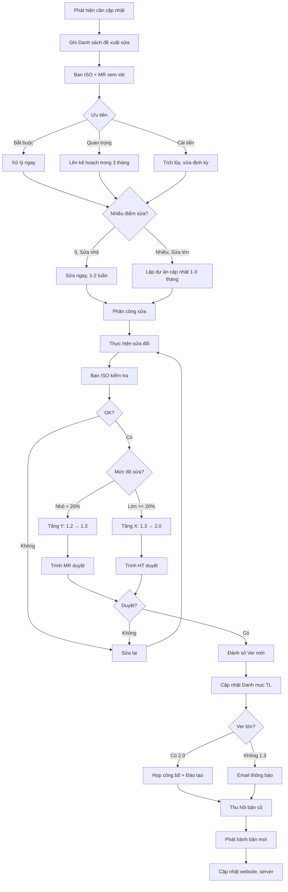

# SOP-03.4: CẬP NHẬT VÀ CẢI TIẾN SỔ TAY

## 1. THÔNG TIN QUY TRÌNH

| **Thuộc tính** | **Nội dung** |
|---|---|
| Mã SOP | SOP-03.4 |
| Tên quy trình | Cập nhật và cải tiến sổ tay |
| Quy trình cha | SOP-03: Sổ tay chất lượng |
| Phiên bản | 1.0 |
| Tần suất | Khi có thay đổi lớn hoặc Rà soát hàng năm |

## 2. MỤC ĐÍCH

- **Luôn cập nhật**: Sổ tay CL phản ánh đúng thực tế đang vận hành
- **Cải tiến liên tục**: Đơn giản hóa, làm rõ hơn, bổ sung thiếu sót
- **Đáp ứng yêu cầu mới**: Khi có ISO mới, Kiểm định mới...

## 3. CÁC TRƯỜNG HỢP CẬP NHẬT

| **Trường hợp** | **Ví dụ** | **Mức độ sửa** |
|---|---|---|
| **Thay đổi tổ chức** | Thêm/Bỏ bộ phận, Thay BGH | Trung bình |
| **Thay đổi quy trình** | Sửa QT, SOP | Tùy mức độ |
| **Thay đổi chính sách** | Chính sách CL mới, KPI mới | Lớn |
| **Yêu cầu mới** | ISO cập nhật, Kiểm định yêu cầu | Lớn |
| **Phát hiện từ audit** | NC về Sổ tay CL | Nhỏ - Trung bình |
| **Cải tiến** | Làm rõ hơn, Bổ sung sơ đồ | Nhỏ |

## 4. QUY TRÌNH THỰC HIỆN

### 4.1. Phát hiện nhu cầu cập nhật

**Bước 1: Nguồn phát hiện**

| **Nguồn** | **Ai phát hiện** | **Kênh** |
|---|---|---|
| Rà soát định kỳ | Ban ISO | Hàng năm (T6) |
| Audit nội bộ | Auditor | Báo cáo audit |
| Management Review | BGH | Biên bản MR |
| Phản hồi NV | CBGVNV | Hộp thư góp ý |
| Thay đổi tổ chức | BGH | Quyết định |
| ISO/Kiểm định mới | Ban ISO | Theo dõi cập nhật |

**Bước 2: Ghi nhận vào Danh sách đề xuất sửa Sổ tay (QT04-S04)**

| **STT** | **Phần cần sửa** | **Nội dung** | **Người đề xuất** | **Mức độ** | **Trạng thái** |
|---|---|---|---|---|---|
| 1 | Phần 3.3 | Cập nhật sơ đồ tổ chức (Thêm Phó HT mới) | Ban ISO | Nhỏ | Đang xử lý |
| 2 | Phần 6.2 | Bổ sung chương trình IB | Học thuật | Lớn | Chờ duyệt |

### 4.2. Xem xét và lập kế hoạch

**Bước 3: Ban ISO + Đại diện quản lý xem xét**

- Ưu tiên: Bắt buộc (Audit NC) > Quan trọng > Cải tiến
- Nhóm lại: Sửa một lần cho nhiều điểm thay vì sửa nhiều lần

**Bước 4: Lập kế hoạch cập nhật**

| **Nếu sửa nhỏ** | **Nếu sửa lớn** |
|---|---|
| Tích lũy 3-5 điểm → Sửa 1 lần | Lập dự án cập nhật riêng |
| Thời gian: 1-2 tuần | Thời gian: 1-3 tháng |
| Ver 1.0 → 1.1 | Ver 1.x → 2.0 |

### 4.3. Thực hiện cập nhật

**Bước 5: Phân công sửa**
- Ai đề xuất → Người đó sửa
- Hoặc Tổng biên tập sửa

**Bước 6: Sửa đổi**

**Bước 7: Ban ISO kiểm tra**
- Có đáp ứng yêu cầu không?
- Có tạo mâu thuẫn với phần khác không?
- Có cần sửa thêm chỗ nào liên quan?

**Bước 8: Trình phê duyệt**

| **Mức độ sửa** | **Người duyệt** |
|---|---|
| Sửa nhỏ (Ver X.Y+1) | Đại diện quản lý |
| Sửa lớn (Ver X+1.0) | Hiệu trưởng |

### 4.4. Phát hành phiên bản mới

**Bước 9: Đánh số Ver mới → Theo SOP-03.3**

**Bước 10: Thông báo toàn trường**

**Nếu sửa nhỏ:**
- Email thông báo
- Không cần đào tạo lại

**Nếu sửa lớn (Ver 2.0):**
- Họp công bố
- Đào tạo lại điểm thay đổi
- Kiểm tra hiểu biết

**Bước 11: Thu hồi bản cũ → Phát hành bản mới**

**Bước 12: Cập nhật website, server**

## 5. LƯU ĐỒ QUY TRÌNH

## 6. BIỂU MẪU LIÊN QUAN

| **Mã** | **Tên** |
|---|---|
| QT04-S04 | Danh sách đề xuất sửa Sổ tay CL |
| QT04-S03 | Lịch sử sửa đổi tài liệu |

## 7. TIÊU CHUẨN VÀ CHỈ TIÊU

| **Chỉ tiêu** | **Mục tiêu** |
|---|---|
| Xử lý đề xuất sửa trong 30 ngày | ≥ 90% |
| Sổ tay CL luôn phản ánh đúng thực tế | 100% |
| Rà soát Sổ tay CL hàng năm | 100% |

## 8. TRÁCH NHIỆM CỤ THỂ

| **Vai trò** | **Trách nhiệm** |
|---|---|
| **Ban ISO** | Thu thập đề xuất, Lập kế hoạch, Kiểm tra, Phát hành |
| **Tổng biên tập** | Sửa đổi nội dung, Kiểm tra nhất quán |
| **MR/HT** | Phê duyệt |

## 9. LƯU Ý QUAN TRỌNG

- ⚠️ **Không sửa quá thường xuyên**: Tối đa 2-3 lần/năm. Sửa nhiều → NV bối rối
- ✅ **Nhóm lại sửa 1 lần**: Tích lũy 5-10 điểm nhỏ, sửa cùng lúc
- ✅ **Test trước khi phát hành**: Cho 1-2 BP dùng thử Ver mới 1 tuần
- 🔥 **Kiểm định sẽ xem**: Sổ tay CL có cập nhật không? Có Ver cũ lưu chung với Ver mới không?

## 10. PHỤ LỤC

### 10.1. Lịch rà soát Sổ tay CL định kỳ

| **Thời điểm** | **Nội dung rà soát** | **Người thực hiện** |
|---|---|---|
| **Sau Audit (T11, T5)** | Xem có NC về Sổ tay CL không | Ban ISO |
| **Management Review (T12, T6)** | Xem có cần sửa không | BGH + Ban ISO |
| **Cuối năm (T6)** | Rà soát toàn diện 9 phần | Tổng biên tập |
| **Khi có ISO mới** | So sánh yêu cầu mới | Chuyên gia ISO |

### 10.2. Checklist rà soát Sổ tay CL

- [ ] Còn phù hợp với thực tế không?
- [ ] Có thay đổi tổ chức không?
- [ ] Có thay đổi quy trình không?
- [ ] Có QT, SOP mới không?
- [ ] Có yêu cầu ISO/Kiểm định mới không?
- [ ] Có phần nào khó hiểu, cần làm rõ?
- [ ] Có phần nào dư thừa, cần bỏ?
- [ ] Có bổ sung sơ đồ, bảng biểu không?

## 11. FAQ

**Q: Bao lâu nên cập nhật Sổ tay CL 1 lần?**  
A: Tùy. Trường ổn định: 2-3 năm/lần. Trường thay đổi nhiều: 6-12 tháng/lần.

**Q: Khi cập nhật Sổ tay, có cần cập nhật tất cả QT, SOP không?**  
A: Không nhất thiết. Sổ tay chỉ tóm tắt, tham chiếu QT/SOP. Trừ khi QT/SOP thay đổi lớn.

---

**PHÊ DUYỆT**

| Tổng biên tập | Đại diện quản lý | Hiệu trưởng |
|---|---|---|
| [Họ tên] | [Họ tên] | [Họ tên] |

---

✅ **HOÀN THÀNH SOP-03: SỔ TAY CHẤT LƯỢNG (4 files) - ĐẦY ĐỦ!**
