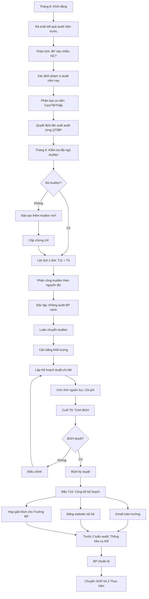
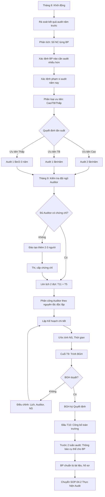

# SOP-04.1: LẬP KẾ HOẠCH AUDIT NỘI BỘ

## 1. THÔNG TIN QUY TRÌNH

| **Thuộc tính** | **Nội dung** |
|---|---|
| Mã SOP | SOP-04.1 |
| Tên quy trình | Lập kế hoạch audit nội bộ |
| Quy trình cha | SOP-04: Audit nội bộ |
| Phiên bản | 1.0 |
| Tần suất | Hàng năm (Trước kỳ audit) |

## 2. MỤC ĐÍCH

- **Lập kế hoạch toàn diện**: Audit tất cả quy trình, tất cả bộ phận trong năm
- **Phân bổ nguồn lực**: Auditor, Thời gian hợp lý
- **Ưu tiên đúng**: Tập trung vào quy trình quan trọng, rủi ro cao

## 3. PHẠM VI ÁP DỤNG

Tất cả quy trình và bộ phận trong phạm vi QMS

## 4. NGUYÊN TẮC LẬP KẾ HOẠCH AUDIT

| **Nguyên tắc** | **Ý nghĩa** |
|---|---|
| **Toàn diện** | Audit hết tất cả quy trình ít nhất 1 lần/năm |
| **Độc lập** | Auditor không audit BP mình |
| **Dựa trên rủi ro** | Quy trình quan trọng, nhiều NC trước → Audit nhiều hơn |
| **Linh hoạt** | Điều chỉnh kế hoạch nếu phát sinh vấn đề |

## 4. QUY TRÌNH THỰC HIỆN

### 4.1. Chuẩn bị (Tháng 8)

**Bước 1: Rà soát kết quả audit năm trước**

| **Bộ phận** | **Lần audit** | **Số NC** | **Đánh giá** |
|---|---|---|---|
| Phòng Học thuật | 2 lần | 3 NC nhỏ | Tốt |
| Phòng Hành chính | 2 lần | 8 NC | ⚠️ Nhiều NC |
| Bếp ăn | 1 lần | 2 NC | Tốt |

**Bước 2: Xác định phạm vi audit năm nay**

| **Quy trình** | **Độ ưu tiên** | **Lý do** | **Tần suất audit** |
|---|---|---|---|
| QT-01: An toàn - PCCC | Cao | Liên quan an toàn HS | 2 lần/năm |
| QT-02: Nhân sự | Cao | Quy trình cốt lõi | 2 lần/năm |
| QT-03: Tài chính | Cao | Rủi ro gian lận | 2 lần/năm |
| QT-04: Chất lượng | Cao | Yêu cầu ISO | 2 lần/năm |
| QT-05: Giảng dạy | Cao | Cốt lõi | 2 lần/năm |
| QT-06: Học sinh | Trung bình | | 1 lần/năm |
| QT-07: Phụ huynh | Trung bình | | 1 lần/năm |
| QT-08: Quản trị | Thấp | Ít thay đổi | 1 lần/3 năm |
| QT-09: Công nghệ | Trung bình | | 1 lần/năm |

**Bước 3: Kiểm tra đội ngũ Auditor**

| **Họ tên** | **Chứng chỉ** | **Bộ phận** | **Kinh nghiệm audit** | **Có thể audit** |
|---|---|---|---|---|
| Nguyễn Văn A | ISO 9001 Lead Auditor | Học thuật | 3 năm | Tất cả (trừ Học thuật) |
| Trần Thị B | ISO 9001 Internal Auditor | Nhân sự | 1 năm | Tất cả (trừ Nhân sự) |

**Lưu ý:** Auditor KHÔNG audit bộ phận mình (Nguyên tắc độc lập)

### 4.2. Lập kế hoạch chi tiết (Tháng 9)

**Bước 4: Lên lịch 2 đợt audit trong năm**

**Đợt 1:** Tháng 11 (Sau học kỳ 1)
**Đợt 2:** Tháng 5 (Cuối năm học)

**Bước 5: Phân công Auditor**

Nguyên tắc:
- Mỗi BP audit bởi ít nhất 2 Auditor (Trưởng đội + Thành viên)
- Luân chuyển Auditor (Không để 1 người audit 1 BP mãi)
- Cân bằng khối lượng công việc

**Bước 6: Lập Kế hoạch Audit năm (QT04-D13)**

**Ví dụ:**

| **STT** | **Quy trình/BP** | **Đợt** | **Thời gian** | **Auditor** | **Phạm vi** | **Tiêu chí** |
|---|---|---|---|---|---|---|
| 1 | QT-01: An toàn - PCCC | Đợt 1 | 10-11/11 | Nguyễn Văn A (Lead)<br>Trần Thị B | Tất cả SOP | Tuân thủ, Hiệu quả |
| 2 | Phòng Học thuật | Đợt 1 | 12-13/11 | Lê Văn C (Lead)<br>Phạm Thị D | Giảng dạy, Học liệu | Tuân thủ, KPI |
| 3 | Phòng Tài chính | Đợt 1 | 14-15/11 | Nguyễn Văn A | Thu chi, Báo cáo | Tuân thủ, Kiểm soát |
| ... | ... | ... | ... | ... | ... | ... |

**Tổng:** 20-25 ngày audit trong năm (10-12 ngày/đợt)

**Bước 7: Ước tính nguồn lực**

| **Nguồn lực** | **Số lượng** | **Chi phí** |
|---|---|---|
| Auditor (Ngày công) | 50 ngày-người | 0 (NV nội bộ) |
| Đào tạo Auditor | 2 khóa | 20 triệu |
| Tài liệu, văn phòng phẩm | | 2 triệu |
| **Tổng** | | **22 triệu** |

### 4.3. Phê duyệt và công bố

**Bước 8: Trình BGH phê duyệt (Cuối tháng 9)**

**Bước 9: BGH ký phê duyệt kế hoạch**

**Bước 10: Công bố kế hoạch audit (Đầu tháng 10)**

- Gửi email toàn trường
- Đăng lên website nội bộ
- Họp giải thích cho Trưởng BP

**Lợi ích công bố sớm:**
- BP có thời gian chuẩn bị
- Không bị bất ngờ
- Tạo văn hóa minh bạch

**Bước 11: Thông báo cụ thể trước 2 tuần**

Trước mỗi đợt audit, gửi email nhắc:
- Thời gian cụ thể
- Auditor là ai
- Phạm vi audit
- Tài liệu cần chuẩn bị

## 5. LƯU ĐỒ QUY TRÌNH



## 6. BIỂU MẪU LIÊN QUAN

| **Mã** | **Tên** |
|---|---|
| QT04-D13 | Kế hoạch Audit nội bộ năm |
| QT04-F09 | Form đăng ký Auditor |
| QT04-D14 | Quyết định phê duyệt kế hoạch Audit |

## 7. TIÊU CHUẨN VÀ CHỈ TIÊU

| **Chỉ tiêu** | **Mục tiêu** |
|---|---|
| Hoàn thành kế hoạch trước T10 | 100% |
| Tất cả quy trình được audit ít nhất 1 lần/năm | 100% |
| Số Auditor có chứng chỉ | ≥ 5 người |
| Tỷ lệ thực hiện đúng kế hoạch | ≥ 90% |

## 8. TRÁCH NHIỆM CỤ THỂ

| **Vai trò** | **Trách nhiệm** |
|---|---|
| **Ban ISO** | Lập kế hoạch, Phân công Auditor |
| **Trưởng đội Audit** | Góp ý kế hoạch, Điều phối Auditor |
| **BGH** | Phê duyệt, Cung cấp nguồn lực |
| **Auditor** | Cam kết tham gia theo lịch |

## 9. LƯU Ý QUAN TRỌNG

- ⚠️ **Audit đủ tần suất**: ISO yêu cầu audit "theo kế hoạch định kỳ". Tối thiểu 1 năm/lần, lý tưởng 6 tháng/lần
- ✅ **Ưu tiên dựa trên rủi ro**: Quy trình càng quan trọng, càng nhiều vấn đề trước → Audit càng thường xuyên
- ✅ **Công bố trước**: Không audit "đột kích", trừ audit đặc biệt khi nghi ngờ gian lận
- ✅ **Đủ thời gian**: Mỗi BP audit ít nhất 0.5-1 ngày (4-8 giờ)
- 🔥 **Không bỏ sót**: Nếu quên audit 1 quy trình → NC trong audit bên ngoài

## 10. PHỤ LỤC

### 10.1. Mẫu Kế hoạch Audit năm

```
KẾ HOẠCH AUDIT NỘI BỘ NĂM HỌC 20XX-20XX
[Tên trường]

I. MỤC ĐÍCH:
Đánh giá mức độ tuân thủ và hiệu quả của Hệ thống Quản lý Chất lượng theo ISO 9001:2015

II. PHẠM VI:
Tất cả 9 Quy tắc (QT-01 đến QT-09) và các bộ phận liên quan

III. LỊCH AUDIT:

ĐỢT 1: 10-21 THÁNG 11/20XX

| Ngày | BP/Quy trình | Auditor | Thời gian | Phạm vi |
|------|--------------|---------|-----------|---------|
| 10/11 | QT-01: PCCC | Nguyễn Văn A (Lead), Trần Thị B | 8h-12h | SOP-01 đến SOP-07 |
| 10/11 | Phòng An toàn | Nguyễn Văn A, Trần Thị B | 13h-17h | Hồ sơ, Thực tế |
| 11/11 | QT-02: Nhân sự | Lê Văn C (Lead), Phạm Thị D | 8h-17h | SOP-01 đến SOP-07 |
| ... | ... | ... | ... | ... |

ĐỢT 2: 05-16 THÁNG 5/20XX
[Tương tự]

IV. ĐỘI NGŨ AUDITOR:

| Họ tên | Chứng chỉ | Vai trò |
|--------|-----------|---------|
| Nguyễn Văn A | Lead Auditor | Trưởng đội |
| Trần Thị B | Internal Auditor | Thành viên |
| ... | ... | ... |

V. NGUỒN LỰC:
• Ngân sách: 22 triệu đồng
• Thời gian: 20 ngày-người

PHÊ DUYỆT:
[Chữ ký Hiệu trưởng]
[Ngày]
```

### 10.2. Ma trận phân công Auditor

| **Bộ phận** | **Lead Auditor** | **Auditor 2** | **Ghi chú** |
|---|---|---|---|
| Học thuật | Lê Văn C (Hành chính) | Phạm Thị D (Tài chính) | Không dùng A (Học thuật) |
| Nhân sự | Nguyễn Văn A (Học thuật) | Trần Thị B (An toàn) | Không dùng E (Nhân sự) |
| Tài chính | Lê Văn C (Hành chính) | Trần Thị B (An toàn) | Không dùng F (Tài chính) |

**Nguyên tắc:** Auditor thuộc BP X → Audit BP Y, Z (KHÔNG audit X)

## 5. LƯU ĐỒ QUY TRÌNH



## 6. BIỂU MẪU LIÊN QUAN

| **Mã** | **Tên** |
|---|---|
| QT04-D13 | Kế hoạch Audit nội bộ năm |
| QT04-D14 | Quyết định phê duyệt KH Audit |
| QT04-F10 | Thông báo audit gửi BP |

## 7. TIÊU CHUẨN VÀ CHỈ TIÊU

| **Chỉ tiêu** | **Mục tiêu** |
|---|---|
| Hoàn thành KH trước T10 | 100% |
| Audit đủ tất cả quy trình | 100% |
| Thực hiện đúng KH (không hoãn, hủy) | ≥ 90% |

## 8. TRÁCH NHIỆM CỤ THỂ

| **Vai trò** | **Trách nhiệm** |
|---|---|
| **Trưởng đội Audit** | Lập kế hoạch, Phân công Auditor |
| **Ban ISO** | Hỗ trợ lập KH, Điều phối |
| **BGH** | Phê duyệt, Cung cấp nguồn lực |

## 9. LƯU Ý QUAN TRỌNG

- ⚠️ **Không audit vào lúc bận**: Tránh tuần thi, tuần lễ, sự kiện lớn
- ✅ **Thời gian hợp lý**: Mỗi BP ít nhất 4 giờ, BP lớn 1-2 ngày
- ✅ **Công bố công khai**: Tạo áp lực tích cực, BP tự chuẩn bị tốt
- 🔥 **Dự phòng**: Có thể điều chỉnh lịch nếu Auditor ốm, BP có việc đột xuất

## 10. PHỤ LỤC

### 10.1. Tiêu chí xác định ưu tiên audit

| **Tiêu chí** | **Điểm** | **Giải thích** |
|---|---|---|
| Liên quan an toàn HS | +10 | QT-01 PCCC, QT-06 Học sinh |
| Quy trình cốt lõi | +8 | QT-05 Giảng dạy, QT-02 Nhân sự |
| Nhiều NC năm trước | +5 | BP có ≥ 5 NC |
| Thay đổi lớn gần đây | +5 | Quy trình mới, SOP mới |
| Khiếu nại từ KH | +5 | PH phàn nàn về BP này |

**Tổng điểm ≥ 15:** Audit 2 lần/năm  
**Tổng điểm 8-14:** Audit 1 lần/năm  
**Tổng điểm < 8:** Audit 1 lần/2 năm

## 11. FAQ

**Q1: Có thể thay đổi kế hoạch audit giữa chừng không?**  
A: Được, nếu có lý do (Auditor ốm, BP quá bận, Phát sinh vấn đề cần audit đột xuất). Nhưng hạn chế.

**Q2: Có bắt buộc audit 2 lần/năm không?**  
A: Không. ISO chỉ yêu cầu "theo kế hoạch định kỳ". Nhưng 2 lần/năm là tốt nhất.

**Q3: Nếu không đủ Auditor?**  
A: Mời Auditor bên ngoài (Chi phí cao) hoặc Đào tạo nội bộ (Tốt hơn, lâu dài).

---

**PHÊ DUYỆT**

| Trưởng đội Audit | Trưởng Ban ISO | Phó HT | Hiệu trưởng |
|---|---|---|---|
| [Họ tên] | [Họ tên] | [Họ tên] | [Họ tên] |
