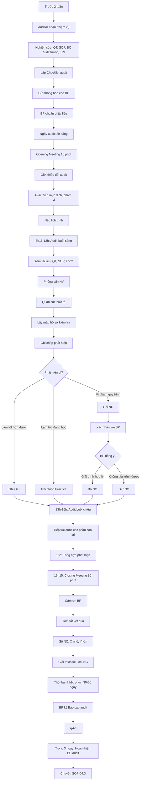

# SOP-04.2: THỰC HIỆN AUDIT NỘI BỘ

## 1. THÔNG TIN QUY TRÌNH

| **Thuộc tính** | **Nội dung** |
|---|---|
| Mã SOP | SOP-04.2 |
| Tên quy trình | Thực hiện audit nội bộ |
| Quy trình cha | SOP-04: Audit nội bộ |
| Phiên bản | 1.0 |
| Tần suất | 2 lần/năm (Tháng 11 và Tháng 5) |

## 2. MỤC ĐÍCH

- **Kiểm tra tuân thủ**: BP có làm đúng theo quy trình không?
- **Đánh giá hiệu quả**: Quy trình có hiệu quả không? Đạt KPI không?
- **Phát hiện NC**: Tìm ra không phù hợp (Non-Conformity) để khắc phục
- **Cải tiến**: Đề xuất cơ hội cải tiến

## 3. PHẠM VI ÁP DỤNG

Tất cả quy trình và bộ phận theo kế hoạch audit

## 4. PHƯƠNG PHÁP AUDIT

| **Phương pháp** | **Mô tả** | **Khi nào dùng** |
|---|---|---|
| **Xem xét tài liệu** | Đọc QT, SOP, Hồ sơ, Báo cáo | Mọi lúc |
| **Phỏng vấn** | Hỏi NV về cách làm, hiểu biết | Kiểm tra nhận thức |
| **Quan sát** | Xem NV làm việc thực tế | Kiểm tra thực hành |
| **Lấy mẫu** | Kiểm tra một số hồ sơ ngẫu nhiên | Đánh giá chung |

## 4. QUY TRÌNH THỰC HIỆN

### 4.1. Chuẩn bị audit (Trước 2 tuần)

**Bước 1: Nhận nhiệm vụ từ kế hoạch**

Auditor nhận thông báo:
- Audit BP nào, ngày nào
- Phạm vi (Quy trình nào)
- Vai trò (Lead hay Member)

**Bước 2: Nghiên cứu tài liệu**

Auditor đọc trước:
- QT, SOP của BP sẽ audit
- Báo cáo audit lần trước (Có NC gì? Đã khắc phục chưa?)
- KPI của BP (Đạt chưa?)
- Phản hồi khách hàng liên quan BP

**Bước 3: Lập Checklist audit (QT04-CL01)**

**Ví dụ Checklist audit Phòng Nhân sự:**

| **Tiêu chí** | **Tham chiếu** | **Phương pháp** | **Câu hỏi audit** | **Bằng chứng cần xem** |
|---|---|---|---|---|
| Có tuyển dụng theo quy trình không? | SOP-01.4 | Xem hồ sơ + Phỏng vấn | "Cho tôi xem hồ sơ tuyển dụng 3 NV gần nhất. Có đủ bảng chấm điểm PV không?" | Hồ sơ TD, Bảng chấm điểm |
| Lương có tính đúng không? | SOP-02.1 | Xem bảng lương | "Cho tôi xem bảng lương T10. Công thức tính có đúng SOP không?" | Bảng lương, Chấm công |
| BHXH đóng đúng hạn không? | SOP-05.2 | Xem giấy nộp | "Cho tôi xem giấy nộp BHXH T10. Có đúng ngày 20 không?" | Giấy nộp BHXH |

**Bước 4: Gửi thông báo audit chính thức cho BP (Trước 1 tuần)**

Email thông báo (QT04-F10):
- Ngày giờ cụ thể
- Auditor là ai
- Phạm vi audit
- Tài liệu cần chuẩn bị
- Người liên hệ

### 4.2. Buổi audit (Ngày audit)

**A. OPENING MEETING (Họp mở đầu - 15 phút)**

**Bước 5: Lead Auditor chủ trì**

**Thành phần:**
- Đội audit (2-3 người)
- Trưởng BP được audit
- NV chủ chốt của BP

**Nội dung:**
- Giới thiệu đội audit
- Giải thích mục đích: Giúp cải tiến, không phải tìm lỗi để phạt
- Nêu phạm vi, tiêu chí audit
- Lịch trình audit (Xem gì, hỏi ai, bao lâu)
- Q&A

**B. THỰC HIỆN AUDIT (3-6 giờ)**

**Bước 6: Audit theo Checklist**

**Kỹ thuật phỏng vấn:**

| **Nên** | **Không nên** |
|---|---|
| Hỏi mở: "Anh làm thế nào khi...?" | Hỏi đóng: "Anh có làm X không?" |
| Lắng nghe nhiều | Nói nhiều, áp đặt |
| Trung lập, khách quan | Chỉ trích, phán xét |
| Xác minh bằng bằng chứng | Tin lời nói suông |

**Ví dụ chuỗi câu hỏi audit:**

```
Auditor: "Anh cho tôi xem quy trình tuyển dụng anh đang dùng."
BP: [Đưa SOP-01.4]
Auditor: "Ver bao nhiêu?"
BP: "Ver 2.0"
Auditor: "OK. Anh có audit nào gần đây không? Cho tôi xem 3 hồ sơ."
BP: [Đưa 3 hồ sơ]
Auditor: [Kiểm tra] "Hồ sơ này thiếu Bảng chấm điểm phỏng vấn. Tại sao?"
BP: "Ứng viên này quen biết nên tôi không chấm điểm."
Auditor: "Vậy là không tuân thủ SOP. Đây là NC."
```

**Bước 7: Ghi chép phát hiện**

**3 loại phát hiện:**

| **Loại** | **Định nghĩa** | **Ví dụ** | **Xử lý** |
|---|---|---|---|
| **NC (Non-Conformity)** | Vi phạm quy trình, Không đạt tiêu chuẩn | Thiếu chứng từ, Không có chữ ký duyệt | **Bắt buộc khắc phục** (CAR) |
| **OFI (Opportunity for Improvement)** | Chưa sai nhưng làm tốt hơn được | Quy trình dài dòng, Form phức tạp | Gợi ý cải tiến (Không bắt buộc) |
| **Good Practice** | Làm tốt, đáng học tập | BP này có cách hay, hiệu quả | Chia sẻ cho BP khác |

**Mỗi phát hiện ghi vào Form (QT04-F11):**

| **STT** | **Loại** | **Phát hiện** | **Bằng chứng** | **Tham chiếu** | **Mức độ** |
|---|---|---|---|---|---|
| 1 | NC | Hồ sơ tuyển dụng 3/5 không có bảng chấm PV | Hồ sơ NV A, B, C | SOP-01.4 Bước 5 | Nhỏ |
| 2 | OFI | Quy trình chấm công thủ công, mất nhiều thời gian | Quan sát | SOP-NS | - |
| 3 | Good | Bảng theo dõi KPI rất trực quan, dễ hiểu | Dashboard BP | - | - |

**Bước 8: Xác nhận phát hiện với BP**

- Đọc lại NC với BP
- BP xác nhận hoặc Giải trình
- Nếu giải trình hợp lý → Không phải NC
- Nếu không giải trình được → Giữ NC

**C. CLOSING MEETING (Họp kết thúc - 30 phút)**

**Bước 9: Lead Auditor chủ trì**

**Nội dung:**
- Cảm ơn BP đã hợp tác
- Tóm tắt kết quả audit:
  - Điểm mạnh (Good Practice)
  - Điểm yếu (NC)
  - Gợi ý cải tiến (OFI)
- Số lượng NC: X NC nhỏ, Y NC lớn
- Giải thích tiêu chí phân loại NC
- Thời hạn khắc phục: 30 ngày (NC nhỏ), 60 ngày (NC lớn)
- BP ký xác nhận vào Báo cáo audit (QT04-R06)

**Bước 10: Q&A**

BP có quyền:
- Hỏi thêm về NC
- Giải trình (nếu chưa rõ)
- Đề xuất thời gian khắc phục dài hơn (nếu có lý do)

### 4.3. Sau audit

**Bước 11: Hoàn thiện Báo cáo audit (Trong 3 ngày)**

**Bước 12: Chuyển sang SOP-04.3 (Báo cáo kết quả)**

## 5. LƯU ĐỒ QUY TRÌNH



## 6. BIỂU MẪU LIÊN QUAN

| **Mã** | **Tên** |
|---|---|
| QT04-CL01 | Checklist audit |
| QT04-F11 | Form ghi nhận phát hiện audit |
| QT04-R06 | Báo cáo audit (Draft tại chỗ) |
| QT04-F10 | Thông báo audit gửi BP |

## 7. TIÊU CHUẨN VÀ CHỈ TIÊU

| **Chỉ tiêu** | **Mục tiêu** |
|---|---|
| Thực hiện đúng lịch | ≥ 95% |
| Hoàn thành BC audit trong 3 ngày | 100% |
| BP hợp tác tốt trong audit | ≥ 90% |
| Phát hiện NC (nếu có) | 100% |

## 8. TRÁCH NHIỆM CỤ THỂ

| **Vai trò** | **Trách nhiệm** |
|---|---|
| **Lead Auditor** | Chủ trì, Phân công, Ra kết luận, Viết BC |
| **Auditor** | Thực hiện audit theo phân công, Ghi chép |
| **BP được audit** | Cung cấp tài liệu, Trả lời, Giải trình, Ký xác nhận |

## 9. LƯU Ý QUAN TRỌNG

- ⚠️ **Khách quan, độc lập**: Auditor không để tình cảm ảnh hưởng
- ✅ **Dựa trên bằng chứng**: Phải có chứng cứ cụ thể, không đoán mò
- ✅ **Tôn trọng**: Thái độ lịch sự, không công kích cá nhân
- ✅ **Ghi chép chi tiết**: Mỗi NC phải có: Phát hiện gì, Ở đâu, Khi nào, Vi phạm điều gì
- 🔥 **Phân loại NC đúng**: NC nhỏ/NC lớn quyết định thời gian khắc phục và ảnh hưởng chứng chỉ ISO

## 10. PHỤ LỤC

### 10.1. Phân loại NC (Non-Conformity)

| **Loại** | **Định nghĩa** | **Ví dụ** | **Hậu quả** |
|---|---|---|---|
| **NC Lớn (Major)** | Vi phạm nghiêm trọng, Hệ thống, Ảnh hưởng lớn | • Không có quy trình<br>• Quy trình sai hoàn toàn<br>• Vi phạm pháp luật<br>• Nhiều NC nhỏ cùng vấn đề | **Không cấp chứng chỉ ISO** (nếu audit bên ngoài)<br>Phải khắc phục NGAY |
| **NC Nhỏ (Minor)** | Vi phạm đơn lẻ, Cục bộ, Ảnh hưởng nhỏ | • Thiếu 1 chứng từ<br>• Quên 1 chữ ký<br>• Ghi chép thiếu sót | Khắc phục trong 30 ngày<br>Vẫn được cấp chứng chỉ (nếu audit ngoài) |

### 10.2. Kỹ năng Auditor cần có

| **Kỹ năng** | **Mô tả** | **Ví dụ** |
|---|---|---|
| **Lắng nghe tích cực** | Nghe kỹ, không ngắt lời | Để NV giải thích hết |
| **Đặt câu hỏi mở** | Hỏi "Như thế nào", "Tại sao" | "Anh làm thế nào khi nhận CV?" |
| **Quan sát sắc bén** | Nhìn ra điểm bất thường | Phát hiện tài liệu không đóng dấu kiểm soát |
| **Phân tích logic** | Liên kết thông tin | "Anh nói làm A nhưng hồ sơ ghi B?" |
| **Giao tiếp tốt** | Thân thiện nhưng chuyên nghiệp | Tạo không khí thoải mái |
| **Khách quan** | Không thiên vị | Bạn thân cũng audit đúng |

### 10.3. Mẫu Checklist audit

```
CHECKLIST AUDIT - PHÒNG HỌC THUẬT

Quy trình: QT-05 Giảng dạy - Học liệu - Đánh giá
Ngày audit: 12/11/2024
Auditor: Nguyễn Văn A

┌────────────────────────────────────────────────────────┐
│ TIÊU CHÍ 1: Thiết kế giáo án (SOP-01)                  │
├────────────────────────────────────────────────────────┤
│ □ Có quy trình thiết kế giáo án (SOP-01.1)?           │
│ □ Giáo án có đủ các thành phần theo SOP?              │
│ □ 100% GV có giáo án?                                  │
│ □ Giáo án được duyệt trước khi dạy?                   │
│                                                        │
│ Phương pháp: Xem 10 giáo án ngẫu nhiên                │
│ Phát hiện: _________________________________          │
│ NC/OFI: ____________________________________          │
└────────────────────────────────────────────────────────┘

[Tiếp tục các tiêu chí khác...]
```

### 10.4. Các câu hỏi audit "sát thủ"

Các câu hỏi này thường phát hiện NC:

1. **"Cho tôi xem tài liệu anh đang dùng. Ver bao nhiêu?"**
   → Phát hiện: Dùng bản cũ, Không kiểm soát

2. **"Theo quy trình, anh phải làm gì? Anh làm thế nào thực tế?"**
   → Phát hiện: Làm khác với quy trình

3. **"Cho tôi xem 5 hồ sơ gần nhất."**
   → Phát hiện: Thiếu chứng từ, Không đầy đủ

4. **"Anh biết KPI của BP là bao nhiêu không? Hiện tại đạt bao nhiêu?"**
   → Phát hiện: Không biết KPI, Không theo dõi

5. **"Khi có vấn đề X, anh xử lý thế nào?"**
   → Phát hiện: Không biết cách xử lý, Không theo quy trình

## 5. LƯU ĐỒ QUY TRÌNH (Lược đồ ở phần 5 bên trên)

## 6. BIỂU MẪU (Đã liệt kê ở phần 6)

## 7. TIÊU CHUẨN (Đã liệt kê ở phần 7)

## 8. TRÁCH NHIỆM (Đã liệt kê ở phần 8)

## 9. LƯU Ý (Đã liệt kê ở phần 9)

## 10. PHỤ LỤC (Đã liệt kê ở phần 10)

## 11. FAQ

**Q1: Nếu BP không hợp tác, không cung cấp tài liệu?**  
A: Ghi NC lớn: "Không hợp tác audit". Báo BGH xử lý kỷ luật.

**Q2: Auditor có thể audit BP mình không (nếu thiếu người)?**  
A: KHÔNG! Vi phạm nguyên tắc độc lập. Phải mời Auditor bên ngoài hoặc đào tạo thêm.

**Q3: Nếu phát hiện gian lận trong audit?**  
A: Dừng audit ngay, Báo BGH khẩn cấp, Chuyển điều tra chuyên sâu.

**Q4: Có thể "bỏ qua" NC nhỏ để giúp BP không?**  
A: KHÔNG! Gian lận audit = Mất chứng chỉ ISO. Phải ghi NC đúng sự thật.

**Q5: BP yêu cầu audit vào thời gian khác?**  
A: Có thể thương lượng thay đổi trong 1-2 tuần. Nhưng không hoãn mãi.

---

**PHÊ DUYỆT**

| Lead Auditor | Trưởng đội Audit | Trưởng Ban ISO | Phó HT |
|---|---|---|---|
| [Họ tên] | [Họ tên] | [Họ tên] | [Họ tên] |
