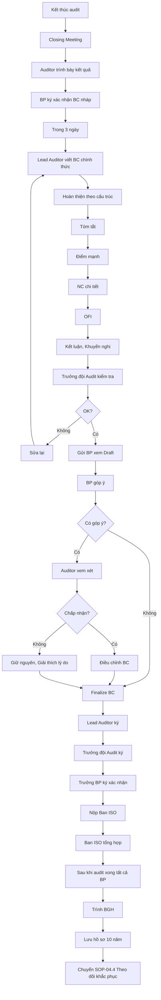

# SOP-04.3: BÁO CÁO KẾT QUẢ AUDIT

## 1. THÔNG TIN QUY TRÌNH

| **Thuộc tính** | **Nội dung** |
|---|---|
| Mã SOP | SOP-04.3 |
| Tên quy trình | Báo cáo kết quả audit |
| Quy trình cha | SOP-04: Audit nội bộ |
| Phiên bản | 1.0 |
| Tần suất | Sau mỗi lần audit |

## 2. MỤC ĐÍCH

- **Ghi nhận chính thức**: Kết quả audit, NC, OFI
- **Minh bạch**: BP, BGH đều biết rõ tình trạng
- **Cơ sở hành động**: Dựa vào BC để khắc phục, cải tiến
- **Bằng chứng cho kiểm định**: BC audit là tài liệu quan trọng khi kiểm định/audit ngoài

## 3. PHẠM VI ÁP DỤNG

Tất cả các lần audit

## 4. CẤU TRÚC BÁO CÁO AUDIT

### 4.1. Thông tin chung

| **Mục** | **Nội dung** |
|---|---|
| Tiêu đề | "BÁO CÁO AUDIT NỘI BỘ - [Tên BP] - Đợt [X]/20XX" |
| Mã BC | QT04-R06-[Số] |
| Ngày audit | [Ngày/Tháng/Năm] |
| Đội audit | Lead: [Tên], Members: [Tên, Tên] |
| BP được audit | [Tên BP], Trưởng BP: [Tên] |
| Phạm vi | QT/SOP nào được audit |
| Tiêu chí | ISO 9001:2015, QT/SOP của trường |

### 4.2. Tóm tắt kết quả (Executive Summary)

**Đánh giá chung:**
- ✅ **Tốt**: Tuân thủ tốt, Không có NC lớn, NC nhỏ dưới 3
- ⚠️ **Chấp nhận được**: Có 3-5 NC nhỏ, Cần cải thiện
- 🔴 **Không đạt**: Có NC lớn hoặc >5 NC nhỏ

**Thống kê:**

| **Chỉ tiêu** | **Số lượng** |
|---|---|
| Số quy trình được audit | 7 SOP |
| Số hồ sơ kiểm tra | 25 hồ sơ |
| Số NV phỏng vấn | 8 người |
| **Số NC lớn** | **0** |
| **Số NC nhỏ** | **3** |
| Số OFI | 5 |
| Good Practice | 2 |

### 4.3. Điểm mạnh (Strengths / Good Practices)

Liệt kê những gì BP làm tốt:

**Ví dụ:**
1. **Quản lý hồ sơ tuyển dụng xuất sắc**: Đầy đủ, Ngăn nắp, Dễ tra cứu. Mỗi hồ sơ có checklist, đã tick đầy đủ.
2. **Dashboard KPI trực quan**: BP tự làm bảng KPI rất đẹp, cập nhật real-time. Đề xuất chia sẻ cho BP khác.

### 4.4. Điểm yếu / NC (Non-Conformities)

**Mỗi NC ghi rõ:**

| **Mã NC** | **Loại** | **Mô tả** | **Bằng chứng** | **Tham chiếu** | **Tác động** |
|---|---|---|---|---|---|
| NC-01 | Nhỏ | Hồ sơ tuyển dụng NV A, B, C (3/10 hồ sơ check) thiếu Bảng chấm điểm Phỏng vấn | Hồ sơ NV A, B, C | SOP-01.4 Bước 5 | Không đánh giá khách quan ứng viên |
| NC-02 | Nhỏ | Bảng lương T10 không có chữ ký Phó HT (Quy trình yêu cầu 3 chữ ký: KT, Phó HT, HT. Chỉ có 2) | Bảng lương T10 | SOP-02.2 | Kiểm soát yếu |
| NC-03 | Nhỏ | Sổ theo dõi đào tạo NV chưa cập nhật (Khóa đào tạo T9 chưa ghi) | Sổ đào tạo | SOP-03.3 | Không nắm được tình hình đào tạo |

**Format NC chuẩn:**
```
NC-[Số]: [Mô tả ngắn gọn]

CHI TIẾT:
• Phát hiện gì: [Cụ thể]
• Ở đâu: [Hồ sơ, Tài liệu, Quy trình...]
• Khi nào: [Thời gian]
• Vi phạm điều gì: [Tham chiếu QT/SOP/ISO cụ thể]
• Bằng chứng: [Liệt kê]
• Tác động: [Ảnh hưởng gì đến chất lượng]

YÊU CẦU KHẮC PHỤC:
• Hành động: [BP phải làm gì]
• Thời hạn: [30 ngày / 60 ngày]
• Người chịu trách nhiệm: [Trưởng BP]
```

### 4.5. Gợi ý cải tiến (OFI - Opportunities for Improvement)

Không bắt buộc khắc phục, nhưng nên làm:

**Ví dụ:**
- **OFI-01**: Quy trình chấm công thủ công, mất thời gian. Đề xuất dùng app chấm công vân tay để tiết kiệm thời gian và chính xác hơn.
- **OFI-02**: Form đánh giá NV dài 5 trang, phức tạp. Đề xuất rút gọn còn 2 trang, tập trung 10 tiêu chí quan trọng nhất.

### 4.6. Kết luận và khuyến nghị

Tổng kết:
- Nhìn chung BP làm việc [Tốt / Chấp nhận được / Cần cải thiện]
- Tuân thủ quy trình [X%]
- Cần khắc phục [Y] NC trong [Z] ngày

Khuyến nghị:
- Ưu tiên khắc phục NC-01, NC-02 trước
- Xem xét triển khai OFI-01 (Có lợi lớn)
- Chia sẻ Good Practice về quản lý hồ sơ cho các BP khác

## 4. QUY TRÌNH LẬP BÁO CÁO

**Bước 1: Trong Closing Meeting**
- Auditor trình bày kết quả
- BP ký xác nhận vào BC (Bản nháp)

**Bước 2: Sau audit (Trong 3 ngày)**

Lead Auditor viết BC chính thức (QT04-R06):
- Hoàn thiện nội dung theo cấu trúc
- Kiểm tra lỗi chính tả, format
- Đính kèm bằng chứng (Ảnh chụp, File scan...)

**Bước 3: Trưởng đội Audit kiểm tra**

**Bước 4: Gửi BP xem lại (Draft)**

BP có quyền:
- Góp ý nếu có điểm chưa chính xác
- Giải trình thêm
- KHÔNG được yêu cầu bỏ NC (trừ khi chứng minh được NC sai)

**Bước 5: Điều chỉnh (nếu cần)**

**Bước 6: Finalize BC**

- Lead Auditor ký
- Trưởng đội Audit ký
- Trưởng BP ký xác nhận

**Bước 7: Nộp Ban ISO**

**Bước 8: Ban ISO tổng hợp vào BC Audit tổng thể**

**Bước 9: Trình BGH (Sau khi audit xong tất cả BP trong đợt)**

**Bước 10: Lưu hồ sơ audit**
- Báo cáo
- Checklist
- Bằng chứng (Ảnh, File)
- Lưu 10 năm

**Bước 11: Chuyển SOP-04.4 (Theo dõi khắc phục NC)**

## 5. LƯU ĐỒ QUY TRÌNH



## 6. BIỂU MẪU LIÊN QUAN

| **Mã** | **Tên** |
|---|---|
| QT04-R06 | Báo cáo audit nội bộ |
| QT04-R07 | Báo cáo tổng hợp audit (Cả đợt) |
| QT04-F12 | Form góp ý BC audit (BP) |

## 7. TIÊU CHUẨN VÀ CHỈ TIÊU

| **Chỉ tiêu** | **Mục tiêu** |
|---|---|
| Hoàn thành BC trong 3 ngày | 100% |
| BC đầy đủ, rõ ràng | 100% |
| BP ký xác nhận | 100% |

## 8. TRÁCH NHIỆM CỤ THỂ

| **Vai trò** | **Trách nhiệm** |
|---|---|
| **Lead Auditor** | Viết BC, Finalize, Ký |
| **Trưởng đội Audit** | Kiểm tra BC, Ký |
| **BP được audit** | Góp ý, Ký xác nhận |
| **Ban ISO** | Tổng hợp, Trình BGH, Lưu trữ |

## 9. LƯU Ý QUAN TRỌNG

- ⚠️ **NC phải cụ thể**: "Hồ sơ không đầy đủ" (Mơ hồ) → "Hồ sơ NV A thiếu Bảng chấm PV" (Cụ thể)
- ✅ **Có bằng chứng**: Ảnh chụp, File scan đính kèm
- ✅ **Không cảm tính**: Dựa trên sự thật, không chủ quan
- ✅ **Cân bằng**: Viết cả điểm mạnh và điểm yếu, không chỉ tập trung NC
- 🔥 **Bảo mật**: BC audit là nội bộ, không công khai ra ngoài

## 10. PHỤ LỤC

### 10.1. Mẫu Báo cáo Audit

```
═══════════════════════════════════════════════════
    BÁO CÁO AUDIT NỘI BỘ
    PHÒNG HỌC THUẬT - ĐỢT 1/2024
═══════════════════════════════════════════════════

Mã BC: QT04-R06-001
Ngày audit: 12-13/11/2024

I. THÔNG TIN AUDIT:

• Đội audit:
  - Lead Auditor: Lê Văn C
  - Auditor: Phạm Thị D

• Bộ phận được audit:
  - Tên: Phòng Học thuật
  - Trưởng phòng: Nguyễn Thị X
  - Số NV: 52 (50 GV + 2 NV hành chính)

• Phạm vi:
  - QT-05: Giảng dạy - Học liệu - Đánh giá
  - SOP-01 đến SOP-06 (6 quy trình cha, 30 quy trình con)

• Tiêu chí:
  - ISO 9001:2015
  - QT-05 và các SOP
  - KPI Phòng Học thuật

• Thời gian: 8h-17h (2 ngày)

II. PHƯƠNG PHÁP AUDIT:

• Xem xét tài liệu: Sổ tay CL, QT-05, 30 SOP, Biểu mẫu
• Phỏng vấn: 8 GV (Mầm non 2, Tiểu học 3, THCS 3)
• Quan sát: 3 tiết học, 1 cuộc họp tổ
• Lấy mẫu: 25 giáo án, 15 bài kiểm tra, 10 báo cáo đánh giá HS

III. KẾT QUẢ AUDIT:

A. ĐÁNH GIÁ CHUNG: ✅ TỐT

Phòng Học thuật tuân thủ tốt các quy trình, KPI đạt 8/10. 
Không có NC lớn, chỉ 3 NC nhỏ cần khắc phục.

B. ĐIỂM MẠNH (GOOD PRACTICES):

1. Quản lý giáo án xuất sắc (SOP-01.1):
   • 100% GV có giáo án đầy đủ
   • Giáo án được duyệt trước khi dạy
   • Lưu trữ có hệ thống (Theo tuần, theo môn)
   • Bằng chứng: Xem 25 giáo án, tất cả đạt chuẩn

2. Lesson Study hiệu quả (SOP-05):
   • Tổ chức đều đặn 2 tuần/lần
   • Có video ghi lại, phân tích sâu
   • GV tham gia tích cực, học hỏi lẫn nhau
   • → ĐỀ XUẤT: Chia sẻ mô hình này cho trường khác

C. KHÔNG PHÙ HỢP (NC):

NC-01: Thiếu biểu mẫu đánh giá học sinh (Minor)
─────────────────────────────────────────────────
• Phát hiện: 3/10 bài kiểm tra được chọn ngẫu nhiên 
  không có "Phiếu nhận xét đánh giá" đính kèm.
  
• Bằng chứng: Bài KT môn Toán Lớp 3A, 4B, 5C 
  (Tháng 10/2024)
  
• Tham chiếu: SOP-04.3 "Kiểm tra - Đánh giá", 
  Bước 6: "Mỗi bài KT phải có Phiếu nhận xét đánh giá"
  
• Tác động: Phụ huynh không biết con yếu ở đâu để 
  hỗ trợ. Vi phạm cam kết "Đánh giá minh bạch".
  
• Yêu cầu khắc phục:
  - Rà soát tất cả bài KT từ T9
  - Bổ sung đầy đủ Phiếu nhận xét
  - Nhắc nhở GV tuân thủ 100%
  - Thời hạn: 30 ngày (12/12/2024)
  - Trách nhiệm: Trưởng phòng Học thuật

[NC-02, NC-03 tương tự...]

D. GỢI Ý CẢI TIẾN (OFI):

OFI-01: Đơn giản hóa quy trình thiết kế giáo án
• Hiện tại: Giáo án 8 bước, mất 2-3 giờ/bài
• Đề xuất: Rút gọn còn 5 bước, dùng template có sẵn
• Lợi ích: Tiết kiệm 30-40% thời gian GV

[OFI-02, OFI-03...]

IV. KẾT LUẬN:

Phòng Học thuật hoạt động TỐT, tuân thủ hầu hết quy trình.
3 NC nhỏ cần khắc phục trong 30 ngày.
Đề xuất triển khai 2 OFI để nâng cao hiệu quả.

V. CHỮ KÝ XÁC NHẬN:

Lead Auditor: _____________ Ngày: _______
Trưởng đội Audit: _________ Ngày: _______
Trưởng BP: _______________ Ngày: _______
```

## 5. LƯU ĐỒ (Đã có ở phần 5)

## 6. BIỂU MẪU (Đã liệt kê)

## 7. TIÊU CHUẨN (Đã liệt kê)

## 8. TRÁCH NHIỆM (Đã liệt kê)

## 9. LƯU Ý (Đã liệt kê)

## 10. PHỤ LỤC (Đã có ở phần 10.1)

## 11. FAQ

**Q1: Nếu BP không đồng ý với NC?**  
A: Auditor giải thích, đưa bằng chứng. Nếu BP vẫn không đồng ý → Ghi vào BC, BGH quyết định cuối.

**Q2: Có giới hạn số NC không?**  
A: Không. Phát hiện bao nhiêu ghi bấy nhiêu. Nhưng > 10 NC = BP có vấn đề lớn.

**Q3: BC audit có công khai không?**  
A: Không công khai ra ngoài. Chỉ: Đội audit, BP, BGH, Ban ISO biết.

---

**PHÊ DUYỆT**

| Lead Auditor | Trưởng đội Audit | Trưởng Ban ISO |
|---|---|---|
| [Họ tên] | [Họ tên] | [Họ tên] |
