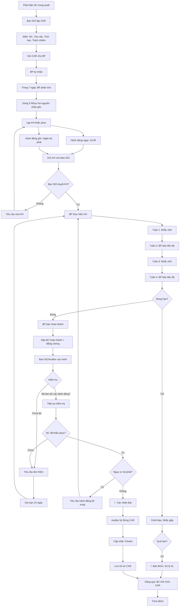

# SOP-04.4: THEO DÕI HÀNH ĐỘNG KHẮC PHỤC

## 1. THÔNG TIN QUY TRÌNH

| **Thuộc tính** | **Nội dung** |
|---|---|
| Mã SOP | SOP-04.4 |
| Tên quy trình | Theo dõi hành động khắc phục |
| Quy trình cha | SOP-04: Audit nội bộ |
| Phiên bản | 1.0 |
| Tần suất | Liên tục (Sau khi có NC) |

## 2. MỤC ĐÍCH

- **Đảm bảo khắc phục**: NC phải được xử lý, không để tồn đọng
- **Đúng hạn**: Khắc phục trong thời gian cam kết
- **Hiệu quả**: Khắc phục đúng gốc rễ, không tái phát
- **Đóng NC**: Xác nhận NC đã khắc phục xong → Đóng

## 3. PHÂN LOẠI HÀNH ĐỘNG

| **Loại** | **Viết tắt** | **Khi nào** | **Ví dụ** |
|---|---|---|---|
| **Corrective Action** | CA / CAR | Sau khi phát hiện lỗi (NC) | Thiếu chứng từ → Bổ sung + Quy định kiểm tra chặt |
| **Preventive Action** | PA / PAR | Ngăn lỗi chưa xảy ra | Rủi ro: Có thể quên backup → Lập lịch tự động |

**Lưu ý:** ISO 9001:2015 không dùng thuật ngữ "Preventive Action" nữa, gộp vào "Risk-based thinking". Nhưng thực tế vẫn dùng.

## 4. QUY TRÌNH THỰC HIỆN

### 4.1. Phát hành CAR (Ngay sau audit)

**Bước 1: Ban ISO lập CAR cho từng NC (QT04-F13)**

**Nội dung CAR:**

| **Mục** | **Chi tiết** |
|---|---|
| Mã CAR | CAR-2024-001 |
| Nguồn | Audit nội bộ Đợt 1/2024 |
| Bộ phận | Phòng Học thuật |
| NC | NC-01: Thiếu Phiếu nhận xét đánh giá (3/10 bài KT) |
| Tham chiếu | SOP-04.3 Bước 6 |
| Mức độ | Minor |
| Ngày phát hiện | 12/11/2024 |
| **Yêu cầu** | 1. Rà soát tất cả bài KT từ T9<br>2. Bổ sung Phiếu nhận xét<br>3. Nhắc nhở GV tuân thủ 100% |
| **Thời hạn** | 30 ngày (12/12/2024) |
| **Trách nhiệm** | Trưởng phòng Học thuật |

**Bước 2: Gửi CAR cho BP (Email + Bản giấy)**

**Bước 3: BP ký nhận CAR**

### 4.2. BP phân tích và lập kế hoạch (Trong 7 ngày)

**Bước 4: BP phân tích nguyên nhân gốc rễ (Root Cause)**

**Công cụ: 5 Whys (5 Tại sao)**

Ví dụ NC-01:
```
Vấn đề: Thiếu Phiếu nhận xét đánh giá

Tại sao 1: Tại sao thiếu phiếu?
→ GV quên không ghi

Tại sao 2: Tại sao GV quên?
→ Không có nhắc nhở

Tại sao 3: Tại sao không nhắc nhở?
→ Không có checklist sau khi chấm bài

Tại sao 4: Tại sao không có checklist?
→ Quy trình không quy định rõ

Tại sao 5: Tại sao quy trình không quy định?
→ Khi viết SOP quên bổ sung

→ NGUYÊN NHÂN GỐC: Quy trình chưa đủ chi tiết, 
  thiếu công cụ hỗ trợ (Checklist)
```

**Bước 5: Lập Kế hoạch khắc phục (QT04-F14)**

**2 loại hành động:**

**A. Hành động ngay (Immediate Action) - Vá lỗi:**
- Rà soát, bổ sung đầy đủ phiếu nhận xét cho bài KT đã thiếu

**B. Hành động gốc (Root Cause Action) - Ngăn tái phát:**
- Bổ sung vào SOP: "Sau khi chấm bài, GV dùng Checklist kiểm tra"
- Tạo Checklist hỗ trợ GV
- Đào tạo lại GV về quy trình đánh giá

| **Hành động** | **Người thực hiện** | **Thời hạn** | **Bằng chứng** |
|---|---|---|---|
| Rà soát bài KT T9-T11 | GV tổ trưởng | 20/11 | Danh sách đã check |
| Bổ sung phiếu nhận xét | GV các lớp | 25/11 | Phiếu hoàn chỉnh |
| Sửa SOP-04.3 | Trưởng BP | 30/11 | SOP Ver 2.1 |
| Tạo Checklist | Tổ trưởng | 05/12 | Checklist mới |
| Đào tạo GV | Trưởng BP | 10/12 | Danh sách tham dự |

**Bước 6: Gửi Kế hoạch cho Ban ISO**

### 4.3. Theo dõi thực hiện (Liên tục)

**Bước 7: Ban ISO theo dõi tiến độ**

**Nhắc nhở:**
- Tuần 1: Email nhắc
- Tuần 2: Email nhắc
- Tuần 3: Gọi điện nhắc
- Tuần 4 (Gần hết hạn): Nhắc khẩn

**Bước 8: BP báo cáo tiến độ (Tuần 2, Tuần 4)**

| **Hành động** | **Tiến độ** | **Hoàn thành** |
|---|---|---|
| Rà soát bài KT | 100% | ✅ |
| Bổ sung phiếu | 80% | 🔄 Đang làm |
| Sửa SOP | 50% | 🔄 Đang soạn |

**Bước 9: Nếu chậm → Cảnh báo**

- Nhắc Trưởng BP
- Nếu quá hạn → Báo BGH

### 4.4. Xác minh khắc phục (Khi BP báo hoàn thành)

**Bước 10: BP nộp Báo cáo hoàn thành CAR (QT04-F15)**

Kèm bằng chứng:
- Hành động ngay: Đã làm gì?
- Hành động gốc: Đã làm gì?
- Bằng chứng: Ảnh, File, Sổ sách...

**Bước 11: Ban ISO/Auditor xác minh**

**Phương pháp:**
- Xem bằng chứng (70%)
- Đến BP kiểm tra thực tế (30% - Nếu cần)

**Tiêu chí xác minh:**

| **Kiểm tra** | **Pass / Fail** |
|---|---|
| Đã thực hiện đủ các hành động cam kết? | |
| Bằng chứng có thuyết phục không? | |
| NC đã được khắc phục chưa? | |
| Có nguy cơ tái phát không? | |
| Hành động gốc có giải quyết nguyên nhân gốc không? | |

**Bước 12: Kết luận**

| **Kết quả** | **Hành động** |
|---|---|
| **Đạt** | Đóng CAR, Kết thúc |
| **Chưa đạt** | Yêu cầu làm thêm, Gia hạn 15 ngày |
| **Không làm gì** | Báo BGH, Xử lý kỷ luật |

**Bước 13: Đóng CAR**
- Auditor ký xác nhận
- Cập nhật trạng thái: "Closed"
- Lưu hồ sơ CAR (10 năm)

### 4.5. Báo cáo tổng hợp

**Bước 14: Hàng quý - BC tình hình NC và CAR (QT04-R08)**

| **STT** | **Mã CAR** | **BP** | **NC** | **Thời hạn** | **Trạng thái** | **Quá hạn** |
|---|---|---|---|---|---|---|
| 1 | CAR-2024-001 | Học thuật | NC-01 | 12/12 | ✅ Closed | Không |
| 2 | CAR-2024-002 | Hành chính | NC-05 | 15/12 | 🔄 Open | Không |
| 3 | CAR-2024-003 | Tài chính | NC-08 | 10/12 | 🔴 Overdue | **5 ngày** |

**Bước 15: Trình BGH**

## 5. LƯU ĐỒ QUY TRÌNH



## 6. BIỂU MẪU LIÊN QUAN

| **Mã** | **Tên** |
|---|---|
| QT04-F13 | CAR (Corrective Action Request) |
| QT04-F14 | Kế hoạch khắc phục CAR |
| QT04-F15 | Báo cáo hoàn thành CAR |
| QT04-S05 | Sổ theo dõi CAR/PAR |
| QT04-R08 | Báo cáo tình hình NC và CAR quý |

## 7. TIÊU CHUẨN VÀ CHỈ TIÊU

| **Chỉ tiêu** | **Mục tiêu** |
|---|---|
| Tỷ lệ CAR được khắc phục đúng hạn | ≥ 95% |
| Tỷ lệ NC tái phát | < 10% |
| Thời gian đóng CAR (Từ phát hành đến đóng) | NC nhỏ: ≤ 30 ngày, NC lớn: ≤ 60 ngày |

## 8. TRÁCH NHIỆM CỤ THỂ

| **Vai trò** | **Trách nhiệm** |
|---|---|
| **Ban ISO** | Phát hành CAR, Theo dõi, Nhắc nhở, Xác minh, Đóng CAR |
| **BP nhận CAR** | Phân tích, Lập KH, Thực hiện, Báo cáo, Nộp bằng chứng |
| **Auditor** | Xác minh khắc phục, Ký đóng CAR |
| **BGH** | Xem báo cáo CAR, Xử lý BP quá hạn |

## 9. LƯU Ý QUAN TRỌNG

- ⚠️ **Khắc phục gốc, không vá víu**: Phải giải quyết nguyên nhân gốc rễ, không chỉ sửa lỗi bề mặt
- ✅ **Bằng chứng quan trọng**: Không chấp nhận "Tôi đã làm rồi" mà không có bằng chứng
- ✅ **Theo dõi sát**: Đừng để BP quên, nhắc nhở thường xuyên
- ✅ **Xác minh nghiêm**: Không "dễ dãi" đóng CAR khi chưa thật sự khắc phục
- 🔥 **NC tái phát = Nghiêm trọng**: Nếu NC lần trước đã khắc phục mà lần này lại phát hiện → NC lớn

## 10. PHỤ LỤC

### 10.1. Template CAR (Corrective Action Request)

```
┌──────────────────────────────────────────────────────────┐
│         YÊU CẦU HÀNH ĐỘNG KHẮC PHỤC (CAR)                │
│            CORRECTIVE ACTION REQUEST                      │
└──────────────────────────────────────────────────────────┘

MÃ CAR: CAR-2024-001                    NGÀY: 12/11/2024

PHÁT HÀNH CHO: Phòng Học thuật
TRƯỞNG BP: Nguyễn Thị X

NGUỒN: ☑ Audit nội bộ  ☐ Audit ngoài  ☐ Khiếu nại KH  ☐ Khác

MỨC ĐỘ: ☐ Major (Lớn)  ☑ Minor (Nhỏ)

═══════════════════════════════════════════════════════════

PHẦN 1: MÔ TẢ KHÔNG PHÙ HỢP (NC)

• Phát hiện: 3/10 bài kiểm tra thiếu Phiếu nhận xét đánh giá

• Bằng chứng: Bài KT Toán Lớp 3A (HS Nguyễn Văn A, Ngày 15/10)
                  Bài KT Văn Lớp 4B (HS Trần Thị B, Ngày 18/10)
                  Bài KT Anh Lớp 5C (HS Lê Văn C, Ngày 20/10)

• Tham chiếu: SOP-04.3 "Kiểm tra - Đánh giá", Bước 6:
  "Mỗi bài kiểm tra phải kèm Phiếu nhận xét đánh giá để
   phụ huynh biết điểm mạnh, điểm cần cải thiện của con"

• Tác động: 
  - Phụ huynh không biết con yếu ở đâu
  - Vi phạm cam kết "Đánh giá minh bạch"
  - Ảnh hưởng điểm hài lòng PH

YÊU CẦU KHẮC PHỤC:
1. Hành động ngay: Rà soát tất cả bài KT từ T9, bổ sung phiếu
2. Hành động gốc: Sửa SOP, Tạo Checklist, Đào tạo GV

THỜI HẠN: 30 ngày (12/12/2024)

═══════════════════════════════════════════════════════════

PHẦN 2: PHÂN TÍCH NGUYÊN NHÂN GỐC (BP điền)

[BP phân tích bằng 5 Whys hoặc Fishbone]

Nguyên nhân gốc: ____________________________________

═══════════════════════════════════════════════════════════

PHẦN 3: KẾ HOẠCH KHẮC PHỤC (BP điền)

| Hành động | Người | Hạn | Bằng chứng |
|-----------|-------|-----|------------|
| 1.        |       |     |            |
| 2.        |       |     |            |

═══════════════════════════════════════════════════════════

PHẦN 4: XÁC MINH (Ban ISO/Auditor điền)

Ngày xác minh: _______
Kết quả: ☐ Đạt  ☐ Chưa đạt

Ghi chú: _____________________________________________

Auditor ký: _______________

═══════════════════════════════════════════════════════════

CHỮ KÝ:

BP nhận CAR: ___________ Ngày: _______
Auditor: _______________ Ngày: _______
Trưởng Ban ISO: ________ Ngày: _______
```

### 10.2. Công cụ phân tích nguyên nhân: Fishbone Diagram

```
                      Thiếu Phiếu nhận xét đánh giá
                                  │
                                  │
        ┌─────────────────────────┼─────────────────────────┐
        │                         │                         │
    CON NGƯỜI                 QUY TRÌNH                 CÔNG CỤ
        │                         │                         │
    GV quên                 Không quy định          Không có Checklist
    Không hiểu             rõ trong SOP              hỗ trợ GV
        │                         │                         │
        └─────────────────────────┴─────────────────────────┘
                                  │
                          → NGUYÊN NHÂN GỐC:
                            Quy trình chưa chi tiết +
                            Thiếu công cụ hỗ trợ
```

## 11. FAQ

**Q1: Nếu BP không khắc phục đúng hạn?**  
A: Gia hạn 1 lần (15 ngày). Nếu vẫn không làm → Báo BGH, Xử lý kỷ luật, Ảnh hưởng đánh giá cuối năm.

**Q2: NC được khắc phục nhưng tái phát lần sau?**  
A: Chứng tỏ khắc phục chưa đúng gốc. Lần sau NC này sẽ trở thành NC lớn.

**Q3: Có thể đóng CAR trước hạn không?**  
A: Được! Nếu khắc phục nhanh, xác minh đạt → Đóng ngay.

**Q4: BP yêu cầu gia hạn vì quá bận?**  
A: Xem xét. Nếu lý do chính đáng (Thi, Sự kiện lớn) → Gia hạn 7-15 ngày. Nhưng không vô thời hạn.

---

**PHÊ DUYỆT**

| Trưởng Ban ISO | Đại diện quản lý | Phó Hiệu trưởng |
|---|---|---|
| [Họ tên] | [Họ tên] | [Họ tên] |
