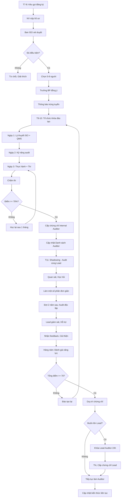

# SOP-04.5: ĐÀO TẠO AUDITOR

## 1. THÔNG TIN QUY TRÌNH

| **Thuộc tính** | **Nội dung** |
|---|---|
| Mã SOP | SOP-04.5 |
| Tên quy trình | Đào tạo Auditor nội bộ |
| Quy trình cha | SOP-04: Audit nội bộ |
| Phiên bản | 1.0 |
| Tần suất | Hàng năm (Đào tạo mới + Duy trì năng lực) |

## 2. MỤC ĐÍCH

- **Xây dựng đội ngũ**: Có đủ Auditor có năng lực
- **Duy trì chất lượng**: Auditor luôn cập nhật kiến thức
- **Tuân thủ ISO**: ISO yêu cầu Auditor phải có năng lực

## 3. YÊU CẦU AUDITOR

### 3.1. Yêu cầu cơ bản

| **Tiêu chí** | **Yêu cầu** |
|---|---|
| Thâm niên | Làm việc ≥ 2 năm tại trường |
| Hiểu biết QMS | Hiểu ISO 9001, QT, SOP |
| Kỹ năng | Giao tiếp, Phân tích, Khách quan |
| Thái độ | Trung thực, Công bằng, Bảo mật |
| Chứng chỉ | Tốt nghiệp khóa đào tạo Auditor |

### 3.2. Phân cấp Auditor

| **Cấp** | **Yêu cầu** | **Vai trò** |
|---|---|---|
| **Auditor** | Khóa đào tạo 16 giờ + Thi đạt | Audit dưới sự giám sát Lead |
| **Lead Auditor** | Auditor + 2 năm kinh nghiệm + Khóa Lead 24 giờ | Chủ trì audit, Viết BC |
| **Master Auditor** | Lead + 5 năm + Đào tạo người khác | Đào tạo, Tư vấn |

## 4. QUY TRÌNH ĐÀO TẠO

### 4.1. Tuyển chọn ứng viên Auditor (Tháng 7-8)

**Bước 1: Ban ISO kêu gọi đăng ký**

Email toàn trường:
```
TUYỂN CHỌN AUDITOR NỘI BỘ

Bạn muốn trở thành Auditor nội bộ?

YÊU CẦU:
• Thâm niên ≥ 2 năm
• Hiểu biết về ISO, QMS
• Kỹ năng giao tiếp, phân tích tốt
• Cam kết tham gia audit (3-5 ngày/năm)

QUYỀN LỢI:
• Được đào tạo miễn phí (Giá trị 10 triệu)
• Chứng chỉ Auditor quốc tế
• Tăng năng lực, cơ hội thăng tiến
• Phụ cấp Auditor: 500K-1 triệu/tháng

Đăng ký: [Link Form]
Hạn: 31/8
```

**Bước 2: Xét duyệt hồ sơ**

Tiêu chí:
- Đủ điều kiện cơ bản
- Trưởng BP đồng ý (Vì Auditor sẽ mất thời gian)
- Đa dạng BP (Không chỉ tập trung 1 BP)

**Bước 3: Chọn 5-8 người**

Lý tưởng:
- 1-2 người từ mỗi BP lớn
- Tổng 8-10 Auditor (Đủ để luân chuyển)

### 4.2. Đào tạo Auditor (Tháng 9-10)

**Bước 4: Tổ chức khóa đào tạo Auditor (16-24 giờ)**

**CHƯƠNG TRÌNH:**

| **Ngày** | **Nội dung** | **Giảng viên** | **Thời lượng** |
|---|---|---|---|
| **Ngày 1** | Tổng quan ISO 9001:2015 | Chuyên gia ISO | 4 giờ |
| | Hệ thống QMS của trường | Trưởng Ban ISO | 2 giờ |
| | Vai trò, Đạo đức Auditor | Chuyên gia | 2 giờ |
| **Ngày 2** | Kỹ năng phỏng vấn | Chuyên gia | 3 giờ |
| | Kỹ thuật lấy mẫu | Chuyên gia | 2 giờ |
| | Phân loại NC, Viết NC | Chuyên gia | 3 giờ |
| **Ngày 3** | Thực hành audit (Role play) | Chuyên gia + Master Auditor | 4 giờ |
| | Viết báo cáo audit | Chuyên gia | 2 giờ |
| | Thi kết thúc khóa | | 2 giờ |

**Bước 5: Thi kết thúc khóa**

**Hình thức:**
- Trắc nghiệm: 40 câu (60 phút)
- Thực hành: Audit giả lập (60 phút)

**Điểm đạt:** ≥ 70%

**Bước 6: Cấp chứng chỉ**

| **Kết quả** | **Chứng chỉ** |
|---|---|
| Đạt ≥ 70% | Chứng chỉ "Internal Auditor ISO 9001" |
| Không đạt | Học lại |

### 4.3. Thực tập và Mentoring (Tháng 11)

**Bước 7: Auditor mới làm Shadowing**

- Tham gia audit thật cùng Lead Auditor
- Quan sát, Học hỏi
- Làm một số phần đơn giản (Dưới sự giám sát)

**Bước 8: Audit lần đầu độc lập (Đợt 2 năm sau)**

- Được giao audit BP nhỏ
- Lead Auditor giám sát, hỗ trợ
- Nhận phản hồi, Cải thiện

### 4.4. Duy trì năng lực (Hàng năm)

**Bước 9: Đánh giá năng lực Auditor hàng năm**

| **Tiêu chí** | **Cách đánh giá** | **Điểm** |
|---|---|---|
| Kiến thức ISO | Thi lại (Mỗi 2 năm) | /30 |
| Số lần audit | Ít nhất 2 lần/năm | /20 |
| Chất lượng BC audit | BP feedback, BGH đánh giá | /30 |
| Phát hiện NC | Số NC phát hiện so với Lead khác | /20 |

**Tổng ≥ 70/100:** Duy trì chứng chỉ  
**< 70:** Đào tạo lại

**Bước 10: Đào tạo nâng cao (Tùy chọn)**

- Auditor → Lead Auditor: Khóa 24 giờ
- Lead → Master: Khóa 40 giờ + Đào tạo người khác

**Bước 11: Cập nhật kiến thức**

- Khi có ISO mới
- Khi có quy trình mới
- Workshop, Hội thảo ISO

## 5. LƯU ĐỒ QUY TRÌNH



## 6. BIỂU MẪU LIÊN QUAN

| **Mã** | **Tên** |
|---|---|
| QT04-F09 | Form đăng ký Auditor |
| QT04-P01 | Chương trình đào tạo Auditor |
| QT04-F16 | Đề thi Auditor |
| QT04-C01 | Chứng chỉ Internal Auditor |
| QT04-S06 | Danh sách Auditor + Năng lực |

## 7. TIÊU CHUẨN VÀ CHỈ TIÊU

| **Chỉ tiêu** | **Mục tiêu** |
|---|---|
| Số Auditor có chứng chỉ | ≥ 8 người |
| Tỷ lệ đậu khóa đào tạo lần 1 | ≥ 80% |
| Auditor tham gia ít nhất 2 audit/năm | 100% |
| Tỷ lệ Auditor duy trì năng lực | ≥ 90% |

## 8. TRÁCH NHIỆM CỤ THỂ

| **Vai trò** | **Trách nhiệm** |
|---|---|
| **Ban ISO** | Tuyển chọn, Tổ chức đào tạo, Đánh giá năng lực |
| **Chuyên gia ISO** | Giảng dạy, Thi, Cấp chứng chỉ |
| **Master Auditor** | Mentoring Auditor mới |
| **Ứng viên** | Học tập, Thi, Thực hành |

## 9. LƯU Ý QUAN TRỌNG

- ⚠️ **Không phải ai cũng phù hợp**: Auditor cần kỹ năng đặc biệt, không ép buộc
- ✅ **Đầu tư đào tạo tốt**: Auditor yếu → Audit không chất lượng → Lãng phí
- ✅ **Duy trì thường xuyên**: Không audit → Kỹ năng teo dần
- ✅ **Chứng chỉ quốc tế ưu tiên**: Nếu có ngân sách, mời tổ chức quốc tế đào tạo (BSI, TUV...)
- 🔥 **Auditor = Tài sản**: Đầu tư vào Auditor = Đầu tư vào QMS

## 10. PHỤ LỤC

### 10.1. Chương trình đào tạo Internal Auditor (16-24 giờ)

**MODULE 1: KIẾN THỨC CƠ BẢN (6 giờ)**
1.1. Giới thiệu ISO 9001:2015 (2 giờ)
   • 7 nguyên tắc quản lý chất lượng
   • Cấu trúc ISO: 10 điều khoản
   • Yêu cầu bắt buộc

1.2. Hệ thống QMS của trường (2 giờ)
   • 9 QT, 100+ SOP
   • Sổ tay CL
   • Chính sách, Mục tiêu CL

1.3. Vai trò và Đạo đức Auditor (2 giờ)
   • Độc lập, Khách quan
   • Bảo mật thông tin
   • Dựa trên bằng chứng
   • Code of conduct

**MODULE 2: KỸ NĂNG AUDIT (8 giờ)**
2.1. Kỹ năng phỏng vấn (3 giờ)
   • Câu hỏi mở vs Câu hỏi đóng
   • Lắng nghe tích cực
   • Xác minh thông tin
   • Xử lý tình huống khó

2.2. Kỹ thuật lấy mẫu (2 giờ)
   • Chọn mẫu đại diện
   • Kích thước mẫu (10-30% hồ sơ)
   • Lấy mẫu ngẫu nhiên

2.3. Phân loại và Viết NC (3 giờ)
   • NC lớn vs NC nhỏ
   • Format NC chuẩn
   • OFI, Good Practice
   • Workshop: Viết NC

**MODULE 3: THỰC HÀNH (8 giờ)**
3.1. Lập Checklist audit (2 giờ)
3.2. Role play audit (4 giờ)
   • Chia nhóm 2-3 người
   • Giả lập: BP = Phòng NS
   • Thực hiện audit đầy đủ: Opening → Audit → Closing
   • Chuyên gia quan sát, Góp ý

3.3. Viết BC audit (2 giờ)

**MODULE 4: THI VÀ ĐÁNH GIÁ (2 giờ)**
4.1. Thi lý thuyết (40 câu, 60 phút)
4.2. Thi thực hành (Audit giả lập, 60 phút)

### 10.2. Đề thi mẫu (Một vài câu)

**PHẦN 1: TRẮC NGHIỆM (40 câu)**

**Câu 1:** ISO 9001:2015 có bao nhiêu điều khoản chính?
A. 7  
B. 8  
C. **10** ✓  
D. 20

**Câu 5:** Auditor có thể audit bộ phận mình không?
A. Có  
B. **Không** ✓ (Vi phạm nguyên tắc độc lập)  
C. Tùy trường hợp  
D. Nếu thiếu người thì được

**Câu 10:** Khi phát hiện NC, Auditor phải làm gì?
A. Báo BGH ngay  
B. **Xác nhận với BP, Ghi vào BC audit** ✓  
C. Bỏ qua nếu NC nhỏ  
D. Tự quyết định xử lý

**PHẦN 2: THỰC HÀNH**

Bạn đang audit Phòng Tài chính. Khi kiểm tra hồ sơ thanh toán, bạn phát hiện:
- 3/10 Phiếu chi không có chữ ký Phó HT (SOP yêu cầu 3 chữ ký: KT, Phó HT, HT)

**Câu hỏi:**
1. Đây có phải NC không? Tại sao? (2 điểm)
2. NC lớn hay nhỏ? Giải thích. (2 điểm)
3. Viết NC theo format chuẩn. (6 điểm)

### 10.3. Danh sách Auditor mẫu

| **Họ tên** | **BP** | **Cấp** | **Chứng chỉ** | **Ngày cấp** | **Số lần audit** | **Trạng thái** |
|---|---|---|---|---|---|---|
| Nguyễn Văn A | Học thuật | Lead | BSI Lead Auditor | 01/09/2023 | 12 lần | ✅ Hoạt động |
| Trần Thị B | Nhân sự | Auditor | IQS Internal Auditor | 15/10/2024 | 2 lần | ✅ Hoạt động |
| Lê Văn C | Hành chính | Auditor | IQS Internal Auditor | 15/10/2024 | 2 lần | ✅ Hoạt động |

## 5. LƯU ĐỒ (Đã có ở phần 5)

## 6. BIỂU MẪU (Đã liệt kê)

## 7. TIÊU CHUẨN (Đã liệt kê)

## 8. TRÁCH NHIỆM (Đã liệt kê)

## 9. LƯU Ý (Đã liệt kê)

## 10. PHỤ LỤC (Đã có)

## 11. FAQ

**Q1: Có bắt buộc phải có chứng chỉ Auditor không?**  
A: ISO không quy định cứng. Nhưng phải chứng minh "có năng lực". Chứng chỉ = Bằng chứng tốt nhất.

**Q2: Auditor có được trả thêm lương không?**  
A: Nên có phụ cấp Auditor (500K-1 triệu/tháng) để động viên.

**Q3: Mất bao lâu để trở thành Lead Auditor?**  
A: Auditor + 2 năm kinh nghiệm (Audit ít nhất 10-15 lần) + Khóa Lead.

---

**PHÊ DUYỆT**

| Trưởng Ban ISO | Phó Hiệu trưởng | Hiệu trưởng |
|---|---|---|
| [Họ tên] | [Họ tên] | [Họ tên] |

---

✅ **HOÀN THÀNH SOP-04: AUDIT NỘI BỘ (5 files) - CỰC KỲ ĐẦY ĐỦ!**

