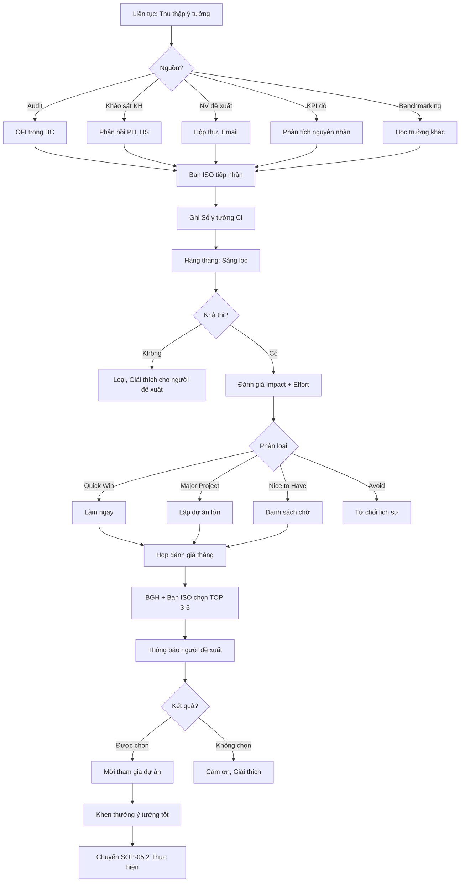

# SOP-05.1: XÁC ĐỊNH CƠ HỘI CẢI TIẾN

## 1. THÔNG TIN QUY TRÌNH

| **Thuộc tính** | **Nội dung** |
|---|---|
| Mã SOP | SOP-05.1 |
| Tên quy trình | Xác định cơ hội cải tiến |
| Quy trình cha | SOP-05: Cải tiến liên tục |
| Phiên bản | 1.0 |
| Tần suất | Liên tục |

## 2. MỤC ĐÍCH

- **Thu thập ý tưởng**: Từ mọi nguồn (NV, PH, HS, Audit, Dữ liệu...)
- **Phát hiện vấn đề**: Điểm nghẽn, Lãng phí, Không hiệu quả
- **Tạo văn hóa CI**: Mọi người đóng góp cải tiến

## 3. NGUỒN Ý TƯỞNG CẢI TIẾN

| **Nguồn** | **Ví dụ** | **Tần suất** |
|---|---|---|
| **Audit nội bộ** | OFI trong BC audit | 6 tháng |
| **Phản hồi KH** | Khảo sát PH, HS | 6 tháng |
| **Đề xuất NV** | Hộp thư góp ý, Email | Liên tục |
| **KPI không đạt** | KPI đỏ → Cần cải tiến | Hàng tháng |
| **Benchmarking** | Học trường khác | Hàng năm |
| **Công nghệ mới** | AI, LMS, App... | Liên tục |
| **Management Review** | BGH đề xuất | 6 tháng |

## 4. QUY TRÌNH THỰC HIỆN

### 4.1. Thu thập ý tưởng liên tục

**Bước 1: Thiết lập các kênh góp ý**

| **Kênh** | **Hình thức** | **Đối tượng** |
|---|---|---|
| **Hộp thư góp ý** | Hộp thư vật lý (Sảnh, Phòng GV) + Form online | Tất cả NV |
| **Email cải tiến** | improvement@[school].edu.vn | Tất cả |
| **Cuộc thi ý tưởng** | 6 tháng/lần, Có giải thưởng | Tất cả NV |
| **Họp bộ phận** | Mỗi tháng dành 15 phút brainstorm | Từng BP |
| **Khảo sát** | Hỏi: "Bạn muốn cải thiện gì?" | PH, HS, NV |

**Bước 2: NV nộp ý tưởng (QT04-F17 - Form đề xuất CI)**

**Nội dung Form:**

| **Mục** | **Hướng dẫn điền** |
|---|---|
| Tên ý tưởng | Ngắn gọn, hấp dẫn |
| Vấn đề hiện tại | Mô tả vấn đề cần giải quyết |
| Giải pháp đề xuất | Đề xuất làm thế nào |
| Lợi ích mong đợi | Tiết kiệm thời gian, Chi phí, Tăng chất lượng... |
| Khó khăn dự kiến | Cần NS, Công nghệ, Thay đổi tư duy... |
| Người đề xuất | Tên, BP, Liên hệ |

**Ví dụ ý tưởng:**
- **Tên**: Dùng App chấm công thay thủ công
- **Vấn đề**: Chấm công giấy mất thời gian, Dễ gian lận
- **Giải pháp**: Mua máy chấm công vân tay + App
- **Lợi ích**: Tiết kiệm 2 giờ/ngày Phòng NS, Chính xác 100%
- **Khó khăn**: Chi phí 50 triệu, Cần đào tạo NV

**Bước 3: Ban ISO tiếp nhận, Ghi sổ (QT04-S07 - Sổ ý tưởng CI)**

### 4.2. Sàng lọc và đánh giá (Hàng tháng)

**Bước 4: Ban ISO sàng lọc sơ bộ**

Loại ngay:
- Không khả thi (Quá đắt, Không thực tế)
- Trùng lặp (Đã có người đề xuất)
- Không liên quan (Ngoài phạm vi trường)

**Bước 5: Đánh giá ý tưởng còn lại**

**Ma trận Impact vs Effort:**

```
    Cao│ QUICK WIN         │ MAJOR PROJECT
        │ (Làm ngay!)       │ (Cân nhắc kỹ)
  I     │                   │
  M  ───┼───────────────────┼───────────────
  P     │                   │
  A     │ NICE TO HAVE      │ AVOID
  C  Thấp│ (Làm khi rảnh)    │ (Không làm)
  T     │                   │
        └───────────────────┴───────────────
           Thấp         EFFORT         Cao
```

Mỗi ý tưởng chấm điểm:

| **Tiêu chí** | **Thang điểm** | **Ví dụ: App chấm công** |
|---|---|---|
| **Impact (Tác động)** | 1-10 | 9 (Tiết kiệm 2h/ngày, Chính xác) |
| **Effort (Công sức)** | 1-10 | 5 (Chi phí TB, Đào tạo đơn giản) |
| **Cost (Chi phí)** | 1-10 | 5 (50 triệu) |
| **Risk (Rủi ro)** | 1-10 | 3 (Công nghệ ổn định) |

**Phân loại:**
- **Impact cao (≥7) + Effort thấp (≤5)**: QUICK WIN → Làm ngay
- **Impact cao + Effort cao**: MAJOR PROJECT → Lập dự án
- **Impact thấp + Effort thấp**: NICE TO HAVE → Làm khi rảnh
- **Impact thấp + Effort cao**: AVOID → Không làm

**Bước 6: Họp đánh giá ý tưởng (Tháng 1 lần)**

Thành phần: Ban ISO + BGH + BP liên quan

**Bước 7: Chọn TOP 3-5 ý tưởng ưu tiên**

**Bước 8: Thông báo cho người đề xuất**
- Ý tưởng được chọn → Mời tham gia dự án
- Ý tưởng không chọn → Giải thích lý do, Cảm ơn

**Bước 9: Chuyển SOP-05.2 (Thực hiện cải tiến)**

### 4.3. Khuyến khích đóng góp

**Bước 10: Khen thưởng ý tưởng tốt**

| **Loại** | **Tiêu chí** | **Giải thưởng** |
|---|---|---|
| **Ý tưởng xuất sắc** | Impact ≥ 9, Được triển khai, Hiệu quả cao | 5-10 triệu + Giấy khen |
| **Ý tưởng tốt** | Impact 7-8, Được triển khai | 2-5 triệu + Giấy khen |
| **Ý tưởng hay** | Impact 5-6, Có thể triển khai | 500K-1 triệu + Khen ngợi |
| **Tích cực đóng góp** | Đề xuất ≥ 5 ý tưởng/năm | 1 triệu + Khen ngợi |

## 5. LƯU ĐỒ QUY TRÌNH



## 6. BIỂU MẪU LIÊN QUAN

| **Mã** | **Tên** |
|---|---|
| QT04-F17 | Form đề xuất cải tiến (CI) |
| QT04-S07 | Sổ theo dõi ý tưởng cải tiến |
| QT04-R09 | Báo cáo đánh giá ý tưởng tháng |

## 7. TIÊU CHUẨN VÀ CHỈ TIÊU

| **Chỉ tiêu** | **Mục tiêu** |
|---|---|
| Số ý tưởng CI/năm | ≥ 50 ý tưởng |
| Tỷ lệ NV đề xuất ít nhất 1 ý tưởng/năm | ≥ 30% |
| Tỷ lệ ý tưởng được triển khai | ≥ 20% |

## 8. TRÁCH NHIỆM CỤ THỂ

| **Vai trò** | **Trách nhiệm** |
|---|---|
| **Tất cả NV** | Đề xuất ý tưởng |
| **Ban ISO** | Thu thập, Sàng lọc, Đánh giá, Tổ chức họp |
| **BGH** | Quyết định triển khai, Phân bổ NS |

## 9. LƯU Ý QUAN TRỌNG

- ⚠️ **Không phê phán ý tưởng "ngớ ngẩn"**: Khuyến khích, dù ý tưởng không hay
- ✅ **Phản hồi nhanh**: Xem xét trong 30 ngày, Thông báo kết quả
- ✅ **Khen thưởng xứng đáng**: Ý tưởng tiết kiệm 100 triệu → Thưởng 5-10 triệu là hợp lý
- 🔥 **Triển khai thật**: Đừng thu thập rồi bỏ ngăn kéo

## 10. PHỤ LỤC

### 10.1. Ví dụ ý tưởng CI thực tế

**Ý tưởng 1: Dùng Google Form thay Phiếu giấy**
- Người đề xuất: GV Trần Thị B
- Vấn đề: Phiếu đánh giá HS bằng giấy, GV ghi tay mất thời gian, Khó tổng hợp
- Giải pháp: Dùng Google Form, GV điền online, Tự động tổng hợp
- Impact: 8/10 (Tiết kiệm 30 phút/lớp/tháng)
- Effort: 3/10 (Dễ làm)
- → **QUICK WIN** → Triển khai ngay

**Ý tưởng 2: Xây thêm nhà vệ sinh tầng 3**
- Người đề xuất: PH (Qua khảo sát)
- Vấn đề: Chỉ có 1 nhà vệ sinh tầng 3, HS xếp hàng dài
- Giải pháp: Xây thêm 1 block WC
- Impact: 7/10
- Effort: 9/10 (Chi phí 500 triệu)
- → **MAJOR PROJECT** → Lập dự án, Xin HĐ duyệt

## 11. FAQ

**Q: Có giới hạn số lượng ý tưởng đề xuất không?**  
A: Không! Càng nhiều càng tốt. Nhưng chỉ triển khai những ý tưởng tốt nhất.

**Q: Ý tưởng không được chọn có được xem xét lại không?**  
A: Có. Năm sau tình hình thay đổi, ý tưởng năm ngoái có thể phù hợp.

---

**PHÊ DUYỆT** | Ban ISO | Phó HT |
