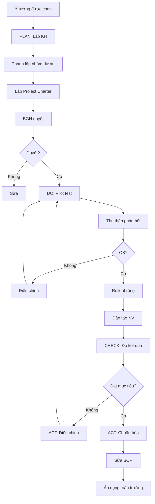

# SOP-05.2: THỰC HIỆN HÀNH ĐỘNG CẢI TIẾN

## 1. THÔNG TIN | Mã: SOP-05.2 | Tần suất: Theo kế hoạch dự án

## 2. MỤC ĐÍCH
Triển khai dự án cải tiến hiệu quả, đạt mục tiêu đề ra

## 3. CHU TRÌNH PDCA

Áp dụng cho mọi dự án CI:

```
P (PLAN - Kế hoạch):
→ Xác định mục tiêu, Lập kế hoạch chi tiết

D (DO - Thực hiện):
→ Triển khai theo kế hoạch, Pilot test

C (CHECK - Kiểm tra):
→ Đo lường kết quả, So với mục tiêu

A (ACT - Hành động):
→ Chuẩn hóa nếu thành công, Điều chỉnh nếu chưa đạt
```

## 4. QUY TRÌNH

### 4.1. PLAN - Lập kế hoạch

**Bước 1: Thành lập nhóm dự án CI**
| Vai trò | Người | Trách nhiệm |
|---|---|---|
| Project Leader | Người đề xuất hoặc Chuyên gia | Điều phối, Quyết định |
| Members | 3-5 người liên quan | Thực hiện, Hỗ trợ |
| Sponsor | BGH | Phê duyệt, Cung cấp NS |

**Bước 2: Lập Project Charter (QT04-D15)**
- Mục tiêu: SMART
- Phạm vi
- Timeline: 3-6 tháng
- Ngân sách
- Rủi ro

**Bước 3: BGH phê duyệt dự án**

### 4.2. DO - Thực hiện

**Bước 4: Pilot test (Chạy thử)**
- Chọn 1-2 BP thử nghiệm trước
- Thu thập phản hồi
- Điều chỉnh

**Bước 5: Rollout (Triển khai rộng)**
- Đào tạo NV
- Cung cấp công cụ, Tài liệu
- Hỗ trợ trong quá trình triển khai

### 4.3. CHECK - Kiểm tra

**Bước 6: Đo lường kết quả (Sau 1-3 tháng)**
| Chỉ tiêu | Trước | Sau | Cải thiện |
|---|---|---|---|
| Thời gian chấm công | 2h/ngày | 15 phút | **-88%** ✅ |
| Sai sót | 5%/tháng | 0% | **-100%** ✅ |

**Bước 7: Đánh giá → Chuyển SOP-05.3**

### 4.4. ACT - Hành động

**Nếu thành công:**
**Bước 8: Chuẩn hóa**
- Sửa SOP
- Đào tạo toàn bộ
- Áp dụng rộng rãi

**Nếu chưa đạt:**
**Bước 9: Điều chỉnh, Thử lại**

## 5. LƯU ĐỒ


## 6. BIỂU MẪU
- QT04-D15: Project Charter
- QT04-R10: Báo cáo tiến độ dự án CI

## 7. FAQ
**Q: Mất bao lâu để triển khai 1 dự án CI?**  
A: 3-6 tháng (Quick Win: 1-2 tháng, Major: 6-12 tháng).

---
**PHÊ DUYỆT** | Project Leader | Ban ISO | BGH |
