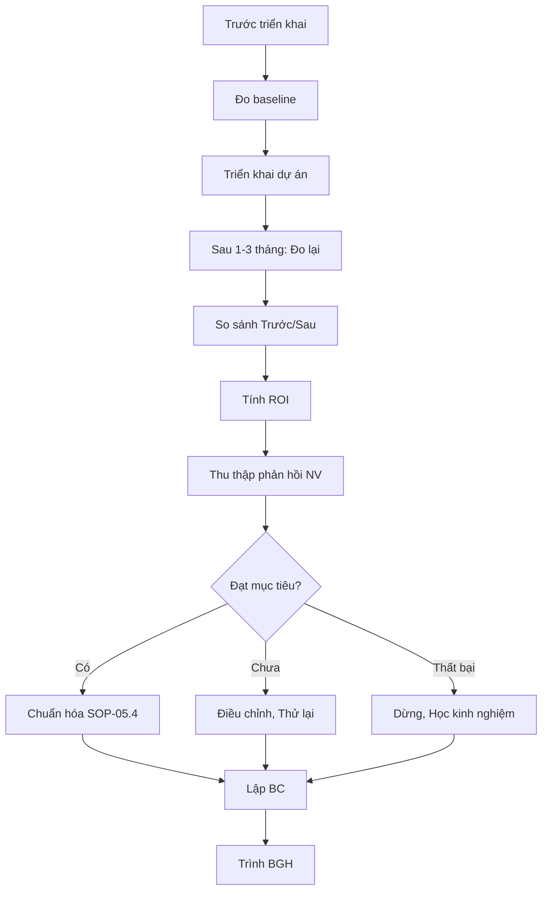

# SOP-05.3: ĐÁNH GIÁ HIỆU QUẢ CẢI TIẾN

## 1. THÔNG TIN | Mã: SOP-05.3 | Tần suất: Sau mỗi dự án CI

## 2. MỤC ĐÍCH
Đo lường tác động thực tế, Rút kinh nghiệm, Quyết định chuẩn hóa hay dừng

## 3. QUY TRÌNH

**Bước 1: Xác định baseline (Trước khi triển khai)**
- Đo chỉ số hiện tại

**Bước 2: Sau triển khai 1-3 tháng - Đo lại**

**Bước 3: So sánh Trước/Sau**
| Chỉ tiêu | Trước | Sau | Cải thiện | Mục tiêu | Đạt? |
|---|---|---|---|---|---|
| Thời gian | 2h | 15 phút | -88% | -50% | ✅ Vượt |
| Chi phí | 10 triệu/tháng | 5 triệu | -50% | -30% | ✅ Vượt |

**Bước 4: Đánh giá ROI**
```
ROI = (Lợi ích - Chi phí) / Chi phí × 100%

VD: Chi phí App chấm công: 50 triệu (1 lần)
    Tiết kiệm: 5 triệu/tháng = 60 triệu/năm
    ROI = (60-50)/50 = 20% (Hoàn vốn trong 10 tháng)
```

**Bước 5: Thu thập phản hồi NV**
- Hài lòng với cải tiến không?
- Có khó khăn gì?

**Bước 6: Quyết định**
| Kết quả | Quyết định |
|---|---|
| Đạt mục tiêu | Chuẩn hóa, Áp dụng rộng |
| Chưa đạt | Điều chỉnh, Thử lại |
| Thất bại | Dừng, Rút kinh nghiệm |

**Bước 7: Lập BC đánh giá (QT04-R11)**

**Bước 8: Trình BGH → Chuyển SOP-05.4**

## 4. LƯU ĐỒ


## 5. FAQ
**Q: Nếu cải tiến có hiệu quả nhưng NV không thích?**  
A: Tìm hiểu nguyên nhân. Nếu chỉ vì lười thay đổi → Tiếp tục. Nếu thật sự bất tiện → Điều chỉnh.

---
**PHÊ DUYỆT** | Ban ISO | BGH |
