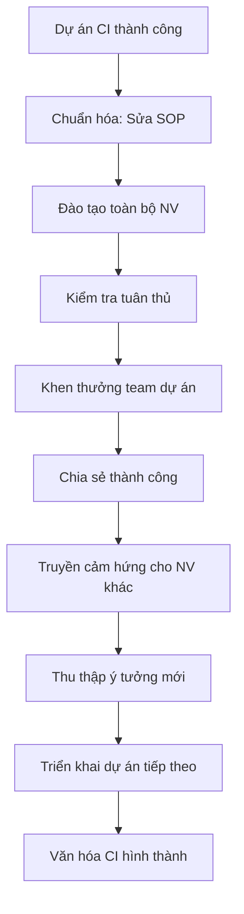

# SOP-05.4: DUY TRÌ CẢI TIẾN LIÊN TỤC

## 1. THÔNG TIN | Mã: SOP-05.4 | Tần suất: Liên tục

## 2. MỤC ĐÍCH
Xây dựng văn hóa cải tiến liên tục, Không dừng lại sau 1 dự án

## 3. CHIẾN LƯỢC DUY TRÌ

### 3.1. Chuẩn hóa thành công

**Bước 1: Cải tiến thành công → Sửa SOP ngay**
- Đưa vào quy trình chính thức
- Đào tạo toàn bộ
- Kiểm tra tuân thủ

### 3.2. Khen thưởng liên tục

**Bước 2: Ghi nhận mọi đóng góp**
| Thành tích | Khen thưởng |
|---|---|
| Ý tưởng xuất sắc | 5-10 triệu |
| Dự án CI thành công | Team thưởng 10-20 triệu |
| "Nhà cải tiến" năm | 20 triệu + Cúp |

### 3.3. Truyền thông

**Bước 3: Chia sẻ thành công**
- Email toàn trường
- Họp toàn trường: Báo cáo CI
- Bảng vinh danh
- Video case study

### 3.4. Kaizen hàng ngày

**Bước 4: Khuyến khích cải tiến nhỏ hàng ngày**

**Kaizen:** Cải tiến nhỏ, Liên tục, Mọi người tham gia

Ví dụ:
- GV sắp xếp lại bàn ghế → Lớp gọn gàng hơn
- Thủ kho dán nhãn → Tìm đồ nhanh hơn
- NV làm checklist → Ít quên việc hơn

**Không cần dự án lớn, Chỉ cần hành động nhỏ mỗi ngày!**

### 3.5. Đào tạo liên tục

**Bước 5: Đào tạo tư duy cải tiến**
- Khóa "Cải tiến liên tục" cho tất cả NV (Hàng năm)
- Workshop, Sharing session
- Đọc sách, Xem video về Kaizen, Lean...

## 4. MỤC TIÊU DUY TRÌ

| Chỉ tiêu | Mục tiêu |
|---|---|
| Số dự án CI/năm | ≥ 10 |
| Số ý tưởng/năm | ≥ 50 |
| % NV tham gia CI | ≥ 50% |

## 5. LƯU ĐỒ

## 6. FAQ
**Q: Làm thế nào để NV không ngại đề xuất?**  
A: Không phê phán ý tưởng "ngớ ngẩn", Khen thưởng mọi đóng góp, BGH nêu gương đề xuất trước.

---
**PHÊ DUYỆT** | Ban ISO | HT |

---

✅ **HOÀN THÀNH SOP-05: CẢI TIẾN LIÊN TỤC (4 files)!**
