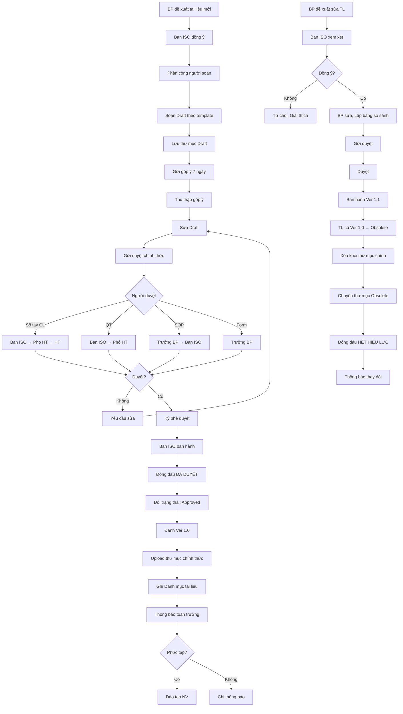

# SOP-06.2: KIỂM SOÁT TÀI LIỆU QMS

## 1. THÔNG TIN QUY TRÌNH

| **Thuộc tính** | **Nội dung** |
|---|---|
| Mã SOP | SOP-06.2 |
| Tên quy trình | Kiểm soát tài liệu QMS |
| Quy trình cha | SOP-06: Quản lý hồ sơ - Pháp lý |
| Phiên bản | 1.0 |
| Tần suất | Liên tục |

## 2. MỤC ĐÍCH

- **Kiểm soát phiên bản**: Đảm bảo NV dùng tài liệu mới nhất
- **Ngăn sử dụng tài liệu lỗi thời**: Tài liệu cũ phải thu hồi
- **Truy vết thay đổi**: Biết ai, khi nào, sửa gì
- **Tuân thủ ISO 9001 Điều 7.5**

## 3. PHÂN LOẠI TÀI LIỆU QMS

### 3.1. Cấp bậc tài liệu

| **Cấp** | **Loại** | **Ví dụ** | **Người duyệt** |
|---|---|---|---|
| **Cấp 1** | Sổ tay CL | Sổ tay chất lượng | Hiệu trưởng |
| **Cấp 2** | Quy tắc (QT) | QT-01, QT-02... | Phó HT |
| **Cấp 3** | Quy trình (SOP) | SOP-01.1, SOP-02.3... | Trưởng BP |
| **Cấp 4** | Biểu mẫu (Form, Checklist) | QT01-F01, QT02-CL01 | Trưởng BP |
| **Cấp 5** | Tài liệu tham khảo | ISO 9001, Pháp luật | Không cần duyệt |

### 3.2. Trạng thái tài liệu

| **Trạng thái** | **Mô tả** | **Hiển thị** |
|---|---|---|
| **Draft** | Đang soạn thảo | Chỉ người soạn thấy |
| **Review** | Đang xem xét | Người liên quan xem, Góp ý |
| **Approved** | Đã duyệt, Đang áp dụng | **Tất cả NV xem** |
| **Obsolete** | Lỗi thời, Thu hồi | Đóng dấu "HẾT HIỆU LỰC" |

## 4. QUY TRÌNH KIỂM SOÁT

### 4.1. Soạn thảo tài liệu mới

**Bước 1: Xác định nhu cầu**
- BP đề xuất: "Cần quy trình mới về X"
- Ban ISO đồng ý → Lập dự án soạn

**Bước 2: Phân công soạn**
- Trưởng BP (hoặc chuyên viên) soạn Draft

**Bước 3: Soạn theo template chuẩn (QT04-T01)**

**Cấu trúc tài liệu bắt buộc:**

```
─────────────────────────────────────────────
  [Logo trường]        [Tên tài liệu]
─────────────────────────────────────────────

THÔNG TIN TÀI LIỆU:
• Mã tài liệu: [QT-XX hoặc SOP-XX.YY]
• Phiên bản: Ver X.Y
• Ngày ban hành: [DD/MM/YYYY]
• Ngày hiệu lực: [DD/MM/YYYY]
• Người soạn: [Tên]
• Người duyệt: [Tên]

LỊCH SỬ THAY ĐỔI:
| Ver | Ngày | Người | Nội dung thay đổi |
|-----|------|-------|-------------------|
| 1.0 | ... | ... | Phát hành lần đầu |

[NỘI DUNG TÀI LIỆU...]

─────────────────────────────────────────────
PHÊ DUYỆT:
Người soạn: ________  Ngày: _______
Người kiểm tra: ____ Ngày: _______
Người phê duyệt: ___ Ngày: _______
─────────────────────────────────────────────
```

**Bước 4: Đặt tên file**

Format: `[Mã]_[Tên]_Ver[X.Y].docx`

VD: `SOP-03.2_Xay_dung_thuc_don_Ver1.0.docx`

**Bước 5: Lưu vào thư mục Draft**

### 4.2. Xem xét và Phê duyệt

**Bước 6: Gửi Draft cho người liên quan**

- Email + File đính kèm (Có watermark "DRAFT")
- Yêu cầu góp ý trong 7 ngày

**Bước 7: Thu thập góp ý**

| **Người góp ý** | **Góp ý** | **Người soạn xử lý** |
|---|---|---|
| GV A | "Bước 3 không rõ" | Sửa lại rõ hơn |
| Trưởng BP | "Thêm checklist" | Bổ sung |

**Bước 8: Sửa Draft theo góp ý**

**Bước 9: Gửi duyệt chính thức (QT04-F19 - Form trình duyệt tài liệu)**

**Chuỗi duyệt:**

| **Tài liệu** | **Chuỗi duyệt** |
|---|---|
| Sổ tay CL | Ban ISO → Phó HT → HT |
| QT (Quy tắc) | Ban ISO → Phó HT |
| SOP (Quy trình) | Người soạn → Trưởng BP → Ban ISO |
| Form/Checklist | Người soạn → Trưởng BP |

**Bước 10: Người duyệt xem xét**

- Đúng cấu trúc chưa?
- Nội dung hợp lý không?
- Khả thi không?

**Bước 11: Phê duyệt hoặc Yêu cầu sửa**

- Phê duyệt → Ký vào tài liệu
- Yêu cầu sửa → Ghi rõ cần sửa gì

### 4.3. Ban hành

**Bước 12: Sau khi được duyệt - Ban ISO ban hành**

- Đóng dấu "ĐÃ DUYỆT"
- Đổi trạng thái: Draft → Approved
- Đánh số phiên bản: Ver 1.0
- Upload lên thư mục chính thức

**Bước 13: Ghi vào "Danh mục tài liệu QMS" (QT04-S09)**

| **STT** | **Mã** | **Tên** | **Ver** | **Ngày ban hành** | **Trạng thái** | **Vị trí** |
|---|---|---|---|---|---|---|
| 25 | SOP-03.2 | Xây dựng thực đơn | 1.0 | 15/11/2024 | Approved | \\ISO\03_SOP\ |

**Bước 14: Thông báo toàn trường**

Email:
```
THƯ MỤC: Quy trình mới - SOP-03.2 Xây dựng thực đơn

Kính gửi Quý thầy cô,

Ban ISO xin thông báo:

Quy trình "SOP-03.2: Xây dựng thực đơn Ver 1.0" đã được phê duyệt 
và có hiệu lực từ 20/11/2024.

Vui lòng:
• Đọc và Thực hiện theo quy trình
• Không sử dụng quy trình cũ (nếu có)
• Liên hệ Ban ISO nếu có thắc mắc

Tài liệu: \\Server\ISO\03_SOP\SOP-03.2_Ver1.0.pdf

Trân trọng,
Ban ISO
```

**Bước 15: Đào tạo (Nếu cần)**

Quy trình phức tạp → Tổ chức Workshop

### 4.4. Sửa đổi tài liệu

**Khi nào cần sửa:**
- OFI từ audit
- Quy trình không còn phù hợp
- Pháp luật thay đổi
- Công nghệ mới

**Bước 16: BP đề xuất sửa (QT04-F20 - Form đề xuất sửa tài liệu)**

**Bước 17: Ban ISO xem xét**

**Bước 18: Nếu đồng ý - Cho phép sửa**

**Bước 19: BP sửa → Lập bảng so sánh**

| **Nội dung** | **Ver cũ (1.0)** | **Ver mới (1.1)** | **Lý do thay đổi** |
|---|---|---|---|
| Bước 3 | "Trưởng BP duyệt" | "Phó HT duyệt" | Theo OFI Audit |

**Bước 20: Gửi duyệt → Quy trình tương tự Ban hành**

**Bước 21: Ban hành Ver 1.1**
- Tài liệu Ver 1.0 → Obsolete
- Tài liệu Ver 1.1 → Approved

**Bước 22: Thông báo thay đổi**

### 4.5. Thu hồi tài liệu lỗi thời

**Bước 23: Tài liệu cũ (Ver 1.0) phải thu hồi**

**Hành động:**
- Xóa khỏi thư mục chính
- Di chuyển vào thư mục "Obsolete"
- Đóng dấu đỏ to "HẾT HIỆU LỰC" lên mỗi trang (Nếu in)
- Cập nhật Danh mục: Trạng thái = Obsolete

**LƯU Ý:** Tài liệu lỗi thời VẪN LƯU (Để tham khảo lịch sử), nhưng KHÔNG được sử dụng!

## 5. LƯU ĐỒ QUY TRÌNH



## 6. BIỂU MẪU LIÊN QUAN

| **Mã** | **Tên** |
|---|---|
| QT04-T01 | Template tài liệu QMS |
| QT04-S09 | Danh mục tài liệu QMS |
| QT04-F19 | Form trình duyệt tài liệu |
| QT04-F20 | Form đề xuất sửa đổi tài liệu |

## 7. TIÊU CHUẨN VÀ CHỈ TIÊU

| **Chỉ tiêu** | **Mục tiêu** |
|---|---|
| Tài liệu đúng template | 100% |
| Tài liệu có đủ chữ ký | 100% |
| NV sử dụng phiên bản mới nhất | 100% |
| Thời gian ban hành TL mới | ≤ 30 ngày (Từ Draft đến Approved) |

## 8. TRÁCH NHIỆM CỤ THỂ

| **Vai trò** | **Trách nhiệm** |
|---|---|
| **BP đề xuất** | Soạn Draft, Sửa theo góp ý |
| **Người duyệt** | Xem xét, Phê duyệt |
| **Ban ISO** | Ban hành, Kiểm soát, Danh mục, Thông báo |
| **Tất cả NV** | Sử dụng tài liệu mới nhất |

## 9. LƯU Ý QUAN TRỌNG

- ⚠️ **Tuyệt đối không dùng tài liệu lỗi thời**: Rất nghiêm trọng! NC lớn!
- ✅ **Kiểm tra phiên bản trước khi dùng**: "Tài liệu này Ver bao nhiêu? Là Ver mới nhất chứ?"
- ✅ **Đóng dấu "ĐÃ DUYỆT"**: Để phân biệt Draft và Approved
- ✅ **Lưu lịch sử thay đổi**: Trong mỗi tài liệu phải có bảng lịch sử
- 🔥 **Thu hồi tài liệu cũ ngay**: Đừng để 2 phiên bản cùng lưu hành!

## 10. PHỤ LỤC

### 10.1. Quy tắc đánh số phiên bản

**Format:** Ver X.Y

| **Thay đổi** | **Cách tăng Ver** | **Ví dụ** |
|---|---|---|
| **Thay đổi lớn** | Tăng X | 1.0 → 2.0 |
| **Thay đổi nhỏ** | Tăng Y | 1.0 → 1.1 → 1.2 |

**Thay đổi lớn:** Sửa đổi nhiều nội dung, Cấu trúc thay đổi, Ảnh hưởng lớn  
**Thay đổi nhỏ:** Sửa lỗi chính tả, Cập nhật 1-2 chỗ, Không ảnh hưởng nhiều

### 10.2. Watermark cho tài liệu

**DRAFT:** (Màu xanh, Góc 45°, Opacity 30%)
```
      D R A F T
   Không sử dụng
```

**OBSOLETE:** (Màu đỏ, Góc 45°, Opacity 50%)
```
  HẾT HIỆU LỰC
    OBSOLETE
 Không sử dụng
```

### 10.3. Checklist kiểm tra trước khi ban hành

**NGƯỜI SOẠN TỰ KIỂM:**
- [ ] Đúng template QT04-T01
- [ ] Có đầy đủ 11 mục (Thông tin, Mục đích, Phạm vi, Quy trình, Lưu đồ, Biểu mẫu, Tiêu chuẩn, Trách nhiệm, Lưu ý, Phụ lục, FAQ)
- [ ] Lưu đồ Mermaid không có `()` và `""`
- [ ] Không lỗi chính tả
- [ ] Đặt tên file đúng

**BAN ISO KIỂM:**
- [ ] Có đủ chữ ký
- [ ] Ver đúng
- [ ] Đã ghi Danh mục
- [ ] Đã đóng dấu "ĐÃ DUYỆT"
- [ ] Upload đúng thư mục

### 10.4. Ví dụ bảng lịch sử thay đổi

```
LỊCH SỬ THAY ĐỔI:

┌─────┬────────────┬───────────┬──────────────────────────────┐
│ Ver │    Ngày    │  Người    │      Nội dung thay đổi       │
├─────┼────────────┼───────────┼──────────────────────────────┤
│ 1.0 │ 15/11/2024 │ Nguyễn A  │ Phát hành lần đầu            │
├─────┼────────────┼───────────┼──────────────────────────────┤
│ 1.1 │ 20/12/2024 │ Trần B    │ Sửa Bước 3: Thay "Trưởng BP  │
│     │            │           │ duyệt" → "Phó HT duyệt"      │
│     │            │           │ (Theo OFI Audit Đợt 1)       │
├─────┼────────────┼───────────┼──────────────────────────────┤
│ 2.0 │ 15/03/2025 │ Lê C      │ Thay đổi lớn:                │
│     │            │           │ - Bổ sung Bước 4, 5, 6 mới  │
│     │            │           │ - Sửa toàn bộ lưu đồ         │
│     │            │           │ - Thêm 3 biểu mẫu mới        │
└─────┴────────────┴───────────┴──────────────────────────────┘
```

## 5. LƯU ĐỒ (Đã có ở phần 5)

## 6. BIỂU MẪU (Đã liệt kê)

## 7. TIÊU CHUẨN (Đã liệt kê)

## 8. TRÁCH NHIỆM (Đã liệt kê)

## 9. LƯU Ý (Đã liệt kê)

## 10. PHỤ LỤC (Đã có)

## 11. FAQ

**Q1: Tôi đang dùng tài liệu Ver 2.0, vừa có Ver 2.1. Phải làm gì?**  
A: Ngừng dùng Ver 2.0 ngay! Đọc Ver 2.1, Xem có thay đổi gì, Áp dụng.

**Q2: Tôi tìm thấy 2 phiên bản trên server (Ver 1.2 và Ver 1.3). Dùng cái nào?**  
A: Dùng Ver cao nhất (1.3). Báo IT xóa Ver 1.2 ngay.

**Q3: Có thể tự sửa tài liệu không?**  
A: KHÔNG! Phải đề xuất qua Form QT04-F20, Ban ISO duyệt mới được sửa.

**Q4: Nếu audit phát hiện NV dùng tài liệu lỗi thời?**  
A: NC lớn! Vi phạm ISO 9001 Điều 7.5.3.

---

**PHÊ DUYỆT**

| Trưởng Ban ISO | Phó Hiệu trưởng |
|---|---|
| [Họ tên] | [Họ tên] |

