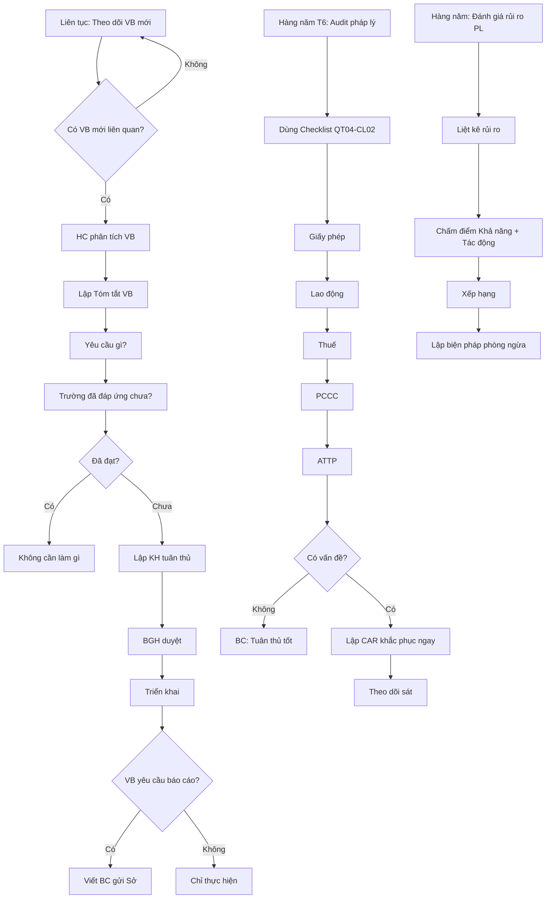

# SOP-06.3: TUÂN THỦ PHÁP LÝ

## 1. THÔNG TIN QUY TRÌNH

| **Thuộc tính** | **Nội dung** |
|---|---|
| Mã SOP | SOP-06.3 |
| Tên quy trình | Tuân thủ pháp lý |
| Quy trình cha | SOP-06: Quản lý hồ sơ - Pháp lý |
| Phiên bản | 1.0 |
| Tần suất | Liên tục |

## 2. MỤC ĐÍCH

- **Tuân thủ 100% pháp luật**: Không vi phạm
- **Cập nhật kịp thời**: Pháp luật thay đổi → Trường điều chỉnh ngay
- **Quản lý rủi ro pháp lý**: Phòng ngừa kiện tụng, Phạt
- **Bảo vệ trường**: Giấy phép, Chứng nhận hợp lệ

## 3. CÁC VĂN BẢN PHÁP LÝ LIÊN QUAN

### 3.1. Danh mục văn bản (QT04-S10)

| **Lĩnh vực** | **Văn bản** | **Cơ quan ban hành** | **Hiệu lực** |
|---|---|---|---|
| **Giáo dục** | Luật Giáo dục 2019 | Quốc hội | 01/07/2020 |
| | Thông tư 32/2020/TT-BGDĐT (Chuẩn cơ sở vật chất) | BGD | 15/12/2020 |
| | Thông tư 28/2020/TT-BGDĐT (Kiểm định) | BGD | 15/10/2020 |
| **Lao động** | Bộ luật Lao động 2019 | Quốc hội | 01/01/2021 |
| | Nghị định 145/2020/NĐ-CP (BHXH) | Chính phủ | 14/12/2020 |
| **Thuế** | Luật Thuế GTGT 2008 (Sửa 2013, 2016) | Quốc hội | - |
| | Luật Thuế TNCN 2007 (Sửa 2012) | Quốc hội | - |
| **PCCC** | Luật PCCC 2001 (Sửa 2013) | Quốc hội | - |
| | Nghị định 136/2020/NĐ-CP (PCCC) | Chính phủ | 12/11/2020 |
| **An toàn thực phẩm** | Luật ATTP 2010 | Quốc hội | 01/07/2011 |
| | Nghị định 15/2018/NĐ-CP (ATTP) | Chính phủ | 01/03/2018 |
| **Môi trường** | Luật Bảo vệ MT 2020 | Quốc hội | 01/01/2022 |
| **Xây dựng** | Luật Xây dựng 2014 (Sửa 2020) | Quốc hội | - |

### 3.2. Phân loại theo mức độ

| **Mức độ** | **Mô tả** | **Ví dụ** |
|---|---|---|
| **Bắt buộc tuân thủ** | Vi phạm = Phạt/Thu hồi GP | PCCC, ATTP, Lao động, Thuế |
| **Khuyến khích** | Tuân thủ tốt hơn | ISO, Các tiêu chuẩn tự nguyện |

## 4. QUY TRÌNH TUÂN THỦ

### 4.1. Cập nhật văn bản pháp luật

**Bước 1: Theo dõi văn bản mới (Liên tục)**

**Nguồn cập nhật:**
| Nguồn | Link | Trách nhiệm |
|---|---|---|
| Cổng TTĐT Chính phủ | https://chinhphu.vn | Phòng Hành chính |
| Công báo | https://congbao.chinhphu.vn | Phòng Hành chính |
| Bộ GD&ĐT | https://moet.gov.vn | Phòng Học thuật |
| Sở GD&ĐT | Website Sở | Phòng Học thuật |
| Tư vấn luật | Email, Điện thoại | Phòng Hành chính |

**Bước 2: Khi có văn bản mới - Phòng Hành chính phân tích**

- Văn bản này liên quan trường không?
- Yêu cầu gì?
- Thời hạn thực hiện?

**Bước 3: Lập "Tóm tắt văn bản" (QT04-F21)**

Ví dụ:
```
TÓM TẮT VĂN BẢN PHÁP LÝ

Tên VB: Thông tư 32/2020/TT-BGDĐT - Chuẩn cơ sở vật chất
Hiệu lực: 15/12/2020

YÊU CẦU CHỦ YẾU:
1. Diện tích lớp học tối thiểu: 1.5m²/HS
2. Nhà vệ sinh: 1 bồn cầu/25 HS
3. Sân chơi: 2m²/HS

ĐÁNH GIÁ HIỆN TRẠNG TRƯỜNG:
✅ Diện tích lớp: Đạt (2m²/HS)
⚠️ Nhà vệ sinh: CHƯA ĐẠT (1 bồn/40 HS)
✅ Sân chơi: Đạt (2.5m²/HS)

HÀNH ĐỘNG CẦN LÀM:
• Xây thêm 2 block WC tầng 2, 3
• Thời hạn: Trước 15/12/2020
• Ngân sách: 300 triệu
• Trách nhiệm: Phòng Hành chính

MỨC ĐỘ ƯU TIÊN: 🔴 CAO (Bắt buộc, Có thời hạn)
```

**Bước 4: Gửi BGH + BP liên quan**

**Bước 5: Họp xử lý (Trong 7 ngày)**

### 4.2. Triển khai tuân thủ

**Bước 6: Lập Kế hoạch tuân thủ (QT04-D17)**

| **Yêu cầu VB** | **Hành động** | **Người** | **Hạn** | **Ngân sách** | **Trạng thái** |
|---|---|---|---|---|---|
| Xây WC | Thiết kế, Thi công | HC | 10/12 | 300 triệu | 🔄 Đang làm |

**Bước 7: BGH phê duyệt KH**

**Bước 8: Triển khai**

**Bước 9: Báo cáo cơ quan quản lý (Nếu yêu cầu)**

VD: Sở GD yêu cầu báo cáo tình hình thực hiện Thông tư 32 → Viết BC, Gửi

### 4.3. Kiểm tra tuân thủ định kỳ

**Bước 10: Mỗi năm 1 lần - Audit pháp lý (Tháng 6)**

**Checklist audit pháp lý (QT04-CL02):**

```
═══════════════════════════════════════════════════
      CHECKLIST AUDIT PHÁP LÝ - NĂM 2024
═══════════════════════════════════════════════════

I. GIẤY PHÉP, CHỨNG NHẬN:

□ Giấy phép hoạt động giáo dục:
  Số: ________ Ngày cấp: _____ HẾT HẠN: _____
  Trạng thái: ☐ Còn hạn  ☐ Hết hạn  ☐ Cần gia hạn

□ Chứng nhận PCCC:
  Số: ________ Ngày cấp: _____ HẾT HẠN: _____

□ Chứng nhận ATTP:
  Số: ________ Ngày cấp: _____ HẾT HẠN: _____

□ Giấy phép XD (Nếu có):
  Số: ________ Ngày cấp: _____ HẾT HẠN: _____

II. LAO ĐỘNG:

□ 100% NV có HĐLĐ?  ☐ Có  ☐ Không
  (Nếu Không: Liệt kê ai chưa có)

□ BHXH đóng đầy đủ?  ☐ Có  ☐ Không
  (Nếu Không: Lý do)

□ Lương tối thiểu >= Lương tối thiểu vùng?  ☐ Có  ☐ Không

□ Giờ làm <= 8h/ngày?  ☐ Có  ☐ Không

□ Có quy chế lao động?  ☐ Có  ☐ Không

III. THUẾ:

□ Khai thuế đúng hạn?  ☐ Có  ☐ Không

□ Nộp thuế đầy đủ?  ☐ Có  ☐ Không

□ Có công nợ thuế?  ☐ Không  ☐ Có (Số tiền: ____)

IV. PCCC:

□ Kiểm tra PCCC định kỳ?  ☐ Có (Lần cuối: ____)  ☐ Không

□ Đủ thiết bị PCCC?  ☐ Có  ☐ Không

□ Diễn tập PCCC?  ☐ Có (Lần cuối: ____)  ☐ Không

V. AN TOÀN THỰC PHẨM:

□ Nhân viên bếp có thẻ sức khỏe?  ☐ Có  ☐ Không

□ Kiểm tra thực phẩm định kỳ?  ☐ Có  ☐ Không

□ Lưu mẫu thức ăn 48h?  ☐ Có  ☐ Không

══════════════════════════════════════════════════
KẾT LUẬN:
☐ ✅ Tuân thủ tốt
☐ ⚠️ Có 1-2 vấn đề nhỏ
☐ 🔴 Vi phạm nghiêm trọng

HÀNH ĐỘNG KHẮC PHỤC: (Nếu có)
________________________________________________

Người kiểm tra: _________ Ngày: _______
Trưởng HC: _____________ Ngày: _______
```

**Bước 11: Lập BC audit pháp lý (QT04-R12)**

**Bước 12: Nếu có vấn đề → Khắc phục ngay**

### 4.4. Quản lý rủi ro pháp lý

**Bước 13: Hàng năm - Đánh giá rủi ro pháp lý (QT04-M01)**

| **Rủi ro** | **Khả năng** | **Tác động** | **Mức độ** | **Biện pháp phòng ngừa** |
|---|---|---|---|---|
| Hết hạn GP hoạt động | Thấp | Cao | **Cao** | Gia hạn trước 6 tháng |
| Vi phạm ATTP | TB | Cao | **Cao** | Kiểm tra chặt, Đào tạo |
| NV kiện về lao động | Thấp | TB | TB | HĐLĐ rõ ràng, Quy chế minh bạch |

## 5. LƯU ĐỒ QUY TRÌNH



## 6. BIỂU MẪU LIÊN QUAN

| **Mã** | **Tên** |
|---|---|
| QT04-S10 | Danh mục văn bản pháp lý |
| QT04-F21 | Tóm tắt văn bản pháp lý |
| QT04-D17 | Kế hoạch tuân thủ pháp lý |
| QT04-CL02 | Checklist audit pháp lý |
| QT04-R12 | Báo cáo audit pháp lý năm |
| QT04-M01 | Ma trận rủi ro pháp lý |

## 7. TIÊU CHUẨN VÀ CHỈ TIÊU

| **Chỉ tiêu** | **Mục tiêu** |
|---|---|
| Vi phạm pháp luật | 0 lần/năm |
| Giấy phép còn hạn | 100% |
| Cập nhật VB mới trong | ≤ 7 ngày |
| Audit pháp lý/năm | 1 lần |

## 8. TRÁCH NHIỆM CỤ THỂ

| **Vai trò** | **Trách nhiệm** |
|---|---|
| **Phòng Hành chính** | Theo dõi VB, Phân tích, Tóm tắt, Gia hạn GP |
| **BP liên quan** | Triển khai tuân thủ |
| **BGH** | Quyết định KH, Phân bổ NS |
| **Ban ISO** | Audit pháp lý, Đánh giá rủi ro |

## 9. LƯU Ý QUAN TRỌNG

- ⚠️ **Vi phạm pháp luật = Tai họa**: Phạt, Thu hồi GP, Đóng cửa, Uy tín mất
- ✅ **Gia hạn GP trước 6 tháng**: Đừng để hết hạn mới lo!
- ✅ **Cập nhật VB kịp thời**: Pháp luật thay đổi liên tục
- 🔥 **Ưu tiên cao nhất**: PCCC, ATTP, Lao động (Liên quan an toàn người)

## 10. PHỤ LỤC

### 10.1. Lịch gia hạn giấy phép

| **Giấy phép** | **Ngày hết hạn** | **Cảnh báo trước** | **Trách nhiệm** |
|---|---|---|---|
| GP hoạt động GD | 31/12/2025 | 6 tháng (01/07/2025) | HC |
| Chứng nhận PCCC | 15/06/2025 | 3 tháng (15/03/2025) | HC |
| Chứng nhận ATTP | 20/08/2025 | 2 tháng (20/06/2025) | Bếp ăn |

**Hệ thống tự động nhắc:** Email trước 6, 3, 1 tháng

### 10.2. Các vi phạm phổ biến và Mức phạt

| **Vi phạm** | **Mức phạt** | **Hậu quả khác** |
|---|---|---|
| Hoạt động không GP | 100-150 triệu | Thu hồi GP, Đóng cửa |
| Vi phạm PCCC nghiêm trọng | 75-100 triệu | Đình chỉ đến khi khắc phục |
| Vi phạm ATTP gây ngộ độc | 50-100 triệu + Hình sự | Đóng cửa bếp, Bồi thường |
| Không đóng BHXH cho NV | 12-18% tổng tiền phải đóng | Truy thu, Lãi suất |
| Trốn thuế | 1-3 lần số thuế + Hình sự | Tịch thu tài sản |

## 11. FAQ

**Q1: Nếu không kịp gia hạn GP, hết hạn?**  
A: DỪNG HOẠT ĐỘNG NGAY! Xin gia hạn khẩn cấp. Hoạt động không GP = Vi phạm nghiêm trọng.

**Q2: VB mới yêu cầu đáp ứng trong 6 tháng nhưng trường chưa có tiền?**  
A: Vay ngân hàng, Xin HĐ phụ huynh hỗ trợ, Hoặc xin Sở GD gia hạn (Có văn bản). KHÔNG được bỏ qua!

**Q3: Audit pháp lý do ai làm?**  
A: Ban ISO + Phòng Hành chính + Chuyên gia luật (Nếu cần).

---

**PHÊ DUYỆT**

| Trưởng HC | Trưởng Ban ISO | Phó HT | HT |
|---|---|---|---|
| [Họ tên] | [Họ tên] | [Họ tên] | [Họ tên] |

