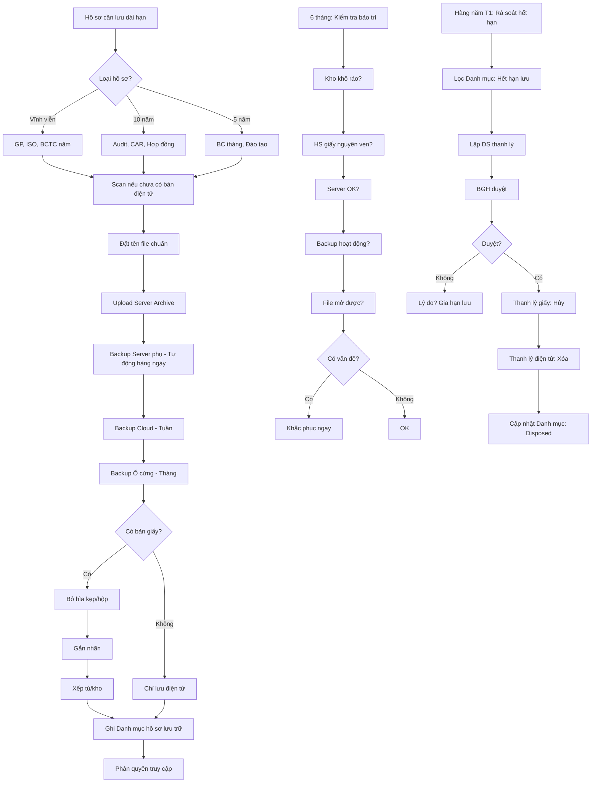

# SOP-06.4: LƯU TRỮ HỒ SƠ DÀI HẠN

## 1. THÔNG TIN QUY TRÌNH

| **Thuộc tính** | **Nội dung** |
|---|---|
| Mã SOP | SOP-06.4 |
| Tên quy trình | Lưu trữ hồ sơ dài hạn |
| Quy trình cha | SOP-06: Quản lý hồ sơ - Pháp lý |
| Phiên bản | 1.0 |
| Tần suất | Liên tục + Rà soát định kỳ |

## 2. MỤC ĐÍCH

- **Bảo quản an toàn**: Hồ sơ quan trọng không mất mát, hư hỏng
- **Dễ tra cứu**: Tìm lại được sau nhiều năm
- **Tuân thủ pháp lý**: Một số hồ sơ pháp luật yêu cầu lưu vĩnh viễn
- **Bằng chứng lịch sử**: Chứng minh quá trình phát triển trường

## 3. PHÂN LOẠI HỒ SƠ DÀI HẠN

### 3.1. Theo thời gian lưu

| **Loại** | **Thời gian** | **Ví dụ** |
|---|---|---|
| **Vĩnh viễn** | Mãi mãi | Giấy phép hoạt động, BCTC năm, Chứng chỉ ISO, QĐ thành lập |
| **10 năm** | 10 năm | Hồ sơ audit, CAR, Hợp đồng, Sổ sách kế toán |
| **5 năm** | 5 năm | Báo cáo tháng/quý, Hồ sơ đào tạo, Khảo sát KH |

### 3.2. Theo hình thức

| **Hình thức** | **Ưu điểm** | **Nhược điểm** | **Áp dụng** |
|---|---|---|---|
| **Giấy** | Pháp lý mạnh, Không virus | Chiếm diện tích, Dễ hư | Hồ sơ gốc quan trọng |
| **Điện tử (PDF/Scan)** | Tiết kiệm, Dễ tra cứu | Cần bảo mật, Có thể hỏng file | Hầu hết hồ sơ |
| **Cả 2** | An toàn nhất | Tốn công | Hồ sơ cực quan trọng |

## 4. QUY TRÌNH LƯU TRỮ

### 4.1. Chuẩn bị lưu trữ

**Bước 1: Xác định hồ sơ cần lưu dài hạn**

**Nguyên tắc:**
- Hồ sơ pháp lý → Vĩnh viễn hoặc 10 năm
- Hồ sơ ISO → 10 năm
- Hồ sơ vận hành → 5 năm

**Bước 2: Scan hồ sơ giấy (Nếu chưa có bản điện tử)**

**Tiêu chuẩn scan:**
- Độ phân giải: 300 DPI
- Định dạng: PDF (Có OCR để tìm kiếm)
- Màu: Màu/Xám (Tùy hồ sơ)
- Kích thước file: < 5MB/file (Nén hợp lý)

**Bước 3: Đặt tên file chuẩn**

Format: `[Năm]_[Loại]_[Tên]_[Ngày].pdf`

VD: `2024_BC_Audit_Hoc_thuat_20241112.pdf`

**Bước 4: Tổ chức thư mục**

```
\\Server\ISO_Archive\
├─ Vinh_vien\
│  ├─ Giay_phep\
│  ├─ Chung_chi_ISO\
│  └─ BCTC_nam\
├─ 10_nam\
│  ├─ 2024\
│  │  ├─ Audit\
│  │  ├─ CAR\
│  │  └─ Hop_dong\
│  ├─ 2023\
│  └─ 2022\
└─ 5_nam\
   ├─ 2024\
   ├─ 2023\
   └─ 2022\
```

### 4.2. Lưu trữ giấy (Nếu cần)

**Bước 5: Bỏ vào bìa kẹp/hộp**

- Bìa cứng, Chống ẩm
- Ghi rõ: Năm, Loại, Nội dung

**Bước 6: Xếp vào tủ/kho lưu trữ**

**Yêu cầu kho:**
- Khô ráo, Thoáng mát
- Có khóa (Bảo mật)
- Có chống cháy/chống nước (Nếu có điều kiện)
- Không ánh sáng trực tiếp (Giấy bị phai màu)

**Bước 7: Gắn nhãn tủ/kệ**

VD:
```
┌─────────────────────────┐
│  KỆ A1                  │
│  ───────────────        │
│  Hồ sơ Audit 2024       │
│  (10 năm)               │
│  Hạn lưu: 31/12/2034    │
└─────────────────────────┘
```

### 4.3. Lưu trữ điện tử

**Bước 8: Upload lên Server chính**

`\\Server\ISO_Archive\...`

**Bước 9: Backup 3 lớp (3-2-1 Rule)**

| **Lớp** | **Vị trí** | **Tần suất** | **Công nghệ** |
|---|---|---|---|
| **1. Server phụ** | Server khác trong mạng | Hàng ngày (Tự động) | RAID, NAS |
| **2. Cloud** | Google Drive, OneDrive | Hàng tuần | Đồng bộ |
| **3. Ổ cứng ngoài** | Két sắt, Khác địa điểm | Hàng tháng | HDD/SSD |

**Bước 10: Mã hóa (Nếu nhạy cảm)**

Hồ sơ lương, Khiếu nại... → Mã hóa AES-256

### 4.4. Quản lý tra cứu

**Bước 11: Lập Danh mục hồ sơ lưu trữ (QT04-S11)**

| **STT** | **Năm** | **Loại** | **Tên** | **Vị trí giấy** | **Vị trí điện tử** | **Hạn lưu** | **Ngày thanh lý dự kiến** |
|---|---|---|---|---|---|---|---|
| 1 | 2024 | BC Audit | Audit Học thuật T11 | Tủ A1-Hộp 05 | \\Archive\10_nam\2024\Audit\ | 10 năm | 31/12/2034 |

**Bước 12: Phân quyền truy cập**

| **Hồ sơ** | **Quyền xem** | **Quyền tải về** |
|---|---|---|
| Vĩnh viễn (GP, ISO) | BGH, Ban ISO, HC | Ban ISO, HC |
| 10 năm (Audit, Hợp đồng) | BGH, Ban ISO, BP liên quan | Ban ISO |
| 5 năm (BC tháng) | BGH, Ban ISO, BP | BP |

**Bước 13: Tra cứu khi cần**

- Tìm trong Danh mục (Excel)
- Hoặc tìm trên Server (Ctrl+F)
- Nếu không tìm thấy → Tìm backup

### 4.5. Bảo trì định kỳ

**Bước 14: Kiểm tra 6 tháng/lần**

**Checklist bảo trì (QT04-CL03):**
```
□ Kho giấy khô ráo, Không ẩm mốc?
□ Hồ sơ giấy còn nguyên vẹn?
□ Server chạy bình thường?
□ Backup tự động hoạt động?
□ File điện tử mở được không?
□ Có virus/malware không?
□ Dung lượng server còn bao nhiêu? (Cảnh báo < 20%)
```

**Bước 15: Di chuyển dữ liệu (Nếu cần)**

VD: Server cũ → Server mới (5 năm/lần)

### 4.6. Thanh lý hồ sơ hết hạn

**Bước 16: Hàng năm (Tháng 1) - Rà soát hồ sơ hết hạn**

Lọc trong Danh mục: `Ngày thanh lý dự kiến <= Hôm nay`

**Bước 17: Lập Danh sách thanh lý (QT04-D18)**

| **STT** | **Hồ sơ** | **Năm** | **Hạn lưu** | **Ngày hết hạn** | **Đề xuất** |
|---|---|---|---|---|---|
| 1 | BC tháng T1-T12 | 2019 | 5 năm | 31/12/2024 | Thanh lý |

**Bước 18: BGH phê duyệt thanh lý**

**Bước 19: Thực hiện thanh lý**

- **Giấy:** Hủy bằng máy hủy (Nếu nhạy cảm) hoặc Vứt thùng rác
- **Điện tử:** Xóa khỏi Server, Cloud, Ổ cứng ngoài

**Bước 20: Cập nhật Danh mục**

Đổi trạng thái: "Active" → "Disposed (Đã thanh lý)"

**LƯU Ý:** Hồ sơ VĨNH VIỄN không bao giờ thanh lý!

## 5. LƯU ĐỒ QUY TRÌNH



## 6. BIỂU MẪU LIÊN QUAN

| **Mã** | **Tên** |
|---|---|
| QT04-S11 | Danh mục hồ sơ lưu trữ |
| QT04-CL03 | Checklist bảo trì hồ sơ lưu trữ |
| QT04-D18 | Danh sách thanh lý hồ sơ |

## 7. TIÊU CHUẨN VÀ CHỈ TIÊU

| **Chỉ tiêu** | **Mục tiêu** |
|---|---|
| Mất mát hồ sơ lưu trữ | 0% |
| Tra cứu được hồ sơ cũ | ≤ 10 phút |
| Backup thành công | 100% |
| Hồ sơ hết hạn được thanh lý đúng hạn | 100% |

## 8. TRÁCH NHIỆM CỤ THỂ

| **Vai trò** | **Trách nhiệm** |
|---|---|
| **BP chủ hồ sơ** | Scan, Đặt tên, Upload |
| **IT** | Quản lý server, Backup, Bảo trì |
| **Ban ISO** | Danh mục, Kiểm tra, Thanh lý |
| **Phòng Hành chính** | Quản lý kho giấy |

## 9. LƯU Ý QUAN TRỌNG

- ⚠️ **Backup cực kỳ quan trọng**: Server cháy = Mất tất cả → Tai họa!
- ✅ **3-2-1 Rule**: 3 bản sao, 2 phương tiện khác nhau, 1 bản ở ngoài (Offsite)
- ✅ **Kiểm tra backup định kỳ**: Backup không chạy = Như không có backup
- ✅ **Thanh lý đúng thời hạn**: Lưu quá nhiều → Lãng phí, Khó quản lý
- 🔥 **Hồ sơ vĩnh viễn = Báu vật**: Giấy phép, Chứng chỉ ISO → Lưu cẩn thận nhất

## 10. PHỤ LỤC

### 10.1. Danh sách hồ sơ lưu vĩnh viễn

| **STT** | **Loại hồ sơ** | **Ghi chú** |
|---|---|---|
| 1 | Giấy phép hoạt động giáo dục | Tất cả phiên bản |
| 2 | Quyết định thành lập trường | |
| 3 | Chứng chỉ ISO | Tất cả lần cấp/tái cấp |
| 4 | Báo cáo tài chính năm | Có chữ ký kế toán trưởng, HT |
| 5 | Biên bản Đại hội Hội đồng trường | |
| 6 | Giấy chứng nhận quyền sử dụng đất | |
| 7 | Hồ sơ xây dựng trường | Bản vẽ thiết kế, Giấy phép XD |

### 10.2. Chiến lược Backup (3-2-1 Rule)

**Ví dụ cụ thể:**

**3 bản sao:**
1. Bản gốc trên Server chính
2. Bản backup Server phụ (NAS)
3. Bản backup Cloud (Google Drive)

**2 phương tiện:**
1. Server (HDD/SSD trong mạng nội bộ)
2. Cloud (Trên Internet)

**1 bản ngoài (Offsite):**
- Cloud là offsite (Không cùng địa điểm với trường)
- Hoặc: Ổ cứng ngoài để nhà Giám đốc IT

**Tình huống thảm họa:**
- Trường cháy → Server chính + Server phụ (NAS) mất → VẪN CÒN Cloud!
- Hack mạng → Xóa Server → Khôi phục từ Ổ cứng ngoài offsite

### 10.3. Thời gian lưu theo pháp luật

| **Loại hồ sơ** | **Văn bản quy định** | **Thời gian** |
|---|---|---|
| Sổ sách kế toán | Luật Kế toán 2015 | 10 năm |
| Hợp đồng lao động | Bộ luật Lao động 2019 | 10 năm sau khi hết hiệu lực |
| Hồ sơ học sinh | Thông tư BGD | 10 năm |
| Chứng từ kế toán | Luật Kế toán 2015 | 10 năm |
| Hồ sơ PCCC | Luật PCCC | 5 năm |

### 10.4. Checklist di chuyển Server

Khi nâng cấp/thay Server (5 năm/lần):

```
□ Backup toàn bộ dữ liệu hiện tại
□ Kiểm tra backup (Mở thử 10% file)
□ Di chuyển dữ liệu sang Server mới
□ Kiểm chứng: So sánh MD5/SHA256 checksum
□ Thử tra cứu 10 hồ sơ ngẫu nhiên
□ Chạy thử 1 tuần song song (Server cũ + mới)
□ Chính thức chuyển sang Server mới
□ Xóa dữ liệu Server cũ (Sau 3 tháng chạy ổn định)
□ Cập nhật Danh mục: Vị trí mới
```

## 5. LƯU ĐỒ (Đã có ở phần 5)

## 6. BIỂU MẪU (Đã liệt kê)

## 7. TIÊU CHUẨN (Đã liệt kê)

## 8. TRÁCH NHIỆM (Đã liệt kê)

## 9. LƯU Ý (Đã liệt kê)

## 10. PHỤ LỤC (Đã có)

## 11. FAQ

**Q1: Nếu file PDF bị hỏng, không mở được sau 5 năm?**  
A: Khôi phục từ backup (Cloud hoặc Ổ cứng). Nếu tất cả backup đều hỏng → Tai họa! (Đó là lý do phải có 3 bản sao)

**Q2: Hồ sơ giấy bị mối ăn, ẩm mốc?**  
A: Rất nghiêm trọng! May mắn có bản scan điện tử → In lại. (Nếu không có scan → Mất hồ sơ)

**Q3: Có cần lưu Email cũ không?**  
A: Email quan trọng (Phê duyệt, Khiếu nại...) nên lưu. Backup tài khoản email định kỳ.

**Q4: Cloud có an toàn không? Sợ bị hack?**  
A: Dùng Cloud uy tín (Google, Microsoft). Bật 2FA (Xác thực 2 lớp). Mã hóa file nhạy cảm trước khi upload.

---

**PHÊ DUYỆT**

| Trưởng IT | Trưởng HC | Trưởng Ban ISO | Phó HT |
|---|---|---|---|
| [Họ tên] | [Họ tên] | [Họ tên] | [Họ tên] |

---

✅ **HOÀN THÀNH SOP-06: QUẢN LÝ HỒ SƠ - PHÁP LÝ (4 files)!**

