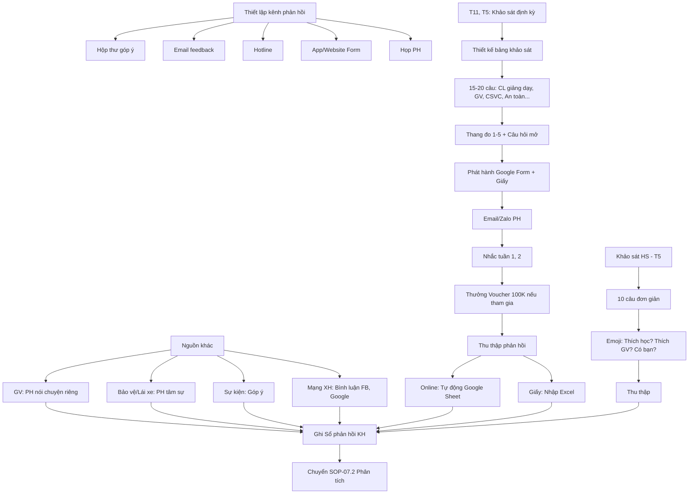

# SOP-07.1: THU THẬP PHẢN HỒI KHÁCH HÀNG

## 1. THÔNG TIN QUY TRÌNH

| **Thuộc tính** | **Nội dung** |
|---|---|
| Mã SOP | SOP-07.1 |
| Tên quy trình | Thu thập phản hồi khách hàng |
| Quy trình cha | SOP-07: Phản hồi - Khiếu nại |
| Phiên bản | 1.0 |
| Tần suất | Liên tục + Khảo sát định kỳ |

## 2. MỤC ĐÍCH

- **Lắng nghe khách hàng**: Biết KH nghĩ gì, Muốn gì, Không hài lòng gì
- **Cải tiến dịch vụ**: Dựa trên phản hồi để cải thiện
- **Tăng hài lòng**: KH thấy được lắng nghe → Tin tưởng hơn
- **Tuân thủ ISO**: ISO 9001 Điều 9.1.2 yêu cầu đo lường hài lòng KH

## 3. KHÁCH HÀNG CỦA TRƯỜNG

| **Loại KH** | **Mô tả** | **Phản hồi quan trọng** |
|---|---|---|
| **Phụ huynh** | KH trả tiền | Hài lòng dịch vụ, Học phí hợp lý, Giáo viên tốt |
| **Học sinh** | KH sử dụng dịch vụ | Thích học, Vui, Bạn bè |
| **Doanh nghiệp** | Tuyển sinh, Hợp tác | Chất lượng đầu ra, Kỹ năng HS |

## 4. QUY TRÌNH THU THẬP

### 4.1. Kênh phản hồi liên tục

**Bước 1: Thiết lập các kênh**

| **Kênh** | **Hình thức** | **Đối tượng** | **Ưu điểm** |
|---|---|---|---|
| **Hộp thư góp ý** | Hộp thư vật lý (Sảnh) + Online (Google Form) | Tất cả | Nặc danh, Thoải mái |
| **Email** | feedback@[school].edu.vn | Tất cả | Chính thức, Có bằng chứng |
| **Hotline** | 1900-xxxx | Khẩn cấp | Nhanh, Trực tiếp |
| **App/Website** | Form góp ý trên App/Website | PH, HS | Tiện lợi |
| **Họp PH** | 2 lần/năm (Học kỳ) | PH | Gặp mặt, Trao đổi sâu |
| **Trao đổi GV-PH** | Nhật ký liên lạc, Zalo Group | PH | Hàng ngày |

**Bước 2: Truyền thông các kênh**

- Email đầu năm học
- Poster ở sảnh, Lớp học
- Hướng dẫn trong App/Website

### 4.2. Khảo sát định kỳ

**Khảo sát Phụ huynh (2 lần/năm)**

**Thời gian:**
- Đợt 1: Tháng 11-12 (Học kỳ 1)
- Đợt 2: Tháng 5-6 (Học kỳ 2)

**Bước 3: Thiết kế bảng khảo sát (QT04-F22)**

**Nội dung:** 15-20 câu hỏi

**Các khía cạnh:**

| **Khía cạnh** | **Câu hỏi mẫu** | **Thang đo** |
|---|---|---|
| **Chất lượng giảng dạy** | "Anh/chị hài lòng với chất lượng giảng dạy?" | 1-5 sao |
| **Giáo viên** | "GV nhiệt tình, Tận tâm?" | 1-5 |
| **Cơ sở vật chất** | "Phòng học, Sân chơi đáp ứng tốt?" | 1-5 |
| **An toàn** | "Trường đảm bảo an toàn cho con?" | 1-5 |
| **Bếp ăn** | "Thực đơn đa dạng, Dinh dưỡng?" | 1-5 |
| **Giao tiếp** | "Trường thông tin kịp thời cho PH?" | 1-5 |
| **Học phí** | "Học phí hợp lý với chất lượng?" | 1-5 |
| **Tổng thể** | "Anh/chị có giới thiệu trường cho người khác?" | Có/Không |

**Câu hỏi mở:** "Điều gì anh/chị muốn trường cải thiện?"

**Bước 4: Phát hành khảo sát**

**Phương pháp:**
- Online: Google Form (Ưu tiên - Dễ tổng hợp)
- Giấy: Phát về cho con đem về (PH không dùng Internet)

**Bước 5: Nhắc nhở PH tham gia**

- Email/Zalo: Tuần 1, Tuần 2
- Thưởng nhỏ: Tham gia khảo sát → Voucher giảm học phí 100K (Tăng tỷ lệ phản hồi)

**Mục tiêu:** Tỷ lệ phản hồi ≥ 70%

**Khảo sát Học sinh (1 lần/năm - Tháng 5)**

Dành cho HS từ lớp 3 trở lên

**Nội dung:** 10 câu, Đơn giản

| **Câu hỏi** | **Hình thức** |
|---|---|
| "Em có thích đi học không?" | ☺️😐🙁 (Emoji) |
| "Em có thích thầy/cô không?" | ☺️😐🙁 |
| "Em có bạn chơi không?" | Có/Không |

**Bước 6: Thu thập khảo sát**

- Online: Tự động vào Google Sheet
- Giấy: Nhập thủ công vào Excel

### 4.3. Phản hồi từ các nguồn khác

**Bước 7: Thu thập từ nguồn thứ cấp**

| **Nguồn** | **Phản hồi** | **Người thu thập** |
|---|---|---|
| **GV chủ nhiệm** | PH nói chuyện riêng với GV | GV ghi lại, Báo Ban ISO |
| **Bảo vệ, Lái xe** | PH tâm sự ở cổng, Trên xe | Ghi lại, Báo Ban ISO |
| **Sự kiện** | PH góp ý trong sự kiện | BP tổ chức ghi lại |
| **Mạng xã hội** | Bình luận Facebook, Google Review | Marketing theo dõi |

**Bước 8: Tất cả phản hồi vào Hệ thống (QT04-S12 - Sổ phản hồi khách hàng)**

## 5. LƯU ĐỒ QUY TRÌNH



## 6. BIỂU MẪU LIÊN QUAN

| **Mã** | **Tên** |
|---|---|
| QT04-F22 | Bảng khảo sát hài lòng Phụ huynh |
| QT04-F23 | Bảng khảo sát Học sinh |
| QT04-S12 | Sổ phản hồi khách hàng |

## 7. TIÊU CHUẨN VÀ CHỈ TIÊU

| **Chỉ tiêu** | **Mục tiêu** |
|---|---|
| Tỷ lệ PH tham gia khảo sát | ≥ 70% |
| Số phản hồi thu thập/năm | ≥ 300 phản hồi (Mọi kênh) |
| Thời gian xử lý phản hồi | ≤ 48 giờ (Xác nhận đã nhận) |

## 8. TRÁCH NHIỆM CỤ THỂ

| **Vai trò** | **Trách nhiệm** |
|---|---|
| **Ban ISO** | Thiết kế khảo sát, Thu thập, Quản lý Sổ phản hồi |
| **Marketing** | Truyền thông, Nhắc nhở PH, Theo dõi mạng xã hội |
| **Tất cả NV** | Thu thập phản hồi từ KH, Báo Ban ISO |

## 9. LƯU Ý QUAN TRỌNG

- ⚠️ **Phản hồi tiêu cực = Quý giá**: Đừng ngại, Đó là cơ hội cải tiến!
- ✅ **Khuyến khích phản hồi thật**: Đừng "ép" PH chấm 5 sao
- ✅ **Bảo mật phản hồi**: PH có quyền giấu tên
- ✅ **Xác nhận đã nhận**: Email "Cảm ơn anh/chị đã góp ý" trong 48h
- 🔥 **Lắng nghe không đủ, Phải hành động**: Thu thập mà không cải tiến = Lãng phí!

## 10. PHỤ LỤC

### 10.1. Mẫu Bảng khảo sát Phụ huynh (QT04-F22)

```
══════════════════════════════════════════════════════
    KHẢO SÁT HÀI LÒNG PHỤ HUYNH - HỌC KỲ 1/2024
══════════════════════════════════════════════════════

Kính gửi Quý Phụ huynh,

Trường trân trọng mời Quý PH dành 5 phút tham gia khảo sát 
để giúp nhà trường cải thiện chất lượng phục vụ.

Mọi ý kiến đều được ghi nhận và bảo mật.

──────────────────────────────────────────────────────

THÔNG TIN:
• Họ tên PH: __________________ (Tùy chọn)
• Con học lớp: ________________
• Số điện thoại: ______________ (Tùy chọn)

──────────────────────────────────────────────────────

VUI LÒNG ĐÁNH GIÁ THEO THANG ĐIỂM 1-5:
1 = Rất không hài lòng
2 = Không hài lòng
3 = Bình thường
4 = Hài lòng
5 = Rất hài lòng

┌────────────────────────────────────┬─────────────┐
│ NỘI DUNG                           │ 1 2 3 4 5   │
├────────────────────────────────────┼─────────────┤
│ 1. Chất lượng giảng dạy            │ ☐☐☐☐☐       │
│ 2. Chương trình học phù hợp        │ ☐☐☐☐☐       │
│ 3. Giáo viên nhiệt tình, Tận tâm   │ ☐☐☐☐☐       │
│ 4. GV chủ nhiệm quan tâm con       │ ☐☐☐☐☐       │
│ 5. Cơ sở vật chất (Phòng, Sân...)  │ ☐☐☐☐☐       │
│ 6. An toàn, An ninh                │ ☐☐☐☐☐       │
│ 7. Bếp ăn (Thực đơn, Vệ sinh)      │ ☐☐☐☐☐       │
│ 8. Xe đưa đón (Nếu dùng)           │ ☐☐☐☐☐ N/A   │
│ 9. Thông tin kịp thời từ trường   │ ☐☐☐☐☐       │
│ 10. Giải quyết thắc mắc nhanh     │ ☐☐☐☐☐       │
│ 11. Học phí hợp lý với CL         │ ☐☐☐☐☐       │
│ 12. Hoạt động ngoại khóa đa dạng  │ ☐☐☐☐☐       │
└────────────────────────────────────┴─────────────┘

13. Con có tiến bộ so với đầu năm?
    ☐ Có, rõ rệt  ☐ Có, một chút  ☐ Không rõ  ☐ Không

14. Anh/chị có giới thiệu trường cho người khác?
    ☐ Chắc chắn có  ☐ Có thể  ☐ Không chắc  ☐ Không

──────────────────────────────────────────────────────

CÂU HỎI MỞ:

15. Điều gì anh/chị HÀI LÒNG NHẤT về trường?
    ________________________________________________
    ________________________________________________

16. Điều gì anh/chị MUỐN TRƯỜNG CẢI THIỆN?
    ________________________________________________
    ________________________________________________
    ________________________________________________

══════════════════════════════════════════════════════
Trân trọng cảm ơn!

Nộp: Hộp thư sảnh hoặc Google Form: [Link]
Thời hạn: 30/11/2024
Voucher giảm 100K học phí tháng 12 cho PH tham gia!
══════════════════════════════════════════════════════
```

### 10.2. Mẫu Email xác nhận đã nhận phản hồi

```
Từ: ISO Team <iso@[school].edu.vn>
Đến: [PH email]
Tiêu đề: Cảm ơn phản hồi của Quý phụ huynh

Kính gửi Quý phụ huynh,

Chúng tôi đã nhận được phản hồi của Quý PH về 
[Nội dung: Giáo viên, Bếp ăn, ...].

Cảm ơn Quý PH đã dành thời gian góp ý. 
Ý kiến của Quý PH rất quý giá giúp trường cải thiện.

Chúng tôi đang xem xét và sẽ phản hồi cụ thể trong 7 ngày làm việc.

Trân trọng,
Ban ISO - [Tên trường]
```

### 10.3. Sổ phản hồi khách hàng (QT04-S12)

| **STT** | **Ngày** | **Nguồn** | **Người phản hồi** | **Nội dung** | **Loại** | **Trạng thái** | **Người xử lý** |
|---|---|---|---|---|---|---|---|
| 1 | 12/11 | Email | PH Lớp 3A (Ẩn danh) | "Thực đơn ít rau xanh" | Góp ý | Đang xử lý | Trưởng Bếp |
| 2 | 15/11 | Hotline | PH Lớp 5B | "Con bị bạn bắt nạt" | Khiếu nại | Đang điều tra | GVCN |
| 3 | 18/11 | Khảo sát | PH Lớp 2C | "Hài lòng với GV" | Khen ngợi | Đã ghi nhận | - |

## 11. FAQ

**Q1: PH không muốn để tên, Có được không?**  
A: Được! Khuyến khích ẩn danh để PH thoải mái góp ý thật.

**Q2: Tỷ lệ phản hồi thấp, Làm sao tăng?**  
A: Thưởng nhỏ (Voucher), Làm khảo sát ngắn (≤ 5 phút), Nhắc nhở nhiều lần.

**Q3: PH phản hồi trên Facebook công khai?**  
A: Trả lời công khai lịch sự: "Cảm ơn PH. Chúng tôi đã nhận được và sẽ xử lý. Vui lòng inbox để trao đổi chi tiết."

---

**PHÊ DUYỆT**

| Ban ISO | Marketing | Phó HT |
|---|---|---|
| [Họ tên] | [Họ tên] | [Họ tên] |

