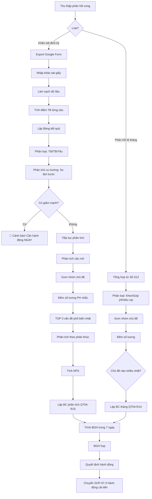

# SOP-07.2: PHÂN TÍCH PHẢN HỒI

## 1. THÔNG TIN QUY TRÌNH

| **Thuộc tính** | **Nội dung** |
|---|---|
| Mã SOP | SOP-07.2 |
| Tên quy trình | Phân tích phản hồi khách hàng |
| Quy trình cha | SOP-07: Phản hồi - Khiếu nại |
| Phiên bản | 1.0 |
| Tần suất | Sau mỗi đợt khảo sát (6 tháng) + Hàng tháng (Phản hồi lẻ) |

## 2. MỤC ĐÍCH

- **Hiểu sâu KH**: Đằng sau con số là gì? KH thực sự nghĩ gì?
- **Tìm vấn đề**: Điểm yếu cần cải tiến
- **Tìm điểm mạnh**: Phát huy, Duy trì
- **Ra quyết định**: Dựa trên dữ liệu, Không cảm tính

## 3. QUY TRÌNH PHÂN TÍCH

### 3.1. Sau khảo sát định kỳ (Tháng 12, Tháng 6)

**Bước 1: Tổng hợp dữ liệu**

- Export khảo sát từ Google Form → Excel
- Nhập khảo sát giấy (Nếu có)
- Làm sạch dữ liệu (Xóa phản hồi trùng, Không hợp lệ)

**Bước 2: Tính điểm trung bình từng câu hỏi**

**Ví dụ:** Câu 1 "Chất lượng giảng dạy"
- 100 PH tham gia
- 1 sao: 2 PH
- 2 sao: 5 PH
- 3 sao: 20 PH
- 4 sao: 50 PH
- 5 sao: 23 PH

**Điểm TB** = (1×2 + 2×5 + 3×20 + 4×50 + 5×23) / 100 = **4.07/5**

**Bước 3: Lập Bảng kết quả (QT04-R13)**

| **Nội dung** | **Điểm TB** | **Đợt trước** | **Thay đổi** | **Đánh giá** |
|---|---|---|---|---|
| Chất lượng giảng dạy | 4.07 | 3.95 | +0.12 ↗️ | ✅ Tốt, Đang cải thiện |
| Giáo viên | 4.35 | 4.30 | +0.05 ↗️ | ✅ Tốt, Duy trì |
| Cơ sở vật chất | 3.82 | 3.80 | +0.02 → | ⚠️ TB, Cần cải thiện |
| An toàn | 4.50 | 4.48 | +0.02 → | ✅ Rất tốt |
| Bếp ăn | 3.65 | 3.90 | **-0.25** ↘️ | 🔴 **GIẢM, Cần hành động NGAY** |
| Xe đưa đón | 4.10 | 4.05 | +0.05 ↗️ | ✅ Tốt |
| Thông tin | 4.20 | 4.15 | +0.05 ↗️ | ✅ Tốt |
| Giải quyết TM | 3.95 | 3.85 | +0.10 ↗️ | ✅ Tốt, Đang cải thiện |
| Học phí | 3.70 | 3.68 | +0.02 → | ⚠️ TB, Luôn là vấn đề |
| Ngoại khóa | 4.00 | 3.95 | +0.05 ↗️ | ✅ Tốt |
| **TRUNG BÌNH** | **4.03** | **3.96** | **+0.07** ↗️ | ✅ Tốt |

**Bước 4: Phân loại kết quả**

| **Điểm** | **Phân loại** | **Hành động** |
|---|---|---|
| ≥ 4.5 | ✅ Rất tốt | Duy trì, Chia sẻ kinh nghiệm |
| 4.0 - 4.49 | ✅ Tốt | Duy trì, Cải tiến nhỏ |
| 3.5 - 3.99 | ⚠️ Trung bình | Cải tiến, Lập kế hoạch |
| < 3.5 | 🔴 Yếu | **HÀN ĐỘNG NGAY, Ưu tiên cao** |

**Bước 5: Phân tích xu hướng**

Vẽ biểu đồ so sánh các đợt:

```
Điểm hài lòng Bếp ăn:
     
 5.0│
 4.5│
 4.0│     ●
 3.9│  ●        
 3.8│              
 3.7│                    ●
 3.6│                          ●  🔴 GIẢM!
 3.5│
────┼─────────────────────────────
    T5   T11   T5   T11   T5  T11
   2023  2023  2024  2024  2024 2024
```

**Bước 6: Phân tích câu trả lời mở**

**Câu 15:** "Điều gì anh/chị HÀI LÒNG NHẤT?"

**Phương pháp:** Gom nhóm chủ đề

| **Chủ đề** | **Số lượt** | **% PH** | **Ví dụ trích dẫn** |
|---|---|---|---|
| Giáo viên tốt | 45 | 45% | "Cô chủ nhiệm rất tận tâm" |
| Con tiến bộ | 30 | 30% | "Con học tốt hơn, Tự tin hơn" |
| An toàn | 20 | 20% | "Trường rất an toàn" |
| Khác | 5 | 5% | |

**Câu 16:** "Điều gì anh/chị MUỐN CẢI THIỆN?"

| **Chủ đề** | **Số lượt** | **% PH** | **Ví dụ trích dẫn** | **Mức độ** |
|---|---|---|---|---|
| **Bếp ăn** | **40** | **40%** | "Thực đơn đơn điệu, Ít rau" | 🔴 CAO |
| Học phí cao | 25 | 25% | "Học phí hơi đắt" | ⚠️ TB |
| Hoạt động ngoại khóa | 15 | 15% | "Muốn thêm câu lạc bộ" | ⚠️ TB |
| CSVC | 10 | 10% | "Thêm sân chơi" | ⚠️ TB |
| Khác | 10 | 10% | | |

→ **KẾT LUẬN:** Bếp ăn là vấn đề CẤP BÁCH nhất!

**Bước 7: Phân tích theo phân khúc**

| **Phân khúc** | **Điểm TB** | **Nhận xét** |
|---|---|---|
| PH Mầm non | 4.15 | Hài lòng cao nhất |
| PH Tiểu học | 4.05 | Tốt |
| PH THCS | 3.85 | Thấp hơn → Cần quan tâm |

**Bước 8: Tính NPS (Net Promoter Score)**

**Câu 14:** "Anh/chị có giới thiệu trường cho người khác?"

| **Trả lời** | **Phân loại** | **Số PH** |
|---|---|---|
| Chắc chắn có | Promoter | 60 |
| Có thể | Passive | 30 |
| Không chắc, Không | Detractor | 10 |

**NPS = % Promoter - % Detractor = 60% - 10% = 50**

| **NPS** | **Đánh giá** |
|---|---|
| ≥ 70 | Xuất sắc |
| 50-69 | Tốt |
| 30-49 | Trung bình |
| < 30 | Yếu |

→ NPS = 50 = **TỐT**

### 3.2. Phân tích phản hồi lẻ (Hàng tháng)

**Bước 9: Tổng hợp phản hồi tháng từ Sổ (QT04-S12)**

**Bước 10: Phân loại**

| **Loại** | **Số lượng** | **Ví dụ** |
|---|---|---|
| Khen ngợi | 15 | "GV tốt" |
| Góp ý | 25 | "Thực đơn đơn điệu" |
| Khiếu nại | 5 | "Con bị bắt nạt" |

**Bước 11: Gom nhóm chủ đề**

| **Chủ đề** | **Góp ý** | **Khiếu nại** | **Tổng** | **Ưu tiên** |
|---|---|---|---|---|
| Bếp ăn | 12 | 1 | 13 | 🔴 CAO |
| Giáo viên | 3 | 2 | 5 | ⚠️ TB |
| CSVC | 5 | 0 | 5 | ⚠️ TB |
| Xe đưa đón | 3 | 1 | 4 | ⚠️ TB |
| Khác | 2 | 1 | 3 | |

→ **Bếp ăn** vẫn là vấn đề nhiều nhất!

**Bước 12: Lập Báo cáo phân tích tháng (QT04-R14)**

### 3.3. Báo cáo BGH

**Bước 13: Sau khảo sát - Lập BC chi tiết (QT04-R15)**

**Nội dung BC:**
- Tổng quan (NPS, Điểm TB, Tỷ lệ phản hồi)
- Điểm mạnh (Top 3)
- Điểm yếu (Top 3)
- Xu hướng (So với đợt trước)
- Phân tích câu mở
- **Khuyến nghị hành động** (Quan trọng nhất!)

**Bước 14: Họp BGH (Trong 7 ngày sau khảo sát)**

**Bước 15: Quyết định hành động → Chuyển SOP-07.3**

## 4. LƯU ĐỒ QUY TRÌNH



## 5. BIỂU MẪU LIÊN QUAN

| **Mã** | **Tên** |
|---|---|
| QT04-R13 | Bảng kết quả khảo sát |
| QT04-R14 | Báo cáo phân tích phản hồi tháng |
| QT04-R15 | Báo cáo phân tích khảo sát định kỳ (Chi tiết) |

## 6. TIÊU CHUẨN VÀ CHỈ TIÊU

| **Chỉ tiêu** | **Mục tiêu** |
|---|---|
| Điểm hài lòng TB | ≥ 4.0/5 |
| NPS | ≥ 50 |
| Hoàn thành BC phân tích sau khảo sát | ≤ 7 ngày |

## 7. TRÁCH NHIỆM CỤ THỂ

| **Vai trò** | **Trách nhiệm** |
|---|---|
| **Ban ISO** | Phân tích, Lập BC, Trình BGH |
| **BGH** | Họp, Quyết định hành động |

## 8. LƯU Ý QUAN TRỌNG

- ⚠️ **Đừng chỉ nhìn điểm số**: Đọc câu trả lời mở để hiểu SÂU
- ✅ **Tìm xu hướng**: 1 đợt không đủ, Phải so sánh nhiều đợt
- ✅ **Hành động > Phân tích**: Phân tích mà không hành động = Vô ích
- 🔥 **Vấn đề GIẢM ĐIỂM = Ưu tiên cao nhất**: Từ 3.9 xuống 3.6 = Nghiêm trọng!

## 9. PHỤ LỤC

### 9.1. Mẫu Báo cáo phân tích (QT04-R15)

```
══════════════════════════════════════════════════════
  BÁO CÁO PHÂN TÍCH KHẢO SÁT HÀI LÒNG PHỤ HUYNH
              HỌC KỲ 1 - NĂM 2024
══════════════════════════════════════════════════════

I. TỔNG QUAN:

• Số lượng PH: 500
• Số phản hồi: 375 (Tỷ lệ: 75% ✅)
• Thời gian: 15/11 - 30/11/2024
• Điểm hài lòng TB: 4.03/5 (Đợt trước: 3.96)
• NPS: 50 (Tốt)

II. ĐIỂM MẠNH (TOP 3):

1. ✅ AN TOÀN (4.50/5): PH rất hài lòng
   • "Trường rất an toàn, Camera nhiều"
   • Duy trì!

2. ✅ GIÁO VIÊN (4.35/5): Tận tâm, Nhiệt tình
   • "Cô chủ nhiệm rất quan tâm con"
   • Khen thưởng GV!

3. ✅ THÔNG TIN (4.20/5): Minh bạch
   • "Trường thông báo kịp thời"

III. ĐIỂM YẾU (TOP 3):

1. 🔴 BẾP ĂN (3.65/5 - GIẢM 0.25 so với đợt trước):
   • "Thực đơn đơn điệu, Lặp đi lặp lại"
   • "Ít rau xanh, Nhiều đồ chiên"
   • **40% PH góp ý về bếp ăn**
   
   → **HÀNH ĐỘNG NGAY:** Họp Trưởng bếp, Đa dạng thực đơn

2. ⚠️ HỌC PHÍ (3.70/5):
   • "Hơi đắt so với trường khác"
   • Vấn đề này khó giải quyết (Chi phí thật cao)
   
   → Giải thích minh bạch chi tiết học phí

3. ⚠️ CSVC (3.82/5):
   • "Cần thêm sân chơi, WC"
   
   → Lập kế hoạch dài hạn (Cần ngân sách lớn)

IV. XU HƯỚNG:

[Biểu đồ so sánh 4 đợt]

• Nhìn chung: Cải thiện +0.07
• Bếp ăn: GIẢM mạnh -0.25 🔴

V. PHÂN TÍCH THEO CẤP:

| Cấp | Điểm TB | Nhận xét |
|-----|---------|----------|
| MN  | 4.15    | Cao nhất |
| TH  | 4.05    | Tốt      |
| THCS| 3.85    | Cần chú ý|

VI. NPS:

• Promoter: 60% (Sẽ giới thiệu)
• Passive: 30%
• Detractor: 10% (Không giới thiệu)
• NPS = 50 (Tốt, Nhưng cần tăng lên 60+)

VII. KHUYẾN NGHỊ:

1. 🔥 ƯU TIÊN 1: Cải tiến Bếp ăn NGAY (Tuần tới)
   • Họp Trưởng bếp
   • Đa dạng thực đơn: Thêm rau xanh, Giảm chiên
   • Khảo sát lại sau 1 tháng

2. ⚠️ Ưu tiên 2: Giải thích Học phí minh bạch
   • Email chi tiết cơ cấu học phí
   • Họp PH giải thích

3. ⚠️ Ưu tiên 3: Kế hoạch CSVC dài hạn
   • Xây WC tầng 2, 3 (2025)
   • Mở rộng sân chơi (2026)

4. ✅ Duy trì: An toàn, Giáo viên, Thông tin

══════════════════════════════════════════════════════
Người phân tích: [Tên] - Ban ISO
Ngày: 05/12/2024
══════════════════════════════════════════════════════
```

## 10. FAQ

**Q1: Nếu điểm TB cao (4.0) nhưng có nhiều phản hồi tiêu cực?**  
A: Đọc kỹ câu mở! Có thể một số vấn đề nghiêm trọng nhưng ít PH nhắc.

**Q2: Có cần thuê công ty bên ngoài phân tích không?**  
A: Nếu có ngân sách, Tốt! Công ty chuyên nghiệp phân tích sâu hơn, Khách quan hơn.

---

**PHÊ DUYỆT**

| Ban ISO | Phó HT |
|---|---|
| [Họ tên] | [Họ tên] |

