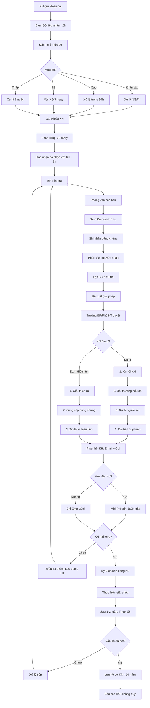

# SOP-07.3: XỬ LÝ KHIẾU NẠI

## 1. THÔNG TIN QUY TRÌNH

| **Thuộc tính** | **Nội dung** |
|---|---|
| Mã SOP | SOP-07.3 |
| Tên quy trình | Xử lý khiếu nại khách hàng |
| Quy trình cha | SOP-07: Phản hồi - Khiếu nại |
| Phiên bản | 1.0 |
| Tần suất | Khi có khiếu nại |

## 2. MỤC ĐÍCH

- **Giải quyết nhanh**: KH hài lòng với cách xử lý
- **Công bằng**: Điều tra đầy đủ, Không thiên vị
- **Ngăn leo thang**: Xử lý kịp thời → Không thành scandal
- **Cải tiến**: Rút kinh nghiệm, Ngăn tái diễn

## 3. PHÂN LOẠI KHIẾU NẠI

### 3.1. Theo mức độ

| **Mức độ** | **Mô tả** | **Ví dụ** | **Thời hạn xử lý** |
|---|---|---|---|
| **Khẩn cấp** | An toàn, Sức khỏe HS | "Con bị thương ở trường", "Ngộ độc thực phẩm" | **Ngay lập tức** |
| **Cao** | Ảnh hưởng lớn, Có thể lan rộng | "GV đánh HS", "Lạm thu" | **24 giờ** |
| **Trung bình** | Quan trọng nhưng không gấp | "Chất lượng dạy không tốt", "CSVC hư" | **3-5 ngày** |
| **Thấp** | Góp ý nhẹ | "Thực đơn đơn điệu" | **7 ngày** |

### 3.2. Theo lĩnh vực

| **Lĩnh vực** | **Người xử lý** |
|---|---|
| Giáo viên | Trưởng BP Học thuật |
| Bếp ăn | Trưởng Bếp + Y tế |
| Xe đưa đón | Trưởng Hành chính |
| Học phí | Trưởng Tài chính |
| Cơ sở vật chất | Trưởng Hành chính |
| An toàn | Phó HT + Ban ISO |

## 4. QUY TRÌNH XỬ LÝ

### 4.1. Tiếp nhận khiếu nại

**Bước 1: Khách hàng gửi khiếu nại**

**Kênh:**
- Email: complaint@[school].edu.vn
- Hotline: 1900-xxxx
- Hộp thư khiếu nại
- Trực tiếp: Gặp BGH

**Bước 2: Ban ISO tiếp nhận (Trong 2 giờ)**

**Bước 3: Đánh giá mức độ**

**Bước 4: Lập Phiếu khiếu nại (QT04-F24)**

| **Mã KN** | **Ngày** | **Người KN** | **Nội dung** | **Lĩnh vực** | **Mức độ** |
|---|---|---|---|---|---|
| KN-2024-001 | 12/11 | PH Lớp 3A | "Con bị bạn bắt nạt" | An toàn | Cao |

**Bước 5: Phân công xử lý**

- Ban ISO chuyển cho BP liên quan
- Thông báo thời hạn xử lý

**Bước 6: Xác nhận đã nhận (Email/Điện thoại - Trong 2 giờ)**

```
Kính gửi Quý phụ huynh,

Chúng tôi đã nhận được khiếu nại của Quý PH về 
"Con bị bạn bắt nạt".

Mã khiếu nại: KN-2024-001
Người xử lý: [GVCN + Phó HT]
Thời hạn: 24 giờ (Do mức độ cao)

Chúng tôi sẽ điều tra và phản hồi cụ thể trong thời gian trên.

Xin lỗi vì sự bất tiện này.

Trân trọng,
Ban ISO - [Tên trường]
Hotline: 1900-xxxx
```

### 4.2. Điều tra

**Bước 7: Người xử lý điều tra**

**Phương pháp:**

| **Phương pháp** | **Khi nào dùng** |
|---|---|
| **Phỏng vấn** | Hỏi các bên liên quan (HS, GV, NV...) |
| **Xem Camera** | Sự việc xảy ra ở khu có camera |
| **Xem hồ sơ** | Kiểm tra giấy tờ, Chứng từ |
| **Khám xét hiện trường** | Sự cố CSVC, Bếp ăn... |
| **Lấy mẫu** | Nghi ngộ độc thực phẩm → Lấy mẫu xét nghiệm |

**Bước 8: Ghi nhận bằng chứng**

- Ảnh, Video
- Biên bản phỏng vấn
- Tài liệu liên quan

**Bước 9: Phân tích nguyên nhân**

- Ai sai?
- Sai ở đâu?
- Tại sao sai?
- Trách nhiệm của ai?

### 4.3. Đưa ra giải pháp

**Bước 10: Lập Báo cáo điều tra (QT04-R16)**

**Nội dung:**
- Tóm tắt khiếu nại
- Quá trình điều tra
- Phát hiện (Sự thật là gì?)
- Nguyên nhân
- **Giải pháp đề xuất**

**Bước 11: Trưởng BP/Phó HT duyệt giải pháp**

**Các loại giải pháp:**

| **Tình huống** | **Giải pháp** |
|---|---|
| **Khiếu nại ĐÚNG** | 1. Xin lỗi KH<br>2. Bồi thường (Nếu có thiệt hại)<br>3. Xử lý người sai<br>4. Cải tiến quy trình |
| **Khiếu nại SAI (Hiểu lầm)** | 1. Giải thích rõ ràng<br>2. Cung cấp bằng chứng<br>3. Xin lỗi vì hiểu lầm |
| **Khiếu nại MƠ HỒ** | 1. Liên hệ KH làm rõ<br>2. Điều tra thêm |

### 4.4. Phản hồi khách hàng

**Bước 12: Phản hồi chính thức (Email + Gọi điện)**

**Nội dung phản hồi:**
- Cảm ơn KH đã phản ánh
- Kết quả điều tra
- Nguyên nhân
- **Giải pháp cụ thể**
- Xin lỗi (Nếu trường sai)
- Cam kết không tái diễn

**Bước 13: Gặp KH trực tiếp (Nếu mức độ cao)**

- Mời PH đến trường
- BGH gặp, Giải thích, Xin lỗi
- Cam kết hành động

**Bước 14: KH ký xác nhận (QT04-F25 - Biên bản đóng khiếu nại)**

| **Kết quả** | **Hành động** |
|---|---|
| KH hài lòng | Đóng KN, Lưu hồ sơ |
| KH chưa hài lòng | Điều tra thêm, Leo thang lên HT |
| KH từ chối giải pháp | Thương lượng, Hoặc chấp nhận bất đồng |

### 4.5. Hành động cải tiến

**Bước 15: Thực hiện giải pháp**

Ví dụ KN "Con bị bắt nạt":

| **Giải pháp** | **Trách nhiệm** | **Thời hạn** |
|---|---|---|
| Xin lỗi PH | GVCN | Ngay |
| Gặp 2 HS, Hòa giải | GVCN | Ngay |
| Kỷ luật HS bắt nạt (Cảnh cáo) | Phó HT | 3 ngày |
| Họp lớp về "Không bạo lực" | GVCN | 1 tuần |
| Sửa SOP: Thêm quy trình xử lý bắt nạt | Ban ISO | 1 tháng |

**Bước 16: Theo dõi (Sau 1-2 tuần)**

- Gọi lại PH: "Tình hình có tốt hơn không?"
- Nếu vẫn có vấn đề → Xử lý tiếp

**Bước 17: Lưu hồ sơ KN (10 năm)**

- Phiếu KN
- BC điều tra
- Biên bản đóng KN
- Bằng chứng

**Bước 18: Báo cáo BGH (Hàng quý - QT04-R17)**

| **Quý** | **Số KN** | **Đã xử lý** | **Đúng hạn** | **KH hài lòng** | **Vấn đề nhiều nhất** |
|---|---|---|---|---|---|
| Q1 | 8 | 8 | 7/8 | 7/8 | Bếp ăn (3 KN) |

## 5. LƯU ĐỒ QUY TRÌNH



## 6. BIỂU MẪU LIÊN QUAN

| **Mã** | **Tên** |
|---|---|
| QT04-F24 | Phiếu khiếu nại |
| QT04-R16 | Báo cáo điều tra khiếu nại |
| QT04-F25 | Biên bản đóng khiếu nại |
| QT04-R17 | Báo cáo khiếu nại quý |

## 7. TIÊU CHUẨN VÀ CHỈ TIÊU

| **Chỉ tiêu** | **Mục tiêu** |
|---|---|
| Xử lý đúng hạn | ≥ 95% |
| KH hài lòng với cách xử lý | ≥ 85% |
| Khiếu nại tái diễn (Cùng vấn đề) | < 5% |

## 8. TRÁCH NHIỆM CỤ THỂ

| **Vai trò** | **Trách nhiệm** |
|---|---|
| **Ban ISO** | Tiếp nhận, Phân loại, Phân công, Theo dõi |
| **BP liên quan** | Điều tra, Lập BC, Đề xuất giải pháp, Thực hiện |
| **Trưởng BP/Phó HT** | Duyệt giải pháp, Gặp KH (Nếu cao) |
| **HT** | Xử lý leo thang |

## 9. LƯU Ý QUAN TRỌNG

- ⚠️ **Xử lý nhanh**: Càng nhanh, KH càng hài lòng
- ✅ **Khách quan**: Điều tra đầy đủ, Không bênh vực NV
- ✅ **Xin lỗi chân thành**: Dù đúng/sai, Xin lỗi vì "làm PH không hài lòng"
- ✅ **Bảo mật**: Không công khai thông tin KH, HS
- 🔥 **Ngăn leo thang**: Xử lý tốt → KH không đưa lên mạng xã hội, Báo chí

## 10. PHỤ LỤC

### 10.1. Các khiếu nại phổ biến và Cách xử lý

**KN 1: "Con bị giáo viên đánh"**

**Điều tra:**
- Phỏng vấn HS
- Xem Camera (Nếu có)
- Phỏng vấn GV, HS khác trong lớp

**Nếu ĐÚNG:**
- Xin lỗi PH ngay
- Kỷ luật GV (Cảnh cáo → Sa thải tùy mức độ)
- Bồi thường (Nếu có thương tích)
- Đào tạo lại GV về "Kỷ luật tích cực"

**Nếu SAI (HS nói dối):**
- Giải thích với PH, Đưa bằng chứng
- Gặp HS, Tìm hiểu lý do nói dối

---

**KN 2: "Thực đơn không đủ dinh dưỡng, Con ốm"**

**Điều tra:**
- Xem thực đơn 1 tháng
- Tham khảo chuyên gia dinh dưỡng
- Xem hồ sơ sức khỏe con PH

**Giải pháp:**
- Cải thiện thực đơn (Thêm rau, Trái cây, Protein)
- Mời chuyên gia tư vấn
- Gửi PH: Thực đơn mới + Giá trị dinh dưỡng

---

**KN 3: "Lạm thu học phí"**

**Điều tra:**
- Xem Quyết định học phí (Đã duyệt Sở?)
- So với cam kết khi tuyển sinh
- Kiểm tra hóa đơn

**Nếu ĐÚNG (Thu sai):**
- Xin lỗi, Hoàn tiền
- Kỷ luật Trưởng TC
- Công khai học phí minh bạch

**Nếu SAI (PH hiểu nhầm):**
- Giải thích chi tiết cơ cấu học phí
- Email bảng kê cho TẤT CẢ PH (Minh bạch)

### 10.2. Mẫu Email phản hồi khiếu nại

**Trường hợp 1: Khiếu nại ĐÚNG**

```
Kính gửi Quý phụ huynh [Tên],

Về khiếu nại KN-2024-001: "Con bị bạn bắt nạt"

Sau khi điều tra, chúng tôi xác nhận sự việc đã xảy ra.

NGUYÊN NHÂN:
- Hai em có mâu thuẫn từ trước
- Em [Tên] đã có hành vi bắt nạt

GIẢI PHÁP:
1. Nhà trường xin lỗi Quý PH và em [Tên con PH]
2. Đã gặp 2 em, Hòa giải, Hai em đã xin lỗi nhau
3. Em [Tên bắt nạt] bị Cảnh cáo kỷ luật, PH em này cũng đã cam kết giám sát
4. GVCN đã họp lớp về "Không bạo lực"
5. Trường sẽ theo dõi sát hai em trong 1 tháng

CAM KẾT:
Nhà trường cam kết không để sự việc tái diễn.

Chúng tôi sẽ gọi lại Quý PH sau 2 tuần để theo dõi tình hình.

Xin lỗi vì sự việc này.

Trân trọng,
[Tên Phó HT]
Phó Hiệu trưởng
```

**Trường hợp 2: Khiếu nại SAI (Hiểu lầm)**

```
Kính gửi Quý phụ huynh [Tên],

Về khiếu nại KN-2024-002: "Lạm thu học phí"

Sau khi kiểm tra, chúng tôi xin giải thích như sau:

THỰC TẾ:
- Học phí tháng 11: 8.000.000 VNĐ
- Bao gồm:
  • Học phí cơ bản: 6.000.000 VNĐ
  • Ăn: 1.500.000 VNĐ
  • Xe đưa đón: 500.000 VNĐ

Quý PH có thể nhầm với học phí "Chỉ học", chưa bao gồm ăn và xe.

Đính kèm: Bảng kê chi tiết + QĐ học phí đã được Sở GD duyệt.

Xin lỗi vì sự hiểu lầm này. 
Nếu còn thắc mắc, Quý PH vui lòng liên hệ Phòng Tài chính: 0xxx-xxx-xxx.

Trân trọng,
Phòng Tài chính
```

## 11. FAQ

**Q1: Nếu PH đe dọa "Đưa lên báo chí"?**  
A: Bình tĩnh, Giải quyết nghiêm túc. Nếu trường sai → Xin lỗi, Sửa. Nếu trường đúng → Giải thích, Cung cấp bằng chứng. Tuyệt đối KHÔNG đe dọa lại PH.

**Q2: Khiếu nại ẩn danh, Không biết PH nào?**  
A: Điều tra vẫn phải làm. Nếu tìm được PH → Liên hệ. Không tìm được → Xử lý vấn đề chung.

**Q3: Khiếu nại vô lý, Phi lý?**  
A: Vẫn phải điều tra, Phản hồi lịch sự. Giải thích tại sao không thể đáp ứng.

---

**PHÊ DUYỆT**

| Ban ISO | Phó HT | HT |
|---|---|---|
| [Họ tên] | [Họ tên] | [Họ tên] |

