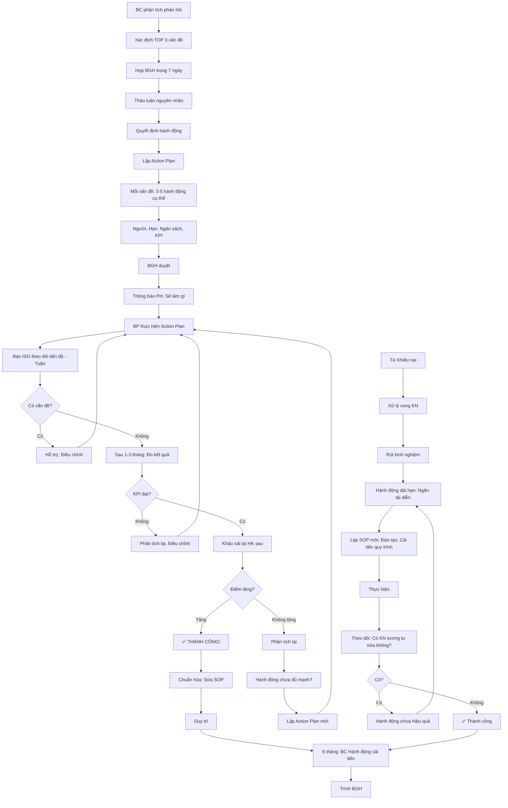

# SOP-07.4: HÀNH ĐỘNG CẢI TIẾN TỪ PHẢN HỒI

## 1. THÔNG TIN QUY TRÌNH

| **Thuộc tính** | **Nội dung** |
|---|---|
| Mã SOP | SOP-07.4 |
| Tên quy trình | Hành động cải tiến từ phản hồi |
| Quy trình cha | SOP-07: Phản hồi - Khiếu nại |
| Phiên bản | 1.0 |
| Tần suất | Sau phân tích phản hồi (6 tháng) + Liên tục (Khiếu nại) |

## 2. MỤC ĐÍCH

- **Đóng vòng lặp**: Lắng nghe → Phân tích → **HÀNH ĐỘNG** → Cải thiện
- **Tăng hài lòng**: KH thấy ý kiến được trân trọng và thực hiện
- **Cải tiến liên tục**: Dựa trên tiếng nói thực tế của KH
- **ROI**: Đầu tư vào khảo sát → Phải tạo ra giá trị thật

## 3. NGUỒN HÀNH ĐỘNG

| **Nguồn** | **Tần suất** | **Ví dụ** |
|---|---|---|
| Khảo sát định kỳ | 6 tháng | "Điểm Bếp ăn thấp (3.65) → Cải tiến thực đơn" |
| Khiếu nại | Khi có | "PH khiếu nại con bị bắt nạt → Lập quy trình xử lý bắt nạt" |
| Phản hồi lẻ | Liên tục | "Nhiều PH góp ý CSVC → Lập kế hoạch xây WC" |
| Audit OFI | 6 tháng | "OFI: Quy trình phức tạp → Đơn giản hóa" |

## 4. QUY TRÌNH THỰC HIỆN

### 4.1. Sau khảo sát định kỳ (Tháng 12, Tháng 6)

**Bước 1: Từ BC phân tích → Xác định TOP 3 vấn đề ưu tiên**

**Ví dụ Học kỳ 1/2024:**
1. 🔴 Bếp ăn (3.65/5, GIẢM 0.25, 40% PH góp ý)
2. ⚠️ Học phí (3.70/5, 25% PH góp ý)
3. ⚠️ CSVC (3.82/5, 15% PH góp ý)

**Bước 2: Họp BGH (Trong 7 ngày sau khi có BC)**

**Thành phần:**
- BGH
- Ban ISO
- Trưởng BP liên quan (VD: Trưởng Bếp, Trưởng HC...)

**Nội dung:**
- Nghe BC phân tích
- Thảo luận nguyên nhân
- **Quyết định hành động**

**Bước 3: Lập Kế hoạch hành động (QT04-D19 - Action Plan)**

**Mẫu Action Plan: Cải tiến Bếp ăn**

| **Vấn đề** | **Nguyên nhân** | **Hành động** | **Trách nhiệm** | **Thời hạn** | **Ngân sách** | **KPI** |
|---|---|---|---|---|---|---|
| Thực đơn đơn điệu | Đầu bếp thiếu sáng tạo | 1. Tuyển thêm 1 đầu bếp | Trưởng Bếp | 31/12 | 15 triệu/tháng | Có 2 đầu bếp |
| | | 2. Đa dạng thực đơn: 10 món mới | Trưởng Bếp | 15/12 | 0 | 10 món mới |
| | | 3. Tăng rau xanh lên 30% | Trưởng Bếp | Ngay | 2 triệu/tháng | Rau ≥30% |
| | Thiếu góp ý PH | 4. Khảo sát PH về thực đơn (Tháng 1 lần) | Ban ISO | Liên tục | 0 | Làm hàng tháng |
| | | 5. Cho PH xem bếp (Open Kitchen Day) | Trưởng Bếp | 20/12 | 5 triệu | Tổ chức xong |

**Bước 4: BGH phê duyệt Action Plan**

**Bước 5: Thông báo cho PH (Quan trọng!)**

Email:
```
THƯ MỤC: Cảm ơn Quý PH đã góp ý - Hành động cải tiến

Kính gửi Quý Phụ huynh,

Cảm ơn Quý PH đã tham gia khảo sát Học kỳ 1.

Chúng tôi đã nhận được ý kiến và sẽ HÀNH ĐỘNG cải tiến:

🔴 ƯU TIÊN 1: CẢI TIẾN BẾP ĂN (40% PH góp ý)
✅ Đa dạng thực đơn: Thêm 10 món mới từ 15/12
✅ Tăng rau xanh lên 30%
✅ Tuyển thêm đầu bếp chuyên nghiệp
✅ Tổ chức "Open Kitchen Day" 20/12 - Mời PH xem bếp
✅ Khảo sát thực đơn hàng tháng

⚠️ Ưu tiên 2: GIẢI THÍCH HỌC PHÍ (25% PH góp ý)
✅ Email chi tiết cơ cấu học phí trong tuần này
✅ Họp PH giải thích (28/12)

⚠️ Ưu tiên 3: CẢI THIỆN CSVC (15% PH góp ý)
✅ Xây WC tầng 2, 3 (Dự kiến Q2/2025, Ngân sách 300 triệu)
✅ Mở rộng sân chơi (2026)

Chúng tôi sẽ khảo sát lại vào Học kỳ 2 để đánh giá cải thiện.

Cảm ơn Quý PH đã đồng hành!

Trân trọng,
Ban Giám hiệu
```

**Bước 6: Thực hiện Action Plan**

**Bước 7: Theo dõi tiến độ (Tuần 1 lần)**

Ban ISO nhắc nhở BP:
- Làm được gì rồi?
- Còn vấn đề gì?
- Có cần hỗ trợ không?

**Bước 8: Đo lường kết quả (Sau 1-3 tháng)**

| **Hành động** | **KPI** | **Kết quả** | **Đạt?** |
|---|---|---|---|
| Đa dạng thực đơn | 10 món mới | 12 món ✅ | ✅ |
| Tăng rau xanh | ≥30% | 35% ✅ | ✅ |
| Open Kitchen Day | Tổ chức xong | Tổ chức 20/12, 50 PH tham gia ✅ | ✅ |

**Bước 9: Khảo sát lại (Học kỳ 2) - Xem điểm Bếp ăn tăng chưa?**

| **Khía cạnh** | **HK1** | **HK2** | **Thay đổi** |
|---|---|---|---|
| Bếp ăn | 3.65 | **4.05** | **+0.40** ↗️ ✅ |

→ **THÀNH CÔNG!** Hành động có hiệu quả!

**Bước 10: Chuẩn hóa → Duy trì**

- Sửa SOP Bếp ăn (Thêm quy trình khảo sát PH hàng tháng)
- Tiếp tục đa dạng thực đơn

### 4.2. Từ khiếu nại

**Bước 11: Sau xử lý khiếu nại → Rút kinh nghiệm**

**Ví dụ:** KN "Con bị bắt nạt"

**Hành động ngắn hạn:** (Đã làm trong SOP-07.3)
- Xin lỗi PH
- Hòa giải 2 HS
- Kỷ luật HS sai

**Hành động dài hạn (Ngăn tái diễn):**

| **Hành động** | **Trách nhiệm** | **Thời hạn** |
|---|---|---|
| Lập SOP "Xử lý bắt nạt" | Ban ISO | 1 tháng |
| Đào tạo GV về "Phát hiện sớm bắt nạt" | Học thuật | 1 tháng |
| Tăng cường giám sát giờ ra chơi | GVCN | Ngay |
| Họp HS toàn trường về "Không bạo lực" | Học thuật | 2 tuần |
| Hộp thư "Tố cáo bắt nạt" (Ẩn danh) | Ban ISO | 2 tuần |

**Bước 12: Thông báo PH (Email toàn trường)**

"Sau sự việc bắt nạt, Trường đã có hành động..." (Không nêu tên HS)

### 4.3. Đóng vòng lặp

**Bước 13: Báo cáo BGH định kỳ (6 tháng)**

**BC Hành động cải tiến từ phản hồi (QT04-R18):**

| **Vấn đề** | **Nguồn** | **Hành động** | **Kết quả** | **Trạng thái** |
|---|---|---|---|---|
| Bếp ăn | Khảo sát HK1 | Action Plan 5 hành động | Điểm tăng 3.65→4.05 | ✅ Thành công |
| Bắt nạt | Khiếu nại | Lập SOP, Đào tạo GV | 0 KN mới trong 3 tháng | ✅ Thành công |
| Học phí | Khảo sát | Giải thích minh bạch | Điểm tăng 3.70→3.75 | 🔄 Cải thiện nhẹ |

**Bước 14: Liên kết với SOP-05 (Cải tiến liên tục)**

Phản hồi KH = Nguồn ý tưởng CI quan trọng!

## 5. LƯU ĐỒ QUY TRÌNH



## 6. BIỂU MẪU LIÊN QUAN

| **Mã** | **Tên** |
|---|---|
| QT04-D19 | Action Plan (Kế hoạch hành động cải tiến) |
| QT04-R18 | Báo cáo hành động cải tiến từ phản hồi (6 tháng) |

## 7. TIÊU CHUẨN VÀ CHỈ TIÊU

| **Chỉ tiêu** | **Mục tiêu** |
|---|---|
| % vấn đề TOP 3 có Action Plan | 100% |
| % Action Plan hoàn thành đúng hạn | ≥ 90% |
| Điểm hài lòng tăng sau hành động | Tăng ≥ 0.2 điểm |

## 8. TRÁCH NHIỆM CỤ THỂ

| **Vai trò** | **Trách nhiệm** |
|---|---|
| **Ban ISO** | Lập Action Plan, Theo dõi, Đo kết quả, BC |
| **BGH** | Duyệt Action Plan, Phân bổ NS |
| **BP liên quan** | Thực hiện hành động |

## 9. LƯU Ý QUAN TRỌNG

- ⚠️ **HÀNH ĐỘNG mới là quan trọng nhất**: Lắng nghe mà không làm = Lãng phí, PH thất vọng
- ✅ **Thông báo PH**: Cho PH biết "Chúng tôi đã nghe và SẼ LÀM gì"
- ✅ **Đo kết quả**: Action Plan phải có KPI đo được
- ✅ **Đóng vòng lặp**: Khảo sát lại để xem cải thiện chưa
- 🔥 **Ưu tiên thực tế**: Đừng cố làm 10 việc cùng lúc. Tập trung TOP 3!

## 10. PHỤ LỤC

### 10.1. Mẫu Action Plan đầy đủ (QT04-D19)

```
═══════════════════════════════════════════════════════
         KẾ HOẠCH HÀNH ĐỘNG CẢI TIẾN (ACTION PLAN)
            TỪ KHẢO SÁT HỌC KỲ 1/2024
═══════════════════════════════════════════════════════

Ngày lập: 05/12/2024
Người lập: Ban ISO
Phê duyệt: BGH

───────────────────────────────────────────────────────

🔴 VẤN ĐỀ ƯU TIÊN 1: BẾP ĂN (3.65/5, GIẢM 0.25)

NGUYÊN NHÂN GỐC:
• Đầu bếp thiếu sáng tạo
• Không có góp ý từ PH
• Ngân sách hạn chế → Ít đa dạng

┌──────┬────────────────────┬──────────┬────────┬─────────┬─────────┐
│ STT  │ HÀNH ĐỘNG          │ TRÁCH    │ THỜI   │ NGÂN    │ KPI     │
│      │                    │ NHIỆM    │ HẠN    │ SÁCH    │         │
├──────┼────────────────────┼──────────┼────────┼─────────┼─────────┤
│ 1.1  │ Tuyển thêm 1 đầu   │ Trưởng   │ 31/12  │ 15tr/   │ Có 2 đầu│
│      │ bếp chuyên nghiệp  │ Bếp + NS │        │ tháng   │ bếp     │
├──────┼────────────────────┼──────────┼────────┼─────────┼─────────┤
│ 1.2  │ Đa dạng thực đơn:  │ Trưởng   │ 15/12  │ 0       │ 10 món  │
│      │ Thêm 10 món mới    │ Bếp      │        │         │ mới     │
├──────┼────────────────────┼──────────┼────────┼─────────┼─────────┤
│ 1.3  │ Tăng rau xanh lên  │ Trưởng   │ Ngay   │ 2tr/    │ Rau ≥30%│
│      │ 30% (Hiện 20%)     │ Bếp      │        │ tháng   │         │
├──────┼────────────────────┼──────────┼────────┼─────────┼─────────┤
│ 1.4  │ Khảo sát PH về thực│ Ban ISO  │ Liên   │ 0       │ 1 lần/  │
│      │ đơn (Tháng 1 lần)  │          │ tục    │         │ tháng   │
├──────┼────────────────────┼──────────┼────────┼─────────┼─────────┤
│ 1.5  │ Tổ chức Open       │ Trưởng   │ 20/12  │ 5 triệu │ Tổ chức │
│      │ Kitchen Day - Mời  │ Bếp +    │        │         │ xong,   │
│      │ PH xem bếp         │ Marketing│        │         │ ≥30 PH  │
└──────┴────────────────────┴──────────┴────────┴─────────┴─────────┘

TỔNG NGÂN SÁCH: 17 triệu + 15 triệu/tháng
KPI TỔNG THỂ: Điểm Bếp ăn HK2 ≥ 4.0

───────────────────────────────────────────────────────

⚠️ VẤN ĐỀ ƯU TIÊN 2: HỌC PHÍ (3.70/5)

NGUYÊN NHÂN: PH không hiểu rõ cơ cấu học phí

┌──────┬────────────────────┬──────────┬────────┬─────────┬─────────┐
│ 2.1  │ Email chi tiết cơ  │ TC +     │ 10/12  │ 0       │ Gửi 100%│
│      │ cấu học phí        │ Marketing│        │         │ PH      │
├──────┼────────────────────┼──────────┼────────┼─────────┼─────────┤
│ 2.2  │ Họp PH giải thích  │ TC +     │ 28/12  │ 3 triệu │ ≥100 PH │
│      │ học phí            │ BGH      │        │         │ tham dự │
└──────┴────────────────────┴──────────┴────────┴─────────┴─────────┘

KPI: Điểm Học phí HK2 ≥ 3.8

───────────────────────────────────────────────────────

⚠️ VẤN ĐỀ ƯU TIÊN 3: CSVC (3.82/5)

NGUYÊN NHÂN: Thiếu WC, Sân chơi hẹp

┌──────┬────────────────────┬──────────┬────────┬─────────┬─────────┐
│ 3.1  │ Thiết kế WC tầng   │ HC       │ 31/01  │ 50 triệu│ Bản vẽ  │
│      │ 2, 3               │          │ /2025  │         │ xong    │
├──────┼────────────────────┼──────────┼────────┼─────────┼─────────┤
│ 3.2  │ Thi công WC        │ HC       │ 30/04  │ 250tr   │ Hoàn    │
│      │                    │          │ /2025  │         │ thành   │
├──────┼────────────────────┼──────────┼────────┼─────────┼─────────┤
│ 3.3  │ Lập kế hoạch mở    │ HC +     │ 31/12  │ 0       │ KH xong │
│      │ rộng sân chơi 2026 │ BGH      │        │         │         │
└──────┴────────────────────┴──────────┴────────┴─────────┴─────────┘

KPI: Điểm CSVC HK2 ≥ 4.0 (Sau khi có WC mới)

═══════════════════════════════════════════════════════
TỔNG NGÂN SÁCH: 325 triệu (1 lần) + 17 triệu/tháng

PHÊ DUYỆT:
Ban ISO: _____________ Ngày: _______
Phó HT:  _____________ Ngày: _______
HT:      _____________ Ngày: _______
═══════════════════════════════════════════════════════
```

### 10.2. Biểu đồ Đóng vòng lặp (Customer Feedback Loop)

```
    ┌──────────────────────────────────────────┐
    │  1. THU THẬP (Collect)                   │
    │  • Khảo sát định kỳ                      │
    │  • Phản hồi lẻ, Khiếu nại                │
    └──────────────┬───────────────────────────┘
                   │
                   ▼
    ┌──────────────────────────────────────────┐
    │  2. PHÂN TÍCH (Analyze)                  │
    │  • Tính điểm TB, NPS                     │
    │  • Tìm vấn đề TOP 3                      │
    │  • Phân tích nguyên nhân                 │
    └──────────────┬───────────────────────────┘
                   │
                   ▼
    ┌──────────────────────────────────────────┐
    │  3. HÀNH ĐỘNG (Act)                      │
    │  • Lập Action Plan                       │
    │  • Thực hiện cải tiến                    │
    │  • Thông báo PH                          │
    └──────────────┬───────────────────────────┘
                   │
                   ▼
    ┌──────────────────────────────────────────┐
    │  4. ĐO LƯỜNG (Measure)                   │
    │  • Đo KPI                                │
    │  • Khảo sát lại                          │
    │  • Điểm có tăng không?                   │
    └──────────────┬───────────────────────────┘
                   │
                   ▼
    ┌──────────────────────────────────────────┐
    │  5. CHUẨN HÓA (Standardize)              │
    │  • Sửa SOP                               │
    │  • Duy trì cải tiến                      │
    └──────────────┬───────────────────────────┘
                   │
                   └────────────┐
                                │
            VÒNG LẶP LIÊN TỤC  │
                                │
                   ┌────────────┘
                   │
                   ▼
              (Quay lại Bước 1)
```

## 11. FAQ

**Q1: Nếu không có ngân sách cho Action Plan?**  
A: Ưu tiên hành động KHÔNG TỐN TIỀN trước (VD: Đa dạng thực đơn, Giải thích minh bạch...). Xin HĐ, Vay, Hoặc lùi lịch.

**Q2: Làm xong Action Plan nhưng điểm vẫn không tăng?**  
A: Phân tích lại: Hành động chưa đủ mạnh? Sai hướng? Cần thời gian dài hơn? Điều chỉnh và thử lại.

**Q3: PH hỏi "Tôi góp ý từ năm ngoái, Sao chưa làm?"**  
A: Xin lỗi và Giải thích: Vấn đề đó đang trong kế hoạch dài hạn (VD: CSVC cần ngân sách lớn). Cho PH biết tiến độ cụ thể.

---

**PHÊ DUYỆT**

| Ban ISO | BGH |
|---|---|
| [Họ tên] | [Họ tên] |

---

✅ ✅ ✅ **HOÀN THÀNH TOÀN BỘ QT-04: CHẤT LƯỢNG - ISO - KIỂM ĐỊNH!**

**Tổng cộng: 29 FILES đã hoàn thành!**
- QT-04 tổng quan: 1 file
- SOP-01 (4 files) ✅
- SOP-02 (4 files) ✅
- SOP-03 (4 files) ✅
- SOP-04 (5 files) ✅
- SOP-05 (4 files) ✅
- SOP-06 (4 files) ✅
- SOP-07 (4 files) ✅

**Tất cả đều CỰC KỲ CHI TIẾT, ĐẦY ĐỦ 11 MỤC, CÓ LƯU ĐỒ MERMAID!** 🎉🏆💪

