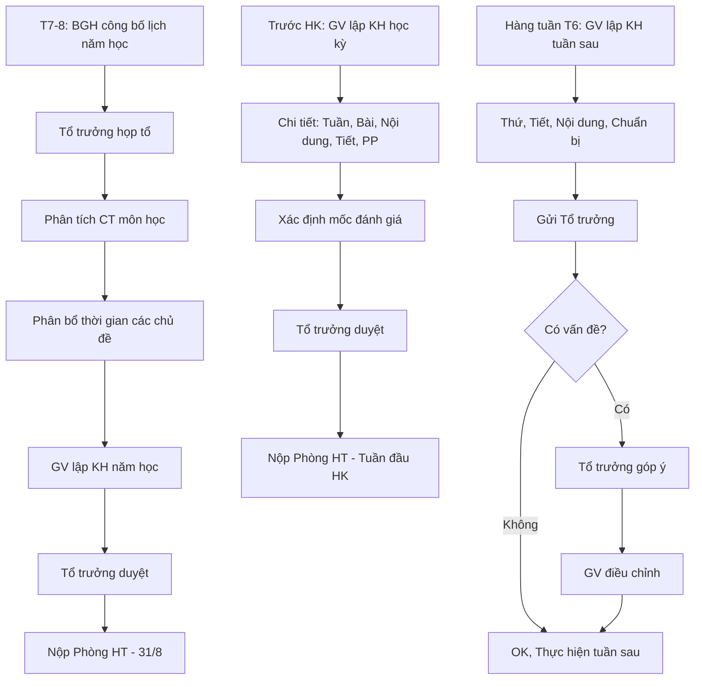

# SOP-01.1: LẬP KẾ HOẠCH DẠY HỌC

## 1. THÔNG TIN QUY TRÌNH

| **Thuộc tính** | **Nội dung** |
|---|---|
| Mã SOP | SOP-01.1 |
| Tên quy trình | Lập kế hoạch dạy học |
| Quy trình cha | SOP-01: Thiết kế giáo án |
| Phiên bản | 1.0 |
| Tần suất | Năm học: 1 lần, Học kỳ: 2 lần, Tuần: Liên tục |

## 2. MỤC ĐÍCH

- **Có lộ trình rõ ràng**: GV biết dạy gì, Khi nào, Như thế nào
- **Phân bổ thời gian hợp lý**: Đủ thời gian cho từng chủ đề, Không vội vã
- **Chuẩn bị kỹ càng**: Có thời gian chuẩn bị giáo án, Học liệu
- **Phối hợp đồng bộ**: Tổ bộ môn cùng tiến độ, Dễ hỗ trợ lẫn nhau

## 3. PHẠM VI ÁP DỤNG

Tất cả giáo viên (GV chủ nhiệm + GV bộ môn)

## 4. CẤU TRÚC KẾ HOẠCH

### 4.1. 3 cấp độ kế hoạch

```
KẾ HOẠCH NĂM HỌC (Macro)
    ↓
KẾ HOẠCH HỌC KỲ (Meso)
    ↓
KẾ HOẠCH TUẦN (Micro)
```

| **Cấp độ** | **Thời gian** | **Chi tiết** | **Người làm** |
|---|---|---|---|
| **Năm học** | 36 tuần | Tổng quan: Các chủ đề lớn, Số tiết | Tổ trưởng + GV |
| **Học kỳ** | 18 tuần | Chi tiết hơn: Từng bài, Tuần dạy | GV |
| **Tuần** | 1 tuần | Cụ thể nhất: Từng tiết, Nội dung, PP | GV |

## 5. QUY TRÌNH LẬP KẾ HOẠCH

### 5.1. Kế hoạch năm học (Tháng 7-8)

**Bước 1: BGH công bố lịch năm học**

- Ngày khai giảng, Nghỉ lễ, Nghỉ hè
- Số tuần thực học: ~36 tuần
- Kỳ thi: Giữa HK, Cuối HK

**Bước 2: Tổ trưởng bộ môn họp tổ**

**Nội dung họp:**
- Phân tích Chương trình môn học (BGD ban hành)
- Phân bổ thời gian cho từng chủ đề

**Ví dụ Toán lớp 3 (140 tiết/năm):**

| **Chủ đề** | **Số tiết** | **Tuần** |
|---|---|---|
| Số học (Phép cộng, trừ, nhân, chia trong phạm vi 1000) | 60 | T1-T15 |
| Hình học (Hình vuông, Hình chữ nhật, Chu vi, Diện tích) | 30 | T16-T23 |
| Đo lường (Đơn vị đo, Đổi đơn vị) | 20 | T24-T28 |
| Giải toán có lời văn | 20 | T29-T33 |
| Ôn tập, Kiểm tra | 10 | T34-T36 |

**Bước 3: GV lập Kế hoạch năm học môn dạy (QT05-D01)**

**Bước 4: Tổ trưởng duyệt**

**Bước 5: Nộp Phòng Học thuật (Trước 31/8)**

### 5.2. Kế hoạch học kỳ (Trước đầu HK)

**Bước 6: GV chi tiết hóa kế hoạch HK (QT05-D02)**

**Nội dung:**

| **Tuần** | **Bài** | **Nội dung** | **Số tiết** | **Mục tiêu** | **PP chính** | **Đánh giá** |
|---|---|---|---|---|---|---|
| T1 | Bài 1 | Số 100 | 2 | HS biết đọc, viết số 100 | Trực quan, Thực hành | Bài tập |
| T2 | Bài 2 | Phép cộng 2 chữ số | 3 | HS thực hiện phép cộng | Luyện tập | Kiểm tra miệng |

**Bước 7: Xác định các mốc đánh giá**

- Kiểm tra giữa HK: Tuần nào?
- Kiểm tra cuối HK: Tuần nào?
- Kiểm tra thường xuyên: Bài nào?

**Bước 8: Tổ trưởng duyệt, Nộp Phòng HT (Trước tuần đầu HK)**

### 5.3. Kế hoạch tuần (Hàng tuần)

**Bước 9: Cuối tuần trước - GV lập KH tuần sau (QT05-D03)**

**Format đơn giản:**

```
KẾ HOẠCH TUẦN 5 (01/10 - 05/10/2024)
Môn: Toán | Lớp: 3A | GV: Nguyễn Văn A

┌──────┬──────┬─────────────────────┬────────────────┐
│ Thứ  │ Tiết │ Nội dung            │ Chuẩn bị       │
├──────┼──────┼─────────────────────┼────────────────┤
│ T2   │ 1-2  │ Bài 10: Phép nhân   │ Bảng nhân,     │
│      │      │ số có 2 chữ số      │ Flashcard      │
├──────┼──────┼─────────────────────┼────────────────┤
│ T3   │ 3    │ Luyện tập           │ Worksheet      │
├──────┼──────┼─────────────────────┼────────────────┤
│ T5   │ 4-5  │ Bài 11: Chia có dư  │ Đồ dùng chia   │
├──────┼──────┼─────────────────────┼────────────────┤
│ T6   │ 6    │ Kiểm tra 15 phút    │ Đề kiểm tra    │
└──────┴──────┴─────────────────────┴────────────────┘

Ghi chú:
- T3: Mượn phòng máy
- T6: In đề kiểm tra (20 bản)
```

**Bước 10: Gửi Tổ trưởng (Thứ 6 hàng tuần)**

**Bước 11: Tổ trưởng phản hồi nếu có vấn đề**

## 6. LƯU ĐỒ QUY TRÌNH



## 7. BIỂU MẪU LIÊN QUAN

| **Mã** | **Tên** |
|---|---|
| QT05-D01 | Kế hoạch dạy học năm |
| QT05-D02 | Kế hoạch dạy học học kỳ |
| QT05-D03 | Kế hoạch dạy học tuần |

## 8. TIÊU CHUẨN VÀ CHỈ TIÊU

| **Chỉ tiêu** | **Mục tiêu** |
|---|---|
| 100% GV có KH năm, HK | 100% |
| KH tuần nộp đúng hạn (T6) | ≥ 95% |
| Thực hiện đúng KH (Sai lệch ≤ 1 tuần) | ≥ 90% |

## 9. TRÁCH NHIỆM CỤ THỂ

| **Vai trò** | **Trách nhiệm** |
|---|---|
| **BGH** | Công bố lịch năm học |
| **Tổ trưởng** | Họp tổ, Hướng dẫn, Duyệt KH |
| **GV** | Lập KH năm, HK, Tuần |
| **Phòng Học thuật** | Thu thập, Lưu trữ KH |

## 10. LƯU Ý QUAN TRỌNG

- ⚠️ **Kế hoạch là hướng dẫn, Không phải "xiết chặt"**: Có thể điều chỉnh nhẹ nếu cần
- ✅ **Dự phòng thời gian**: Có thể có sự kiện bất ngờ (Nghỉ bão, Dịch...)
- ✅ **Linh hoạt nhưng có kỷ luật**: Điều chỉnh OK, Nhưng không được chậm quá 2 tuần
- 🔥 **Không có KH = Dạy "Thả nổi"**: Rất nguy hiểm!

## 11. PHỤ LỤC

### 11.1. Mẫu Kế hoạch năm học (QT05-D01)

```
═════════════════════════════════════════════════════
      KẾ HOẠCH DẠY HỌC NĂM HỌC 2024-2025
═════════════════════════════════════════════════════

Môn: TOÁN                    Lớp: 3A
Giáo viên: Nguyễn Văn A      Tổ: Toán Tiểu học

I. THÔNG TIN CHUNG:
• Tổng số tuần: 36 tuần
• Tổng số tiết: 140 tiết (4 tiết/tuần)
• Kiểm tra giữa HK1: Tuần 9
• Kiểm tra cuối HK1: Tuần 18
• Kiểm tra giữa HK2: Tuần 27
• Kiểm tra cuối HK2: Tuần 36

II. PHÂN BỔ NỘI DUNG:

┌──────┬─────────────────────┬───────┬──────────────┐
│ Tuần │ Chủ đề              │ Tiết  │ Ghi chú      │
├──────┼─────────────────────┼───────┼──────────────┤
│ 1-15 │ SỐ HỌC              │ 60    │              │
│      │ • Số trong phạm vi  │       │              │
│      │   1000              │       │              │
│      │ • Phép cộng, trừ    │       │              │
│      │ • Phép nhân, chia   │       │              │
├──────┼─────────────────────┼───────┼──────────────┤
│ 16-23│ HÌNH HỌC            │ 30    │ Cần đồ dùng  │
│      │ • Hình vuông        │       │ hình học     │
│      │ • Chu vi, Diện tích │       │              │
├──────┼─────────────────────┼───────┼──────────────┤
│ 24-28│ ĐO LƯỜNG            │ 20    │              │
├──────┼─────────────────────┼───────┼──────────────┤
│ 29-33│ GIẢI TOÁN           │ 20    │              │
├──────┼─────────────────────┼───────┼──────────────┤
│ 34-36│ ÔN TẬP, KIỂM TRA    │ 10    │              │
└──────┴─────────────────────┴───────┴──────────────┘

III. MỤC TIÊU NĂM:
• HS nắm vững 4 phép tính trong phạm vi 1000
• HS biết tính chu vi, diện tích hình cơ bản
• HS giải được toán có lời văn 2-3 bước
• Tỷ lệ HS đạt loại Khá-Giỏi: ≥ 80%

═════════════════════════════════════════════════════
Người lập: ___________ Ngày: _______
Tổ trưởng: ___________ Ngày: _______
═════════════════════════════════════════════════════
```

### 11.2. Nguyên tắc phân bổ thời gian

| **Nguyên tắc** | **Giải thích** |
|---|---|
| **80-20** | 80% dạy mới, 20% ôn tập/kiểm tra |
| **Khó → Nhiều thời gian** | Chủ đề khó (VD: Phép chia) cần nhiều tiết hơn |
| **Dự phòng 10%** | Luôn dự phòng 3-4 tuần cho bất ngờ |
| **Cân đối** | Không dồn quá nhiều vào 1 HK |

### 11.3. Checklist lập kế hoạch

**TRƯỚC KHI NỘP:**
- [ ] Đã tham khảo CT BGD?
- [ ] Tổng số tiết = Số tiết quy định?
- [ ] Đã phân bổ đều các chủ đề?
- [ ] Đã xác định mốc kiểm tra?
- [ ] Có dự phòng thời gian?
- [ ] Tổ trưởng đã xem qua?

## 12. FAQ

**Q1: Nếu thực tế chậm hơn kế hoạch 2 tuần?**  
A: Họp tổ, Điều chỉnh KH: Rút ngắn một số phần, Hoặc bỏ phần không quan trọng. Báo Phòng HT.

**Q2: Có cần làm lại KH nếu đổi GV giữa chừng?**  
A: GV mới tiếp tục KH của GV cũ. Có thể điều chỉnh nhẹ nếu cần.

**Q3: Kế hoạch tuần có bắt buộc không?**  
A: Có! Để Tổ trưởng nắm tiến độ, Hỗ trợ kịp thời.

---

**PHÊ DUYỆT**

| GV | Tổ trưởng | Trưởng BP HT |
|---|---|---|
| [Họ tên] | [Họ tên] | [Họ tên] |
