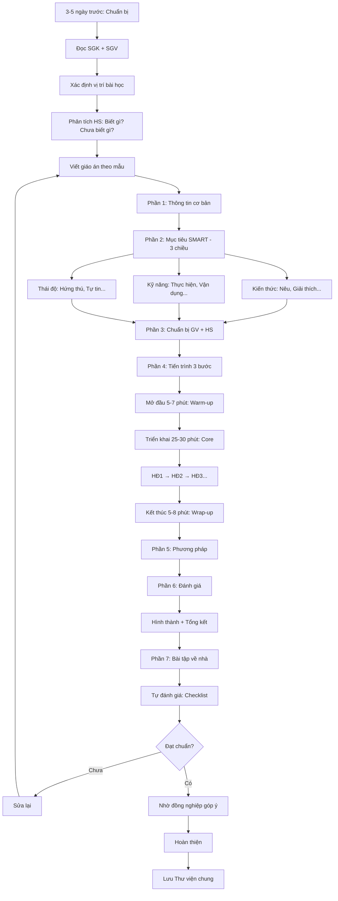

# SOP-01.2: THIẾT KẾ NỘI DUNG BÀI HỌC

## 1. THÔNG TIN QUY TRÌNH

| **Thuộc tính** | **Nội dung** |
|---|---|
| Mã SOP | SOP-01.2 |
| Tên quy trình | Thiết kế nội dung bài học |
| Quy trình cha | SOP-01: Thiết kế giáo án |
| Phiên bản | 1.0 |
| Tần suất | Trước mỗi bài (Trước 3-5 ngày) |

## 2. MỤC ĐÍCH

- **Bài học có cấu trúc**: Mục tiêu rõ, Nội dung logic, PP phù hợp
- **Lấy HS làm trung tâm**: Thiết kế để HS chủ động, Tích cực
- **Đạt mục tiêu**: Sau bài học, HS biết/làm được gì
- **Dễ chia sẻ**: GV khác có thể dạy theo giáo án này

## 3. CẤU TRÚC GIÁO ÁN CHUẨN

### 3.1. 7 thành phần bắt buộc

| **Thành phần** | **Nội dung** | **Quan trọng** |
|---|---|---|
| 1. Thông tin cơ bản | Môn, Lớp, Bài, Thời gian, GV | ⭐ |
| 2. Mục tiêu bài học | Kiến thức, Kỹ năng, Thái độ (3 chiều) | ⭐⭐⭐ |
| 3. Chuẩn bị | Học liệu, Đồ dùng, Công nghệ | ⭐⭐ |
| 4. Tiến trình dạy học | Hoạt động từng phần (Mở đầu, Triển khai, Kết thúc) | ⭐⭐⭐ |
| 5. Phương pháp | PP chính (Thuyết trình, Thảo luận nhóm, PBL...) | ⭐⭐ |
| 6. Đánh giá | Cách đánh giá HS đạt mục tiêu chưa | ⭐⭐⭐ |
| 7. Bài tập về nhà | (Nếu có) | ⭐ |

## 4. QUY TRÌNH THIẾT KẾ

### 4.1. Chuẩn bị (1-2 ngày trước)

**Bước 1: Đọc kỹ Sách giáo khoa (SGK) + Sách giáo viên (SGV)**

**Bước 2: Xác định vị trí bài học**

- Bài này nằm trong chủ đề gì?
- Liên hệ với bài trước/sau thế nào?

**Bước 3: Phân tích HS**

| **Câu hỏi** | **Tại sao quan trọng** |
|---|---|
| HS đã biết gì? | Để không dạy lại |
| HS chưa biết gì? | Đây là trọng tâm |
| Khó khăn của HS? | Để chuẩn bị hỗ trợ |
| HS thích học thế nào? | Chọn PP phù hợp |

### 4.2. Viết giáo án (Theo mẫu QT05-F01)

**Bước 4: Phần 1 - Thông tin cơ bản**

```
═══════════════════════════════════════════════════
         GIÁO ÁN [TÊN MÔN]
═══════════════════════════════════════════════════

Bài:   [Tên bài]
Lớp:   [X]A/B/C
Ngày:  [DD/MM/YYYY]
Tiết:  [Số tiết]
GV:    [Họ tên]
```

**Bước 5: Phần 2 - Mục tiêu (Quan trọng nhất!)**

**Viết theo công thức SMART:**
- **S**pecific: Cụ thể
- **M**easurable: Đo được
- **A**chievable: Đạt được
- **R**elevant: Liên quan
- **T**ime-bound: Có thời hạn (40 phút)

**3 chiều mục tiêu:**

| **Chiều** | **Mô tả** | **Động từ dùng** | **Ví dụ** |
|---|---|---|---|
| **Kiến thức** | HS biết, Hiểu | Nêu, Giải thích, Phân tích, So sánh | "HS nêu được khái niệm phép nhân" |
| **Kỹ năng** | HS làm được | Thực hiện, Vận dụng, Giải quyết | "HS thực hiện được phép nhân 2 chữ số" |
| **Thái độ** | HS cảm nhận | Hứng thú, Tự tin, Tích cực | "HS hứng thú học Toán qua trò chơi" |

**❌ Sai:**
"Giúp HS hiểu phép nhân" (Mơ hồ, Không đo được)

**✅ Đúng:**
"Sau bài học, HS:
- Nêu được khái niệm phép nhân (K)
- Thực hiện đúng phép nhân 2 số có 1 chữ số (S)
- Tự tin giải 8/10 bài tập (T)"

**Bước 6: Phần 3 - Chuẩn bị**

**GV chuẩn bị:**
- Giáo cụ: Bảng nhân, Flashcard, Que tính...
- Công nghệ: Slide, Video, Kahoot...
- Tài liệu: Worksheet, Đề kiểm tra...

**HS chuẩn bị:**
- Ôn bài cũ: Phép cộng (Tiền đề cho phép nhân)
- Dụng cụ: Vở, Bút, Thước...

**Bước 7: Phần 4 - Tiến trình dạy học**

**Cấu trúc 3 phần:**

**A. MỞ ĐẦU (5-7 phút) - WARM-UP**

Mục đích: Thu hút sự chú ý, Kích thích tò mò

| **Hoạt động** | **Ví dụ** |
|---|---|
| Câu hỏi mở | "Các em thích ăn kẹo không? Nếu mỗi em 3 viên, 5 em có bao nhiêu viên?" |
| Trò chơi | "Đoán số" |
| Video | Clip hoạt hình về phép nhân |
| Câu chuyện | Kể chuyện liên quan |

**B. TRIỂN KHAI (25-30 phút) - CORE**

Phần quan trọng nhất! Chia thành các hoạt động nhỏ:

**Ví dụ Toán lớp 2 - Bài "Phép nhân":**

| **Hoạt động** | **Thời gian** | **Nội dung** | **PP** |
|---|---|---|---|
| HĐ1: Nhận biết | 7 phút | GV cho HS đếm nhóm: 3+3+3+3 = 12<br>→ Giới thiệu: 4 nhóm 3 = 4 × 3 = 12 | Trực quan |
| HĐ2: Thực hành | 10 phút | HS làm bài tập cùng nhau (Nhóm 4)<br>Đổi phép cộng → phép nhân | Nhóm |
| HĐ3: Củng cố | 8 phút | Chơi game Kahoot: Trắc nghiệm nhanh | Công nghệ |
| HĐ4: Vận dụng | 5 phút | Giải bài toán có lời văn | Cá nhân |

**Nguyên tắc:**
- Từ dễ → Khó
- Từ cụ thể → Trừu tượng
- GV nói ít, HS làm nhiều (70% HS hoạt động, 30% GV hướng dẫn)

**C. KẾT THÚC (5-8 phút) - WRAP-UP**

| **Hoạt động** | **Mục đích** |
|---|---|
| Tóm tắt | GV hoặc HS nhắc lại kiến thức chính |
| Đánh giá nhanh | Exit ticket: 2-3 câu hỏi nhanh |
| Giao bài tập | Về nhà làm gì |
| Dặn dò | Chuẩn bị bài sau |

**Bước 8: Phần 5 - Phương pháp**

Liệt kê PP chính dùng trong bài:

| **PP** | **Khi nào dùng** |
|---|---|
| Thuyết trình | Giới thiệu khái niệm mới |
| Thảo luận nhóm | Giải quyết vấn đề |
| Trò chơi | Củng cố, Tạo hứng thú |
| Thực hành | Luyện kỹ năng |

**Bước 9: Phần 6 - Đánh giá**

| **Loại đánh giá** | **Cách thức** | **Khi nào** |
|---|---|---|
| **Đánh giá hình thành** | Quan sát HS làm bài, Trả lời câu hỏi | Trong giờ |
| **Đánh giá tổng kết** | Exit ticket: Bài tập ngắn cuối giờ | Cuối giờ |

**Tiêu chí đánh giá:**
- HS trả lời đúng ≥ 8/10 câu → Đạt mục tiêu
- HS tham gia tích cực → Thái độ tốt

**Bước 10: Phần 7 - Bài tập về nhà (Nếu có)**

Ví dụ: "SGK trang 25 bài 1, 2, 3"

### 4.3. Hoàn thiện

**Bước 11: Tự đánh giá giáo án**

Checklist (QT05-CL02):
- [ ] Mục tiêu SMART?
- [ ] Có đủ 3 chiều (K-S-T)?
- [ ] Tiến trình logic?
- [ ] Thời gian hợp lý?
- [ ] PP phù hợp với HS?
- [ ] Có đánh giá?

**Bước 12: Nhờ đồng nghiệp góp ý (Nếu có thời gian)**

**Bước 13: Lưu giáo án vào Thư viện chung**

## 5. LƯU ĐỒ QUY TRÌNH



## 6. BIỂU MẪU LIÊN QUAN

| **Mã** | **Tên** |
|---|---|
| QT05-F01 | Mẫu giáo án chuẩn |
| QT05-CL02 | Checklist đánh giá giáo án |

## 7. TIÊU CHUẨN VÀ CHỈ TIÊU

| **Chỉ tiêu** | **Mục tiêu** |
|---|---|
| Giáo án có đủ 7 thành phần | 100% |
| Mục tiêu SMART, 3 chiều | 100% |
| Giáo án sẵn sàng trước 3 ngày | ≥ 90% |

## 8. TRÁCH NHIỆM

| **Vai trò** | **Trách nhiệm** |
|---|---|
| **GV** | Viết giáo án, Tự đánh giá |
| **Tổ trưởng** | Hướng dẫn GV mới, Kiểm tra mẫu |

## 9. LƯU Ý QUAN TRỌNG

- ⚠️ **Mục tiêu là "Tim" của giáo án**: Sai mục tiêu = Sai cả bài
- ✅ **Lấy HS làm trung tâm**: Hỏi "HS làm gì" chứ không "GV làm gì"
- ✅ **Thời gian thực tế**: 40 phút bay rất nhanh, Đừng tham nhiều!
- 🔥 **Giáo án tốt ≠ Giờ dạy tốt**: Giáo án chỉ là bản đồ, Thực tế còn phụ thuộc kỹ năng GV!

## 10. PHỤ LỤC

### 10.1. Mẫu Giáo án đầy đủ (QT05-F01)

*(Xem file đính kèm - Giáo án mẫu Toán lớp 2 "Phép nhân")*

### 10.2. Động từ hành động theo Bloom's Taxonomy

| **Cấp độ** | **Động từ** | **Ví dụ** |
|---|---|---|
| **Nhớ** | Nêu, Liệt kê, Nhận biết | "HS nêu được 3 dấu hiệu của..." |
| **Hiểu** | Giải thích, Mô tả, So sánh | "HS giải thích được tại sao..." |
| **Vận dụng** | Thực hiện, Giải quyết, Sử dụng | "HS giải được bài toán..." |
| **Phân tích** | Phân tích, Phân biệt, Tách ra | "HS phân tích được cấu trúc..." |
| **Đánh giá** | Đánh giá, Phê bình, Bảo vệ | "HS đánh giá được..." |
| **Sáng tạo** | Tạo ra, Thiết kế, Xây dựng | "HS tạo được sản phẩm mới..." |

## 11. FAQ

**Q1: Giáo án có cần dài không?**  
A: KHÔNG! Đủ nội dung, Rõ ràng là đủ. 3-5 trang A4 là hợp lý.

**Q2: Có thể dùng giáo án của người khác?**  
A: Tham khảo OK, Nhưng phải điều chỉnh cho phù hợp lớp mình. KHÔNG copy 100%!

**Q3: Nếu giờ dạy không theo được giáo án?**  
A: Bình thường! Linh hoạt điều chỉnh. Sau đó ghi chú vào giáo án "Thực tế khác: ..."

---

**PHÊ DUYỆT**

| GV | Tổ trưởng |
|---|---|
| [Họ tên] | [Họ tên] |
