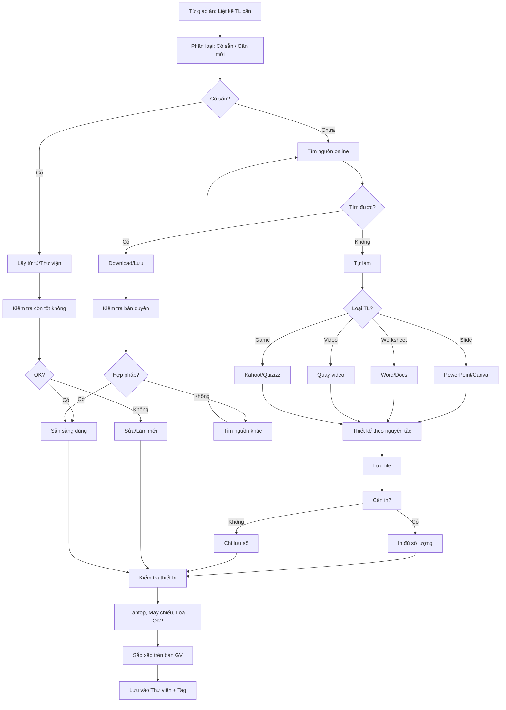

# SOP-01.3: CHUẨN BỊ TÀI LIỆU GIẢNG DẠY

## 1. THÔNG TIN QUY TRÌNH

| **Thuộc tính** | **Nội dung** |
|---|---|
| Mã SOP | SOP-01.3 |
| Tên quy trình | Chuẩn bị tài liệu giảng dạy |
| Quy trình cha | SOP-01: Thiết kế giáo án |
| Phiên bản | 1.0 |
| Tần suất | Trước mỗi tiết (1-2 ngày) |

## 2. MỤC ĐÍCH

- **Đủ công cụ dạy**: GV không thiếu tài liệu, Đồ dùng khi lên lớp
- **Tiết kiệm thời gian**: Chuẩn bị trước → Không mất thời gian tìm kiếm
- **Nâng cao chất lượng**: Học liệu đẹp, Sinh động → HS học tốt hơn
- **Tái sử dụng**: Lưu trữ để dùng lại năm sau

## 3. PHÂN LOẠI TÀI LIỆU GIẢNG DẠY

### 3.1. Theo hình thức

| **Loại** | **Ví dụ** | **Ưu điểm** | **Nhược điểm** |
|---|---|---|---|
| **Vật lý (Cứng)** | Flashcard, Mô hình, Đồ dùng thí nghiệm | Trực quan, HS sờ được | Tốn không gian, Dễ hư |
| **Số (Mềm)** | Slide, Video, Game online | Dễ lưu trữ, Chia sẻ | Cần thiết bị |

### 3.2. Theo chức năng

| **Loại** | **Chức năng** | **Ví dụ** |
|---|---|---|
| **Giáo cụ** | Minh họa khái niệm | Bảng nhân, Quả địa cầu, Mô hình xương người |
| **Phương tiện công nghệ** | Trình chiếu, Tương tác | Laptop, Máy chiếu, Tablet, App |
| **Tài liệu in** | Phát cho HS | Worksheet, Handout, Đề kiểm tra |
| **Tài liệu tham khảo** | GV đọc thêm | Sách chuyên khảo, Bài báo |

## 4. QUY TRÌNH CHUẨN BỊ

### 4.1. Xác định nhu cầu (Từ giáo án)

**Bước 1: Đọc lại giáo án → Liệt kê tài liệu cần**

**Ví dụ Toán lớp 2 "Phép nhân":**

| **Hoạt động trong GA** | **Tài liệu cần** |
|---|---|
| Mở đầu: Video về phép nhân | Video 3 phút (Tìm YouTube hoặc Tự làm) |
| HĐ1: Nhận biết phép nhân | Bảng nhân (Treo tường), Flashcard |
| HĐ2: Thực hành nhóm | Worksheet (In 30 bản - 30 HS) |
| HĐ3: Game Kahoot | Link Kahoot (Chuẩn bị trước) |
| Đánh giá: Exit ticket | Exit ticket (In 30 bản) |

**Bước 2: Phân loại: Có sẵn / Cần làm mới**

| **Tài liệu** | **Có sẵn?** | **Hành động** |
|---|---|---|
| Bảng nhân | ✅ Có | Lấy từ tủ |
| Flashcard | ✅ Có (Năm ngoái) | Kiểm tra còn đẹp không |
| Video | ❌ Chưa | Tìm hoặc Tự quay |
| Worksheet | ❌ Chưa | Thiết kế + In |
| Kahoot | ❌ Chưa | Tạo mới |

### 4.2. Tạo/Tìm tài liệu số

**A. Tìm tài liệu có sẵn**

**Bước 3: Tìm từ các nguồn**

| **Nguồn** | **Loại tài liệu** | **Link** |
|---|---|---|
| **Thư viện số trường** | Tài liệu nội bộ | [Link nội bộ] |
| **YouTube** | Video giảng dạy | youtube.com |
| **Teachers Pay Teachers** | Worksheet, Games | teacherspayteachers.com |
| **Canva** | Template Slide, Poster | canva.com |
| **Kahoot, Quizizz** | Game tương tác | kahoot.com, quizizz.com |
| **Google Images** | Hình ảnh | images.google.com |

**Lưu ý bản quyền:** Chỉ dùng tài liệu miễn phí hoặc Có giấy phép!

**B. Tự tạo tài liệu**

**Bước 4: Nếu không tìm được → Tự làm**

**4.1. Tạo Slide (PowerPoint/Canva):**

**Nguyên tắc thiết kế:**
- **Font chữ lớn**: ≥ 24pt (HS ngồi cuối cũng thấy)
- **Màu sắc tương phản**: Chữ đen nền trắng, Hoặc Chữ trắng nền xanh đậm
- **Ít chữ**: Tối đa 5 dòng/slide
- **Nhiều hình ảnh**: 1 hình = 1000 chữ
- **Animation nhẹ nhàng**: Đừng lạm dụng hiệu ứng

**Cấu trúc Slide chuẩn:**
```
Slide 1: Tiêu đề bài học + Hình đẹp
Slide 2: Mục tiêu (HS biết được gì sau bài)
Slide 3-10: Nội dung (Mỗi khái niệm 1 slide)
Slide 11: Bài tập thực hành
Slide 12: Tóm tắt + Bài tập về nhà
```

**4.2. Tạo Worksheet (Word/Google Docs):**

**Cấu trúc:**
- Header: Logo trường, Tên bài, Họ tên HS, Lớp
- Hướng dẫn rõ ràng
- Bài tập từ dễ → Khó
- Chỗ trống đủ để HS viết
- Đáp án (Riêng cho GV)

**4.3. Quay Video:**

**Công cụ:**
- Điện thoại (iPhone, Android) + Giá đỡ
- Hoặc: Loom, Camtasia (Quay màn hình)

**Yêu cầu:**
- Âm thanh rõ ràng
- Ánh sáng đủ
- Thời lượng: 3-7 phút (Đừng dài!)
- Có phụ đề (Nếu có thể)

**4.4. Tạo Game Kahoot:**

- Vào kahoot.com
- Create → Quiz
- Thêm 10-15 câu hỏi (Trắc nghiệm)
- Mỗi câu có hình ảnh
- Lưu và Lấy PIN code

### 4.3. Chuẩn bị tài liệu vật lý

**Bước 5: In ấn**

| **Loại** | **Số lượng** | **Giấy** | **Nơi in** |
|---|---|---|
| Worksheet | 30 bản (Số HS) | A4 trắng | Phòng in |
| Exit ticket | 30 bản | A4 màu | Phòng in |
| Flashcard | 10 bộ (Nhóm) | A4 cứng | Phòng in |

**Bước 6: Chuẩn bị đồ dùng**

- Lấy từ Tủ đồ dùng tổ
- Hoặc Mượn từ tổ khác
- Hoặc Đề xuất mua mới (Nếu cần thiết)

**Bước 7: Kiểm tra thiết bị công nghệ**

| **Thiết bị** | **Kiểm tra** |
|---|---|
| Laptop | Pin đủ? Đã copy file vào? |
| Máy chiếu | Hoạt động? Kết nối được? |
| Loa | Âm thanh OK? |
| Wifi | Kết nối được? (Nếu cần online) |

**Mẹo:** Luôn có **Plan B**! Máy chiếu hỏng → Dùng TV trong lớp. Wifi mất → In Slide ra giấy.

### 4.4. Tổ chức và Lưu trữ

**Bước 8: Sắp xếp theo thứ tự dùng**

**Trên bàn GV (Trước giờ dạy 10 phút):**
```
Từ trái → phải:
[Giáo án] [Slide USB] [Worksheet] [Exit ticket] [Bút dạ]
```

**Bước 9: Lưu tài liệu số vào Thư viện**

**Cấu trúc thư mục:**
```
\\Thu_vien\Mon_Toan\Lop_2\
  ├─ Bai_01_Phep_nhan\
  │  ├─ Giao_an.docx
  │  ├─ Slide.pptx
  │  ├─ Video.mp4
  │  ├─ Worksheet.pdf
  │  └─ Exit_ticket.pdf
  └─ Bai_02_...
```

**Đặt tên file chuẩn:**
`[Lop]_[Mon]_[Bai]_[Loai].[Đuôi]`

VD: `Lop2_Toan_Phep_nhan_Worksheet.pdf`

**Bước 10: Tag (Gắn thẻ) để dễ tìm**

Tags: `#Toán`, `#Lớp2`, `#Phepnhan`, `#Worksheet`

## 5. LƯU ĐỒ QUY TRÌNH



## 6. BIỂU MẪU LIÊN QUAN

| **Mã** | **Tên** |
|---|---|
| QT05-F08 | Danh sách tài liệu cần chuẩn bị |
| QT05-F09 | Đề xuất mua đồ dùng giảng dạy |

## 7. TIÊU CHUẨN VÀ CHỈ TIÊU

| **Chỉ tiêu** | **Mục tiêu** |
|---|---|
| Tài liệu sẵn sàng trước giờ dạy | 100% |
| Tài liệu được lưu Thư viện | ≥ 80% |
| Tái sử dụng tài liệu năm trước | ≥ 60% |

## 8. TRÁCH NHIỆM CỤ THỂ

| **Vai trò** | **Trách nhiệm** |
|---|---|
| **GV** | Chuẩn bị TL, Tự làm, Lưu trữ |
| **Phòng in** | In ấn kịp thời |
| **IT** | Hỗ trợ thiết bị, Thư viện số |

## 9. LƯU Ý QUAN TRỌNG

- ⚠️ **Chuẩn bị trước 1-2 ngày**: Đừng để phút chót!
- ✅ **Luôn có Plan B**: Công nghệ có thể hỏng!
- ✅ **Tuân thủ bản quyền**: Không dùng tài liệu lậu!
- 🔥 **Lưu để tái sử dụng**: Năm sau không phải làm lại!

## 10. PHỤ LỤC

### 10.1. Checklist chuẩn bị (QT05-CL03)

**1 NGÀY TRƯỚC:**
- [ ] Đã tìm/tạo xong tất cả TL số?
- [ ] Đã gửi in (Nếu cần)?
- [ ] Đã lưu file vào USB/Laptop?

**SÁNG NGÀY DẠY:**
- [ ] Lấy TL in từ Phòng in?
- [ ] Kiểm tra Laptop, Máy chiếu?
- [ ] Sắp xếp TL trên bàn GV?
- [ ] Test Wifi (Nếu dùng online)?

### 10.2. Công cụ hỗ trợ

| **Công cụ** | **Mục đích** | **Link** |
|---|---|---|
| **Canva** | Thiết kế Slide, Poster đẹp | canva.com |
| **Flaticon** | Tải icon miễn phí | flaticon.com |
| **Unsplash** | Ảnh đẹp, Không bản quyền | unsplash.com |
| **Loom** | Quay video màn hình | loom.com |
| **Kahoot** | Tạo game quiz | kahoot.com |
| **Wordwall** | Tạo trò chơi tương tác | wordwall.net |

### 10.3. Nguyên tắc thiết kế Slide

**✅ NÊN:**
- Font lớn (≥24pt)
- Màu tương phản
- 1 ý chính/slide
- Nhiều hình, Ít chữ
- Animation nhẹ nhàng

**❌ KHÔNG NÊN:**
- Font nhỏ (<18pt)
- Màu chói, Khó đọc
- Quá nhiều chữ
- Quá nhiều animation
- Background ảnh rối, Đọc không rõ chữ

## 11. FAQ

**Q1: Nếu máy chiếu hỏng đột xuất?**  
A: Plan B: Dùng TV trong lớp, Hoặc In slide ra giấy (A3), Hoặc Vẽ lên bảng.

**Q2: Có bắt buộc phải dùng Slide không?**  
A: KHÔNG! Slide chỉ là công cụ. Dạy tốt mà không cần Slide vẫn OK!

**Q3: Tài liệu của năm ngoái có dùng được không?**  
A: Được! Nhưng xem lại, Sửa nếu cần. Đừng dùng tài liệu cũ quá 3 năm (Lỗi thời).

---

**PHÊ DUYỆT**

| GV | Tổ trưởng |
|---|---|
| [Họ tên] | [Họ tên] |
