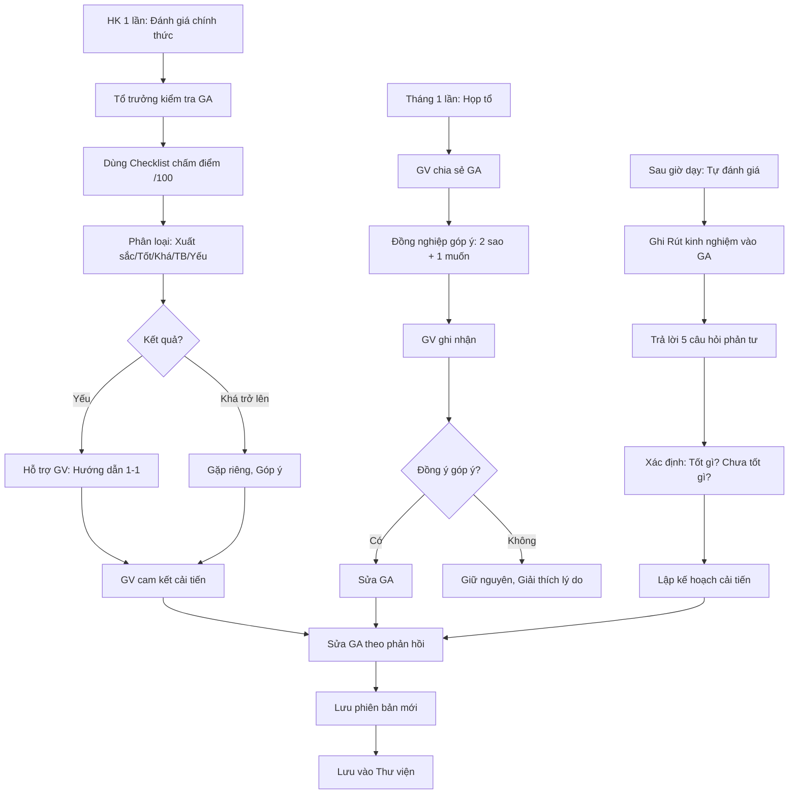

# SOP-01.4: ĐÁNH GIÁ VÀ CẢI TIẾN GIÁO ÁN

## 1. THÔNG TIN QUY TRÌNH

| **Thuộc tính** | **Nội dung** |
|---|---|
| Mã SOP | SOP-01.4 |
| Tên quy trình | Đánh giá và cải tiến giáo án |
| Quy trình cha | SOP-01: Thiết kế giáo án |
| Phiên bản | 1.0 |
| Tần suất | Sau mỗi tiết dạy + Định kỳ (Tháng) |

## 2. MỤC ĐÍCH

- **Cải tiến liên tục**: Giáo án ngày càng tốt hơn
- **Rút kinh nghiệm**: Học từ thành công và thất bại
- **Chia sẻ kiến thức**: GV học hỏi lẫn nhau
- **Nâng cao năng lực**: GV tự phản tư, Phát triển chuyên môn

## 3. 3 CẤP ĐỘ ĐÁNH GIÁ

| **Cấp độ** | **Người đánh giá** | **Tần suất** | **Mục đích** |
|---|---|---|---|
| **Tự đánh giá** | Chính GV | Sau mỗi tiết | Phản tư cá nhân |
| **Đánh giá đồng nghiệp** | GV khác trong tổ | 1 lần/tháng | Góp ý, Học hỏi |
| **Đánh giá chính thức** | Tổ trưởng, BGH | 1 lần/HK | Đánh giá chuyên môn |

## 4. QUY TRÌNH THỰC HIỆN

### 4.1. Tự đánh giá (Sau mỗi tiết - 10 phút)

**Bước 1: Ngay sau giờ dạy - GV ghi chú vào giáo án**

**Phần "Rút kinh nghiệm" (Thêm vào cuối giáo án):**

```
═══════════════════════════════════════════════════
  RÚT KINH NGHIỆM SAU BÀI DẠY

Ngày dạy: [DD/MM/YYYY]

1. ĐIỂM TỐT (Keep):
   • ___________________________________________
   • ___________________________________________

2. ĐIỂM CHƯA TỐT (Problems):
   • ___________________________________________
   • ___________________________________________

3. NGUYÊN NHÂN:
   • ___________________________________________

4. CẢI TIẾN LẦN SAU (Plans):
   • ___________________________________________
   • ___________________________________________

5. THỜI GIAN THỰC TẾ:
   • Mở đầu: ___ phút (KH: 5 phút)
   • Triển khai: ___ phút (KH: 30 phút)
   • Kết thúc: ___ phút (KH: 5 phút)

6. HS ĐẠT MỤC TIÊU:
   • Ước tính: ___% HS đạt
   • Căn cứ: Exit ticket, Quan sát
═══════════════════════════════════════════════════
```

**Bước 2: Tự trả lời 5 câu hỏi phản tư**

| **Câu hỏi** | **Mục đích** |
|---|---|
| 1. Mục tiêu đã đạt chưa? | Kiểm tra hiệu quả |
| 2. HS có hứng thú không? | Đánh giá engagement |
| 3. Phần nào HS khó hiểu nhất? | Tìm điểm yếu |
| 4. Thời gian có vừa không? | Điều chỉnh tiến độ |
| 5. Lần sau làm gì khác? | Lập kế hoạch cải tiến |

**Ví dụ tự đánh giá:**

```
1. ĐIỂM TỐT:
   • HS rất thích game Kahoot, Tham gia tích cực
   • Video mở đầu thu hút được sự chú ý

2. ĐIỂM CHƯA TỐT:
   • Hoạt động nhóm mất nhiều thời gian (15 phút thay vì 10)
   • Một số HS yếu không theo kịp

3. NGUYÊN NHÂN:
   • Hướng dẫn hoạt động nhóm chưa rõ, HS loay hoay
   • Nhóm có 5 HS, Quá đông, Không tập trung

4. CẢI TIẾN LẦN SAU:
   • Giảm nhóm xuống 4 HS
   • Làm demo 1 lần trước khi chia nhóm
   • Hỗ trợ riêng HS yếu (Cho bài dễ hơn)

5. THỜI GIAN THỰC TẾ:
   • Mở đầu: 7 phút (Dài hơn KH 2 phút - OK)
   • Triển khai: 32 phút (Dài hơn 2 phút)
   • Kết thúc: 1 phút (Thiếu! Không kịp tóm tắt)

6. HS ĐẠT MỤC TIÊU:
   • ~75% HS đạt (Exit ticket: 22/30 HS trả lời đúng ≥8/10 câu)
   • 8 HS chưa đạt → Cần hỗ trợ thêm
```

### 4.2. Đánh giá đồng nghiệp (1 lần/tháng)

**Bước 3: GV tự nguyện chia sẻ giáo án trong họp tổ**

**Bước 4: Đồng nghiệp đọc và Góp ý**

**Phương pháp: "2 sao + 1 muốn"**

| **Phần** | **Nội dung** |
|---|---|
| ⭐ Sao 1 | Điểm mạnh thứ nhất |
| ⭐ Sao 2 | Điểm mạnh thứ hai |
| 💡 1 Muốn | Gợi ý cải tiến (Không phải chỉ trích!) |

**Ví dụ:**
```
⭐ Sao 1: "Mục tiêu bài học rất rõ ràng, SMART!"
⭐ Sao 2: "Video mở đầu rất hay, Em thích!"
💡 1 Muốn: "Em muốn thấy thêm 1-2 câu hỏi mở trong phần Triển khai 
          để kích thích tư duy HS hơn."
```

**Bước 5: GV ghi nhận góp ý, Cảm ơn**

**Bước 6: Sửa giáo án theo góp ý (Nếu đồng ý)**

### 4.3. Đánh giá chính thức (1 lần/HK)

**Bước 7: Tổ trưởng/BGH kiểm tra giáo án**

**Cách kiểm tra:**
- **Ngẫu nhiên**: Chọn 3-5 giáo án của GV
- **Hoặc Theo kế hoạch**: Thông báo trước

**Bước 8: Dùng Checklist đánh giá (QT05-CL02)**

**Tiêu chí đánh giá:**

| **Tiêu chí** | **Điểm tối đa** | **Ghi chú** |
|---|---|---|
| **1. Đầy đủ 7 thành phần** | 10 | Thiếu 1 phần: -2 điểm |
| **2. Mục tiêu SMART, 3 chiều** | 15 | Quan trọng nhất! |
| **3. Tiến trình logic** | 15 | Mở đầu → Triển khai → Kết thúc |
| **4. Phương pháp phù hợp** | 10 | Phù hợp với HS, Nội dung |
| **5. Thời gian hợp lý** | 10 | Tổng = 40 phút |
| **6. Có đánh giá** | 10 | Cách đánh giá rõ ràng |
| **7. Chuẩn bị tài liệu** | 10 | Liệt kê đủ |
| **8. Rút kinh nghiệm** | 10 | Có ghi sau khi dạy |
| **9. Trình bày** | 5 | Rõ ràng, Dễ đọc |
| **10. Sáng tạo** | 5 | Có điểm mới, Hay |
| **TỔNG** | **100** | |

**Phân loại:**
- **90-100**: Xuất sắc
- **80-89**: Tốt
- **70-79**: Khá
- **60-69**: Trung bình
- **< 60**: Yếu (Cần hỗ trợ)

**Bước 9: Tổ trưởng phản hồi cho GV**

- Gặp riêng GV
- Chỉ ra điểm mạnh + Điểm cần cải thiện
- Hỗ trợ nếu GV yếu

**Bước 10: GV cam kết cải tiến (Nếu cần)**

### 4.4. Cải tiến giáo án

**Bước 11: Sau khi nhận phản hồi - GV sửa giáo án**

**Bước 12: Lưu phiên bản mới**

Đặt tên: `Giao_an_Phep_nhan_v2.docx` (Tăng số version)

**Bước 13: Lưu vào Thư viện (Ghi đè bản cũ)**

## 5. LƯU ĐỒ QUY TRÌNH



## 6. BIỂU MẪU LIÊN QUAN

| **Mã** | **Tên** |
|---|---|
| QT05-CL02 | Checklist đánh giá giáo án |
| QT05-F10 | Form phản hồi giáo án (Đồng nghiệp) |

## 7. TIÊU CHUẨN VÀ CHỈ TIÊU

| **Chỉ tiêu** | **Mục tiêu** |
|---|---|
| GV tự đánh giá sau tiết | 100% |
| GV chia sẻ GA trong tổ | ≥ 50% GV/tháng |
| Điểm GA trung bình | ≥ 80/100 |
| GA được cải tiến sau phản hồi | ≥ 80% |

## 8. TRÁCH NHIỆM CỤ THỂ

| **Vai trò** | **Trách nhiệm** |
|---|---|
| **GV** | Tự đánh giá, Chia sẻ, Cải tiến |
| **Tổ trưởng** | Tổ chức họp, Đánh giá chính thức, Hỗ trợ GV yếu |

## 9. LƯU Ý QUAN TRỌNG

- ⚠️ **Đánh giá để CẢI TIẾN, Không phải TÌM LỖI**: Tạo không khí an toàn, Khuyến khích chia sẻ
- ✅ **Phản hồi xây dựng**: Luôn có gợi ý cụ thể, Không chỉ nói "Không tốt"
- ✅ **Học từ người khác**: GV giỏi chia sẻ → GV yếu học hỏi
- 🔥 **Cải tiến liên tục**: Giáo án không bao giờ "Hoàn hảo", Luôn có cái để cải thiện!

## 10. PHỤ LỤC

### 10.1. Checklist đánh giá giáo án chi tiết (QT05-CL02)

```
═══════════════════════════════════════════════════
     CHECKLIST ĐÁNH GIÁ GIÁO ÁN
═══════════════════════════════════════════════════

GV: _____________  Môn: _______  Bài: _____________
Người đánh giá: _____________  Ngày: _____________

┌──────────────────────────────────┬────────┬───────┐
│ TIÊU CHÍ                         │ Điểm   │ Ghi   │
│                                  │ tối đa │ chú   │
├──────────────────────────────────┼────────┼───────┤
│ 1. ĐẦY ĐỦ 7 THÀNH PHẦN (10đ)    │        │       │
│    □ Thông tin cơ bản            │ 1      │       │
│    □ Mục tiêu                    │ 2      │       │
│    □ Chuẩn bị                    │ 1      │       │
│    □ Tiến trình                  │ 3      │       │
│    □ Phương pháp                 │ 1      │       │
│    □ Đánh giá                    │ 1      │       │
│    □ Bài tập về nhà              │ 1      │       │
├──────────────────────────────────┼────────┼───────┤
│ 2. MỤC TIÊU (15đ)                │        │       │
│    □ Cụ thể, Đo được (SMART)     │ 5      │       │
│    □ Có 3 chiều (K-S-T)          │ 5      │       │
│    □ Phù hợp với HS              │ 3      │       │
│    □ Đạt được trong 40 phút      │ 2      │       │
├──────────────────────────────────┼────────┼───────┤
│ 3. TIẾN TRÌNH (15đ)              │        │       │
│    □ Logic: Mở đầu→Triển khai→KT │ 5      │       │
│    □ Hoạt động đa dạng           │ 3      │       │
│    □ Lấy HS làm trung tâm        │ 4      │       │
│    □ Có tương tác                │ 3      │       │
├──────────────────────────────────┼────────┼───────┤
│ 4. PHƯƠNG PHÁP (10đ)             │        │       │
│    □ Phù hợp với HS              │ 5      │       │
│    □ Phù hợp với nội dung        │ 5      │       │
├──────────────────────────────────┼────────┼───────┤
│ 5. THỜI GIAN (10đ)               │        │       │
│    □ Phân bổ hợp lý              │ 5      │       │
│    □ Tổng = 40 phút              │ 5      │       │
├──────────────────────────────────┼────────┼───────┤
│ 6. ĐÁNH GIÁ (10đ)                │        │       │
│    □ Có cách đánh giá cụ thể     │ 5      │       │
│    □ Đánh giá cả 3 chiều         │ 5      │       │
├──────────────────────────────────┼────────┼───────┤
│ 7. CHUẨN BỊ (10đ)                │        │       │
│    □ Liệt kê đầy đủ TL           │ 5      │       │
│    □ TL phù hợp                  │ 5      │       │
├──────────────────────────────────┼────────┼───────┤
│ 8. RÚT KINH NGHIỆM (10đ)         │        │       │
│    □ Có ghi sau khi dạy          │ 5      │       │
│    □ Có kế hoạch cải tiến        │ 5      │       │
├──────────────────────────────────┼────────┼───────┤
│ 9. TRÌNH BÀY (5đ)                │        │       │
│    □ Rõ ràng, Dễ đọc             │ 5      │       │
├──────────────────────────────────┼────────┼───────┤
│ 10. SÁNG TẠO (5đ)                │        │       │
│    □ Có điểm mới, Độc đáo        │ 5      │       │
├──────────────────────────────────┼────────┼───────┤
│ TỔNG ĐIỂM                        │  /100  │       │
└──────────────────────────────────┴────────┴───────┘

PHÂN LOẠI:
□ Xuất sắc (90-100)  □ Tốt (80-89)  □ Khá (70-79)
□ Trung bình (60-69) □ Yếu (<60)

ĐIỂM MẠNH:
___________________________________________________
___________________________________________________

ĐIỂM CẦN CẢI THIỆN:
___________________________________________________
___________________________________________________

GỢI Ý CẢI TIẾN:
___________________________________________________
___________________________________________________

Người đánh giá ký: _______________ Ngày: _______
GV nhận xét ký: __________________ Ngày: _______
═══════════════════════════════════════════════════
```

## 11. FAQ

**Q1: Tự đánh giá có bắt buộc không?**  
A: Có! Đây là thói quen tốt giúp GV phát triển.

**Q2: Nếu đồng nghiệp góp ý sai?**  
A: Lắng nghe lịch sự, Giải thích quan điểm mình. Không bắt buộc phải làm theo 100%.

**Q3: Điểm GA có ảnh hưởng lương không?**  
A: Là 1 phần trong đánh giá cuối năm. Không quyết định trực tiếp lương hàng tháng.

---

**PHÊ DUYỆT**

| Tổ trưởng | Trưởng BP HT |
|---|---|
| [Họ tên] | [Họ tên] |
