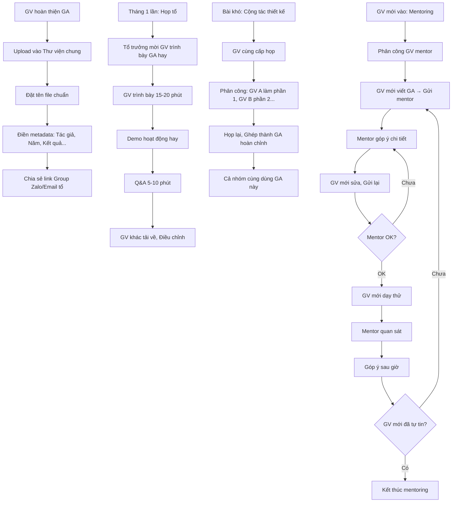

# SOP-01.5: CHIA SẺ VÀ CỘNG TÁC GIÁO ÁN

## 1. THÔNG TIN QUY TRÌNH

| **Thuộc tính** | **Nội dung** |
|---|---|
| Mã SOP | SOP-01.5 |
| Tên quy trình | Chia sẻ và cộng tác giáo án |
| Quy trình cha | SOP-01: Thiết kế giáo án |
| Phiên bản | 1.0 |
| Tần suất | Liên tục |

## 2. MỤC ĐÍCH

- **Tiết kiệm thời gian**: Không phải làm lại từ đầu
- **Học hỏi lẫn nhau**: GV giỏi chia sẻ → GV khác học
- **Đồng đều chất lượng**: Tất cả lớp cùng cấp đều được dạy tốt
- **Xây dựng văn hóa chia sẻ**: Không "Giấu nghề"

## 3. HÌNH THỨC CHIA SẺ

| **Hình thức** | **Mô tả** | **Khi nào** |
|---|---|---|
| **Thư viện chung** | Lưu GA online, Ai cũng truy cập được | Liên tục |
| **Họp tổ** | GV trình bày GA hay | 1 lần/tháng |
| **Lesson Study** | Cùng thiết kế, Quan sát, Cải tiến | 1 lần/HK |
| **Mentoring** | GV giỏi hướng dẫn GV mới | Khi có GV mới |

## 4. QUY TRÌNH CHIA SẺ

### 4.1. Lưu vào Thư viện chung

**Bước 1: Sau khi hoàn thiện GA - GV upload**

**Đường dẫn:**
```
\\Thu_vien\Giao_an\
  ├─ Man_non\
  ├─ Tieu_hoc\
  │  ├─ Toan\
  │  │  ├─ Lop_1\
  │  │  ├─ Lop_2\
  │  │  │  ├─ Bai_01_So_100.docx
  │  │  │  ├─ Bai_02_Phep_cong.docx
  │  │  │  └─ ...
  │  │  └─ Lop_3-5...
  │  ├─ Tieng_Viet\
  │  └─ Khac...
  └─ THCS\
```

**Bước 2: Đặt tên file chuẩn**

Format: `[Cap]_[Mon]_[Lop]_[Bai]_[Tac_gia]_[Nam].docx`

VD: `TH_Toan_L2_Phep_nhan_NguyenVanA_2024.docx`

**Bước 3: Điền metadata (Thông tin GA)**

Trong file Word, Thêm phần đầu:
```
════════════════════════════════════════════
  THÔNG TIN GIÁO ÁN
════════════════════════════════════════════
Môn:          Toán
Lớp:          2A
Bài:          Phép nhân
Tác giả:      Nguyễn Văn A
Năm:          2024
Đã dạy:       ✅ Có (Ngày: 15/10/2024)
Kết quả:      Tốt (85% HS đạt)
Ghi chú:      HS thích game Kahoot!
Bản quyền:    Chia sẻ tự do trong trường
════════════════════════════════════════════
```

**Bước 4: Chia sẻ link trong Group Zalo/Email tổ**

"Mọi người ơi, Em vừa upload GA Bài Phép nhân lớp 2. 
Link: [Link]
Mọi người xem và góp ý giúp em nhé! 🙏"

### 4.2. Chia sẻ trong họp tổ

**Bước 5: Tổ trưởng mời GV trình bày GA hay (15-20 phút)**

**Nội dung trình bày:**
- Bài này đặc biệt ở chỗ nào?
- Hoạt động nào HS thích nhất?
- Khó khăn gì và Giải quyết thế nào?
- Demo 1-2 hoạt động hay

**Bước 6: Q&A (5-10 phút)**

- GV khác hỏi
- Tác giả trả lời

**Bước 7: GV khác tải về, Điều chỉnh cho lớp mình**

### 4.3. Cộng tác thiết kế GA (Đồng giáo án)

**Bước 8: Với bài khó - GV cùng cấp họp cùng thiết kế**

**Ví dụ:** 3 GV Toán lớp 2 (A, B, C) cùng thiết kế Bài "Phép chia có dư"

**Phân công:**
- GV A: Thiết kế Mở đầu + HĐ1
- GV B: Thiết kế HĐ2 + HĐ3
- GV C: Thiết kế Kết thúc + Tài liệu

**Bước 9: Họp lại, Ghép thành GA hoàn chỉnh**

**Bước 10: Cả 3 cùng dùng GA này (Có thể điều chỉnh nhẹ)**

**Lợi ích:**
- Tiết kiệm thời gian (1/3)
- Chất lượng cao hơn (3 đầu óc > 1)
- Đồng đều giữa các lớp

### 4.4. Mentoring GV mới

**Bước 11: GV giỏi hướng dẫn GV mới**

**Quy trình:**
- GV mới viết GA → Gửi GV mentor xem trước
- GV mentor góp ý chi tiết
- GV mới sửa → Gửi lại
- GV mentor OK → GV mới dạy thử
- GV mentor quan sát → Góp ý sau giờ dạy

**Chu kỳ: 3-6 tháng** (Đến khi GV mới tự tin)

## 5. LƯU ĐỒ QUY TRÌNH



## 6. BIỂU MẪU LIÊN QUAN

| **Mã** | **Tên** |
|---|---|
| QT05-F11 | Form đề xuất GA mẫu (Để chia sẻ toàn trường) |
| QT05-S01 | Sổ theo dõi GA được chia sẻ |

## 7. TIÊU CHUẨN VÀ CHỈ TIÊU

| **Chỉ tiêu** | **Mục tiêu** |
|---|---|
| GA được upload vào Thư viện | ≥ 80% |
| GV tải GA từ Thư viện | ≥ 60% GV/tháng |
| GV trình bày trong họp tổ | ≥ 2 GV/tháng |
| GV mới được mentoring | 100% |

## 8. TRÁCH NHIỆM CỤ THỂ

| **Vai trò** | **Trách nhiệm** |
|---|---|
| **GV** | Upload GA, Chia sẻ kinh nghiệm, Tải GA người khác |
| **Tổ trưởng** | Tổ chức họp chia sẻ, Phân công mentor |
| **IT** | Quản lý Thư viện, Hỗ trợ kỹ thuật |

## 9. LƯU Ý QUAN TRỌNG

- ⚠️ **Tôn trọng tác giả**: Ghi rõ "Dựa trên GA của GV X", Không xóa tên tác giả
- ✅ **Chia sẻ tự nguyện**: Không ép buộc GV phải chia sẻ
- ✅ **Điều chỉnh cho phù hợp**: GA của người khác chỉ là tham khảo, Phải sửa cho phù hợp lớp mình
- 🔥 **Văn hóa chia sẻ = Sức mạnh**: Trường nào GV chia sẻ nhiều, Trường đó mạnh!

## 10. PHỤ LỤC

### 10.1. Nguyên tắc sử dụng GA người khác

| **Nên** | **Không nên** |
|---|---|
| Tải về, Đọc, Học hỏi | Copy 100% không sửa gì |
| Điều chỉnh cho lớp mình | Xóa tên tác giả |
| Góp ý cho tác giả | Chỉ trích công khai |
| Ghi "Dựa trên GA của..." | Nói là mình tự làm |
| Cảm ơn tác giả | Im lặng, Không phản hồi |

### 10.2. Checklist trước khi upload GA

- [ ] GA đã hoàn thiện?
- [ ] Đã dạy thử chưa? Kết quả thế nào?
- [ ] Đặt tên file chuẩn?
- [ ] Điền đầy đủ metadata?
- [ ] Có tài liệu đính kèm (Slide, Worksheet)?
- [ ] Đã kiểm tra lỗi chính tả?

### 10.3. Mẫu Email chia sẻ GA

```
Tiêu đề: [Chia sẻ] Giáo án Toán lớp 2 - Phép nhân

Kính gửi các Thầy/Cô,

Em vừa hoàn thành Giáo án Bài "Phép nhân" lớp 2 và 
muốn chia sẻ với mọi người.

📌 THÔNG TIN:
• Môn: Toán
• Lớp: 2
• Bài: Phép nhân
• Thời gian: 40 phút
• Đã dạy: 15/10/2024

✅ ĐIỂM NỔI BẬT:
• Game Kahoot rất thu hút (HS thích lắm!)
• Video mở đầu hay
• Hoạt động nhóm hiệu quả

📂 TÀI LIỆU:
[Link Thư viện]
Bao gồm: Giáo án, Slide, Worksheet, Link Kahoot

Mọi người tải về tham khảo nhé! Nếu có góp ý, 
vui lòng cho em biết để em cải thiện.

Cảm ơn mọi người! 🙏

Trân trọng,
Nguyễn Văn A
```

### 10.4. TOP 10 GA được tải nhiều nhất (Ví dụ)

| **STT** | **Môn** | **Bài** | **Tác giả** | **Lượt tải** | **Đánh giá** |
|---|---|---|---|---|---|
| 1 | Toán L2 | Phép nhân | Nguyễn Văn A | 25 | ⭐⭐⭐⭐⭐ |
| 2 | Tiếng Việt L3 | Tả con vật | Trần Thị B | 20 | ⭐⭐⭐⭐⭐ |
| 3 | Khoa học L5 | Quang hợp | Lê Văn C | 18 | ⭐⭐⭐⭐ |

→ Khuyến khích GV học hỏi từ TOP GA!

## 11. FAQ

**Q1: Nếu dùng GA người khác mà thất bại?**  
A: Bình thường! GA phụ thuộc nhiều vào kỹ năng GV và đặc điểm lớp. Rút kinh nghiệm, Sửa lại.

**Q2: GA có bản quyền không?**  
A: GA trong trường chia sẻ tự do, Không có bản quyền. Nhưng tôn trọng tác giả!

**Q3: Có thể chia sẻ GA ra ngoài trường không?**  
A: Nên hỏi tác giả trước. Một số GV OK, Một số không muốn.

---

**PHÊ DUYỆT**

| Tổ trưởng | Trưởng BP HT |
|---|---|
| [Họ tên] | [Họ tên] |

---

✅ **HOÀN THÀNH SOP-01: THIẾT KẾ GIÁO ÁN (5 files)!** 🎉📝
