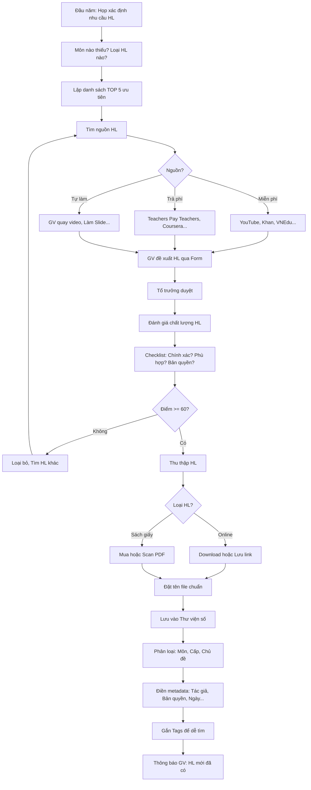

# SOP-02.1: THU THẬP VÀ PHÂN LOẠI HỌC LIỆU

## 1. THÔNG TIN QUY TRÌNH

| **Thuộc tính** | **Nội dung** |
|---|---|
| Mã SOP | SOP-02.1 |
| Tên quy trình | Thu thập và phân loại học liệu |
| Quy trình cha | SOP-02: Quản lý học liệu |
| Phiên bản | 1.0 |
| Tần suất | Liên tục + Đợt rà soát (Hè) |

## 2. MỤC ĐÍCH

- **Đủ học liệu**: GV và HS có đủ tài liệu học tập
- **Đa dạng**: Video, Slide, Worksheet, Game, Sách, App...
- **Dễ tìm**: Phân loại khoa học, Tag đầy đủ
- **Chất lượng cao**: Chọn lọc kỹ, Loại bỏ tài liệu kém

## 3. PHÂN LOẠI HỌC LIỆU

### 3.1. Theo hình thức

| **Loại** | **Ví dụ** | **Ưu điểm** | **Nhược điểm** |
|---|---|---|---|
| **Sách giấy** | SGK, Sách tham khảo, Truyện | Không cần điện, Dễ đọc | Nặng, Chiếm chỗ, Cũ nhanh |
| **Video** | Bài giảng, Thí nghiệm, Phim tài liệu | Sinh động, Thu hút | Cần Internet/Thiết bị |
| **Audio** | Podcast, Bài hát, Truyện nói | Nghe mọi lúc | Không có hình ảnh |
| **Slide/Presentation** | PowerPoint, Google Slides | Dễ làm, Trực quan | Có thể nhàm chán |
| **Tài liệu in** | Worksheet, Handout, Đề thi | Thực hành tốt | Tốn giấy |
| **Game/App** | Kahoot, Quizizz, Duolingo | Vui, Tương tác | Cần thiết bị |
| **Website/Portal** | Khan Academy, Coursera | Nhiều nội dung | Cần Internet |

### 3.2. Theo đối tượng

| **Đối tượng** | **Học liệu** |
|---|---|
| **Giáo viên** | Giáo án mẫu, Sách giáo viên, Khóa đào tạo |
| **Học sinh** | SGK, Sách bài tập, Video bài giảng, Game |
| **Phụ huynh** | Hướng dẫn hỗ trợ con học, Tips nuôi dạy |

### 3.3. Theo cấp độ

| **Cấp độ** | **Đặc điểm** |
|---|---|
| **Mầm non** | Nhiều hình ảnh, Màu sắc, Trò chơi, Ít chữ |
| **Tiểu học** | Ngôn ngữ đơn giản, Trực quan, Vui nhộn |
| **THCS** | Phức tạp hơn, Có lý thuyết sâu, Bài tập nâng cao |

## 4. QUY TRÌNH THU THẬP

### 4.1. Xác định nhu cầu

**Bước 1: Đầu năm học - Họp xác định học liệu cần**

**Thành phần:** Tổ trưởng + GV các môn

**Nội dung:**
- Môn nào thiếu học liệu?
- Loại học liệu nào cần (Video, Worksheet...)?
- Ưu tiên: TOP 5 nhu cầu cấp bách

**Ví dụ kết quả họp:**

| **STT** | **Môn** | **Loại HL cần** | **Số lượng** | **Ưu tiên** |
|---|---|---|---|---|
| 1 | Toán | Video bài giảng lớp 3-5 | 50 video | 🔴 Cao |
| 2 | Tiếng Anh | App luyện nghe | 3 app | 🔴 Cao |
| 3 | Khoa học | Thí nghiệm ảo | 20 bài | ⚠️ TB |
| 4 | Lịch sử | Phim tài liệu | 10 phim | ⚠️ TB |
| 5 | Mỹ thuật | Hướng dẫn vẽ | 30 tutorial | ⚠️ TB |

### 4.2. Tìm nguồn học liệu

**Bước 2: Tìm kiếm từ các nguồn**

**A. Nguồn miễn phí (Ưu tiên)**

| **Nguồn** | **Loại HL** | **Link** | **Chất lượng** |
|---|---|---|---|
| **YouTube** | Video giảng dạy | youtube.com | ⭐⭐⭐⭐ |
| **Khan Academy** | Video + Bài tập Toán, Khoa học | khanacademy.org | ⭐⭐⭐⭐⭐ |
| **VNEdu** | Tài liệu Việt Nam | vnedu.vn | ⭐⭐⭐⭐ |
| **Canva** | Template Slide, Poster | canva.com (Free) | ⭐⭐⭐⭐ |
| **Pixabay, Unsplash** | Ảnh, Video không bản quyền | pixabay.com | ⭐⭐⭐⭐⭐ |
| **Quizlet** | Flashcard, Game | quizlet.com | ⭐⭐⭐⭐ |

**B. Nguồn trả phí (Nếu cần)**

| **Nguồn** | **Loại HL** | **Giá** | **Chất lượng** |
|---|---|---|---|
| **Teachers Pay Teachers** | Worksheet, Giáo án | $1-10/tài liệu | ⭐⭐⭐⭐⭐ |
| **Coursera, Udemy** | Khóa học GV | $10-50/khóa | ⭐⭐⭐⭐⭐ |
| **Adobe Stock** | Ảnh, Video chuyên nghiệp | $30/tháng | ⭐⭐⭐⭐⭐ |

**C. Tự sản xuất (Nếu không tìm được)**

- GV tự quay video
- GV tự làm Slide, Worksheet
- Mời chuyên gia đến quay

**Bước 3: GV đề xuất học liệu (QT05-F12)**

**Nội dung form:**
- Tên học liệu
- Link (Nếu online) hoặc Mô tả (Nếu sách)
- Lý do cần
- Ước tính chi phí (Nếu mua)

**Bước 4: Tổ trưởng duyệt**

### 4.3. Đánh giá chất lượng

**Bước 5: Trước khi thu thập - Đánh giá HL**

**Tiêu chí đánh giá (QT05-CL04):**

| **Tiêu chí** | **Câu hỏi** | **Điểm** |
|---|---|---|
| **Chính xác** | Nội dung có đúng không? | /20 |
| **Phù hợp độ tuổi** | Phù hợp với HS chưa? | /20 |
| **Chất lượng kỹ thuật** | Hình ảnh rõ? Âm thanh tốt? | /20 |
| **Dễ sử dụng** | GV/HS dùng dễ không? | /20 |
| **Bản quyền** | Hợp pháp không? | /20 |
| **TỔNG** | | /100 |

**Phân loại:**
- **≥ 80**: Xuất sắc → Thu thập ngay
- **60-79**: Tốt → Thu thập
- **< 60**: Yếu → Không thu thập

**Bước 6: Nếu không đạt chuẩn → Tìm HL khác**

### 4.4. Thu thập và Lưu trữ

**Bước 7: Download/Mua/Tạo học liệu**

**Nếu online:**
- Download về (Nếu cho phép)
- Hoặc Lưu link + Bookmark

**Nếu sách giấy:**
- Mua từ nhà sách
- Hoặc Scan thành PDF (Nếu hợp pháp)

**Bước 8: Đặt tên file chuẩn**

Format: `[Cap]_[Mon]_[Chu_de]_[Loai]_[Tac_gia].[Đuôi]`

VD: `TH_Toan_Phep_nhan_Video_KhanAcademy.mp4`

**Bước 9: Lưu vào Thư viện số**

Đường dẫn:
```
\\Thu_vien\Hoc_lieu\
  ├─ Man_non\
  ├─ Tieu_hoc\
  │  ├─ Toan\
  │  │  ├─ Video\
  │  │  ├─ Slide\
  │  │  ├─ Worksheet\
  │  │  └─ Game\
  │  ├─ Tieng_Viet\
  │  └─ Khac...
  └─ THCS\
```

### 4.5. Phân loại và Gắn thẻ

**Bước 10: Điền metadata (Thông tin HL)**

| **Metadata** | **Ví dụ** |
|---|---|
| Tiêu đề | "Video: Phép nhân 2 chữ số" |
| Loại | Video |
| Môn | Toán |
| Cấp | Tiểu học - Lớp 2 |
| Chủ đề | Phép nhân |
| Thời lượng | 5 phút |
| Tác giả | Khan Academy |
| Ngày thêm | 15/10/2024 |
| Người thêm | Nguyễn Văn A |
| Bản quyền | CC BY-NC-SA (Chia sẻ phi thương mại) |
| Tags | #Toán #Lớp2 #Phepnhan #Video #KhanAcademy |

**Bước 11: Gắn Tags để dễ tìm**

Ví dụ: `#Toán`, `#Lớp2`, `#Phepnhan`, `#Video`

## 5. LƯU ĐỒ QUY TRÌNH



## 6. BIỂU MẪU LIÊN QUAN

| **Mã** | **Tên** |
|---|---|
| QT05-F12 | Form đề xuất học liệu |
| QT05-CL04 | Checklist đánh giá chất lượng HL |
| QT05-S02 | Sổ theo dõi học liệu |

## 7. TIÊU CHUẨN VÀ CHỈ TIÊU

| **Chỉ tiêu** | **Mục tiêu** |
|---|---|
| Số lượng HL trong Thư viện | ≥ 500 tài nguyên |
| HL có đầy đủ metadata | 100% |
| HL đạt chất lượng (≥60 điểm) | 100% |
| Thời gian xử lý đề xuất HL | ≤ 7 ngày |

## 8. TRÁCH NHIỆM CỤ THỂ

| **Vai trò** | **Trách nhiệm** |
|---|---|
| **GV** | Đề xuất HL, Đánh giá, Tự tạo HL |
| **Tổ trưởng** | Duyệt đề xuất, Phân bổ ngân sách |
| **Thủ thư** | Thu thập, Lưu trữ, Phân loại, Gắn thẻ |
| **IT** | Quản lý Thư viện số, Backup |

## 9. LƯU Ý QUAN TRỌNG

- ⚠️ **Bản quyền là ưu tiên số 1**: Không dùng tài liệu lậu!
- ✅ **Chất lượng > Số lượng**: 100 HL tốt > 1000 HL tệ
- ✅ **Phân loại khoa học**: Dễ tìm = Dùng nhiều
- 🔥 **Thu thập liên tục**: Không chỉ đợt Hè, Mà suốt năm!

## 10. PHỤ LỤC

### 10.1. TOP 10 nguồn học liệu miễn phí tốt nhất

| **Nguồn** | **Loại** | **Môn** | **Link** | **Đánh giá** |
|---|---|---|---|---|
| Khan Academy | Video, Bài tập | Toán, Khoa học | khanacademy.org | ⭐⭐⭐⭐⭐ |
| YouTube Edu | Video | Tất cả | youtube.com/education | ⭐⭐⭐⭐ |
| Quizlet | Flashcard, Game | Tất cả | quizlet.com | ⭐⭐⭐⭐ |
| Canva Education | Template thiết kế | Tất cả | canva.com/education | ⭐⭐⭐⭐⭐ |
| VNEdu | Tài liệu VN | Tất cả | vnedu.vn | ⭐⭐⭐⭐ |

### 10.2. Checklist đánh giá HL chi tiết (QT05-CL04)

```
═══════════════════════════════════════════════════
  CHECKLIST ĐÁNH GIÁ CHẤT LƯỢNG HỌC LIỆU
═══════════════════════════════════════════════════

Tên HL: _______________________  Loại: __________
Người đánh giá: _______________  Ngày: _________

1. CHÍNH XÁC (20đ):
   □ Nội dung đúng khoa học (10đ)
   □ Không có lỗi sai (5đ)
   □ Cập nhật (Không lỗi thời) (5đ)
   Điểm: ___/20

2. PHÙ HỢP ĐỘ TUỔI (20đ):
   □ Ngôn ngữ phù hợp (7đ)
   □ Nội dung phù hợp (7đ)
   □ Độ khó phù hợp (6đ)
   Điểm: ___/20

3. CHẤT LƯỢNG KỸ THUẬT (20đ):
   □ Hình ảnh rõ nét (5đ)
   □ Âm thanh rõ ràng (5đ)
   □ Không bị lỗi kỹ thuật (5đ)
   □ Thời lượng hợp lý (5đ)
   Điểm: ___/20

4. DỄ SỬ DỤNG (20đ):
   □ GV dùng dễ (10đ)
   □ HS dùng dễ (10đ)
   Điểm: ___/20

5. BẢN QUYỀN (20đ):
   □ Hợp pháp (10đ)
   □ Có ghi rõ nguồn (5đ)
   □ Cho phép sử dụng giáo dục (5đ)
   Điểm: ___/20

TỔNG: ___/100

QUYẾT ĐỊNH:
□ Xuất sắc (≥80) → Thu thập ngay
□ Tốt (60-79) → Thu thập
□ Yếu (<60) → Không thu thập

Ghi chú: __________________________________________
══════════════════════════════════════════════════
```

## 11. FAQ

**Q1: Nếu không tìm được HL phù hợp?**  
A: Tự sản xuất! GV quay video, Làm Slide, Viết Worksheet.

**Q2: HL trả phí có tốt hơn miễn phí không?**  
A: Không hẳn! Nhiều HL miễn phí rất tốt (VD: Khan Academy). Nhưng một số HL trả phí chuyên nghiệp hơn.

**Q3: Có giới hạn dung lượng Thư viện không?**  
A: Nên mở rộng server khi cần. Video tốn dung lượng nhất, Nên dùng YouTube embed thay vì lưu file.

---

**PHÊ DUYỆT**

| Thủ thư | Tổ trưởng | Trưởng BP HT |
|---|---|---|
| [Họ tên] | [Họ tên] | [Họ tên] |
