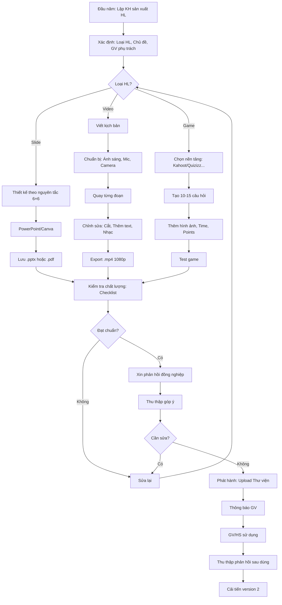

# SOP-02.2: SẢN XUẤT HỌC LIỆU SỐ

## 1. THÔNG TIN QUY TRÌNH

| **Thuộc tính** | **Nội dung** |
|---|---|
| Mã SOP | SOP-02.2 |
| Tên quy trình | Sản xuất học liệu số |
| Quy trình cha | SOP-02: Quản lý học liệu |
| Phiên bản | 1.0 |
| Tần suất | Khi cần (Theo kế hoạch) |

## 2. MỤC ĐÍCH

- **Tự chủ nội dung**: Không phụ thuộc hoàn toàn nguồn bên ngoài
- **Phù hợp 100%**: Tự làm → Phù hợp với chương trình, HS của trường
- **Tiết kiệm chi phí**: Không phải mua bản quyền
- **Nâng cao năng lực GV**: GV biết làm HL số = Năng lực tăng

## 3. LOẠI HỌC LIỆU SỐ CÓ THỂ TỰ LÀM

| **Loại** | **Công cụ** | **Độ khó** | **Thời gian** |
|---|---|---|---|
| **Slide bài giảng** | PowerPoint, Canva | ⭐ Dễ | 1-2 giờ |
| **Worksheet PDF** | Word, Canva | ⭐ Dễ | 30 phút |
| **Infographic** | Canva, Piktochart | ⭐⭐ TB | 1 giờ |
| **Video bài giảng** | Loom, Camtasia, OBS | ⭐⭐⭐ Khó | 2-4 giờ |
| **Game tương tác** | Kahoot, Quizizz, Wordwall | ⭐⭐ TB | 1 giờ |
| **E-book** | Canva, Flipbook | ⭐⭐ TB | 3-5 giờ |
| **Podcast** | Audacity, GarageBand | ⭐⭐⭐ Khó | 2-3 giờ |

## 4. QUY TRÌNH SẢN XUẤT

### 4.1. Lập kế hoạch sản xuất

**Bước 1: Đầu năm - Xác định HL cần tự làm**

**Tiêu chí ưu tiên tự làm:**
- Không tìm thấy HL phù hợp
- HL có sẵn không khớp chương trình trường
- Muốn tùy chỉnh 100%
- Có GV có kỹ năng

**Bước 2: Lập kế hoạch sản xuất năm (QT05-D04)**

| **Tháng** | **Loại HL** | **Chủ đề** | **GV phụ trách** | **Deadline** |
|---|---|---|---|---|
| 9 | 10 Video | Toán lớp 3 | Nguyễn Văn A | 30/9 |
| 10 | 20 Worksheet | Tiếng Anh | Trần Thị B | 31/10 |
| 11 | 5 E-book | Khoa học | Lê Văn C | 30/11 |

**Bước 3: Phân bổ ngân sách (Nếu cần mua công cụ)**

### 4.2. Sản xuất Slide bài giảng

**Bước 4: Thiết kế Slide theo nguyên tắc**

**Công cụ:** PowerPoint hoặc Canva

**Nguyên tắc thiết kế:**

| **Nguyên tắc** | **Chi tiết** |
|---|---|
| **6×6 Rule** | Tối đa 6 dòng, Mỗi dòng 6 từ |
| **Một ý/slide** | Không nhồi nhét quá nhiều |
| **Font lớn** | ≥ 24pt (Tiêu đề 36-44pt) |
| **Màu tương phản** | Chữ đen nền trắng, Hoặc Chữ trắng nền xanh đậm |
| **Hình ảnh chất lượng** | HD, Không mờ, Không lỗi bản quyền |
| **Animation vừa phải** | Chỉ dùng Fade, Wipe (Không xoay vòng!) |

**Template chuẩn Slide:**
```
Slide 1: Title
  - Logo trường
  - Tiêu đề bài
  - Hình nền đẹp

Slide 2: Mục tiêu
  - HS sẽ học được gì

Slide 3-10: Nội dung
  - Mỗi khái niệm 1 slide
  - Nhiều hình, Ít chữ

Slide 11: Thực hành
  - Bài tập cho HS

Slide 12: Tóm tắt + Q&A
```

**Bước 5: Lưu file**
- Format: `.pptx` (PowerPoint) hoặc `.pdf` (Canva)
- Đặt tên: `Lop3_Toan_Phep_nhan_Slide_v1.pptx`

### 4.3. Sản xuất Video bài giảng

**Bước 6: Chọn phương pháp quay**

| **Phương pháp** | **Khi nào dùng** | **Công cụ** |
|---|---|---|
| **Quay màn hình + Giọng nói** | Giải bài tập, Demo phần mềm | Loom, OBS, Camtasia |
| **Quay người + Slide** | Bài giảng lý thuyết | Camera + Máy chiếu |
| **Animation** | Giải thích khái niệm phức tạp | Vyond, Powtoon |

**Bước 7: Chuẩn bị kịch bản (Script)**

Ví dụ kịch bản Video "Phép nhân 2 chữ số":
```
[00:00-00:10] Intro
  "Xin chào các em! Hôm nay cô sẽ hướng dẫn 
   các em phép nhân 2 chữ số."
  [Hiển thị: Tiêu đề + Logo]

[00:11-01:00] Giới thiệu bài toán
  "Ví dụ: 23 × 45 = ?"
  [Hiển thị: Phép tính]

[01:01-03:00] Giải thích từng bước
  Bước 1: 23 × 5 = ...
  Bước 2: 23 × 40 = ...
  Bước 3: Cộng lại
  [Animation: Từng bước hiện ra]

[03:01-03:30] Tóm tắt
  "Vậy là các em đã học xong..."

[03:31-04:00] Bài tập
  "Bây giờ các em thử làm: 34 × 56 = ?"

[04:01-04:10] Outro
  "Cảm ơn các em! Hẹn gặp lại!"
```

**Bước 8: Quay video**

**Setup quay:**
- Ánh sáng: Đủ sáng, Không lóe
- Âm thanh: Im lặng, Không ồn
- Camera: Ổn định (Giá đỡ)
- Mic: Gần miệng (30cm)

**Tips:**
- Quay nhiều lần, Chọn lần tốt nhất
- Mỗi đoạn quay riêng, Ghép sau
- Cười tự nhiên, Nói rõ ràng

**Bước 9: Chỉnh sửa video**

**Công cụ:** Camtasia, DaVinci Resolve, CapCut

**Chỉnh sửa:**
- Cắt phần dư, Giữ phần hay
- Thêm text/annotation
- Thêm nhạc nền (Nhẹ nhàng, Không át tiếng)
- Thêm intro/outro

**Bước 10: Export video**
- Format: `.mp4` (H.264)
- Độ phân giải: 1080p (Full HD)
- Thời lượng: 3-7 phút (Đừng quá dài!)

### 4.4. Sản xuất Game tương tác

**Bước 11: Chọn nền tảng**

| **Nền tảng** | **Loại game** | **Độ khó** |
|---|---|---|
| **Kahoot** | Quiz trắc nghiệm | ⭐ Dễ |
| **Quizizz** | Quiz tự học | ⭐ Dễ |
| **Wordwall** | Nhiều loại (Match, Crossword...) | ⭐⭐ TB |
| **Genially** | Game tương tác phức tạp | ⭐⭐⭐ Khó |

**Bước 12: Tạo game trên Kahoot (Ví dụ)**

1. Vào kahoot.com → Sign in
2. Create → New kahoot → Quiz
3. Thêm câu hỏi:
   - Question: "23 × 5 = ?"
   - Answers: 115 (Đúng), 105, 120, 100
   - Time: 30 giây
   - Points: 1000
   - Thêm hình ảnh (Nếu có)
4. Lặp lại cho 10-15 câu
5. Save → Share → Lấy PIN code

**Bước 13: Test game trước khi dùng**

### 4.5. Hoàn thiện và Phát hành

**Bước 14: Kiểm tra chất lượng**

Checklist (QT05-CL05):
- [ ] Nội dung chính xác?
- [ ] Không lỗi chính tả?
- [ ] Hình ảnh/Video rõ nét?
- [ ] Âm thanh tốt?
- [ ] Thời lượng hợp lý?
- [ ] Có thể dùng được?

**Bước 15: Xin phản hồi đồng nghiệp**

- Gửi cho 2-3 GV xem trước
- Thu thập góp ý
- Sửa nếu cần

**Bước 16: Phát hành**

- Upload lên Thư viện
- Thông báo GV trong tổ
- Chia sẻ link/File

**Bước 17: Thu thập phản hồi sau khi dùng**

- GV/HS thích không?
- Có vấn đề kỹ thuật không?
- Cần cải tiến gì?

## 5. LƯU ĐỒ QUY TRÌNH



## 6. BIỂU MẪU LIÊN QUAN

| **Mã** | **Tên** |
|---|---|
| QT05-D04 | Kế hoạch sản xuất HL năm |
| QT05-CL05 | Checklist kiểm tra chất lượng HL tự làm |
| QT05-F13 | Form phản hồi HL (Sau khi dùng) |

## 7. TIÊU CHUẨN VÀ CHỈ TIÊU

| **Chỉ tiêu** | **Mục tiêu** |
|---|---|
| Số HL tự sản xuất/năm | ≥ 50 |
| HL tự làm đạt chất lượng | ≥ 80% |
| GV biết làm HL số | ≥ 60% GV |

## 8. TRÁCH NHIỆM CỤ THỂ

| **Vai trò** | **Trách nhiệm** |
|---|---|
| **GV** | Sản xuất HL, Tuân thủ chuẩn |
| **Tổ trưởng** | Phân công, Kiểm tra CL |
| **IT** | Hỗ trợ kỹ thuật, Đào tạo công cụ |

## 9. LƯU Ý QUAN TRỌNG

- ⚠️ **Chất lượng quan trọng**: HL tự làm kém = Mất uy tín
- ✅ **Bắt đầu từ đơn giản**: Slide → Worksheet → Video → Game
- ✅ **Đào tạo GV**: Tổ chức Workshop làm HL số
- 🔥 **Đừng làm lại bánh xe**: Tìm kỹ trước khi tự làm!

## 10. PHỤ LỤC

### 10.1. Công cụ miễn phí tốt nhất

| **Công cụ** | **Mục đích** | **Giá** | **Link** |
|---|---|---|---|
| **Canva** | Slide, Infographic, E-book | Free + Pro ($13/tháng) | canva.com |
| **Loom** | Quay màn hình | Free (≤5 phút/video) | loom.com |
| **OBS Studio** | Quay màn hình, Live | Free 100% | obsproject.com |
| **Audacity** | Edit audio | Free 100% | audacityteam.org |
| **DaVinci Resolve** | Edit video chuyên nghiệp | Free + Pro | blackmagicdesign.com |
| **Kahoot** | Game quiz | Free | kahoot.com |
| **Quizizz** | Quiz tự học | Free | quizizz.com |

### 10.2. Checklist quay Video chất lượng

**TRƯỚC KHI QUAY:**
- [ ] Kịch bản đã viết xong?
- [ ] Ánh sáng đủ sáng?
- [ ] Mic hoạt động tốt?
- [ ] Camera ổn định?
- [ ] Phòng im lặng?
- [ ] Đã test quay thử?

**TRONG KHI QUAY:**
- [ ] Nói rõ ràng, Không nhanh?
- [ ] Nhìn camera?
- [ ] Cười tự nhiên?
- [ ] Không có tiếng ồn?

**SAU KHI QUAY:**
- [ ] Xem lại toàn bộ?
- [ ] Âm thanh OK?
- [ ] Hình ảnh rõ?
- [ ] Cần quay lại đoạn nào?

### 10.3. Mẫu kịch bản Video (Template)

```
═══════════════════════════════════════════════════
  KỊCH BẢN VIDEO: [TÊN BÀI]
═══════════════════════════════════════════════════

Môn: ___________  Lớp: _______  Thời lượng: ___ phút
GV: _____________  Ngày: _______

───────────────────────────────────────────────────

[00:00-00:10] INTRO
  Script: "_________________________________"
  Visual: [Logo + Tiêu đề]

[00:11-01:00] GIỚI THIỆU
  Script: "_________________________________"
  Visual: [...]

[01:01-XX:XX] NỘI DUNG CHÍNH
  Phần 1: _____________________________
    Script: "___________________________"
    Visual: [...]
  
  Phần 2: _____________________________
    ...

[XX:XX-XX:XX] TÓM TẮT
  Script: "_________________________________"

[XX:XX-XX:XX] BÀI TẬP
  Script: "_________________________________"

[XX:XX-XX:XX] OUTRO
  Script: "Cảm ơn các em! Hẹn gặp lại!"
  Visual: [Logo + Contact]

═══════════════════════════════════════════════════
```

## 11. FAQ

**Q1: Tôi không biết làm Video, Có khó không?**  
A: Bắt đầu dễ: Quay màn hình + Giọng nói (Loom). Dễ hơn bạn nghĩ!

**Q2: Video bao lâu là đủ?**  
A: 3-7 phút. Học sinh tập trung tối đa 7 phút. Dài hơn = Mất tập trung.

**Q3: Có cần thiết bị đắt không?**  
A: KHÔNG! Điện thoại + Mic rẻ ($10-20) là đủ!

---

**PHÊ DUYỆT**

| GV | Tổ trưởng | IT |
|---|---|---|
| [Họ tên] | [Họ tên] | [Họ tên] |
