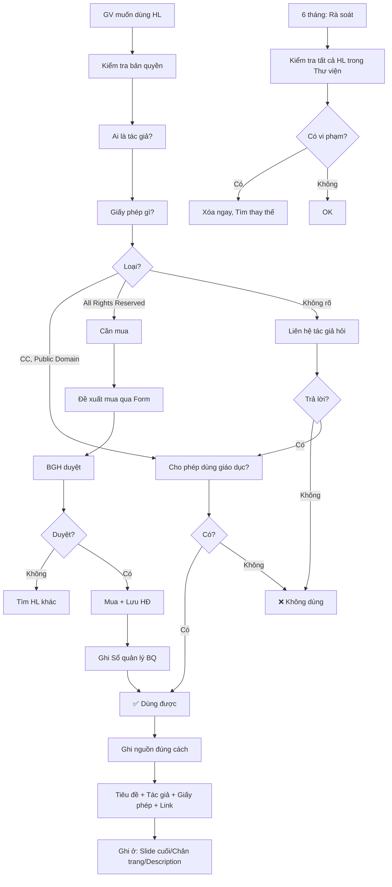

# SOP-02.3: QUẢN LÝ BẢN QUYỀN HỌC LIỆU

## 1. THÔNG TIN QUY TRÌNH

| **Thuộc tính** | **Nội dung** |
|---|---|
| Mã SOP | SOP-02.3 |
| Tên quy trình | Quản lý bản quyền học liệu |
| Quy trình cha | SOP-02: Quản lý học liệu |
| Phiên bản | 1.0 |
| Tần suất | Trước khi sử dụng HL + Rà soát 6 tháng |

## 2. MỤC ĐÍCH

- **Tuân thủ pháp luật**: Không vi phạm bản quyền = Không bị phạt, Kiện
- **Bảo vệ trường**: Tránh rủi ro pháp lý, Mất uy tín
- **Văn hóa tôn trọng**: Tôn trọng tác giả, Khuyến khích sáng tạo
- **Giáo dục HS**: Dạy HS về đạo đức sở hữu trí tuệ

## 3. KIẾN THỨC CƠ BẢN VỀ BẢN QUYỀN

### 3.1. Bản quyền là gì?

**Bản quyền (Copyright):** Quyền pháp lý của tác giả đối với tác phẩm (Sách, Ảnh, Video, Nhạc, Phần mềm...)

**Tác giả có quyền:**
- ✅ Sao chép
- ✅ Phân phối
- ✅ Chỉnh sửa
- ✅ Biểu diễn công khai
- ✅ Cho phép/Cấm người khác dùng

### 3.2. Các loại giấy phép

| **Loại** | **Mô tả** | **Dùng được không?** | **Ví dụ** |
|---|---|---|---|
| **All Rights Reserved** | Tác giả giữ toàn bộ quyền | ❌ KHÔNG (Trừ khi mua) | Sách thương mại |
| **Creative Commons (CC)** | Một số quyền được chia sẻ | ✅ CÓ (Tùy loại CC) | Ảnh Unsplash |
| **Public Domain** | Không còn bản quyền | ✅ CÓ (Tự do 100%) | Tác phẩm cổ điển |
| **Educational Use** | Cho phép dùng giáo dục | ✅ CÓ (Chỉ trong trường) | Một số tài liệu |

### 3.3. Các loại Creative Commons

| **Loại** | **Ký hiệu** | **Ý nghĩa** | **Dùng trong trường?** |
|---|---|---|---|
| **CC BY** | CC-BY | Ghi nguồn là được dùng | ✅ Có |
| **CC BY-SA** | CC-BY-SA | Ghi nguồn + Chia sẻ tương tự | ✅ Có |
| **CC BY-ND** | CC-BY-ND | Ghi nguồn + Không chỉnh sửa | ✅ Có (Không sửa) |
| **CC BY-NC** | CC-BY-NC | Ghi nguồn + Phi thương mại | ✅ Có |
| **CC BY-NC-SA** | CC-BY-NC-SA | Phi thương mại + Chia sẻ tương tự | ✅ Có |
| **CC BY-NC-ND** | CC-BY-NC-ND | Phi thương mại + Không sửa | ✅ Có (Không sửa) |

**Lưu ý:** Trường học = **Phi thương mại** → Có thể dùng CC-NC

## 4. QUY TRÌNH QUẢN LÝ

### 4.1. Kiểm tra trước khi sử dụng

**Bước 1: Trước khi dùng HL - Kiểm tra bản quyền**

**Câu hỏi cần trả lời:**

| **Câu hỏi** | **Cách kiểm tra** |
|---|---|
| 1. Ai là tác giả? | Xem trong tài liệu, Website |
| 2. Giấy phép gì? | Tìm logo CC, Đọc Terms of Use |
| 3. Cho phép dùng giáo dục không? | Đọc License |
| 4. Cần ghi nguồn không? | Hầu hết đều cần |
| 5. Được chỉnh sửa không? | Xem có ND (No Derivatives) không |

**Bước 2: Dùng Checklist (QT05-CL06)**

```
CHECKLIST KIỂM TRA BẢN QUYỀN

Tên HL: _______________________
Nguồn: ________________________

□ Đã xác định tác giả?
□ Đã tìm thấy thông tin giấy phép?
□ Giấy phép là: _______________
□ Cho phép dùng giáo dục? ☐ Có ☐ Không
□ Cần ghi nguồn? ☐ Có ☐ Không
□ Được chỉnh sửa? ☐ Có ☐ Không

QUYẾT ĐỊNH:
☐ OK - Dùng được
☐ Cần mua bản quyền
☐ KHÔNG dùng (Vi phạm)
```

**Bước 3: Phân loại**

| **Kết quả** | **Hành động** |
|---|---|
| ✅ Hợp pháp (CC, Public Domain...) | Dùng ngay, Nhớ ghi nguồn |
| 💰 Cần mua | Đề xuất mua (Nếu cần thiết) |
| ❌ Vi phạm | **KHÔNG dùng**, Tìm HL khác |

### 4.2. Ghi nguồn đúng cách

**Bước 4: Nếu dùng HL có bản quyền - Phải ghi nguồn**

**Format ghi nguồn chuẩn:**

```
[Tiêu đề] bởi [Tác giả]
Giấy phép: [Loại giấy phép]
Nguồn: [Link hoặc Tên sách]
```

**Ví dụ:**

**Ảnh:**
```
"Sunset Beach" bởi John Smith
Giấy phép: CC BY 2.0
Nguồn: unsplash.com/photos/abc123
```

**Video:**
```
"Phép nhân 2 chữ số" bởi Khan Academy
Giấy phép: CC BY-NC-SA 3.0
Nguồn: khanacademy.org/math/...
```

**Bước 5: Ghi nguồn ở đâu?**

| **Loại HL** | **Ghi ở đâu** |
|---|---|
| **Slide** | Slide cuối cùng "References" |
| **Video** | Mô tả video (Description) |
| **Worksheet** | Chân trang |
| **Website** | Footer |

### 4.3. Mua bản quyền (Nếu cần)

**Bước 6: Nếu HL quan trọng và Phải mua - Đề xuất**

**Nội dung đề xuất (QT05-F14):**
- Tên HL
- Tác giả/Nhà xuất bản
- Lý do cần (Tại sao quan trọng?)
- Giá
- Đề xuất ngân sách

**Bước 7: BGH duyệt**

**Bước 8: Nếu duyệt - Mua và Lưu hóa đơn**

**Bước 9: Ghi vào Sổ quản lý bản quyền (QT05-S03)**

| **STT** | **Tên HL** | **Tác giả** | **Giấy phép** | **Ngày mua** | **Giá** | **HĐ** |
|---|---|---|---|---|---|---|
| 1 | Adobe Stock | Adobe | Đăng ký tháng | 01/09/24 | $30/tháng | HĐ123 |

### 4.4. Rà soát định kỳ

**Bước 10: 6 tháng/lần - Rà soát HL trong Thư viện**

**Mục đích:**
- Phát hiện HL vi phạm (Nếu có)
- Kiểm tra giấy phép còn hạn không (VD: Đăng ký tháng)
- Xóa HL không dùng nữa

**Bước 11: Lập BC rà soát (QT05-R19)**

| **Loại HL** | **Tổng số** | **Hợp pháp** | **Chưa rõ** | **Vi phạm** |
|---|---|---|---|---|
| Video | 100 | 95 | 3 | 2 |
| Ảnh | 500 | 490 | 5 | 5 |

**Bước 12: Xử lý HL vi phạm**

- Xóa ngay
- Tìm HL thay thế
- Thông báo GV không dùng nữa

## 5. LƯU ĐỒ QUY TRÌNH



## 6. BIỂU MẪU LIÊN QUAN

| **Mã** | **Tên** |
|---|---|
| QT05-CL06 | Checklist kiểm tra bản quyền |
| QT05-F14 | Form đề xuất mua bản quyền |
| QT05-S03 | Sổ quản lý bản quyền |
| QT05-R19 | Báo cáo rà soát bản quyền |

## 7. TIÊU CHUẨN VÀ CHỈ TIÊU

| **Chỉ tiêu** | **Mục tiêu** |
|---|---|
| HL trong Thư viện hợp pháp | 100% |
| HL có ghi nguồn (Khi cần) | 100% |
| Vi phạm bản quyền | 0 lần/năm |

## 8. TRÁCH NHIỆM CỤ THỂ

| **Vai trò** | **Trách nhiệm** |
|---|---|
| **GV** | Kiểm tra BQ trước khi dùng, Ghi nguồn |
| **Thủ thư** | Kiểm tra HL trước khi thêm vào Thư viện, Rà soát 6 tháng |
| **BGH** | Duyệt mua BQ, Xử lý vi phạm |

## 9. LƯU Ý QUAN TRỌNG

- ⚠️ **Vi phạm = Rủi ro lớn**: Phạt, Kiện, Mất uy tín
- ✅ **Nghi ngờ = Không dùng**: Không rõ BQ → Không dùng
- ✅ **Ghi nguồn = Tôn trọng**: Luôn ghi nguồn, Dù nhỏ
- 🔥 **Giáo dục HS**: Dạy HS không copy, Tôn trọng tác giả

## 10. PHỤ LỤC

### 10.1. Các nguồn hợp pháp 100%

| **Nguồn** | **Loại** | **Giấy phép** | **Link** |
|---|---|---|---|
| **Unsplash** | Ảnh | Free (Giống Public Domain) | unsplash.com |
| **Pixabay** | Ảnh, Video | Free | pixabay.com |
| **Pexels** | Ảnh, Video | Free | pexels.com |
| **Wikimedia Commons** | Ảnh, Âm thanh | Đa dạng (Hầu hết CC) | commons.wikimedia.org |
| **YouTube Audio Library** | Nhạc nền | Free | youtube.com/audiolibrary |
| **Khan Academy** | Video giảng dạy | CC BY-NC-SA | khanacademy.org |

### 10.2. Dấu hiệu HL vi phạm

| **Dấu hiệu** | **Giải thích** |
|---|---|
| Không ghi tác giả | Nghi ngờ vi phạm |
| Chất lượng quá cao (4K pro) | Có thể là từ nguồn thương mại |
| Có logo/watermark | Chưa mua bản quyền |
| Tìm trên Google → Nhiều site bán | Là tài liệu thương mại |

### 10.3. Mẫu ghi nguồn trong Slide

```
═══════════════════════════════════════════════════
            REFERENCES (NGUỒN THAM KHẢO)
═══════════════════════════════════════════════════

IMAGES:
• Slide 3: "Mountain Landscape" by Jane Doe
  License: CC BY 2.0
  Source: unsplash.com/photos/xyz789

• Slide 7: "Student Learning" by John Smith
  License: CC BY-NC-SA 4.0
  Source: pexels.com/photo/123456

VIDEOS:
• Slide 10: "Multiplication Tutorial" by Khan Academy
  License: CC BY-NC-SA 3.0
  Source: khanacademy.org/math/...

MUSIC:
• Background: "Calm Piano" by Kevin MacLeod
  License: CC BY 4.0
  Source: incompetech.com

═══════════════════════════════════════════════════
```

## 11. FAQ

**Q1: Nếu không tìm thấy thông tin bản quyền?**  
A: GIẢ SỬ vi phạm → Không dùng! Tìm HL khác rõ ràng hơn.

**Q2: "Fair Use" (Sử dụng hợp lý) có áp dụng không?**  
A: Ở Mỹ có, Ở VN không rõ ràng. An toàn nhất: Xin phép hoặc Dùng CC.

**Q3: Tự chụp ảnh trong sách để dạy có được không?**  
A: KHÔNG! Vẫn vi phạm bản quyền sách. Trừ khi sách cho phép.

**Q4: Dùng ảnh Google Images có được không?**  
A: KHÔNG tự động! Phải click vào ảnh → Xem nguồn gốc và Giấy phép.

---

**PHÊ DUYỆT**

| Thủ thư | Pháp chế | BGH |
|---|---|---|
| [Họ tên] | [Họ tên] | [Họ tên] |
