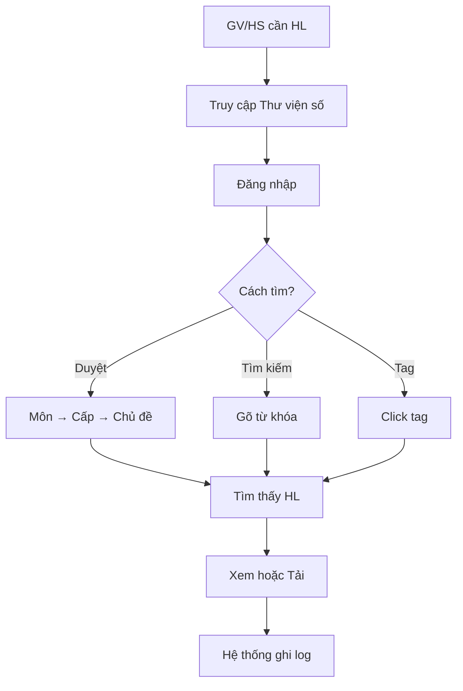

# SOP-02.4: PHÂN PHỐI VÀ TRUY CẬP HỌC LIỆU

## 1. THÔNG TIN | Mã: SOP-02.4 | Tần suất: Liên tục

## 2. MỤC ĐÍCH
- **Truy cập dễ dàng**: GV/HS tìm được HL trong ≤ 2 phút
- **Mọi lúc, Mọi nơi**: Truy cập 24/7, Từ nhà/Trường
- **Phân quyền hợp lý**: HS không xem tài liệu GV
- **Theo dõi được**: Biết ai dùng HL gì

## 3. PHƯƠNG THỨC PHÂN PHỐI

| **Phương thức** | **Khi nào** | **Ưu/Nhược** |
|---|---|---|
| **Thư viện số** | HL điện tử | ✅ Dễ truy cập, ❌ Cần Internet |
| **USB/Ổ cứng** | HL lớn (Video) | ✅ Không cần mạng, ❌ Dễ mất |
| **In phát** | Worksheet | ✅ HS dùng ngay, ❌ Tốn giấy |
| **Email** | Gửi riêng cho GV | ✅ Nhanh, ❌ Dễ spam |
| **QR Code** | Trong sách/Poster | ✅ Tiện, ❌ Cần điện thoại |

## 4. QUY TRÌNH

### 4.1. Truy cập Thư viện số

**Bước 1: GV/HS truy cập**
- Link: `https://library.[truong].edu.vn`
- Hoặc: Google Drive, Notion...

**Bước 2: Đăng nhập**
- GV: Email @[truong].edu.vn
- HS: Mã số HS + Mật khẩu

**Bước 3: Tìm kiếm HL**

**3 cách tìm:**
1. **Duyệt thư mục**: Môn → Cấp → Chủ đề
2. **Tìm kiếm**: Gõ từ khóa (VD: "Phép nhân")
3. **Lọc theo Tag**: Click tag `#Toán` `#Lớp2`

**Bước 4: Xem/Tải về**
- Xem trực tuyến (Nếu PDF, Video)
- Tải về (Nếu cần offline)

### 4.2. Phân quyền

**Bước 5: Phòng IT phân quyền**

| **Đối tượng** | **Quyền truy cập** |
|---|---|
| **GV** | Xem tất cả, Tải, Upload |
| **HS** | Chỉ xem HL cho HS, Không tải |
| **PH** | Xem HL cho PH (Hướng dẫn...) |
| **Thủ thư** | Toàn quyền |

**Bước 6: Theo dõi truy cập (Analytics)**
- Ai xem HL gì?
- HL nào được xem nhiều nhất?
- Thời gian trung bình?

## 5. LƯU ĐỒ

## 6. BIỂU MẪU
- QT05-R20: Báo cáo truy cập HL (Tháng)

## 7. FAQ
**Q: HS có thể download không?**  
A: Tùy chính sách. Nên cho xem online, Không cho download (Tránh chia sẻ ra ngoài).

---
**PHÊ DUYỆT** | IT | Thủ thư |
