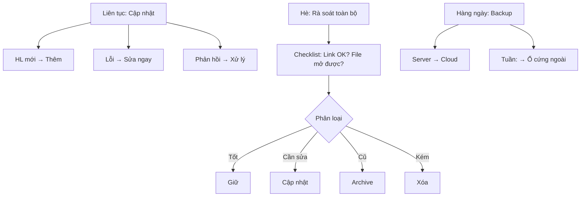

# SOP-02.5: CẬP NHẬT VÀ BẢO TRÌ HỌC LIỆU

## 1. THÔNG TIN | Mã: SOP-02.5 | Tần suất: Liên tục + Rà soát Hè

## 2. MỤC ĐÍCH
- **HL luôn mới**: Không lỗi thời
- **Link không hỏng**: Video/Website vẫn truy cập được
- **Chất lượng duy trì**: Xóa HL kém, Giữ HL tốt
- **Thư viện gọn gàng**: Không lộn xộn

## 3. QUY TRÌNH

### 3.1. Cập nhật liên tục

**Bước 1: Khi có HL mới - Thêm vào Thư viện**
- Upload file
- Điền metadata
- Gắn tag

**Bước 2: Khi phát hiện lỗi - Sửa ngay**
- Link hỏng → Tìm link mới
- File lỗi → Tải lại
- Nội dung sai → Sửa hoặc Xóa

**Bước 3: Khi có phản hồi - Xử lý**

| **Phản hồi** | **Xử lý** |
|---|---|
| "HL này hay!" | Đánh dấu ⭐, Quảng bá |
| "Link hỏng" | Sửa trong 24h |
| "Nội dung sai" | Kiểm tra → Sửa/Xóa |
| "Khó hiểu" | Thêm hướng dẫn |

### 3.2. Rà soát định kỳ (Hè hàng năm)

**Bước 4: Tháng 6-7 - Rà soát toàn bộ Thư viện**

**Checklist rà soát:**
- [ ] Link còn hoạt động?
- [ ] File mở được?
- [ ] Nội dung còn đúng?
- [ ] Chất lượng còn tốt?
- [ ] Còn dùng không?

**Bước 5: Phân loại HL**

| **Loại** | **Hành động** |
|---|---|
| ✅ Tốt, Còn dùng | Giữ lại |
| 🔄 Cần cập nhật | Sửa/Thay thế |
| 📦 Cũ, Ít dùng | Lưu trữ (Archive) |
| ❌ Lỗi thời/Kém | Xóa |

**Bước 6: Thực hiện**
- Sửa → Tải bản mới
- Xóa → Di chuyển sang thư mục "Deleted"
- Archive → Thư mục riêng

**Bước 7: Lập BC rà soát (QT05-R21)**

| **Tổng HL** | **Giữ** | **Cập nhật** | **Archive** | **Xóa** |
|---|---|---|---|---|
| 500 | 400 | 50 | 30 | 20 |

### 3.3. Backup

**Bước 8: Backup tự động (Hàng ngày)**
- Server → Cloud (Google Drive)
- Tuần 1 lần: Backup ra ổ cứng ngoài

**Bước 9: Test backup (Tháng 1 lần)**
- Thử khôi phục 5 file ngẫu nhiên
- OK → Yên tâm
- Lỗi → Sửa hệ thống backup

## 4. LƯU ĐỒ

## 5. TIÊU CHUẨN

| **Chỉ tiêu** | **Mục tiêu** |
|---|---|
| Link hỏng | < 5% |
| Thời gian sửa link hỏng | ≤ 24h |
| Backup thành công | 100% |

## 6. FAQ
**Q: Nên xóa HL cũ không?**  
A: Nếu hoàn toàn lỗi thời → Xóa. Nếu còn giá trị lịch sử → Archive.

**PHÊ DUYỆT** | Thủ thư | IT |

---
✅ **HOÀN THÀNH SOP-02: QUẢN LÝ HỌC LIỆU (5 files)!**
