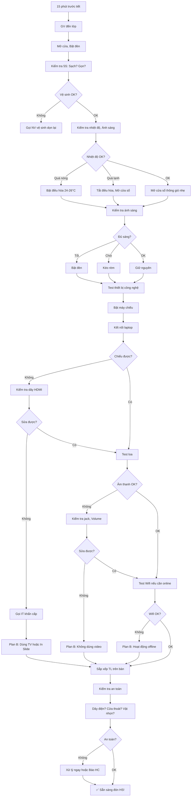

# SOP-03.1: CHUẨN BỊ MÔI TRƯỜNG HỌC TẬP

## 1. THÔNG TIN QUY TRÌNH

| **Thuộc tính** | **Nội dung** |
|---|---|
| Mã SOP | SOP-03.1 |
| Tên quy trình | Chuẩn bị môi trường học tập |
| Quy trình cha | SOP-03: Tổ chức giờ dạy |
| Phiên bản | 1.0 |
| Tần suất | Trước mỗi tiết dạy (10-15 phút) |

## 2. MỤC ĐÍCH

- **Không gian lý tưởng**: Tạo môi trường học tập tốt nhất cho HS
- **An toàn**: Phòng học an toàn, Không rủi ro
- **Thiết bị sẵn sàng**: Công nghệ hoạt động tốt, Không gián đoạn giờ dạy
- **Tâm lý thoải mái**: HS cảm thấy thoải mái, Muốn học

## 3. PHẠM VI ÁP DỤNG

Tất cả giáo viên, Tất cả phòng học (Lớp học thông thường, Phòng máy, Phòng thí nghiệm, Phòng nhạc...)

## 4. TIÊU CHUẨN MÔI TRƯỜNG LỚP HỌC

### 4.1. Yếu tố vật lý

| **Yếu tố** | **Tiêu chuẩn** | **Cách đo** | **Tại sao quan trọng** |
|---|---|---|---|
| **Ánh sáng** | 300-500 lux | Máy đo ánh sáng hoặc Cảm giác | Thiếu sáng → Mỏi mắt, Khó tập trung |
| **Nhiệt độ** | 22-26°C | Nhiệt kế | Quá nóng/lạnh → HS khó chịu |
| **Độ ẩm** | 50-70% | Ẩm kế | Quá khô → Khó thở, Quá ẩm → Ngột ngạt |
| **Tiếng ồn** | < 60 dB | Máy đo âm hoặc Nghe | Ồn → Không nghe rõ GV |
| **Không khí** | Thông thoáng | Cảm nhận | Thiếu O₂ → Buồn ngủ |
| **Diện tích** | 1.5-2 m²/HS | Đo phòng / Số HS | Chật → Khó di chuyển |

### 4.2. Bố trí lớp học

**Yêu cầu cơ bản:**

| **Khu vực** | **Yêu cầu** |
|---|---|
| **Bàn ghế HS** | Đủ cho mọi HS, Cao thấp phù hợp, Không lắc lư |
| **Bàn GV** | Vị trí nhìn toàn lớp, Có ngăn kéo khóa (Đồ quan trọng) |
| **Bảng** | Sạch, Viết rõ, Đủ cao (HS hàng đầu không bị che) |
| **Góc đọc sách** | Sách phù hợp cấp, Gọn gàng |
| **Tủ đồ dùng** | Khóa chặt (An toàn), Ghi rõ nội dung |
| **Trang trí** | Tác phẩm HS, Poster giáo dục, Không quá rối |

### 4.3. Thiết bị công nghệ

| **Thiết bị** | **Vị trí** | **Kiểm tra** |
|---|---|---|
| **Máy chiếu** | Trần hoặc Bàn | Chiếu rõ? Không mờ? Không nhiễu? |
| **Màn chiếu** | Trước lớp | Kéo xuống được? Không rách? |
| **Loa** | Góc lớp | Âm thanh rõ? Không rè? |
| **Bảng tương tác** | Trước lớp | Touch hoạt động? Bút viết được? |
| **Tablet GV** | Bàn GV | Pin đủ? Kết nối Wifi? |
| **Router Wifi** | Góc lớp | Tín hiệu mạnh? Không giật lag? |

## 5. QUY TRÌNH CHUẨN BỊ

### 5.1. Chuẩn bị hàng ngày (Buổi sáng - 7h)

**Bước 1: Nhân viên vệ sinh lau dọn lớp (6h30-7h)**

Checklist vệ sinh (QT05-CL10):
- [ ] Lau bàn ghế
- [ ] Quét sàn
- [ ] Lau bảng
- [ ] Đổ rác
- [ ] Lau cửa sổ (1 tuần/lần)

**Bước 2: Lớp trưởng kiểm tra (7h15)**

- Bật đèn
- Mở cửa sổ (Thông gió)
- Kiểm tra bàn ghế (Có hư không?)
- Báo GV nếu có vấn đề

### 5.2. Chuẩn bị trước mỗi tiết (10-15 phút)

**Bước 3: GV đến lớp sớm (Trước 10 phút)**

**Bước 4: Kiểm tra môi trường vật lý (QT05-CL11)**

**Checklist 5S cho lớp học:**

```
═══════════════════════════════════════════════════
  CHECKLIST CHUẨN BỊ MÔI TRƯỜNG LỚP HỌC
═══════════════════════════════════════════════════

Tiết: ___  Môn: _______  Lớp: _____  Ngày: ______
GV: ______________

1. SEIRI (Sàng lọc):
   □ Không có đồ thừa trên bàn HS
   □ Bảng không còn chữ cũ
   □ Chỉ để đồ dùng cần thiết

2. SEITON (Sắp xếp):
   □ Bàn ghế thẳng hàng
   □ Đồ dùng GV ngăn nắp trên bàn
   □ Tài liệu sắp xếp theo thứ tự dùng

3. SEISO (Sạch sẽ):
   □ Lớp sạch, Không rác
   □ Bảng sạch, Không bẩn
   □ Bàn ghế không bụi

4. SEIKETSU (Săn sóc):
   □ Ánh sáng đủ (Bật đèn nếu tối)
   □ Nhiệt độ OK (24-26°C, Bật điều hòa nếu cần)
   □ Cửa sổ mở (Thông gió)
   □ Không mùi hôi

5. SHITSUKE (Sẵn sàng):
   □ Thiết bị công nghệ đã test
   □ Tài liệu đã chuẩn bị
   □ GV đã sẵn sàng về tâm lý

══════════════════════════════════════════════════
GV ký: ____________  Giờ kiểm tra: _______
```

**Bước 5: Kiểm tra và Test thiết bị công nghệ**

**Quy trình test (5 phút):**

**A. Máy chiếu + Laptop:**
1. Bật máy chiếu (Chờ 1-2 phút khởi động)
2. Kết nối laptop (HDMI hoặc VGA)
3. Nhấn Windows + P → "Duplicate" (Nhân bản màn hình)
4. Mở file Slide/Video thử
5. Kiểm tra: Hình rõ? Màu chuẩn?

**B. Loa/Âm thanh:**
1. Kết nối loa với laptop (Jack 3.5mm hoặc Bluetooth)
2. Mở file nhạc/Video test
3. Điều chỉnh âm lượng: 60-70%
4. Nghe thử: Rõ? Không rè?

**C. Internet/Wifi:**
1. Kết nối Wifi trên laptop
2. Mở trình duyệt, Vào Google
3. Tốc độ OK? (Không loading lâu)
4. Nếu dùng Kahoot → Vào thử

**D. Bảng tương tác (Nếu có):**
1. Bật nguồn
2. Hiệu chỉnh touch (Nếu lệch)
3. Test viết, Xóa

**Bước 6: Nếu có lỗi - Xử lý ngay**

| **Lỗi** | **Xử lý tức thì** | **Plan B** |
|---|---|---|
| Máy chiếu không sáng | Kiểm tra nguồn, Đèn | Dùng TV trong lớp |
| Laptop không kết nối | Thay dây HDMI | In Slide ra giấy A3 |
| Loa không có tiếng | Kiểm tra jack, Volume | Nói to (Không dùng video) |
| Wifi mất | Khởi động lại Router | Chuyển hoạt động offline |
| Bảng không viết được | Lau bảng, Thay bút | Viết lên giấy A0 |

**Bước 7: Nếu không sửa được - Gọi IT/Hành chính (Khẩn cấp)**

- Hotline IT: [Số điện thoại]
- IT đến hỗ trợ trong ≤ 5 phút

**Bước 8: Sắp xếp tài liệu giảng dạy trên bàn GV**

**Thứ tự từ trái → phải:**
```
┌─────────┬─────────┬──────────┬────────────┬────────┐
│ Giáo án │   USB   │ Worksheet│ Exit ticket│ Bút dạ │
│         │ (Slide) │  (30 bản)│  (30 bản)  │ 3 màu  │
└─────────┴─────────┴──────────┴────────────┴────────┘
```

**Mẹo:** Dùng khay nhỏ để tổ chức, Không để lộn xộn

**Bước 9: Điều chỉnh bố trí chỗ ngồi (Nếu cần)**

**Ví dụ:** Tiết thảo luận nhóm → Xếp bàn thành nhóm 4-6 HS

**Thời gian xếp lại:** 2-3 phút (Cả lớp cùng xếp)

### 5.3. Kiểm tra an toàn

**Bước 10: Rà soát an toàn lớp học (QT05-CL12)**

```
CHECKLIST AN TOÀN LỚP HỌC

□ Không có vật sắc nhọn (Dao, Kim...) để lung tung
□ Dây điện không hở, Không đi ngang lối đi
□ Ổ cắm không quá tải (Tối đa 3 thiết bị/ổ)
□ Quạt trần không rung lắc
□ Cửa thoát hiểm không bị chặn
□ Bình cứu hỏa trong phòng (Còn hạn sử dụng?)
□ Không có góc nhọn bàn ghế (Đã bọc xốp)
□ Sàn không trơn trượt (Nhất là sau mưa)

Nếu có vấn đề → Báo Hành chính NGAY!
```

**Bước 11: Đặc biệt với phòng đặc biệt**

**Phòng thí nghiệm:**
- Hóa chất an toàn?
- Dụng cụ thí nghiệm đủ, Không vỡ?
- Bồn rửa nước chạy?
- Tủ cứu thương đầy đủ?

**Phòng máy:**
- Tất cả máy tính hoạt động?
- Phần mềm cần thiết đã cài?
- Không virus?

**Phòng thể dục:**
- Dụng cụ an toàn?
- Sân không ướt trơn?

## 6. TẠO KHÔNG KHÍ HỌC TẬP TÍCH CỰC

### 6.1. Trang trí lớp học

**Nguyên tắc:**
- **70% Tác phẩm HS**: Ảnh, Bài văn hay, Tranh vẽ... (HS tự hào!)
- **20% Poster giáo dục**: Bảng chữ cái, Bảng cửu chương, Bản đồ...
- **10% Góc động viên**: Slogan "Em có thể làm được!", Ảnh HS vui vẻ...

**Vị trí:**
- Trước lớp: Poster chính (Bảng cửu chương...)
- Hai bên: Tác phẩm HS
- Sau lớp: Góc đọc sách, Bảng thông báo

**Bước 12: Thay đổi trang trí định kỳ (Tháng 1 lần)**

Tránh nhàm chán, Luôn mới mẻ

### 6.2. Âm nhạc (Tùy chọn)

**Trước giờ học (5 phút):**
- Phát nhạc nhẹ nhàng (Classical, Piano...)
- Âm lượng nhỏ (30-40%)
- Giúp HS thư giãn, Chuẩn bị tâm lý học

**Trong giờ học:**
- Không phát nhạc (Trừ giờ Nhạc/Mỹ thuật)
- Nếu cần nhạc nền → Rất nhỏ (10-20%)

### 6.3. Mùi hương (Nếu có điều kiện)

- Tinh dầu Lavender, Bạc hà → Thư giãn, Tập trung
- Xịt nhẹ, Không quá mùi

## 7. QUY TRÌNH CHI TIẾT

### 7.1. Timeline chuẩn bị (15 phút)

**7h45 (15 phút trước tiết 1):**

| **Phút** | **Hoạt động** |
|---|---|
| **0-2** | Đến lớp, Mở cửa, Bật đèn |
| **2-5** | Kiểm tra vệ sinh (Checklist 5S) |
| **5-10** | Test thiết bị công nghệ |
| **10-12** | Sắp xếp tài liệu trên bàn |
| **12-14** | Kiểm tra an toàn |
| **14-15** | Hít thở sâu, Chuẩn bị tinh thần |

**8h00:** Sẵn sàng đón HS!

### 7.2. Trong giờ dạy

**Bước 13: Duy trì môi trường**

- Nhiệt độ tăng (Trưa) → Bật điều hòa
- Hết giờ → Tắt thiết bị, Tắt đèn (Tiết kiệm điện)
- HS đổ rác sai chỗ → Nhắc nhở ngay

### 7.3. Sau giờ dạy

**Bước 14: Thu dọn (5 phút)**

- Tắt máy chiếu, Laptop
- Thu tài liệu
- Nhắc HS: "Giữ lớp gọn gàng nhé!"
- Đóng cửa sổ (Nếu tiết cuối)

**Bước 15: Báo cáo lỗi (Nếu có)**

Form báo lỗi (QT05-F15):
- Thiết bị gì hỏng?
- Mô tả lỗi
- Mức độ: 🔴 Khẩn cấp / ⚠️ Sớm / ✅ Không gấp

Gửi: Email IT hoặc Hành chính

## 8. LƯU ĐỒ QUY TRÌNH



## 9. BIỂU MẪU LIÊN QUAN

| **Mã** | **Tên** |
|---|---|
| QT05-CL10 | Checklist vệ sinh lớp học (NV vệ sinh) |
| QT05-CL11 | Checklist chuẩn bị môi trường (GV) |
| QT05-CL12 | Checklist an toàn lớp học |
| QT05-F15 | Form báo lỗi thiết bị |

## 10. TIÊU CHUẨN VÀ CHỈ TIÊU

| **Chỉ tiêu** | **Mục tiêu** |
|---|---|
| Lớp đạt tiêu chuẩn môi trường | 100% |
| Thiết bị hoạt động tốt | ≥ 98% |
| Thời gian xử lý lỗi thiết bị | ≤ 5 phút |
| Lớp được vệ sinh mỗi ngày | 100% |

## 11. TRÁCH NHIỆM CỤ THỂ

| **Vai trò** | **Trách nhiệm** |
|---|---|
| **NV vệ sinh** | Dọn lớp mỗi sáng (6h30-7h) |
| **Lớp trưởng** | Kiểm tra sơ bộ (7h15), Báo GV nếu có vấn đề |
| **GV** | Kiểm tra kỹ trước tiết (10-15 phút), Test thiết bị, Báo lỗi |
| **IT** | Sửa lỗi thiết bị trong ≤ 5 phút |
| **Hành chính** | Sửa chữa CSVC, Mua thiết bị mới |

## 12. LƯU Ý QUAN TRỌNG

- ⚠️ **Đến sớm = Chủ động**: GV đến muộn → Không kịp chuẩn bị → Giờ dạy kém
- ✅ **Luôn có Plan B**: Công nghệ LUÔN có nguy cơ hỏng!
- ✅ **Test trước, Không test giữa giờ**: Test trước 10 phút, Không test khi HS đã vào lớp
- ✅ **Môi trường ảnh hưởng học tập**: Lớp nóng, Ồn, Tối → HS không học được
- 🔥 **5S mỗi ngày**: Seiri, Seiton, Seiso, Seiketsu, Shitsuke!

## 13. PHỤ LỤC

### 13.1. Bố trí lớp học theo hoạt động

**A. Giảng lý thuyết (Hàng dọc):**
```
          [BẢNG + CHIẾU]
          
     HS  HS  HS  HS  HS
     HS  HS  HS  HS  HS
     HS  HS  HS  HS  HS
     HS  HS  HS  HS  HS
     HS  HS  HS  HS  HS
     HS  HS  HS  HS  HS
     
         [BÀN GV]
```

**B. Thảo luận nhóm (Nhóm 4-6):**
```
     [Nhóm 1]      [Nhóm 2]
      HS  HS        HS  HS
      HS  HS        HS  HS
      
     [Nhóm 3]      [Nhóm 4]
      HS  HS        HS  HS
      HS  HS        HS  HS
      
          [BẢNG]
          [GV]
```

**C. Thảo luận chữ U:**
```
              [BẢNG]
    HS HS HS HS HS HS HS
    HS              HS
    HS              HS
    HS              HS
    HS HS HS HS HS HS HS
    
           [GV]
```

### 13.2. Tiêu chuẩn môi trường theo cấp

| **Yếu tố** | **Mầm non** | **Tiểu học** | **THCS** |
|---|---|---|---|
| **Nhiệt độ** | 24-26°C (Ấm hơn) | 22-26°C | 22-25°C |
| **Ánh sáng** | 400-500 lux (Sáng) | 300-500 lux | 300-400 lux |
| **Trang trí** | Nhiều màu sắc, Vui nhộn | Cân bằng | Chuyên nghiệp hơn |
| **Chỗ ngồi** | Bàn thấp, Ghế nhỏ | Bàn TB | Bàn cao hơn |

### 13.3. Checklist IT hỗ trợ (Khi được gọi)

**IT NHẬN ĐƯỢC CUỘC GỌI:**

```
Lớp: ____  Tiết: ____  Vấn đề: ______________

HÀNH ĐỘNG (Trong 5 phút):
□ Mang theo: Dây HDMI dự phòng, Remote máy chiếu, Loa
□ Đến lớp
□ Chẩn đoán lỗi
□ Sửa nếu đơn giản (Thay dây, Reset...)
□ Nếu phức tạp → Đề xuất Plan B cho GV
□ Hoàn thành trong tiết nghỉ hoặc Sau giờ

Thời gian xử lý: ____ phút
Kết quả: □ Đã sửa  □ Plan B  □ Cần thay thiết bị

IT ký: ____________  GV ký: ____________
```

## 14. FAQ

**Q1: Nếu lớp quá nóng (30°C) mà không có điều hòa?**  
A: Mở tất cả cửa sổ, Bật quạt, Cho HS nghỉ giải lao nhiều hơn (5 phút mỗi 15 phút). Báo BGH lắp điều hòa.

**Q2: Học sinh phàn nàn "Lớp tối"?**  
A: Bật hết đèn, Kéo rèm. Nếu vẫn tối → Báo Hành chính thay bóng đèn sáng hơn.

**Q3: Có cần kiểm tra môi trường mỗi tiết không?**  
A: CÓ! Chỉ 2-3 phút nhưng rất quan trọng. Tiết 1 OK không có nghĩa tiết 3 vẫn OK (Nhiệt độ thay đổi).

---

**PHÊ DUYỆT**

| GV | Tổ trưởng | Trưởng HC | IT |
|---|---|---|---|
| [Họ tên] | [Họ tên] | [Họ tên] | [Họ tên] |
