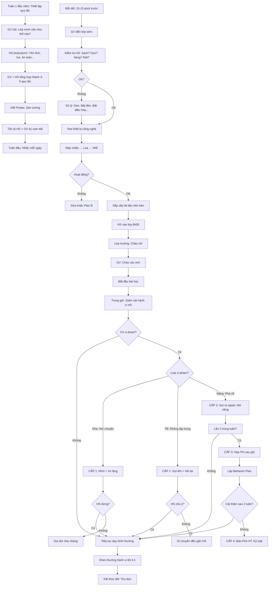

# SOP-03.2: QUẢN LÝ LỚP HỌC

## 1. THÔNG TIN QUY TRÌNH

| **Thuộc tính** | **Nội dung** |
|---|---|
| Mã SOP | SOP-03.2 |
| Tên quy trình | Quản lý lớp học |
| Quy trình cha | SOP-03: Tổ chức giờ dạy |
| Phiên bản | 1.0 |
| Tần suất | Mỗi tiết dạy |

## 2. MỤC ĐÍCH

- **Duy trì kỷ luật**: Lớp học trật tự, HS tập trung
- **Tạo môi trường tích cực**: HS cảm thấy an toàn, Muốn tham gia
- **Tối đa thời gian học**: Ít mất thời gian cho kỷ luật
- **Phát triển kỹ năng xã hội HS**: Tôn trọng, Hợp tác, Tự quản

## 3. NGUYÊN TẮC QUẢN LÝ LỚP

### 3.1. 5 nguyên tắc vàng

| **Nguyên tắc** | **Giải thích** | **Ví dụ** |
|---|---|---|
| **1. Công bằng** | Đối xử như nhau với mọi HS | HS giỏi và HS yếu đều được quan tâm |
| **2. Nhất quán** | Quy tắc áp dụng đều, Không thay đổi tùy hứng | Quy tắc "Giơ tay trước khi nói" áp dụng cho tất cả |
| **3. Tích cực** | Khen nhiều hơn phạt (Tỷ lệ 4:1) | 4 lần khen : 1 lần nhắc nhở |
| **4. Proactive** | Ngăn chặn vấn đề trước khi xảy ra | Thấy HS buồn ngủ → Cho nghỉ giải lao, Không chờ HS ngủ gật |
| **5. Tôn trọng** | GV tôn trọng HS, HS tôn trọng GV | Không quát mắng, chỉ trích trước lớp |

### 3.2. Mô hình quản lý lớp

**Classroom Management Model:**

```
        NGĂN CHẶN (Proactive)
               ↓
    ┌──────────────────────────┐
    │   XÂY DỰNG MỐI QUAN HỆ   │ ← Nền tảng
    └──────────────────────────┘
               ↓
    ┌──────────────────────────┐
    │  THIẾT LẬP QUY TẮC RÕ   │
    └──────────────────────────┘
               ↓
    ┌──────────────────────────┐
    │   DẠY CÓ CAM KẾT        │ ← HS chủ động học
    └──────────────────────────┘
               ↓
    ┌──────────────────────────┐
    │  XỬ LÝ VI PHẠM (Nếu có)  │ ← Biện pháp cuối
    └──────────────────────────┘
```

## 4. QUY TRÌNH QUẢN LÝ

### 4.1. Thiết lập quy tắc lớp (Đầu năm - Tuần 1)

**Bước 1: GV và HS cùng xây dựng quy tắc**

**Không phải:** GV áp đặt quy tắc  
**Mà là:** HS tham gia đóng góp → HS có Ownership (Quyền sở hữu) → Tuân thủ tốt hơn!

**Quy trình:**
- GV hỏi: "Các em muốn lớp mình như thế nào?"
- HS brainstorm: Yên tĩnh, Vui vẻ, An toàn...
- GV hỏi: "Để có được vậy, Chúng ta cần làm gì?"
- HS đề xuất: Không nói chuyện riêng, Giúp bạn...
- GV tổng hợp thành 3-5 quy tắc ngắn gọn

**Ví dụ 5 quy tắc chuẩn:**

| **STT** | **Quy tắc** | **Giải thích cụ thể** |
|---|---|---|
| 1 | **Giơ tay trước khi phát biểu** | Không hét lên, Chờ GV gọi |
| 2 | **Tôn trọng GV và bạn bè** | Không chế giễu, Không bắt nạt |
| 3 | **Hoàn thành bài tập đúng hạn** | Nộp đúng thời gian GV quy định |
| 4 | **Giữ lớp sạch sẽ** | Rác bỏ đúng chỗ, Bàn ghế gọn gàng |
| 5 | **Tham gia tích cực** | Tập trung, Làm bài, Không ngủ gật |

**Bước 2: Viết lên Poster, Dán tường lớp**

**Bước 3: Ký cam kết (Tất cả HS + GV)**

Poster có chữ ký tất cả HS → HS có trách nhiệm hơn!

**Bước 4: Nhắc lại quy tắc (Tuần đầu)**

Mỗi buổi nhắc 1 lần (30 giây) cho HS nhớ

### 4.2. Duy trì kỷ luật trong giờ dạy

**Bước 5: Bắt đầu giờ đúng giờ**

- GV đến đúng giờ (Nêu gương!)
- 8h00 → Bắt đầu ngay, Không chờ HS muộn

**Bước 6: Thiết lập thói quen (Routines)**

**Thói quen mở đầu tiết:**
```
1. HS vào lớp, Ngồi vào chỗ
2. Lớp trưởng: "Lớp chào cô!"
3. GV: "Cô chào các em!"
4. GV: "Hôm nay chúng ta học Bài..."
5. Bắt đầu bài học
```

→ HS làm theo thói quen → Tiết kiệm thời gian, Không loạn!

**Bước 7: Sử dụng tín hiệu (Signals)**

| **Tín hiệu** | **Ý nghĩa** | **Khi nào dùng** |
|---|---|---|
| **Vỗ tay 2 lần** | "Im lặng, Chú ý!" | Cả lớp ồn ào |
| **Đếm ngược 5-4-3-2-1** | "Dừng hoạt động, Về chỗ" | Kết thúc hoạt động nhóm |
| **Giơ tay lên** | "Ai thấy cô giơ tay, Giơ tay theo" | Thu hút sự chú ý (HS thấy → Giơ tay → Cả lớp im) |
| **Đèn tắt/bật** | "Chú ý!" | Khẩn cấp |

**Bước 8: Quản lý hoạt động nhóm**

**Kỹ thuật:**
- **Hướng dẫn rõ ràng** (Trước khi chia nhóm):
  ```
  "Các em sẽ làm gì: [Nhiệm vụ]
   Thời gian: [X phút]
   Thành phẩm: [Viết lên giấy A3]
   Ai chưa hiểu? [Q&A]
   Bắt đầu!"
  ```
- **Chia nhóm nhanh**: Đã chia sẵn (Không mất thời gian tranh cãi)
- **Vai trò rõ**: Leader, Ghi chép, Báo cáo...
- **Giám sát**: GV đi quanh các nhóm, Hỗ trợ kịp thời
- **Tín hiệu kết thúc**: Đếm ngược 3-2-1

**Bước 9: Xử lý gián đoạn**

| **Tình huống** | **Cách xử lý** |
|---|---|---|
| **HS đến muộn** | Gật đầu cho HS vào, Không mắng (Giữ nhịp độ bài). Gặp riêng sau giờ |
| **HS xin đi vệ sinh** | Cho đi (Nếu thật), Nhưng nhắc "Nên đi giờ ra chơi" |
| **Chuông báo cháy (Diễn tập)** | Dừng ngay, Dẫn HS thoát theo SOP PCCC |
| **Khách đến (Phụ huynh)** | "Cô/Chú chờ ngoài 5 phút, Hoặc Gặp sau giờ nhé" |
| **Thiết bị hỏng giữa giờ** | Chuyển Plan B ngay, Không mất thời gian sửa |

### 4.3. Xử lý hành vi không mong muốn

**Hệ thống 3 cấp độ (Tiệm tiến):**

**CẤP 1: NHẮC NHỞ (Lần 1)**

| **Hành vi** | **Cách nhắc** | **Ví dụ** |
|---|---|---|
| Nói chuyện riêng | Nhìn vào HS, Dừng nói 2 giây | (Im lặng, Nhìn) → HS tự nhận ra |
| Mất tập trung | Gọi tên nhẹ nhàng | "Em A, Em theo dõi cô nhé!" |
| Quên dụng cụ | Cho mượn, Nhắc lần sau | "Lần sau nhớ mang nhé!" |
| Ngủ gật | Hỏi riêng "Em có khỏe không?" | Có thể HS ốm, Không ngủ đủ |

**Nguyên tắc:** Nhắc riêng, Không công khai (Giữ thể diện HS)

**CẤP 2: CẢNH CÁO (Lần 2 - Trong cùng tuần)**

- Gọi ra ngoài hành lang, Nói riêng (1-2 phút)
- "Em đã vi phạm quy tắc X. Lần này cô nhắc nhở. Lần sau cô sẽ gọi phụ huynh. Em hiểu chưa?"
- HS cam kết cải thiện

**CẤP 3: HỌP PHỤ HUYNH (Lần 3 - Trong cùng tháng)**

- Gặp HS + PH sau giờ học
- Trình bày hành vi, Số lần vi phạm
- PH cam kết giám sát con
- Lập kế hoạch hỗ trợ HS (Nếu có vấn đề sâu xa)

**CẤP 4: LEO THANG (Nếu vẫn không cải thiện)**

- Báo Phó HT
- Kỷ luật theo quy chế (Cảnh cáo, Khiển trách...)

**NGUYÊN TẮC:** Luôn cho cơ hội sửa sai! Không phạt ngay lần đầu!

### 4.4. Hệ thống khen thưởng

**Khen nhiều hơn phạt (4:1)!**

**Bước 10: Khen ngợi tích cực**

| **Loại khen** | **Ví dụ** | **Khi nào dùng** |
|---|---|---|
| **Khen lời** | "Em giải thích rất rõ ràng!" | Mọi lúc |
| **Điểm cộng** | +1 điểm tích cực | Tham gia tích cực |
| **Sticker/Tem** | Dán lên sổ liên lạc | Mầm non, Tiểu học |
| **Giấy khen** | "Học sinh tích cực tuần" | Cuối tuần |
| **Khen trước lớp** | "Cả lớp vỗ tay cho em A!" | Thành tích đặc biệt |
| **Gọi điện khen với PH** | "Con em hôm nay tham gia rất tốt!" | 1 tháng/lần |

**Nguyên tắc khen hiệu quả:**

| **Nên** | **Không nên** |
|---|---|
| **Khen cụ thể**: "Em giải bài rất logic!" | Khen chung chung: "Giỏi!" |
| **Khen nỗ lực**: "Cô thấy em cố gắng nhiều!" | Chỉ khen kết quả: "Em đúng!" |
| **Khen công khai**: Trước lớp | Khen lén lút |
| **Khen ngay**: Hành vi tốt → Khen ngay | Khen sau vài ngày (HS quên rồi) |

## 5. KỸ THUẬT QUẢN LÝ CỤ THỂ

### 5.1. Xử lý HS mất tập trung

| **Dấu hiệu** | **Kỹ thuật xử lý** |
|---|---|
| Nhìn ra ngoài cửa sổ | • Gọi tên nhẹ + Câu hỏi: "Em A, Theo em câu trả lời là gì?"<br>• Di chuyển đến gần HS (Proximity) |
| Vẽ nguệch ngoạc | • Dừng nói 2 giây, Nhìn vào HS<br>• HS nhận ra → Dừng |
| Nằm bàn | • Hỏi riêng: "Em có khỏe không?"<br>• Cho đến phòng Y tế (Nếu ốm) |
| Chơi điện thoại | • "Em A, Em để điện thoại vào cặp nhé!"<br>• Nếu không nghe → Thu điện thoại đến cuối giờ |

### 5.2. Xử lý HS nói chuyện riêng

**Bước 11: Kỹ thuật "3 bước"**

**Bước 1: Im lặng + Nhìn**
- GV dừng nói
- Nhìn vào 2 HS đang nói chuyện
- Đợi 2-3 giây
- 80% HS sẽ tự ngừng

**Bước 2: Gọi tên + Hỏi lại**
- "Em B, Cô vừa nói gì?"
- Nếu HS không biết → "Em chú ý lắng nghe nhé!"

**Bước 3: Di chuyển gần + Nhắc riêng**
- Đi đến bàn HS
- Nói nhỏ: "Em tập trung vào bài nhé!"

**Bước 4: Đổi chỗ ngồi (Nếu vẫn tái diễn)**
- Tách 2 HS ra xa nhau

### 5.3. Xử lý cả lớp ồn ào

**Bước 12: Kỹ thuật "Wait + Signal"**

1. **Dừng nói hoàn toàn** (Không cạnh tranh với tiếng ồn!)
2. **Đứng yên, Tay chéo** (Tư thế chờ đợi)
3. **Nhìn vào HS ồn nhất** (Không cần nói gì)
4. **Đợi...** (10-20 giây)
5. Dần dần lớp im lặng
6. Khi đã yên → **Khen:** "Cảm ơn các em đã im lặng!"
7. Tiếp tục bài học

**Hoặc dùng Tín hiệu:**
- Vỗ tay 2 lần: "Clap-Clap" → HS vỗ lại: "Clap-Clap" và Im lặng
- Giơ tay lên → HS thấy → Giơ theo → Cả lớp im

### 5.4. Xử lý HS phá rối nghiêm trọng

**Ví dụ:** Ném đồ, Đánh bạn, Nói tục...

**Bước 13: Xử lý tức thì**

1. **Dừng hành vi ngay**: "Em C, Dừng lại!"
2. **Tách HS ra khỏi tình huống**: "Em ra ngoài hành lang"
3. **Tiếp tục dạy lớp** (Đừng để cả lớp ngừng vì 1 HS)
4. **Sau 5 phút - Gọi HS vào nói riêng** (Hoặc Sau giờ nếu vẫn giận)
5. **Gặp riêng sau giờ (10-15 phút):**
   - Hỏi nguyên nhân: "Tại sao em làm vậy?"
   - Lắng nghe (Có thể HS có vấn đề gia đình, Bị bắt nạt...)
   - Giải thích tác hại hành vi
   - HS xin lỗi
   - Cam kết không tái diễn
6. **Gọi PH (Nếu nghiêm trọng hoặc Tái diễn)**
7. **Lập "Kế hoạch hành vi" (Behavior Plan - QT05-F16)** (Nếu HS có vấn đề thường xuyên)

## 6. TẠO ĐỘNG LỰC HỌC TẬP

### 6.1. Gamification (Trò chơi hóa)

**Ví dụ: Hệ thống "Sao tích cực"**

- Mỗi HS có bảng sao (5 ô)
- Tham gia tốt → Được 1 sao
- Đủ 5 sao → Đổi 1 Giấy khen
- Cuối tháng: HS có nhiều Giấy khen nhất → Quà

**Ví dụ: Hệ thống "Nhóm thi đua"**

- Chia lớp thành 5 nhóm
- Mỗi tuần chấm điểm nhóm:
  - Hoàn thành bài tập: +5 điểm
  - Giữ bàn sạch: +2 điểm
  - Vi phạm kỷ luật: -3 điểm
- Cuối tháng: Nhóm điểm cao nhất → Được chọn hoạt động (Xem phim, Chơi game...)

### 6.2. Tương tác tích cực

**Bước 14: Kỹ năng đặt câu hỏi**

| **Loại câu hỏi** | **Mục đích** | **Ví dụ** |
|---|---|---|
| **Câu hỏi đóng** | Kiểm tra nhanh | "2+2=?" |
| **Câu hỏi mở** | Kích thích tư duy | "Tại sao lá cây có màu xanh?" |
| **Câu hỏi dẫn dắt** | Hướng HS đến đáp án | "Nếu ta nhân 2 vế với 3 thì sao?" |

**Kỹ thuật đặt câu hỏi hiệu quả:**

**A. Wait Time (Thời gian chờ):**
- Hỏi xong → Đợi 3-5 giây
- Đừng tự trả lời ngay!
- Cho HS thời gian suy nghĩ

**B. No Opt-Out (Không cho phép "Không biết" và ngồi im):**
```
GV: "Em A, 5 × 3 = ?"
HS A: "Em không biết."
GV: "OK, Em B trả lời giúp."
HS B: "15 ạ."
GV: "Đúng rồi! Vậy Em A, Câu trả lời là bao nhiêu?"
HS A: "15 ạ."
GV: "Giỏi! Bây giờ em đã biết rồi đấy!"
```
→ HS A vẫn phải trả lời, Không "Thoát" được!

**C. Cold Call (Gọi ngẫu nhiên):**
- Không chỉ gọi HS giơ tay
- Gọi cả HS không giơ tay (Ngẫu nhiên)
- → Tất cả HS đều phải sẵn sàng!

**D. Bounce (Bật câu hỏi):**
```
GV: "Em C, Câu trả lời là gì?"
HS C: "Là 20 ạ."
GV: "Em D, Em nghĩ câu trả lời của bạn C có đúng không?"
HS D: "Em nghĩ đúng ạ."
GV: "Tại sao em nghĩ vậy?"
```
→ HS tương tác với nhau, Không chỉ GV-HS!

## 7. LƯU ĐỒ QUY TRÌNH



## 8. BIỂU MẪU LIÊN QUAN

| **Mã** | **Tên** |
|---|---|
| QT05-CL10 | Checklist vệ sinh lớp học (NV vệ sinh) |
| QT05-CL11 | Checklist chuẩn bị môi trường (GV) |
| QT05-CL12 | Checklist an toàn lớp học |
| QT05-F15 | Form báo lỗi thiết bị |
| QT05-F16 | Kế hoạch hành vi (Behavior Plan) - Cho HS có vấn đề |
| QT05-S04 | Sổ ghi nhận hành vi HS |

## 9. TIÊU CHUẨN VÀ CHỈ TIÊU

| **Chỉ tiêu** | **Mục tiêu** |
|---|---|
| Lớp đạt tiêu chuẩn môi trường | 100% |
| Thiết bị hoạt động tốt | ≥ 98% |
| Thời gian mất do kỷ luật | ≤ 5% thời gian tiết (≤ 2 phút/tiết) |
| HS vi phạm kỷ luật nghiêm trọng | < 1% HS/tháng |
| Tỷ lệ Khen/Phạt | ≥ 4:1 |

## 10. TRÁCH NHIỆM CỤ THỂ

| **Vai trò** | **Trách nhiệm** |
|---|---|
| **GV** | Chuẩn bị môi trường, Test thiết bị, Quản lý kỷ luật, Khen thưởng |
| **NV vệ sinh** | Dọn lớp mỗi sáng |
| **Lớp trưởng** | Hỗ trợ GV, Nhắc bạn tuân thủ quy tắc |
| **IT** | Sửa lỗi thiết bị trong ≤ 5 phút |
| **Hành chính** | Bảo trì CSVC, Mua thiết bị |

## 11. LƯU Ý QUAN TRỌNG

- ⚠️ **Môi trường vật lý ảnh hưởng 40% hiệu quả học**: Lớp nóng, Tối, Ồn → HS không học được!
- ✅ **Khen nhiều = Lớp tích cực**: Tỷ lệ 4 khen : 1 phạt là lý tưởng
- ✅ **Nhất quán = Hiệu quả**: Quy tắc áp dụng đều mọi lúc, Không thay đổi
- ✅ **Phòng ngừa > Xử lý**: Thiết lập quy tắc rõ từ đầu → Ít vi phạm hơn
- 🔥 **Mối quan hệ là nền tảng**: HS thích GV → Ít phá rối hơn!

## 12. PHỤ LỤC

### 12.1. Mẫu Behavior Plan (Kế hoạch hành vi)

Dành cho HS có vấn đề hành vi thường xuyên:

```
═══════════════════════════════════════════════════
       KẾ HOẠCH HÀNH VI (BEHAVIOR PLAN)
═══════════════════════════════════════════════════

Học sinh: _______________  Lớp: _____  Ngày: ______

1. HÀNH VI CẦN CẢI THIỆN:
   □ Nói chuyện riêng trong giờ học
   □ Không làm bài tập
   □ Phá rối lớp
   □ Khác: _______________________

2. TẦN SUẤT: 
   Xảy ra ___ lần/tuần

3. NGUYÊN NHÂN (Theo phân tích):
   □ Không hiểu bài
   □ Vấn đề gia đình
   □ Muốn thu hút sự chú ý
   □ Khác: _______________________

4. MỤC TIÊU:
   Giảm xuống ___ lần/tuần trong 2 tuần
   
5. CAN THIỆP:

   a) Từ GV:
      • Nhắc nhở riêng mỗi ngày
      • Khen ngay khi em làm tốt
      • Cho em ngồi gần bàn GV (Giám sát gần)
      • Giao nhiệm vụ đặc biệt (VD: Phát tài liệu)
      
   b) Từ Phụ huynh:
      • Kiểm tra bài tập mỗi tối
      • Hỏi con về ngày học
      • Khen khi con cố gắng
      
   c) Từ Học sinh:
      • Cam kết cố gắng
      • Xin lỗi nếu vi phạm
      • Ngồi chỗ GV chọn

6. THEO DÕI (2 tuần):

   ┌──────┬────┬────┬────┬────┬────┬────┬────┬────┬────┬────┐
   │ Ngày │ T2 │ T3 │ T4 │ T5 │ T6 │ T2 │ T3 │ T4 │ T5 │ T6 │
   ├──────┼────┼────┼────┼────┼────┼────┼────┼────┼────┼────┤
   │ Vi   │    │    │    │    │    │    │    │    │    │    │
   │ phạm │    │    │    │    │    │    │    │    │    │    │
   └──────┴────┴────┴────┴────┴────┴────┴────┴────┴────┴────┘
   
   Mục tiêu: ≤ 2 lần/tuần

7. ĐÁNH GIÁ SAU 2 TUẦN:
   □ Cải thiện rõ rệt → Kết thúc kế hoạch
   □ Cải thiện nhẹ → Tiếp tục thêm 2 tuần
   □ Không cải thiện → Leo thang (Tâm lý học đường, Chuyên gia)

GV ký: __________  PH ký: __________  HS ký: __________
═══════════════════════════════════════════════════
```

### 12.2. Các kỹ thuật quản lý lớp nâng cao

**A. Kỹ thuật "Praise Around" (Khen vòng quanh):**
```
HS A đang phá rối.
GV KHÔNG nói: "Em A, Im đi!"
MÀ NÓI: "Cô thấy Em B, C, D ngồi rất ngay ngắn. Cả lớp vỗ tay!"
→ Em A nghe thấy → Tự ngồi ngay (Không muốn thua bạn)
```

**B. Kỹ thuật "Strategic Seating" (Xếp chỗ ngồi chiến lược):**
| **Vị trí** | **Ngồi ai** |
|---|---|
| Gần GV | HS cần hỗ trợ, HS hay phá rối |
| Giữa lớp | HS trung bình |
| Sau lớp | HS tự lập, Giỏi |
| Cạnh HS giỏi | HS yếu (Để học hỏi) |

**C. Kỹ thuật "Proximity" (Gần gũi):**
- GV đi lại trong lớp (Không đứng yên ở bục)
- Đến gần HS đang phá rối → HS tự dừng
- Không cần nói gì!

### 12.3. Xử lý tình huống khó

**Tình huống 1: "HS khóc trong giờ học"**

**Xử lý:**
1. Hỏi nhỏ: "Em sao vậy?"
2. Nếu HS không nói → Gửi đến phòng Y tế với bạn
3. Tiếp tục dạy lớp
4. Sau giờ tìm hiểu nguyên nhân

**Tình huống 2: "HS đánh nhau trong lớp"**

**Xử lý:**
1. Dừng ngay: "Dừng lại!"
2. Tách 2 HS ra
3. Gọi GVCN/Phó HT
4. Tiếp tục dạy lớp (Không để cả lớp ngừng)
5. Sau giờ xử lý kỷ luật

**Tình huống 3: "Cả lớp phản đối bài tập khó"**

**Xử lý:**
1. Lắng nghe: "Các em thấy khó ở chỗ nào?"
2. Giải thích lý do giao bài này
3. Điều chỉnh: Làm cùng HS 1-2 bài mẫu
4. Giảm số lượng (Nếu thật sự quá nhiều)

## 13. FAQ

**Q1: Nếu tất cả kỹ thuật đều thử mà HS vẫn phá rối?**  
A: Có thể HS có vấn đề tâm lý, Gia đình. Giới thiệu đến Tâm lý học đường, Làm việc với PH.

**Q2: Khen 4:1 có thực tế không? Sẽ "Khen vu vơ"?**  
A: Khen HÀNH VI CỤ THỂ, Không khen chung chung. "Em ngồi thẳng rất đẹp!" (Cụ thể) ≠ "Giỏi!" (Chung chung).

**Q3: Lớp yên nhưng HS không tham gia, Im lặng. Tốt không?**  
A: KHÔNG! Yên tĩnh ≠ Học tốt. Cần HS tích cực, Có tiếng nói (Controlled noise - Ồn có kiểm soát).

**Q4: Có thể dùng "Phạt viết 100 lần" không?**  
A: KHÔNG khuyến khích! Phạt cổ lỗ, Không hiệu quả. Dùng hậu quả tự nhiên: VD: Không làm BT → Làm bù giờ ra chơi.

---

**PHÊ DUYỆT**

| GV | Tổ trưởng | Trưởng BP HT | Phó HT |
|---|---|---|---|
| [Họ tên] | [Họ tên] | [Họ tên] | [Họ tên] |
