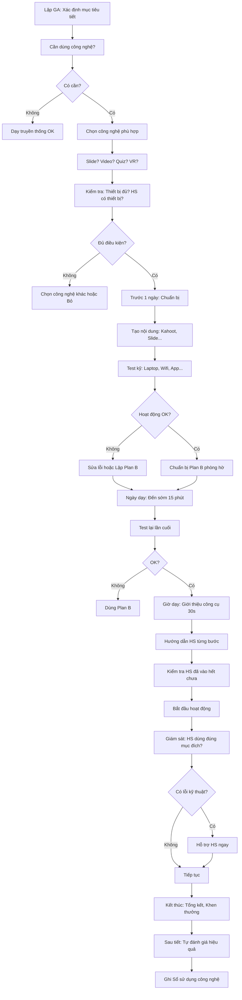

# SOP-03.3: SỬ DỤNG CÔNG NGHỆ TRONG GIẢNG DẠY

## 1. THÔNG TIN QUY TRÌNH

| **Thuộc tính** | **Nội dung** |
|---|---|
| Mã SOP | SOP-03.3 |
| Tên quy trình | Sử dụng công nghệ trong giảng dạy |
| Quy trình cha | SOP-03: Tổ chức giờ dạy |
| Phiên bản | 1.0 |
| Tần suất | Theo nhu cầu (Khuyến khích mỗi tiết) |

## 2. MỤC ĐÍCH

- **Nâng cao chất lượng**: Công nghệ giúp bài giảng sinh động, Dễ hiểu
- **Tăng engagement**: HS hứng thú hơn (So với chỉ nghe giảng)
- **Cá nhân hóa học tập**: Mỗi HS học theo tốc độ riêng (Adaptive Learning)
- **Chuẩn bị HS cho tương lai**: Thế kỷ 21 = Kỷ nguyên số

## 3. PHẠM VI ÁP DỤNG

Tất cả giáo viên, Khuyến khích dùng công nghệ ít nhất 30% thời gian tiết

## 4. CÔNG NGHỆ TRONG GIẢNG DẠY

### 4.1. Phân loại theo mục đích

| **Mục đích** | **Công nghệ** | **Ví dụ cụ thể** |
|---|---|---|
| **Trình chiếu** | Máy chiếu + Laptop | PowerPoint, Canva, Prezi |
| **Video giảng** | YouTube, Video tự quay | Khan Academy, Ted-Ed |
| **Tương tác** | App quiz | Kahoot, Quizizz, Mentimeter |
| **Quản lý lớp** | LMS | Google Classroom, Moodle |
| **Collaboration** | Công cụ cộng tác | Google Docs, Padlet, Jamboard |
| **Simulation** | Mô phỏng | PhET (Vật lý), Virtual Lab |
| **AR/VR** | Thực tế ảo | Google Expeditions, Merge Cube |
| **AI** | Trợ lý AI | ChatGPT (Tạo câu hỏi), Grammarly |

### 4.2. SAMR Model (Mức độ tích hợp công nghệ)

```
      CAO ↑
          │
    ┌─────────────────┐
    │ REDEFINITION    │  Tạo ra nhiệm vụ không thể
    │ (Tái định nghĩa)│  làm được nếu không có công nghệ
    └─────────────────┘  VD: HS làm video, Tạo website
          │
    ┌─────────────────┐
    │ MODIFICATION    │  Thay đổi đáng kể nhiệm vụ
    │ (Sửa đổi)       │  VD: HS cộng tác Google Docs real-time
    └─────────────────┘
  ════════════════════  ← Ngưỡng chuyển đổi (Transformation)
    ┌─────────────────┐
    │ AUGMENTATION    │  Nâng cao chức năng
    │ (Tăng cường)    │  VD: Dùng Kahoot thay câu hỏi miệng
    └─────────────────┘
          │
    ┌─────────────────┐
    │ SUBSTITUTION    │  Thay thế đơn giản
    │ (Thay thế)      │  VD: Slide thay bảng viết tay
    └─────────────────┘
          │
      THẤP ↓
```

**Mục tiêu:** ≥ 50% giờ dạy đạt mức Augmentation trở lên!

## 5. QUY TRÌNH SỬ DỤNG

### 5.1. Lựa chọn công nghệ phù hợp

**Bước 1: Xác định mục tiêu tiết học**

**Bước 2: Chọn công nghệ phù hợp**

**Ma trận lựa chọn:**

| **Mục tiêu** | **Công nghệ phù hợp** | **Ví dụ** |
|---|---|---|
| Trình bày kiến thức | Slide, Video | PowerPoint, YouTube |
| Kiểm tra nhanh | Quiz tương tác | Kahoot, Quizizz |
| Thảo luận, Chia sẻ ý kiến | Bảng tương tác | Padlet, Jamboard |
| Cộng tác viết | Tài liệu online | Google Docs |
| Thí nghiệm (Không có dụng cụ) | Lab ảo | PhET Simulations |
| Khám phá địa điểm | VR | Google Expeditions |

**Nguyên tắc chọn:**
- Phù hợp mục tiêu (Không dùng công nghệ vì... công nghệ!)
- Dễ sử dụng (GV và HS)
- Ổn định (Không hay bị lỗi)
- Miễn phí hoặc Giá hợp lý

**Bước 3: Kiểm tra sẵn có**

- Thiết bị có đủ không? (Laptop, Tablet, Wifi...)
- HS có thiết bị không? (Nếu cần HS dùng)
- Có tài khoản/Giấy phép không?

### 5.2. Chuẩn bị trước tiết

**Bước 4: Test kỹ càng (Trước 1 ngày)**

**Checklist test (QT05-CL13):**
```
□ Tải app/Truy cập website → OK?
□ Tạo tài khoản (Nếu cần) → Xong?
□ Tạo nội dung (VD: Kahoot quiz) → Xong?
□ Test trên thiết bị thực tế (Laptop, Tablet) → Hoạt động?
□ Test kết nối Wifi → Đủ mạnh?
□ Chuẩn bị Plan B (Nếu công nghệ hỏng) → Sẵn sàng?
```

**Ví dụ chuẩn bị Kahoot:**
1. Vào kahoot.com (Trước 1 ngày)
2. Create → Quiz
3. Thêm 10 câu hỏi + Hình ảnh
4. Test: Start → Join với 2 thiết bị (Laptop + Phone)
5. Chơi thử → OK?
6. Lưu PIN code
7. Sáng tiết dạy: Mở sẵn Kahoot trên laptop, Chờ bắt đầu

**Bước 5: Chuẩn bị thiết bị cho HS (Nếu cần)**

- Tablet: Sạc đầy pin, Cài app sẵn
- Wifi: Đảm bảo đủ băng thông (30 HS cùng online)

### 5.3. Trong giờ dạy

**Bước 6: Giới thiệu công cụ (30 giây - 1 phút)**

```
"Hôm nay chúng ta sẽ dùng Kahoot để ôn tập.
 Kahoot là trò chơi trắc nghiệm vui.
 Các em vào kahoot.it, Nhập mã này: [PIN]
 Ai chưa biết cách vào?"
```

**Bước 7: Hướng dẫn từng bước (Cho HS lần đầu - 2-3 phút)**

Demo trên màn hình lớn:
1. Mở trình duyệt
2. Vào kahoot.it
3. Nhập PIN
4. Nhập tên
5. Chờ bắt đầu

**Bước 8: Kiểm tra HS đã vào hết chưa**

Màn hình hiện số HS: "20/30 HS đã vào. Còn 10 em chưa vào, Cô chờ 1 phút."

**Bước 9: Bắt đầu hoạt động**

**Bước 10: Giám sát**

- Đi quanh lớp
- Giúp HS gặp lỗi kỹ thuật
- Đảm bảo HS dùng đúng mục đích (Không lướt web)

**Bước 11: Kết thúc, Tổng kết (1-2 phút)**

- "Top 3 em có điểm cao nhất: ..."
- Khen thưởng
- Nhận xét học thuật: "Câu 5 nhiều em sai. Chúng ta xem lại nhé!"

### 5.4. Sau tiết

**Bước 12: Đánh giá hiệu quả**

**Tự hỏi:**
- Công nghệ có giúp HS học tốt hơn không?
- Có vấn đề kỹ thuật gì?
- Thời gian dùng công nghệ: __% tiết
- Lần sau điều chỉnh gì?

**Bước 13: Ghi nhận vào Sổ (QT05-S05 - Sổ sử dụng công nghệ)**

| **Ngày** | **Lớp** | **Công nghệ** | **Mục đích** | **Hiệu quả** | **Vấn đề** |
|---|---|---|---|---|---|
| 12/11 | 3A | Kahoot | Ôn tập | Tốt, HS thích | 3 em Wifi yếu |

## 6. LƯU ĐỒ QUY TRÌNH



## 7. BIỂU MẪU LIÊN QUAN

| **Mã** | **Tên** |
|---|---|
| QT05-CL13 | Checklist test công nghệ |
| QT05-S05 | Sổ sử dụng công nghệ (GV) |
| QT05-F17 | Form đề xuất mua thiết bị/App |

## 8. TIÊU CHUẨN VÀ CHỈ TIÊU

| **Chỉ tiêu** | **Mục tiêu** |
|---|---|
| % giờ dạy có dùng công nghệ | ≥ 70% |
| % GV biết dùng công nghệ cơ bản | 100% |
| % GV biết dùng công nghệ nâng cao | ≥ 50% |
| Lỗi kỹ thuật gián đoạn giờ dạy | ≤ 2% |

## 9. TRÁCH NHIỆM CỤ THỂ

| **Vai trò** | **Trách nhiệm** |
|---|---|
| **GV** | Chọn công nghệ, Test, Sử dụng, Đánh giá |
| **IT** | Đào tạo GV, Hỗ trợ kỹ thuật, Mua thiết bị |
| **BGH** | Phân bổ ngân sách công nghệ |

## 10. LƯU Ý QUAN TRỌNG

- ⚠️ **Công nghệ là CÔNG CỤ, Không phải MỤC ĐÍCH**: Chỉ dùng khi thật sự cần!
- ✅ **Cân bằng**: 70% Công nghệ + 30% Tương tác trực tiếp
- ✅ **Luôn có Plan B**: Wifi mất, Máy hỏng → Vẫn dạy được!
- 🔥 **Đào tạo GV liên tục**: Công nghệ thay đổi nhanh!

## 11. PHỤ LỤC

### 11.1. TOP 10 công cụ khuyến khích dùng

| **Công cụ** | **Mục đích** | **Cấp** | **Giá** | **Đánh giá** |
|---|---|---|---|---|
| **Google Classroom** | Quản lý lớp, Giao bài | Tất cả | Free | ⭐⭐⭐⭐⭐ |
| **Kahoot** | Quiz vui | TH, THCS | Free + Pro | ⭐⭐⭐⭐⭐ |
| **Canva** | Thiết kế Slide, Poster | Tất cả | Free + Pro | ⭐⭐⭐⭐⭐ |
| **Loom** | Quay video màn hình | GV | Free | ⭐⭐⭐⭐ |
| **Padlet** | Bảng tương tác | Tất cả | Free + Pro | ⭐⭐⭐⭐ |
| **Quizizz** | Quiz tự học | TH, THCS | Free | ⭐⭐⭐⭐⭐ |
| **Mentimeter** | Khảo sát nhanh | THCS | Free + Pro | ⭐⭐⭐⭐ |
| **PhET** | Thí nghiệm ảo Vật lý | THCS | Free | ⭐⭐⭐⭐⭐ |
| **Quizlet** | Flashcard | Tất cả | Free | ⭐⭐⭐⭐ |
| **Scratch** | Lập trình cho trẻ em | TH, THCS | Free | ⭐⭐⭐⭐⭐ |

### 11.2. Kịch bản sử dụng công nghệ trong 1 tiết

**Tiết Toán lớp 3 - Bài "Phép nhân 2 chữ số" (40 phút):**

| **Phút** | **Hoạt động** | **Công nghệ** | **Mục đích** |
|---|---|---|---|
| **0-5** | Mở đầu: Video hoạt hình về phép nhân | YouTube | Thu hút, Động lực |
| **5-15** | Giảng: GV trình chiếu cách nhân | PowerPoint + Máy chiếu | Trực quan, Dễ hiểu |
| **15-25** | Thực hành: HS làm bài tập nhóm trên Google Docs | Google Docs | Cộng tác, GV xem real-time |
| **25-35** | Củng cố: Chơi Kahoot (10 câu) | Kahoot | Vui, Kiểm tra hiểu |
| **35-40** | Kết thúc: Giao bài tập trên Google Classroom | Google Classroom | Quản lý bài tập |

**Tổng thời gian dùng công nghệ:** 35/40 phút = **88%**  
**SAMR Level:** Augmentation → Modification (Cao!)

### 11.3. Xử lý sự cố kỹ thuật

**A. Wifi mất giữa tiết:**

**Plan B ngay lập tức (30 giây):**
```
GV: "Các em ơi, Wifi đang có vấn đề. 
     Chúng ta chuyển sang hoạt động khác nhé!"

→ Không dùng Kahoot (Cần Wifi)
→ Chuyển sang: Thảo luận nhóm (Giấy)
```

**B. Máy chiếu không lên hình:**

**Plan B:**
- Dùng TV trong lớp (Nếu có)
- Hoặc: In slide ra giấy A3, Dán bảng
- Hoặc: Vẽ lên bảng

**C. Quá nhiều HS cùng lúc vào → Wifi quá tải:**

**Giải pháp:**
- Chia nửa lớp vào trước, Nửa sau
- Hoặc: Giảm chất lượng video (240p thay vì 1080p)

### 11.4. Nguyên tắc an toàn khi dùng công nghệ

| **Nguyên tắc** | **Giải thích** |
|---|---|---|
| **Bảo vệ dữ liệu HS** | Không công khai thông tin cá nhân HS ra ngoài |
| **Lọc nội dung** | Chặn website không phù hợp (YouTube Safe Mode) |
| **Giám sát chặt** | HS không lướt web riêng |
| **Hạn chế thời gian màn hình** | Không 100% tiết đều nhìn màn hình (Mỏi mắt!) |
| **Dạy đạo đức số** | Không copy, Tôn trọng bản quyền, Không bắt nạt online |

## 12. FAQ

**Q1: Nếu trường không đủ thiết bị (Chỉ có 1 máy chiếu)?**  
A: Vẫn OK! GV dùng 1 máy chiếu cho cả lớp. Không nhất thiết mỗi HS 1 thiết bị.

**Q2: HS không có thiết bị ở nhà, Làm bài tập online thế nào?**  
A: Cho làm bài tập giấy thay thế. Hoặc Cho mượn Tablet (Nếu trường có).

**Q3: GV không biết dùng công nghệ?**  
A: Đào tạo! Tổ chức Workshop hàng tháng. GV trẻ hướng dẫn GV lớn tuổi.

**Q4: Có nên dùng AI (ChatGPT) trong giảng dạy không?**  
A: CÓ, Nhưng cẩn thận! Dùng để: Tạo câu hỏi, Ý tưởng bài giảng. KHÔNG để HS dùng ChatGPT làm bài tập thay!

---

**PHÊ DUYỆT**

| GV | Tổ trưởng | IT | Phó HT |
|---|---|---|---|
| [Họ tên] | [Họ tên] | [Họ tên] | [Họ tên] |
