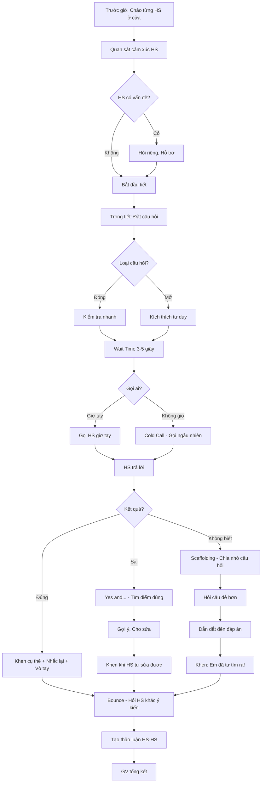

# SOP-03.4: TƯƠNG TÁC VÀ GIAO TIẾP VỚI HỌC SINH

## 1. THÔNG TIN QUY TRÌNH

| **Thuộc tính** | **Nội dung** |
|---|---|
| Mã SOP | SOP-03.4 |
| Tên quy trình | Tương tác và giao tiếp với học sinh |
| Quy trình cha | SOP-03: Tổ chức giờ dạy |
| Phiên bản | 1.0 |
| Tần suất | Mỗi tiết, Mỗi ngày |

## 2. MỤC ĐÍCH

- **Xây dựng mối quan hệ**: GV-HS tin tưởng, Tôn trọng lẫn nhau
- **Tăng tham gia**: HS muốn phát biểu, Đặt câu hỏi
- **Phát triển tư duy**: Câu hỏi tốt → HS suy nghĩ sâu
- **Môi trường an toàn**: HS không sợ bị chế giễu khi sai

## 3. NGUYÊN TẮC GIAO TIẾP

### 3.1. 5C của giao tiếp hiệu quả

| **Nguyên tắc** | **Giải thích** | **Ví dụ** |
|---|---|---|
| **Clear (Rõ ràng)** | Nói đơn giản, Dễ hiểu | "Các em mở SGK trang 25" (Rõ) ≠ "Các em xem sách nhé" (Mơ hồ) |
| **Concise (Ngắn gọn)** | Không dài dòng | Hướng dẫn trong 30 giây, Không 5 phút |
| **Concrete (Cụ thể)** | Có ví dụ | "Các em làm bài 1, 2, 3" ≠ "Các em làm mấy bài" |
| **Correct (Chính xác)** | Nội dung đúng | Kiểm tra kỹ trước khi nói |
| **Courteous (Lịch sự)** | Tôn trọng HS | "Em vui lòng ngồi xuống" ≠ "Ngồi xuống!" |

## 4. KỸ NĂNG GIAO TIẾP

### 4.1. Đặt câu hỏi

**A. Phân loại câu hỏi**

| **Loại** | **Mục đích** | **Ví dụ** | **Khi nào dùng** |
|---|---|---|---|
| **Câu hỏi đóng** | Kiểm tra kiến thức cơ bản | "2+3=?" | Warm-up, Ôn tập nhanh |
| **Câu hỏi mở** | Kích thích tư duy | "Tại sao lá cây lại rụng vào mùa thu?" | Khám phá, Thảo luận |
| **Câu hỏi Socratic** | Dẫn dắt suy luận | "Nếu ta tăng nhiệt độ thì nước sẽ thế nào?" | Phát triển logic |
| **Câu hỏi phân tích** | Phân tích sâu | "So sánh phép cộng và phép nhân?" | Mức độ cao |

**B. Kỹ thuật đặt câu hỏi hiệu quả**

**1. Wait Time (Thời gian chờ):**

```
GV hỏi: "Tại sao mặt trời mọc phía Đông?"
[ĐỪNG nói gì trong 3-5 giây!]
[Để HS suy nghĩ...]
Sau đó: "OK, Ai muốn trả lời?"
```

**Lợi ích:**
- HS có thời gian suy nghĩ → Trả lời tốt hơn
- Nhiều HS muốn trả lời hơn (Không chỉ HS nhanh nhất)
- Câu trả lời sâu sắc hơn

**2. No Opt-Out (Không cho "Thoát"):**

Đã giải thích ở SOP-03.2. Ôn lại:
```
GV: "Em A, 5 × 3 = ?"
HS A: "Em không biết ạ."
GV: "OK, Ai giúp Em A?" [Gọi HS B]
HS B: "15 ạ."
GV: "Đúng! Vậy Em A, Câu trả lời là?"
HS A: "15 ạ."
GV: "Giỏi lắm! Em đã biết rồi đấy!"
```

**3. Cold Call (Gọi ngẫu nhiên):**

Thay vì: "Ai biết câu trả lời?" (Chỉ HS giỏi giơ tay)

Làm: "Em C [Gọi bất ngờ], Câu trả lời là gì?"

**Lợi ích:**
- Tất cả HS phải sẵn sàng (Không ai "Ẩn" được!)
- HS yếu cũng được gọi → Có cơ hội tham gia

**Mẹo:** Dùng que HS (Popsicle sticks) - Mỗi que ghi tên 1 HS, Rút ngẫu nhiên!

**4. Bounce (Bật câu hỏi):**

```
GV: "Em D, Câu trả lời là gì?"
HS D: "20 ạ."
GV: "Em E, Em nghĩ bạn D đúng không?"
HS E: "Em nghĩ sai ạ."
GV: "Tại sao em nghĩ vậy?"
HS E: "Vì 5×3=15, Không phải 20."
GV: "Vậy Em D, Em nghĩ sao?"
HS D: "Em sai rồi ạ. Phải là 15."
GV: "Cả hai em đều giỏi! Một em dám nói, Một em giúp sửa!"
```

→ HS tương tác với nhau, Không chỉ GV!

**5. Think-Pair-Share (Nghĩ-Ghép đôi-Chia sẻ):**

```
GV: "Tại sao Trái Đất có 4 mùa? 
     Các em suy nghĩ 1 phút." [THINK]
[1 phút...]
GV: "Bây giờ thảo luận với bạn ngồi cạnh." [PAIR]
[2 phút...]
GV: "OK, Ai muốn chia sẻ?" [SHARE]
```

**Lợi ích:**
- HS nhút nhát dám nói (Nói với 1 bạn dễ hơn cả lớp!)
- Câu trả lời tốt hơn (Đã thảo luận)

### 4.2. Lắng nghe tích cực

**Bước 1: Khi HS nói - GV PHẢI:**

| **Làm** | **Không làm** |
|---|---|
| ✅ Nhìn vào HS | ❌ Nhìn xuống giấy, Nhìn máy tính |
| ✅ Gật đầu | ❌ Im lặng như tượng |
| ✅ Ghi lại ý chính lên bảng | ❌ Không ghi gì |
| ✅ Hỏi lại để xác nhận | ❌ Ngắt lời ngay |
| ✅ Khen "Hay đấy!" | ❌ Chỉ nói "Ừ" |

**Bước 2: Paraphrase (Diễn giải lại):**

```
HS: "Em nghĩ là vì Trái Đất quay quanh Mặt Trời."
GV: "Ồ, Vậy ý em là quỹ đạo của Trái Đất ảnh hưởng đến mùa, Đúng không?"
HS: "Dạ đúng ạ."
```

→ Đảm bảo GV hiểu đúng ý HS!

### 4.3. Khuyến khích tham gia

**Bước 3: Tạo môi trường an toàn**

**Văn hóa "No wrong answer" (Không có câu trả lời sai):**

```
HS: "Em nghĩ là 20 ạ."
GV KHÔNG nói: "Sai rồi!"
MÀ NÓI: "Cảm ơn em đã chia sẻ! Ai còn ý kiến khác?"

Sau khi có đáp án đúng:
GV: "Đáp án là 15. Em [HS trả lời 20] đã dám phát biểu, 
     Đó là điều tuyệt vời! Lần sau em sẽ đúng thôi!"
```

→ HS không sợ sai → Dám nói nhiều hơn!

**Bước 4: Khen cụ thể**

| **Khen chung chung (Không tốt)** | **Khen cụ thể (Tốt)** |
|---|---|
| "Giỏi!" | "Em giải thích rất rõ ràng từng bước!" |
| "Hay!" | "Ý tưởng của em rất sáng tạo!" |
| "Đúng rồi!" | "Em đã áp dụng công thức một cách chính xác!" |

**Bước 5: Gọi tên HS**

- Nhớ tên tất cả HS (Tuần đầu)
- Gọi tên khi hỏi: "Em Lan [Không phải "Em kia"]"
- Quan tâm cá nhân: "Em Mai hôm nay mặc áo đẹp nhỉ!"

### 4.4. Ngôn ngữ cơ thể (Body Language)

**Bước 6: GV sử dụng cơ thể hiệu quả**

| **Yếu tố** | **Nên** | **Không nên** |
|---|---|---|
| **Gương mặt** | Mỉm cười, Vui vẻ | Cau mày, Nghiêm trọng suốt |
| **Mắt** | Giao tiếp mắt với HS | Nhìn xuống giấy suốt |
| **Tay** | Cử chỉ mở, Chỉ bảng | Khoanh tay (Đóng) |
| **Vị trí** | Đi lại trong lớp, Đến gần HS | Đứng yên ở bục suốt 40 phút |
| **Tư thế** | Đứng thẳng, Tự tin | Gù lưng, Co ro |
| **Giọng nói** | Rõ ràng, Nhiệt tình, Thay đổi cao-thấp | Đều đều như robot, Nhỏ |

**Nguyên tắc "3V" của giao tiếp:**
- **V**erbal (Lời nói): 7%
- **V**ocal (Giọng điệu): 38%
- **V**isual (Hình ảnh - Cơ thể): 55%

→ Cơ thể quan trọng hơn lời nói!

## 5. XÂY DỰNG MỐI QUAN HỆ

### 5.1. Hàng ngày

**Bước 7: Chào hỏi cá nhân (Trước giờ học)**

```
GV đứng ở cửa, Chào từng HS:

"Chào em Lan! Hôm nay em có khỏe không?"
"Chào em Nam! Hôm qua em đá bóng vui không?"
[Ghi nhớ sở thích HS → Hỏi về nó → HS cảm thấy được quan tâm!]
```

**Bước 8: Quan tâm cảm xúc HS**

| **Dấu hiệu** | **Hỏi** | **Hành động** |
|---|---|---|
| HS buồn bã | "Em có chuyện gì không?" | Nói riêng, Hỗ trợ |
| HS vui bất thường | "Hôm nay em vui nhỉ?" | Chia vui |
| HS mệt mỏi | "Em có ốm không?" | Cho nghỉ, Gửi Y tế |

### 5.2. Hoạt động xây dựng quan hệ

**Bước 9: Dành thời gian cho "Morning Meeting" (Buổi sáng T2 - 15 phút)**

**Cấu trúc:**
1. **Greeting (Chào):** Chào nhau vui vẻ
2. **Sharing (Chia sẻ):** "Cuối tuần em làm gì?"
3. **Activity (Hoạt động):** Trò chơi nhỏ
4. **Morning Message (Thông điệp):** "Tuần này chúng ta cùng cố gắng nhé!"

**Bước 10: "2×10 Strategy"**

- Mỗi ngày dành 2 phút
- Nói chuyện với 10 HS
- Về chủ đề không liên quan học tập (Sở thích, Gia đình...)
- Trong 2 tuần → Nói chuyện được hết lớp!

**Lợi ích:** HS cảm thấy GV quan tâm → Học tốt hơn!

## 6. KỸ NĂNG GIAO TIẾP CỤ THỂ

### 6.1. Kỹ năng đặt câu hỏi (Mở rộng từ SOP-03.2)

**Bloom's Question Stems (Câu hỏi theo Bloom):**

| **Cấp độ** | **Câu hỏi mẫu** |
|---|---|
| **Nhớ** | • Em nhớ lại...?<br>• Định nghĩa của X là gì?<br>• Liệt kê... |
| **Hiểu** | • Em giải thích... bằng lời của em?<br>• Sự khác biệt giữa A và B?<br>• Tóm tắt... |
| **Vận dụng** | • Em sẽ giải quyết vấn đề này như thế nào?<br>• Áp dụng công thức vào bài này?<br>• Dùng kiến thức này vào đời sống? |
| **Phân tích** | • Tại sao...?<br>• Nguyên nhân của... là gì?<br>• Phân tích cấu trúc... |
| **Đánh giá** | • Em nghĩ cách nào tốt hơn? Tại sao?<br>• Đánh giá giải pháp A và B?<br>• Em có đồng ý với...? |
| **Sáng tạo** | • Em sẽ thiết kế...?<br>• Tạo ra một giải pháp mới?<br>• Nếu em là..., Em sẽ làm gì? |

**Bước 1: Hỏi từ dễ → Khó**

```
Câu 1 (Nhớ): "Công thức diện tích hình vuông là gì?"
Câu 2 (Hiểu): "Giải thích tại sao dùng công thức đó?"
Câu 3 (Vận dụng): "Tính diện tích sân trường?"
Câu 4 (Phân tích): "So sánh diện tích hình vuông và hình chữ nhật?"
Câu 5 (Sáng tạo): "Thiết kế một sân chơi 100m² sao cho đẹp?"
```

**Bước 2: Hỏi đa dạng cấp độ**

Mỗi tiết có:
- 40% câu Nhớ/Hiểu (Cơ bản)
- 40% câu Vận dụng/Phân tích (Trung bình)
- 20% câu Đánh giá/Sáng tạo (Cao)

### 6.2. Kỹ năng lắng nghe

**Bước 3: Lắng nghe tích cực (Active Listening)**

**SOLER Model:**

| **Ký tự** | **Ý nghĩa** | **Cách làm** |
|---|---|---|
| **S** | Sit/Stand squarely | Quay người về phía HS |
| **O** | Open posture | Tư thế mở (Không khoanh tay) |
| **L** | Lean forward | Nghiêng người về phía HS (Quan tâm) |
| **E** | Eye contact | Nhìn vào mắt HS |
| **R** | Relax | Thư giãn, Không căng thẳng |

**Bước 4: Phản hồi (Feedback)**

**3 loại phản hồi:**

| **Loại** | **Khi nào** | **Ví dụ** |
|---|---|---|
| **Positive** | HS trả lời đúng | "Chính xác! Em giải thích rất hay!" |
| **Corrective** | HS trả lời sai | "Gần đúng rồi! Nhưng em xem lại bước 2 nhé!" |
| **Probing** | Muốn HS nghĩ sâu hơn | "Hay đấy! Em có thể giải thích thêm không?" |

**Nguyên tắc phản hồi:**
- Ngay lập tức (Không chờ lâu)
- Cụ thể (Đúng/Sai ở đâu)
- Xây dựng (Giúp HS cải thiện)
- Công khai (Khen trước lớp)

### 6.3. Xử lý câu trả lời

**Bước 5: HS trả lời ĐÚNG**

```
GV: "Chính xác! [Khen]
     Các em nghe Em A giải thích nhé. [Nhắc lại cho cả lớp]
     Cả lớp vỗ tay cho Em A! [Khen công khai]"
```

**Bước 6: HS trả lời SAI**

**❌ KHÔNG làm:**
- "Sai rồi!" (Phủ định trực tiếp)
- "Em không nghe cô giảng à?" (Chỉ trích)
- "Ai biết câu trả lời đúng?" (Bỏ qua HS)

**✅ NÊN làm:**
```
Phương pháp "Yes, and..." (Vâng, và...):

HS: "Em nghĩ là 20 ạ."
GV: "Cảm ơn em đã chia sẻ! [Tôn trọng]
     Em đã nghĩ đến phép nhân, Rất tốt! [Tìm điểm đúng]
     Nhưng em xem lại: 5×3 có bằng 5+5+5 không? [Gợi ý]
     Em tính lại thử xem?" [Cho cơ hội sửa]

HS: "À, 15 ạ!"
GV: "Đúng rồi! Em đã tự sửa được, Giỏi lắm!" [Khen]
```

**Bước 7: HS trả lời "Em không biết"**

**Không bỏ qua! Dùng Scaffolding (Giàn giáo):**

```
GV: "Em B, 15 - 7 = ?"
HS B: "Em không biết ạ."
GV: "OK, Cô giúp em. 15 - 5 = ?"
HS B: "10 ạ."
GV: "Giỏi! Vậy 15 - 7 thì sao? (Gợi ý: 7 = 5 + 2)"
HS B: "À, 15 - 5 = 10, Rồi 10 - 2 = 8 ạ!"
GV: "Xuất sắc! Em đã tự tìm ra đáp án!"
```

## 7. LƯU ĐỒ QUY TRÌNH



## 8. BIỂU MẪU LIÊN QUAN

| **Mã** | **Tên** |
|---|---|
| QT05-CL14 | Checklist kỹ năng giao tiếp GV (Tự đánh giá) |
| QT05-F18 | Form phản hồi giao tiếp (HS đánh giá GV - Ẩn danh) |

## 9. TIÊU CHUẨN VÀ CHỈ TIÊU

| **Chỉ tiêu** | **Mục tiêu** |
|---|---|
| Tỷ lệ HS tham gia phát biểu | ≥ 60% HS/tiết |
| Wait Time trung bình | ≥ 3 giây |
| Câu hỏi mức cao (Phân tích, Sáng tạo) | ≥ 20% câu hỏi |
| HS hài lòng với giao tiếp GV | ≥ 4.3/5 (Khảo sát) |

## 10. TRÁCH NHIỆM

| **Vai trò** | **Trách nhiệm** |
|---|---|
| **GV** | Áp dụng kỹ năng giao tiếp, Tự đánh giá |
| **Tổ trưởng** | Quan sát, Góp ý cho GV |
| **Ban đào tạo** | Tổ chức Workshop kỹ năng giao tiếp |

## 11. LƯU Ý QUAN TRỌNG

- ⚠️ **Mối quan hệ là nền tảng**: HS thích GV → Học tốt hơn (Research chứng minh!)
- ✅ **Lắng nghe quan trọng bằng nói**: GV nói 30%, HS nói 70%!
- ✅ **Mỗi HS là cá nhân**: Gọi tên, Nhớ sở thích, Quan tâm cá nhân
- 🔥 **Phản hồi xây dựng**: Luôn tìm điểm tích cực, Dù HS trả lời sai!

## 12. PHỤ LỤC

### 12.1. Checklist tự đánh giá kỹ năng giao tiếp (QT05-CL14)

```
═══════════════════════════════════════════════════
  CHECKLIST TỰ ĐÁNH GIÁ KỸ NĂNG GIAO TIẾP GV
═══════════════════════════════════════════════════

GV: _______________  Ngày: ______  Lớp: _____

1. ĐẶT CÂU HỎI:
   □ Tôi đã dùng cả câu hỏi đóng và mở
   □ Tôi đã chờ 3-5 giây sau khi hỏi
   □ Tôi đã gọi cả HS không giơ tay
   □ Tôi đã bounce câu hỏi cho nhiều HS

2. LẮNG NGHE:
   □ Tôi nhìn vào HS khi HS nói
   □ Tôi gật đầu, Ghi lại ý chính
   □ Tôi không ngắt lời HS
   □ Tôi paraphrase lại để xác nhận

3. PHẢN HỒI:
   □ Tôi khen cụ thể (Không chung chung)
   □ Tôi không nói "Sai!" khi HS sai
   □ Tôi dùng "Yes, and..." để sửa lỗi
   □ Tôi khen ≥ 4 lần : 1 lần nhắc nhở

4. NGÔN NGỮ CƠ THỂ:
   □ Tôi mỉm cười
   □ Tôi giao tiếp mắt với HS
   □ Tôi đi lại trong lớp (Không đứng yên)
   □ Tôi dùng cử chỉ tay mở

5. XÂY DỰNG QUAN HỆ:
   □ Tôi chào từng HS hôm nay
   □ Tôi gọi tên HS (Không "Em kia")
   □ Tôi hỏi thăm HS buồn/Ốm
   □ Tôi dành 2 phút nói chuyện cá nhân với 10 HS

TỔNG: ___/20 (Mỗi mục 1 điểm)

ĐÁNH GIÁ:
□ Xuất sắc (18-20)
□ Tốt (15-17)
□ Cần cải thiện (< 15)

HÀNH ĐỘNG CẢI TIẾN:
_________________________________________________
═══════════════════════════════════════════════════
```

### 12.2. Các tình huống giao tiếp khó

**Tình huống 1: "HS trả lời hoàn toàn sai lệch"**

**Xử lý:**
```
GV: "Cảm ơn em đã suy nghĩ! [Tôn trọng]
     Câu trả lời của em rất...sáng tạo! [Tích cực]
     Nhưng cô nghĩ em đang nghĩ về Bài 5, Đúng không?
     Còn bài này về chủ đề khác.
     Em thử suy nghĩ lại nhé! [Gợi ý hướng đúng]
     Ai giúp Em [Tên] một chút?" [Gọi HS khác]
```

**Tình huống 2: "HS hỏi câu quá khó, GV không biết trả lời"**

**Xử lý (Trung thực):**
```
GV: "Ồ, Câu hỏi của em rất hay! [Khen]
     Nhưng cô cũng chưa biết câu trả lời chính xác. [Thành thật]
     Để cô về tìm hiểu và Trả lời em vào ngày mai nhé! [Cam kết]
     Hoặc các em có thể tìm hiểu về nhà, Ngày mai chia sẻ!" [Giao cho HS]
```

→ Không giả vờ biết! Thành thật = HS tôn trọng hơn!

**Tình huống 3: "Cả lớp im lặng, Không ai trả lời"**

**Xử lý:**
```
GV: "OK, Có vẻ câu hỏi này hơi khó.
     Chúng ta dùng Think-Pair-Share nhé!
     1 phút suy nghĩ.
     2 phút thảo luận với bạn bên cạnh.
     Sau đó cô sẽ gọi một vài em chia sẻ!"
```

## 13. FAQ

**Q1: Tôi hỏi nhưng chỉ có 3-4 HS giỏi giơ tay. Làm sao?**  
A: Dùng Cold Call (Gọi ngẫu nhiên) + Think-Pair-Share. Tạo văn hóa "Không sợ sai".

**Q2: HS hỏi câu không liên quan bài (VD: Giờ Toán hỏi về Khoa học)?**  
A: "Câu hỏi hay! Nhưng không thuộc bài hôm nay. Em ghi ra, Giờ Khoa học em hỏi cô Khoa học nhé!"

**Q3: Tôi không nhớ hết tên 30 HS?**  
A: Tuần đầu: Làm name tag (Bảng tên), HS để trên bàn. Chụp ảnh lớp, Học tên mỗi ngày 5 em.

---

**PHÊ DUYỆT**

| GV | Tổ trưởng | Trưởng BP HT |
|---|---|---|
| [Họ tên] | [Họ tên] | [Họ tên] |
