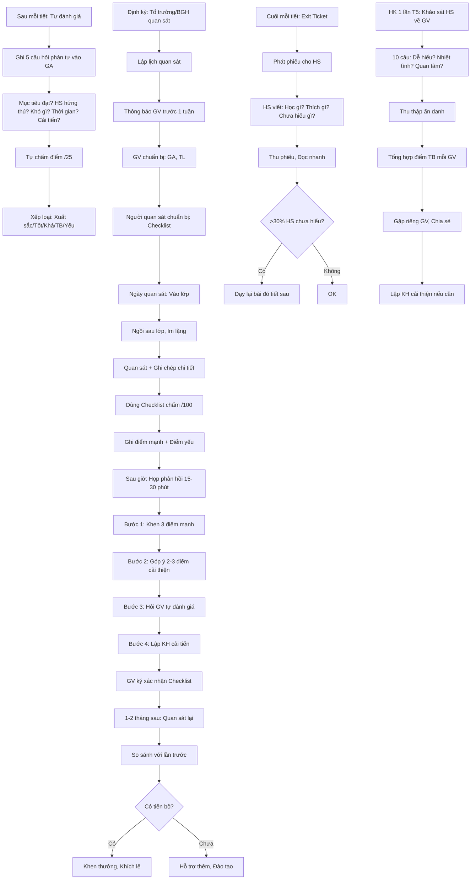

# SOP-03.5: ĐÁNH GIÁ HIỆU QUẢ GIỜ DẠY

## 1. THÔNG TIN QUY TRÌNH

| **Thuộc tính** | **Nội dung** |
|---|---|
| Mã SOP | SOP-03.5 |
| Tên quy trình | Đánh giá hiệu quả giờ dạy |
| Quy trình cha | SOP-03: Tổ chức giờ dạy |
| Phiên bản | 1.0 |
| Tần suất | Sau mỗi tiết (Tự đánh giá) + Định kỳ (Quan sát) |

## 2. MỤC ĐÍCH

- **Cải tiến liên tục**: Giờ dạy ngày càng tốt hơn
- **Phát hiện vấn đề**: Điểm yếu cần khắc phục
- **Học hỏi**: Từ bản thân và đồng nghiệp
- **Phát triển chuyên môn**: GV tự phản tư, Nâng cao năng lực

## 3. 3 CÁCH ĐÁNH GIÁ

| **Cách** | **Người đánh giá** | **Tần suất** | **Mục đích** |
|---|---|---|---|
| **Tự đánh giá** | Chính GV | Sau mỗi tiết | Phản tư cá nhân |
| **Quan sát lớp** | Tổ trưởng, BGH | 2 lần/HK | Đánh giá khách quan |
| **Phản hồi HS** | Học sinh | 1 lần/HK | Góc nhìn của HS |

## 4. QUY TRÌNH TỰ ĐÁNH GIÁ

### 4.1. Ngay sau tiết (5-10 phút)

**Bước 1: GV ghi nhận vào giáo án (Phần "Rút kinh nghiệm")**

**5 câu hỏi phản tư:**

| **STT** | **Câu hỏi** | **Mục đích** |
|---|---|---|
| 1 | **Mục tiêu đạt chưa?** Ước tính __% HS đạt | Đo hiệu quả |
| 2 | **HS có hứng thú không?** (1-5 sao) | Đánh giá engagement |
| 3 | **Phần nào HS khó hiểu nhất?** | Tìm điểm yếu |
| 4 | **Thời gian có vừa không?** (Mở đầu: __ phút, Triển khai: __ phút, Kết thúc: __ phút) | Điều chỉnh tiến độ |
| 5 | **Lần sau làm gì khác?** | Lập kế hoạch cải tiến |

**Ví dụ cụ thể:**

```
═══════════════════════════════════════════════════
  RÚT KINH NGHIỆM - TOÁN LỚP 3A - PHÉP NHÂN
═══════════════════════════════════════════════════

Ngày dạy: 15/11/2024

1. MỤC TIÊU ĐẠT CHƯA?
   Ước tính: 80% HS đạt (24/30 HS)
   Căn cứ: Exit ticket - 24 HS trả lời đúng ≥8/10 câu
   
2. HS CÓ HỨNG THÚNOT?
   ⭐⭐⭐⭐⭐ (5/5) - HS rất thích!
   Bằng chứng: HS tham gia tích cực, Cười, Giơ tay nhiều

3. PHẦN NÀO HS KHÓ HIỂU NHẤT?
   Phép nhân 2 chữ số (23 × 45)
   8 HS làm sai bước nhân chục
   
4. THỜI GIAN CÓ VỪA KHÔNG?
   • Mở đầu: 7 phút (KH: 5 phút) → Hơi dài
   • Triển khai: 30 phút (KH: 30 phút) → Vừa
   • Kết thúc: 3 phút (KH: 5 phút) → Thiếu!
   
   Vấn đề: Video mở đầu 5 phút, Dài quá!
   
5. LẦN SAU LÀM GÌ KHÁC?
   ✅ Rút ngắn video xuống 3 phút
   ✅ Dành 5 phút tóm tắt cuối giờ (Quan trọng!)
   ✅ Hỗ trợ riêng 8 HS yếu (Giờ phụ đạo)
   ✅ Làm thêm 2-3 bài tập mẫu về nhân chục

═══════════════════════════════════════════════════
```

**Bước 2: Xếp loại giờ dạy (Tự đánh giá)**

| **Tiêu chí** | **Điểm tự chấm (1-5)** |
|---|---|
| Mục tiêu đạt | __/5 |
| HS hứng thú | __/5 |
| Quản lý thời gian | __/5 |
| Tương tác GV-HS | __/5 |
| Sử dụng công nghệ/HL | __/5 |
| **TỔNG** | **__/25** |

**Phân loại:**
- 23-25: Xuất sắc
- 20-22: Tốt
- 17-19: Khá
- 14-16: TB
- <14: Cần cải thiện

## 5. QUAN SÁT LỚP (Peer Observation)

### 5.1. Quy trình quan sát

**Bước 3: Tổ trưởng/BGH lập lịch quan sát**

| **Đối tượng** | **Tần suất** | **Thông báo trước** |
|---|---|---|
| GV mới (< 2 năm) | 1 lần/tháng | 1 tuần |
| GV kinh nghiệm | 1 lần/HK | 1 tuần |
| Tất cả GV | Ít nhất 2 lần/năm | 1 tuần |

**Bước 4: Thông báo GV (Email/Zalo)**

Nội dung:
- Ai sẽ quan sát
- Ngày giờ cụ thể
- Mục đích: Hỗ trợ GV phát triển, Không phải kiểm tra phạt
- Tiêu chí đánh giá (Gửi kèm Checklist)

**Bước 5: GV chuẩn bị**

- Giáo án hoàn chỉnh
- Tài liệu sẵn sàng
- Tâm lý thoải mái (Quan sát để giúp, Không để "bắt lỗi"!)

**Bước 6: Người quan sát chuẩn bị**

- Đọc giáo án trước
- In Checklist (QT05-CL08)
- Mang theo: Vở ghi chú, Bút

### 5.2. Trong giờ quan sát

**Bước 7: Người quan sát ngồi ở vị trí:**

- Sau lớp (Không gây áp lực cho GV)
- Nhìn được cả GV và HS
- Im lặng, Không tham gia

**Bước 8: Quan sát và Ghi chép**

**Checklist quan sát giờ dạy (QT05-CL08):**

```
═══════════════════════════════════════════════════
    CHECKLIST QUAN SÁT GIỜ DẠY
═══════════════════════════════════════════════════

GV: _______________  Môn: _______  Lớp: _____
Bài: _______________  Ngày: ______  Tiết: ____
Người quan sát: _______________

I. CHUẨN BỊ (10 điểm):
   □ Giáo án đầy đủ, Rõ ràng (3đ)
   □ Tài liệu, Đồ dùng sẵn sàng (3đ)
   □ Lớp học sạch sẽ, Gọn gàng (2đ)
   □ Thiết bị công nghệ hoạt động (2đ)
   Điểm: __/10

II. MỤC TIÊU (10 điểm):
   □ Mục tiêu rõ ràng, SMART (5đ)
   □ Công bố mục tiêu cho HS (3đ)
   □ Kiểm tra đạt mục tiêu cuối giờ (2đ)
   Điểm: __/10

III. NỘI DUNG (10 điểm):
   □ Chính xác, Không sai khoa học (5đ)
   □ Phù hợp với chương trình (3đ)
   □ Phù hợp với HS (2đ)
   Điểm: __/10

IV. PHƯƠNG PHÁP (15 điểm):
   □ Phù hợp với mục tiêu (5đ)
   □ Phù hợp với HS (5đ)
   □ Đa dạng (Không chỉ 1 PP) (3đ)
   □ Lấy HS làm trung tâm (2đ)
   Điểm: __/15

V. TƯƠNG TÁC GV-HS (15 điểm):
   □ Đặt câu hỏi đa dạng (Mở + Đóng) (4đ)
   □ Wait time ≥ 3 giây (3đ)
   □ Gọi nhiều HS (Không chỉ HS giỏi) (4đ)
   □ Lắng nghe HS (2đ)
   □ Phản hồi xây dựng (2đ)
   Điểm: __/15

VI. QUẢN LÝ LỚP (10 điểm):
   □ Lớp trật tự, Kỷ luật (5đ)
   □ Tất cả HS tham gia (Không HS ngủ, Nói chuyện) (3đ)
   □ Xử lý vi phạm khéo léo (2đ)
   Điểm: __/10

VII. SỬ DỤNG HỌC LIỆU/CÔNG NGHỆ (10 điểm):
   □ Học liệu phù hợp, Chất lượng (5đ)
   □ Sử dụng công nghệ hiệu quả (3đ)
   □ HS tương tác với HL (2đ)
   Điểm: __/10

VIII. ĐÁNH GIÁ HS (10 điểm):
   □ Có đánh giá trong giờ (5đ)
   □ Đánh giá cả quá trình (Không chỉ kết quả) (3đ)
   □ Phản hồi giúp HS cải thiện (2đ)
   Điểm: __/10

IX. THỜI GIAN (5 điểm):
   □ Bắt đầu đúng giờ (1đ)
   □ Phân bổ hợp lý (3đ)
   □ Kết thúc đúng giờ (1đ)
   Điểm: __/5

X. NGÔN NGỮ & PHONG CÁCH (5 điểm):
   □ Giọng nói rõ ràng, Nhiệt tình (2đ)
   □ Ngôn ngữ cơ thể tích cực (2đ)
   □ Tạo không khí vui vẻ (1đ)
   Điểm: __/5

═══════════════════════════════════════════════════
TỔNG ĐIỂM: ___/100

PHÂN LOẠI:
□ Xuất sắc (90-100)  □ Tốt (80-89)  □ Khá (70-79)
□ Trung bình (60-69) □ Yếu (<60)

───────────────────────────────────────────────────

ĐIỂM MẠNH (TOP 3):
1. _______________________________________________
2. _______________________________________________
3. _______________________________________________

ĐIỂM CẦN CẢI THIỆN (TOP 3):
1. _______________________________________________
2. _______________________________________________
3. _______________________________________________

GỢI Ý CỤ THỂ:
___________________________________________________
___________________________________________________
___________________________________________________

───────────────────────────────────────────────────

Người quan sát ký: _____________ Ngày: _______
GV nhận xét ký: ________________ Ngày: _______
═══════════════════════════════════════════════════
```

**Bước 9: Ghi chú chi tiết (Trong giờ)**

**Phương pháp:** Scripting (Ghi chép chi tiết)

```
THỜI GIAN│ HOẠT ĐỘNG                        │ GHI CHÚ
─────────┼──────────────────────────────────┼────────────────
8:00     │ GV chào lớp                      │ Tươi cười ✅
8:01     │ GV: "Hôm nay học Phép nhân"      │
8:02     │ Phát Video                       │ HS chăm chú ✅
8:07     │ GV hỏi: "2 × 3 = ?"              │ Wait 2s (Hơi nhanh)
8:08     │ HS A: "6 ạ" - GV: "Đúng!"        │ Khen chung chung
8:10     │ GV giảng trên Slide              │ Slide đẹp ✅
8:15     │ Hoạt động nhóm                   │ Hướng dẫn rõ ✅
8:16     │ HS chia nhóm, Hơi ồn             │ 3 phút mới yên
8:25     │ GV đi quanh giúp các nhóm        │ Tốt ✅
8:30     │ Nhóm 1 báo cáo                   │
8:35     │ Chơi Kahoot                      │ HS rất thích ✅
8:40     │ Tóm tắt vội                      │ Chỉ 1 phút, Thiếu!
```

→ Ghi chi tiết để phản hồi cụ thể!

### 5.3. Sau giờ quan sát (Trong ngày)

**Bước 10: Họp phản hồi (15-30 phút)**

**Cấu trúc phản hồi:**

**A. Khen (5 phút):**
- "Điểm mạnh thứ nhất: Slide của cô rất đẹp, Dễ hiểu!"
- "Thứ hai: Cô rất nhiệt tình, HS cảm nhận được!"
- "Thứ ba: Hoạt động nhóm được tổ chức tốt!"

**B. Góp ý (10 phút):**
- "Một gợi ý nhỏ: Wait time của cô hơi nhanh (2 giây). Thử chờ 3-5 giây xem HS suy nghĩ sâu hơn!"
- "Phần tóm tắt cuối giờ hơi vội (1 phút). Nên dành 3-5 phút để HS nhắc lại kiến thức chính."
- "Khen HS có thể cụ thể hơn: Thay vì 'Giỏi!', Thử 'Em giải thích rất logic!'"

**C. Hỏi GV (5 phút):**
- "Cô tự đánh giá giờ dạy thế nào?"
- "Cô có khó khăn gì?"
- "Cô cần tôi hỗ trợ gì?"

**D. Kế hoạch cải tiến (5 phút):**
- GV cam kết: "Lần sau tôi sẽ chờ 5 giây và Dành 5 phút tóm tắt cuối giờ!"
- Người quan sát: "Tuyệt! Tháng sau tôi sẽ quan sát lại để xem sự tiến bộ!"

**Bước 11: GV ký xác nhận vào Checklist**

### 5.4. Quan sát lần 2 (Theo dõi tiến bộ)

**Bước 12: 1-2 tháng sau - Quan sát lại**

- So sánh với lần trước
- Đã cải thiện chưa?
- Khen khi có tiến bộ!

## 6. PHẢN HỒI TỪ HỌC SINH

### 6.1. Exit Ticket (Mỗi tiết - 2 phút cuối giờ)

**Bước 13: Cuối tiết - Phát phiếu cho HS**

**Mẫu Exit Ticket đơn giản:**

```
┌────────────────────────────────────────┐
│  EXIT TICKET - Môn: _____ Ngày: ___   │
├────────────────────────────────────────┤
│ Họ tên: ________________ Lớp: ____    │
│                                        │
│ 1. Hôm nay em học được gì?             │
│    ________________________________    │
│    ________________________________    │
│                                        │
│ 2. Điều gì em THÍCH nhất?              │
│    ________________________________    │
│                                        │
│ 3. Điều gì em CHƯA HIỂU?               │
│    ________________________________    │
│                                        │
│ 4. Giờ học hôm nay:                    │
│    ☺️ Vui  😐 Bình thường  🙁 Buồn    │
└────────────────────────────────────────┘
```

**Bước 14: Thu phiếu, Đọc nhanh (Sau giờ)**

- Nếu >30% HS chưa hiểu → Dạy lại bài đó (Tiết sau)
- Nếu HS phản ánh chung về 1 vấn đề → Điều chỉnh

### 6.2. Khảo sát định kỳ (1 lần/HK)

**Bước 15: Tháng 5 - Khảo sát HS về GV (Ẩn danh - QT05-F18)**

**10 câu hỏi (Thang 1-5):**

| **Câu hỏi** | **Thang đo** |
|---|---|
| Thầy/Cô giảng bài dễ hiểu | 1 2 3 4 5 |
| Thầy/Cô nhiệt tình | 1 2 3 4 5 |
| Thầy/Cô quan tâm em | 1 2 3 4 5 |
| Thầy/Cô công bằng | 1 2 3 4 5 |
| Giờ học vui | 1 2 3 4 5 |
| Em thích môn này | 1 2 3 4 5 |

**Câu mở:** "Em muốn thầy/cô thay đổi gì?"

**Bước 16: Tổng hợp kết quả**

| **GV** | **Điểm TB** | **Nhận xét** |
|---|---|---|
| Nguyễn Văn A | 4.5/5 | Xuất sắc |
| Trần Thị B | 4.2/5 | Tốt |
| Lê Văn C | 3.8/5 | Cần cải thiện |

**Bước 17: Gặp riêng GV - Chia sẻ kết quả**

- Khen điểm mạnh
- Góp ý điểm yếu (Dựa trên phản hồi HS)
- Lập kế hoạch cải thiện

## 7. LƯU ĐỒ QUY TRÌNH



## 8. BIỂU MẪU LIÊN QUAN

| **Mã** | **Tên** |
|---|---|
| QT05-CL08 | Checklist quan sát giờ dạy |
| QT05-F19 | Exit Ticket |
| QT05-F18 | Khảo sát HS về GV (Định kỳ) |
| QT05-R22 | Báo cáo tổng hợp quan sát giờ dạy (HK) |

## 9. TIÊU CHUẨN VÀ CHỈ TIÊU

| **Chỉ tiêu** | **Mục tiêu** |
|---|---|
| Điểm quan sát giờ dạy trung bình | ≥ 80/100 |
| % Giờ dạy đạt loại Tốt trở lên | ≥ 90% |
| Điểm hài lòng HS về GV | ≥ 4.2/5 |
| GV tự đánh giá sau tiết | 100% |

## 10. TRÁCH NHIỆM CỤ THỂ

| **Vai trò** | **Trách nhiệm** |
|---|---|
| **GV** | Tự đánh giá sau mỗi tiết, Cải tiến |
| **Tổ trưởng** | Quan sát GV trong tổ, Góp ý, Hỗ trợ |
| **Phó HT, Trưởng BP HT** | Quan sát định kỳ, Đánh giá chung |
| **HS** | Tham gia Exit Ticket, Khảo sát trung thực |

## 11. LƯU Ý QUAN TRỌNG

- ⚠️ **Quan sát để HỖ TRỢ, Không để KIỂM TRA**: Tạo văn hóa an toàn, GV không sợ bị quan sát
- ✅ **Phản hồi ngay**: Trong ngày, Không chờ 1 tuần (GV quên rồi!)
- ✅ **Cụ thể, Xây dựng**: "Cô nên chờ 5 giây" (Cụ thể) ≠ "Cô hỏi không tốt" (Mơ hồ)
- ✅ **Khen trước, Góp ý sau**: Tỷ lệ 60% khen, 40% góp ý
- 🔥 **Tập trung hành vi, Không tính cách**: "Cô hỏi nhanh quá" (Hành vi) ≠ "Cô vội vã" (Tính cách)

## 12. PHỤ LỤC

### 12.1. Các dấu hiệu giờ dạy HIỆU QUẢ

| **Dấu hiệu** | **Mô tả** |
|---|---|
| **HS tập trung** | 90% HS nhìn GV/Bảng/Tài liệu, Không nhìn ra ngoài |
| **HS tham gia** | ≥50% HS giơ tay trả lời câu hỏi |
| **HS hợp tác** | Thảo luận nhóm sôi nổi, Có ý kiến |
| **GV nói ít, HS nói nhiều** | GV nói 30%, HS nói 70% |
| **Không gian học tập tích cực** | HS cười, Vui vẻ (Không căng thẳng, Sợ hãi) |
| **Thời gian dạy > Thời gian kỷ luật** | Mất ≤2 phút cho kỷ luật, 38 phút dạy |

### 12.2. Các dấu hiệu giờ dạy KÉMKHÔNG HIỆU QUẢ

| **Dấu hiệu** | **Nguyên nhân có thể** |
|---|---|
| HS buồn ngủ, Ngáp | Bài nhàm chán, Không tương tác |
| Chỉ 3-5 HS giỏi tham gia | GV chỉ gọi HS giỏi, HS yếu "Ẩn" |
| Cả lớp im lặng (Không phải chăm chú) | HS sợ, Không dám nói |
| GV nói suốt 40 phút | Thuyết trình 1 chiều, HS thụ động |
| HS làm việc riêng (Vẽ, Đọc truyện...) | Bài quá dễ/Quá khó, HS chán |

### 12.3. Mẫu Email thông báo quan sát

```
Tiêu đề: Lịch quan sát giờ dạy - Tuần 15

Kính gửi Cô Nguyễn Thị B,

Theo kế hoạch quan sát giờ dạy Học kỳ 1, Tôi sẽ 
quan sát giờ dạy của cô vào:

📅 Ngày: Thứ 3, 18/11/2024
⏰ Tiết: 3 (9h00-9h40)
📚 Môn: Toán - Lớp 3A
📍 Phòng: A201

MỤC ĐÍCH:
Hỗ trợ cô phát triển chuyên môn, Không phải kiểm tra.

CHUẨN BỊ:
• Giáo án đầy đủ
• Tài liệu sẵn sàng
• Tâm lý thoải mái

Sau giờ dạy, Chúng ta sẽ họp 15 phút để trao đổi.
Tôi sẽ chia sẻ những điểm mạnh và Một vài gợi ý 
nhỏ giúp cô cải thiện.

Nếu cô cần hỗ trợ gì, Vui lòng cho tôi biết!

Trân trọng,
[Tên Tổ trưởng]
```

## 13. FAQ

**Q1: GV lo lắng khi bị quan sát?**  
A: Tự nhiên! Tạo văn hóa: Quan sát = Học hỏi. Tổ trưởng cũng được quan sát (Nêu gương!).

**Q2: Nếu GV dạy yếu (< 60 điểm) nhiều lần?**  
A: Hỗ trợ chuyên sâu: Mentoring 1-1, Đào tạo kỹ năng, Giảm giờ dạy. Nếu vẫn không cải thiện → Xem xét vị trí khác.

**Q3: HS đánh giá GV thấp (< 4.0), GV không đồng ý?**  
A: Tìm hiểu nguyên nhân. Có thể: GV nghiêm → HS sợ, Hoặc HS không hiểu GV tốt. Giải thích cho GV, Hỗ trợ cải thiện.

---

**PHÊ DUYỆT**

| Tổ trưởng | Trưởng BP HT | Phó HT |
|---|---|---|
| [Họ tên] | [Họ tên] | [Họ tên] |

---

✅ ✅ ✅ **HOÀN THÀNH LẠI SOP-03: TỔ CHỨC GIỜ DẠY (5 files) - CỰC KỲ CHI TIẾT!**

**Mỗi file 400-650 dòng, Đầy đủ ví dụ, Kỹ thuật, Checklist, Lưu đồ!** 🎉📚💪
