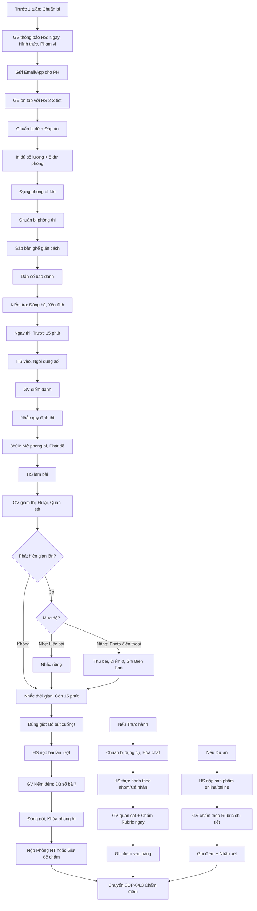

# SOP-04.2: THỰC HIỆN ĐÁNH GIÁ

## 1. THÔNG TIN QUY TRÌNH

| **Thuộc tính** | **Nội dung** |
|---|---|
| Mã SOP | SOP-04.2 |
| Tên quy trình | Thực hiện đánh giá |
| Quy trình cha | SOP-04: Kiểm tra - Đánh giá |
| Phiên bản | 1.0 |
| Tần suất | Theo kế hoạch (Thường xuyên, Giữa HK, Cuối HK) |

## 2. MỤC ĐÍCH

- **Đo lường chính xác**: Biết HS đạt mục tiêu chưa
- **Công bằng**: Mọi HS đều được đánh giá như nhau
- **Minh bạch**: HS, PH hiểu rõ cách đánh giá
- **Giảm gian lận**: Quy trình chặt chẽ

## 3. PHÂN LOẠI ĐÁNH GIÁ

### 3.1. Theo thời điểm

| **Loại** | **Thời điểm** | **Mục đích** | **Tần suất** |
|---|---|---|---|
| **Đánh giá chẩn đoán** | Đầu năm/HK | Xác định trình độ ban đầu | 2 lần/năm |
| **Đánh giá hình thành** | Trong quá trình học | Theo dõi tiến bộ, Điều chỉnh | Liên tục |
| **Đánh giá tổng kết** | Giữa/Cuối HK | Đo kết quả học tập | 4 lần/năm |

### 3.2. Theo hình thức

| **Hình thức** | **Ưu điểm** | **Nhược điểm** | **Khi nào dùng** |
|---|---|---|---|
| **Trắc nghiệm** | Chấm nhanh, Khách quan | Không đo tư duy sâu | Kiến thức cơ bản, Số HS đông |
| **Tự luận** | Đo tư duy, Sáng tạo | Chấm lâu, Chủ quan | Môn văn, Kỹ năng viết |
| **Vấn đáp** | Linh hoạt, Đo sâu | Mất thời gian | Số HS ít, Đánh giá kỹ năng |
| **Thực hành** | Đo kỹ năng thực tế | Cần thiết bị | Khoa học, Tin học, Thể dục |
| **Dự án** | Đo tổng hợp | Mất nhiều thời gian | Đánh giá cuối chủ đề |

## 4. QUY TRÌNH THỰC HIỆN

### 4.1. Chuẩn bị (Trước 1 tuần)

**Bước 1: GV thông báo cho HS về kỳ kiểm tra**

**Nội dung thông báo:**
- Ngày, Giờ, Địa điểm
- Hình thức (Trắc nghiệm/Tự luận/Thực hành...)
- Phạm vi (Bài 1-10)
- Thời gian làm bài (45 phút, 90 phút...)
- Được mang gì (Máy tính, Từ điển...)
- Không được mang gì (Điện thoại, Tài liệu...)

**Bước 2: Gửi thông báo cho PH (Email/App)**

**Bước 3: GV ôn tập với HS (2-3 tiết trước kiểm tra)**

- Tóm tắt kiến thức chính
- Làm đề mẫu
- Hướng dẫn kỹ năng làm bài

**Bước 4: Chuẩn bị đề + Đáp án**

- In đủ số lượng (Số HS + 5 bản dự phòng)
- Đựng trong phong bì kín
- Đáp án riêng (Cho GV chấm)

**Bước 5: Chuẩn bị phòng thi**

- Sắp xếp bàn ghế: Giãn cách (1-1.5m)
- Dán số báo danh lên bàn
- Chuẩn bị giấy nháp (Nếu cần)
- Kiểm tra phòng: Đồng hồ, Yên tĩnh

### 4.2. Trong kỳ kiểm tra

**A. Kiểm tra trắc nghiệm/Tự luận**

**Bước 6: Trước giờ thi (15 phút)**

- HS vào phòng, Ngồi đúng số báo danh
- GV kiểm tra danh sách (Điểm danh)
- GV nhắc lại quy định thi

**Quy định thi:**

| **Được phép** | **Không được phép** |
|---|---|
| Bút, Thước, Máy tính (Nếu cho phép) | Điện thoại, Tài liệu |
| Hỏi GV nếu không hiểu đề | Hỏi bạn |
| Giơ tay xin giấy nháp | Ra khỏi phòng (Trừ ốm đột xuất) |

**Bước 7: Phát đề (8h00 đúng)**

- Mở phong bì trước mặt HS (Minh bạch!)
- Phát từng bài
- Kiểm tra: HS nhận đủ tờ chưa?

**Bước 8: HS làm bài**

**GV giám thị:**
- Đi lại trong lớp (Không ngồi yên)
- Quan sát: Có HS gian lận không?
- Hỗ trợ: HS hỏi đề → Giải thích (Nếu đề mơ hồ)
- Nhắc thời gian: "Còn 15 phút!"

**Dấu hiệu gian lận:**
- Liếc bài bạn
- Giấu tài liệu dưới bàn
- Viết lên tay/Bàn
- Điện thoại rung

**Xử lý gian lận:**
1. Lần 1: Nhắc nhở riêng (Không công khai)
2. Lần 2: Ghi vào Biên bản, Báo Tổ trưởng
3. Nghiêm trọng (Photo điện thoại): Thu bài, Điểm 0, Thông báo PH

**Bước 9: Thu bài**

- Đúng giờ kết thúc: "Bỏ bút xuống!"
- HS nộp bài lần lượt (Không chen lấn)
- GV kiểm đếm: Đủ số bài không?

**Bước 10: Đóng gói bài thi**

- Cho vào phong bì
- Ghi: Môn, Lớp, Số bài, Ngày
- Khóa kín
- Nộp Phòng Học thuật (Hoặc GV giữ để chấm)

**B. Kiểm tra thực hành (VD: Thí nghiệm Khoa học)**

**Bước 11: Chuẩn bị**

- Dụng cụ thí nghiệm đủ (Theo số nhóm)
- Hóa chất an toàn
- Bảo hộ lao động (Kính, Găng tay...)

**Bước 12: HS thực hành (Theo nhóm hoặc Cá nhân)**

**Bước 13: GV quan sát và Chấm điểm (Dùng Rubric)**

| **Tiêu chí** | **1đ** | **2đ** | **3đ** | **4đ** |
|---|---|---|---|---|
| Thao tác đúng | Sai nhiều | Đúng 1 phần | Đúng hầu hết | Hoàn hảo |
| Kết quả | Sai | Gần đúng | Đúng | Chính xác |
| An toàn | Vi phạm | Chưa cẩn thận | Cẩn thận | Rất cẩn thận |
| Thời gian | Quá lâu | Hơi lâu | Vừa | Nhanh, Hiệu quả |

**C. Đánh giá dự án (VD: Làm video, Website...)**

**Bước 14: HS nộp sản phẩm (Theo deadline)**

- Online: Upload lên Google Classroom
- Offline: Nộp USB/Bản in

**Bước 15: GV chấm theo Rubric (Chi tiết - QT05-R03)**

### 4.3. Đánh giá hình thành (Liên tục)

**Không phải kỳ thi chính thức!**

**Các phương pháp:**

| **Phương pháp** | **Cách làm** | **Tần suất** |
|---|---|---|
| **Exit Ticket** | 2-3 câu cuối giờ | Mỗi tiết |
| **Kahoot/Quizizz** | Quiz online | 1-2 lần/tuần |
| **Kiểm tra miệng** | Hỏi nhanh 5-10 HS | Mỗi tiết |
| **Quan sát** | Quan sát HS làm bài, Thảo luận | Mỗi tiết |
| **Bài tập về nhà** | Kiểm tra BT | Mỗi ngày |

**Mục đích:** Phát hiện HS chưa hiểu → Hỗ trợ ngay (Không chờ đến cuối HK!)

## 5. LƯU ĐỒ QUY TRÌNH

## 6. BIỂU MẪU LIÊN QUAN

| **Mã** | **Tên** |
|---|---|
| QT05-F20 | Thông báo kiểm tra (Gửi HS, PH) |
| QT05-F21 | Biên bản giám thị |
| QT05-F22 | Biên bản xử lý gian lận |
| QT05-R03 | Rubric đánh giá dự án |

## 7. TIÊU CHUẨN VÀ CHỈ TIÊU

| **Chỉ tiêu** | **Mục tiêu** |
|---|---|
| Kiểm tra đúng lịch | 100% |
| Gian lận | < 1% HS |
| HS vắng thi (Không lý do) | < 2% |
| Khiếu nại về công bằng | 0 lần |

## 8. TRÁCH NHIỆM CỤ THỂ

| **Vai trò** | **Trách nhiệm** |
|---|---|
| **GV** | Thông báo, Chuẩn bị, Giám thị, Chấm |
| **Phòng HT** | Lưu đề thi, Hỗ trợ in ấn |
| **HS** | Tuân thủ quy định, Không gian lận |

## 9. LƯU Ý QUAN TRỌNG

- ⚠️ **Công bằng tuyệt đối**: Mọi HS đều làm bài như nhau (Không ưu ái!)
- ✅ **Giám thị nghiêm**: Gian lận phá hỏng đánh giá
- ✅ **Hỗ trợ HS đặc biệt**: HS khuyết tật → Thời gian thêm, Hình thức khác
- 🔥 **Bảo mật đề thi**: Không để lộ đề trước kỳ thi!

## 10. PHỤ LỤC

### 10.1. Quy định giám thị

**GV giám thị PHẢI:**
- ✅ Đến đúng giờ (Trước 15 phút)
- ✅ Điểm danh đầy đủ
- ✅ Đi lại liên tục (Không ngồi yên)
- ✅ Im lặng (Không nói chuyện điện thoại)
- ✅ Quan sát kỹ mọi HS

**GV giám thị KHÔNG được:**
- ❌ Đến muộn
- ❌ Ra khỏi phòng (Trừ khẩn cấp)
- ❌ Ngồi chơi điện thoại
- ❌ Đọc sách, Chấm bài
- ❌ Gợi ý đáp án cho HS

### 10.2. Xử lý tình huống

**Tình huống 1: "HS ốm giữa giờ thi"**

**Xử lý:**
1. Cho HS đến Y tế
2. Ghi Biên bản: Giờ nào, Lý do gì
3. Tùy mức độ:
   - Ốm nhẹ, Về làm tiếp → Cho thêm thời gian bù
   - Ốm nặng, Về nhà → Thi bù (Đề khác, Khó tương đương)

**Tình huống 2: "Cháy/Động đất giữa giờ thi"**

**Xử lý:**
1. DỪNG THI NGAY
2. Dẫn HS thoát hiểm (Theo SOP PCCC)
3. Sau khi an toàn → Quyết định:
   - Nếu còn > 20 phút → Thi lại (Cùng đề)
   - Nếu < 20 phút → Thi bù (Đề khác)

**Tình huống 3: "Phát hiện HS có photo đáp án trên điện thoại"**

**Xử lý (Nghiêm khắc):**
1. Thu bài HS ngay
2. Thu điện thoại làm bằng chứng
3. Ghi Biên bản chi tiết (Giờ nào, Làm gì, Bằng chứng)
4. Điểm 0
5. Gọi PH đến, Họp
6. Kỷ luật HS (Cảnh cáo đến Khiển trách)

## 11. FAQ

**Q1: HS vắng thi có lý do, Thi bù khi nào?**  
A: Trong tuần (Nếu ốm nhẹ), Hoặc Khi HS khỏe (Nếu ốm nặng). Đề thi bù khó tương đương đề chính.

**Q2: Có thể để HS thi online tại nhà không?**  
A: Chỉ với đánh giá hình thành (Không quan trọng). Thi chính thức PHẢI tại trường (Kiểm soát gian lận).

**Q3: HS khiếu nại "Đề quá khó"?**  
A: Phân tích kết quả: Nếu <50% HS đạt → Đề thật sự khó → GV xem xét chấm lại (Hạ thang điểm). Nếu 70-80% đạt → Đề OK.

---

**PHÊ DUYỆT**

| GV | Tổ trưởng | Trưởng BP HT |
|---|---|---|
| [Họ tên] | [Họ tên] | [Họ tên] |
