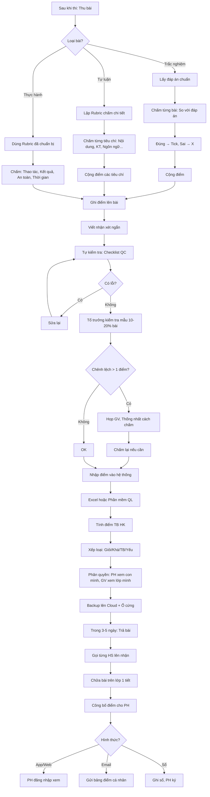

# SOP-04.3: CHẤM ĐIỂM VÀ GHI NHẬN KẾT QUẢ

## 1. THÔNG TIN QUY TRÌNH

| **Thuộc tính** | **Nội dung** |
|---|---|
| Mã SOP | SOP-04.3 |
| Tên quy trình | Chấm điểm và ghi nhận kết quả |
| Quy trình cha | SOP-04: Kiểm tra - Đánh giá |
| Phiên bản | 1.0 |
| Tần suất | Sau mỗi kỳ kiểm tra |

## 2. MỤC ĐÍCH

- **Chấm chính xác**: Đúng đáp án, Không sai sót
- **Công bằng**: Mọi HS được chấm như nhau
- **Nhanh chóng**: Trả bài trong ≤ 3 ngày
- **Minh bạch**: HS, PH hiểu rõ cách tính điểm

## 3. NGUYÊN TẮC CHẤM ĐIỂM

| **Nguyên tắc** | **Giải thích** |
|---|---|---|
| **Theo đáp án** | Không tự ý sửa thang điểm |
| **Nhất quán** | Bài giống nhau = Điểm giống nhau |
| **Khách quan** | Không để tình cảm ảnh hưởng |
| **Bảo mật** | Không tiết lộ điểm HS cho người khác (Trừ PH, BGH) |

## 4. QUY TRÌNH CHẤM ĐIỂM

### 4.1. Chấm trắc nghiệm

**Bước 1: GV lấy đáp án chuẩn**

**Bước 2: Chấm từng bài**

**Phương pháp 1: Chấm thủ công**
- Đặt đáp án cạnh bài HS
- So sánh từng câu
- Đúng → Tick ✓, Sai → Gạch X
- Cộng điểm

**Phương pháp 2: Máy chấm trắc nghiệm (Nếu có)**
- HS tô vào phiếu trả lời chuẩn
- Đưa qua máy quét
- Máy tự động chấm → Xuất Excel

**Bước 3: Ghi điểm vào bài**

Góc phải trang 1: **"Điểm: 8.5/10"** (Chữ to, Rõ ràng)

**Bước 4: Ghi điểm vào sổ (Excel hoặc Phần mềm)**

### 4.2. Chấm tự luận

**Bước 5: GV lập "Hướng dẫn chấm" (Rubric chi tiết)**

**Ví dụ Toán - Bài toán có lời văn (10 điểm):**

| **Bước** | **Mô tả** | **Điểm** |
|---|---|---|
| 1. Tóm tắt | Tóm tắt đúng đề bài | 2 |
| 2. Phương pháp | Chọn đúng phép tính | 2 |
| 3. Trình bày | Trình bày rõ ràng từng bước | 3 |
| 4. Kết quả | Đáp số đúng | 2 |
| 5. Đơn vị | Ghi đúng đơn vị (VD: "cm", "kg") | 1 |

**Ví dụ Văn - Bài văn tả cảnh (10 điểm):**

| **Tiêu chí** | **Điểm tối đa** | **Mô tả cụ thể** |
|---|---|---|
| **Nội dung** | 4đ | • Đúng chủ đề (1đ)<br>• Nội dung phong phú (2đ)<br>• Cảm xúc chân thực (1đ) |
| **Kỹ thuật viết** | 3đ | • Dùng biện pháp tu từ (1đ)<br>• Mô tả sinh động (1đ)<br>• Cấu trúc rõ ràng (1đ) |
| **Ngôn ngữ** | 2đ | • Dùng từ đúng (1đ)<br>• Câu văn mạch lạc (1đ) |
| **Chính tả** | 1đ | • Ít lỗi (< 3 lỗi: 1đ, 3-5 lỗi: 0.5đ, > 5 lỗi: 0đ) |

**Bước 6: Chấm từng bài theo Rubric**

**Mẹo chấm nhanh:**
- Chấm từng tiêu chí (Chấm hết nội dung → Chấm hết kỹ thuật...)
- Không chấm từ bài 1 → bài 30 tuần tự (Dễ thiên vị!)

**Bước 7: Ghi điểm + Nhận xét ngắn**

Ví dụ:
```
Điểm: 8/10

Nhận xét:
✅ Nội dung hay, Cảm xúc chân thực
✅ Dùng ví von sinh động
⚠️ Còn 5 lỗi chính tả
💡 Lần sau em chú ý: "Xuân" không phải "Xuan"
```

### 4.3. Chấm thực hành/Dự án

**Bước 8: Chấm theo Rubric (Đã chuẩn bị ở SOP-04.1)**

**Bước 9: Có thể chấm theo nhóm hoặc Cá nhân**

- Thực hành nhóm → Điểm chung (Hoặc Điểm nhóm + Điểm cá nhân)
- Dự án cá nhân → Điểm riêng

**Bước 10: Ghi điểm + Feedback chi tiết (Quan trọng!)**

Feedback tốt:
```
Dự án: Làm video giới thiệu trường
Điểm: 16/20

✅ ĐIỂM MẠNH:
• Nội dung đầy đủ, Chính xác
• Hình ảnh đẹp, Chất lượng HD
• Âm thanh rõ ràng

⚠️ ĐIỂM CẦN CẢI THIỆN:
• Thời lượng hơi dài (10 phút, Nên 5-7 phút)
• Chuyển cảnh hơi nhanh (Chóng mặt)

💡 LẦN SAU:
• Cắt ngắn xuống 7 phút
• Chuyển cảnh chậm hơn (Fade thay vì Cut)

EM ĐÃ LÀM RẤT TỐT! Tiếp tục phát huy! 👍
```

### 4.4. Kiểm tra lại (Quality Control)

**Bước 11: GV tự kiểm tra lại (Trước khi trả bài)**

Checklist (QT05-CL15):
- [ ] Đã chấm hết bài?
- [ ] Cộng điểm đúng?
- [ ] Ghi điểm vào sổ đúng HS?
- [ ] Có nhận xét?
- [ ] Không lỗi chính tả trong nhận xét?

**Bước 12: Tổ trưởng kiểm tra mẫu (10-20% bài)**

- Chọn ngẫu nhiên 3-5 bài
- Chấm lại
- So với điểm GV chấm
- Nếu chênh lệch > 1 điểm → Hỏi lại GV

**Mục đích:** Đảm bảo công bằng, Không GV nào chấm quá dễ/Quá khó

### 4.5. Ghi nhận kết quả

**Bước 13: Nhập điểm vào hệ thống**

**Phần mềm:** Excel hoặc Phần mềm quản lý (VD: MISA, Edusoft...)

**Cấu trúc bảng điểm:**

| **STT** | **Họ tên** | **TX1** | **TX2** | **GK** | **CK** | **TB HK** | **Xếp loại** |
|---|---|---|---|---|---|---|---|
| 1 | Nguyễn Văn A | 8 | 9 | 8.5 | 9 | 8.7 | Giỏi |
| 2 | Trần Thị B | 7 | 7.5 | 7 | 8 | 7.5 | Khá |

**Cách tính:**
```
Điểm TB HK = (TX1 + TX2 + GK×2 + CK×3) / 7

VD: (8 + 9 + 8.5×2 + 9×3) / 7 = 8.7
```

**Xếp loại:**
- Giỏi: ≥ 8.0
- Khá: 6.5-7.9
- TB: 5.0-6.4
- Yếu: < 5.0

**Bước 14: Phân quyền truy cập điểm**

| **Người** | **Quyền** |
|---|---|
| GV | Xem, Sửa (Chỉ lớp mình dạy) |
| GVCN | Xem tất cả môn của lớp |
| Tổ trưởng | Xem tất cả GV trong tổ |
| BGH | Xem tất cả |
| PH | Chỉ xem con mình (Qua App/Email) |
| HS | Chỉ xem điểm mình |

**Bước 15: Backup dữ liệu**

- Mỗi tuần: Backup lên Cloud
- Hàng tháng: Backup ra ổ cứng ngoài

## 5. TRẢ BÀI VÀ CÔNG BỐ ĐIỂM

**Bước 16: Trả bài trong ≤ 3 ngày (Nếu < 40 HS) hoặc ≤ 5 ngày (Nếu > 40 HS)**

**Cách trả:**
- Gọi từng HS lên nhận
- Hoặc: Phát ngay chỗ ngồi

**Bước 17: Chữa bài trên lớp (1 tiết)**

- Giải thích đáp án
- Phân tích lỗi phổ biến
- Hướng dẫn cách làm đúng

**Bước 18: Công bố điểm cho PH**

**Phương pháp:**
- **App/Website:** PH đăng nhập → Xem điểm con
- **Email:** Gửi bảng điểm (Chỉ con mình)
- **Sổ liên lạc:** Ghi điểm, PH ký xác nhận

**KHÔNG công khai điểm cả lớp!** (Vi phạm quyền riêng tư HS)

## 6. LƯU ĐỒ QUY TRÌNH



## 7. BIỂU MẪU LIÊN QUAN

| **Mã** | **Tên** |
|---|---|
| QT05-CL15 | Checklist kiểm tra lại kết quả chấm |
| QT05-S06 | Sổ điểm (Excel) |
| QT05-F23 | Email công bố điểm cho PH |

## 8. TIÊU CHUẨN VÀ CHỈ TIÊU

| **Chỉ tiêu** | **Mục tiêu** |
|---|---|
| Trả bài đúng hạn | ≥ 95% |
| Sai sót khi chấm | < 1% |
| Khiếu nại về chấm điểm | < 2% bài |
| Điểm được nhập hệ thống | 100% |

## 9. TRÁCH NHIỆM

| **Vai trò** | **Trách nhiệm** |
|---|---|
| **GV** | Chấm điểm, Nhập hệ thống, Trả bài, Chữa bài |
| **Tổ trưởng** | Kiểm tra mẫu, Thống nhất cách chấm |
| **IT** | Quản lý phần mềm, Backup |

## 10. LƯU Ý QUAN TRỌNG

- ⚠️ **Bảo mật điểm số**: Không công khai điểm cả lớp!
- ✅ **Chấm nhanh**: Càng nhanh, HS càng nhớ bài
- ✅ **Nhận xét xây dựng**: Giúp HS biết cải thiện chỗ nào
- 🔥 **Kiểm tra kỹ trước khi công bố**: Sai điểm = Mất uy tín!

## 11. PHỤ LỤC

### 11.1. Xử lý khiếu nại điểm

**Nếu HS/PH khiếu nại:**

**Bước 1: Lắng nghe**
- "Em/Anh chị khiếu nại điểm câu nào?"

**Bước 2: Giải thích**
- Đưa đáp án + Rubric
- "Câu này em làm thế này, Theo đáp án phải thế kia, Nên bị trừ X điểm"

**Bước 3: Xem xét lại (Nếu HS có lý)**
- "À, Cách của em cũng đúng! Cô chấm lại."
- Sửa điểm, Xin lỗi

**Bước 4: Giữ nguyên (Nếu HS sai)**
- "Cô hiểu quan điểm của em. Nhưng theo đáp án chuẩn, Em vẫn chưa đạt điểm tối đa."

**Bước 5: Leo thang (Nếu HS/PH vẫn không đồng ý)**
- Nhờ Tổ trưởng chấm lại
- Quyết định của Tổ trưởng là cuối cùng

### 11.2. Thang điểm chuẩn

**Việt Nam:**
- 0-10 (Thập phân: 0, 0.5, 1, 1.5...)
- Xếp loại: Giỏi (8-10), Khá (6.5-7.9), TB (5-6.4), Yếu (<5)

**Quốc tế (Nếu trường áp dụng):**
- A, B, C, D, F (US)
- 1-7 (IB)
- 9-1 (UK GCSE)

**Quy đổi:**
| **VN** | **US** | **IB** |
|---|---|---|
| 9.0-10 | A | 7 |
| 8.0-8.9 | B+ | 6 |
| 7.0-7.9 | B | 5 |
| 6.0-6.9 | C+ | 4 |
| 5.0-5.9 | C | 3 |
| < 5.0 | D/F | 1-2 |

## 12. FAQ

**Q1: Chấm mất bao lâu?**  
A: Trắc nghiệm: 30 giây/bài. Tự luận: 3-5 phút/bài. 30 HS → 1.5-2.5 giờ.

**Q2: Có thể nhờ HS giỏi chấm bài không?**  
A: KHÔNG! Vi phạm bảo mật. GV phải tự chấm.

**Q3: Nếu quên không nhập điểm vào hệ thống?**  
A: Nghiêm trọng! Cuối HK không có điểm → Không xếp loại được. Nhập NGAY sau khi chấm!

---

**PHÊ DUYỆT**

| GV | Tổ trưởng | Trưởng BP HT |
|---|---|---|
| [Họ tên] | [Họ tên] | [Họ tên] |
