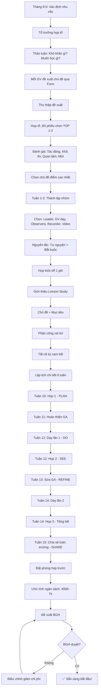

# SOP-05.1: LẬP KẾ HOẠCH LESSON STUDY

## 1. THÔNG TIN QUY TRÌNH

| **Thuộc tính** | **Nội dung** |
|---|---|
| Mã SOP | SOP-05.1 |
| Tên quy trình | Lập kế hoạch Lesson Study |
| Quy trình cha | SOP-05: Lesson Study |
| Phiên bản | 1.0 |
| Tần suất | 1 lần/Học kỳ (Mỗi tổ bộ môn) |

## 2. MỤC ĐÍCH

- **Kế hoạch chi tiết**: Lesson Study có lộ trình rõ ràng, Không làm qua loa
- **Chọn chủ đề đúng**: Chủ đề có giá trị, Nhiều GV quan tâm
- **Phân công rõ ràng**: Ai làm gì, Khi nào
- **Chuẩn bị kỹ càng**: Đủ thời gian, Nguồn lực

## 3. LESSON STUDY LÀ GÌ?

### 3.1. Định nghĩa

**Lesson Study (授業研究 - Jugyou Kenkyuu):** 

Phương pháp phát triển chuyên môn giáo viên từ Nhật Bản, Dựa trên nguyên tắc:

> **"Giáo viên học tốt nhất khi họ học CÙNG NHAU, từ THỰC HÀNH, tập trung vào HỌC SINH"**

### 3.2. Chu trình Lesson Study

```
    ┌─────────────────────────────────────────┐
    │  1. PLAN (Lập kế hoạch)                 │
    │  • Chọn chủ đề                          │
    │  • Cùng thiết kế giáo án                │
    └──────────────┬──────────────────────────┘
                   ↓
    ┌─────────────────────────────────────────┐
    │  2. DO (Thực hiện)                      │
    │  • 1 GV dạy bài mẫu                     │
    │  • Nhóm quan sát HS (Không đánh giá GV!)│
    └──────────────┬──────────────────────────┘
                   ↓
    ┌─────────────────────────────────────────┐
    │  3. SEE (Thảo luận)                     │
    │  • Phân tích: HS học được gì?           │
    │  • Rút kinh nghiệm                      │
    └──────────────┬──────────────────────────┘
                   ↓
    ┌─────────────────────────────────────────┐
    │  4. REFINE (Cải tiến)                   │
    │  • Sửa giáo án                          │
    │  • Dạy lại (Lần 2)                      │
    └──────────────┬──────────────────────────┘
                   ↓
    ┌─────────────────────────────────────────┐
    │  5. SHARE (Chia sẻ)                     │
    │  • Chia sẻ toàn trường                  │
    │  • Viết báo cáo                         │
    └─────────────────────────────────────────┘
            ↓
     (Quay lại PLAN với chủ đề mới)
```

### 3.3. Tại sao Lesson Study hiệu quả?

**So với đào tạo truyền thống:**

| **Đào tạo truyền thống** | **Lesson Study** |
|---|---|
| Nghe chuyên gia giảng | Tự học qua thực hành |
| Lý thuyết chung chung | Cụ thể cho 1 bài học |
| 1 lần rồi quên | Làm → Phản tư → Cải tiến → Làm lại |
| Thụ động | Chủ động |
| Hiệu quả: 10-20% | Hiệu quả: 70-80% |

**Nghiên cứu:**
- Nhật Bản: 95% GV tham gia Lesson Study
- Singapore: Lesson Study bắt buộc (2 lần/năm)
- Phần Lan: Áp dụng rộng rãi

## 4. QUY TRÌNH LẬP KẾ HOẠCH

### 4.1. Xác định nhu cầu (Tháng 8-9)

**Bước 1: Đầu năm học - Tổ trưởng họp tổ**

**Thảo luận:**
- Năm ngoái gặp khó khăn gì trong giảng dạy?
- Bài nào HS hay sai?
- Phương pháp nào muốn học?
- Công nghệ nào muốn thử?

**Bước 2: Mỗi GV đề xuất chủ đề (QT05-F26)**

**Form đề xuất chủ đề Lesson Study:**

| **Mục** | **Nội dung** |
|---|---|
| GV đề xuất | [Tên] |
| Chủ đề | "Dạy phép nhân 2 chữ số - Toán lớp 3" |
| Tại sao chủ đề này? | "Năm ngoái 40% HS sai bài này. Rất khó dạy." |
| Mục tiêu muốn đạt | "Tìm PP giúp HS hiểu dễ hơn" |
| GV quan tâm | 5 GV (Liệt kê tên) |

**Bước 3: Tổ họp, Bỏ phiếu chọn TOP 1-2 chủ đề**

**Tiêu chí chọn:**

| **Tiêu chí** | **Điểm** | **Giải thích** |
|---|---|---|
| **Tác động** | /30 | Nhiều GV/HS hưởng lợi | 
| **Khả thi** | /30 | Có thể làm được trong thời gian/NS |
| **Quan tâm** | /20 | Nhiều GV muốn tham gia |
| **Mới mẻ** | /20 | Chưa từng làm, Muốn thử |

**Chọn chủ đề điểm cao nhất!**

### 4.2. Thành lập nhóm (Tuần 1-2)

**Bước 4: Tổ trưởng thành lập nhóm Lesson Study**

**Cấu trúc nhóm lý tưởng (5-6 người):**

| **Vai trò** | **Số lượng** | **Đặc điểm** | **Trách nhiệm** |
|---|---|---|---|
| **Leader (Trưởng nhóm)** | 1 | Tổ trưởng hoặc GV giỏi | Điều phối, Tổ chức họp |
| **Teacher (GV dạy)** | 1 | Tự nguyện hoặc Bốc thăm | Dạy bài mẫu lần 1 |
| **Observers (Quan sát)** | 3-4 | Tất cả GV còn lại | Quan sát, Góp ý |
| **Expert (Chuyên gia)** | 0-1 | Tùy chọn (Nếu có ngân sách) | Tư vấn, Góp ý chuyên môn |

**Nguyên tắc chọn GV dạy:**
- **Tự nguyện tốt nhất** (GV muốn dạy → Tâm huyết hơn!)
- Hoặc **Luân phiên** (Mỗi HK 1 GV)
- **KHÔNG** chỉ chọn GV giỏi (GV trẻ cũng cần cơ hội!)

**Bước 5: Họp kick-off (1 giờ)**

**Nội dung:**
- Giới thiệu Lesson Study (Nếu GV lần đầu)
- Chủ đề đã chọn: "Phép nhân 2 chữ số"
- Mục tiêu nhóm: "Tìm PP dạy hiệu quả hơn"
- Phân công vai trò
- Lập lịch

### 4.3. Lập lịch chi tiết

**Bước 6: Lập timeline (QT05-D06)**

**Mẫu lịch Lesson Study (6 tuần):**

| **Tuần** | **Hoạt động** | **Thời gian** | **Địa điểm** | **Chuẩn bị** |
|---|---|---|---|---|
| **Tuần 10** | **Họp 1: Cùng thiết kế GA (PLAN)** | 2 giờ (T4, 15h-17h) | Phòng họp | Mỗi GV nghiên cứu trước |
| **Tuần 11** | Hoàn thiện GA | (Riêng lẻ) | | GV dạy hoàn thiện GA |
| **Tuần 12** | **Dạy lần 1 + Quan sát (DO)** | 1 tiết (T3, Tiết 3) | Lớp 3A | In phiếu quan sát, Camera |
| **Tuần 12** | **Họp 2: Thảo luận (SEE)** | 1.5 giờ (T3, 14h-15h30) | Phòng họp | Tổng hợp ghi chép |
| **Tuần 13** | Sửa GA (REFINE) | (Riêng lẻ) | | Nhóm sửa GA |
| **Tuần 14** | **Dạy lần 2 + Quan sát** | 1 tiết (T4, Tiết 2) | Lớp 3B | |
| **Tuần 14** | **Họp 3: Tổng kết + Chia sẻ (SHARE)** | 1 giờ (T4, 14h-15h) | Phòng họp | Viết BC Lesson Study |
| **Tuần 15** | Chia sẻ toàn trường | 30 phút (Họp toàn trường) | Hội trường | Chuẩn bị Slide trình bày |

**Tổng thời gian:** ~6 tuần, 8-10 giờ (Bao gồm cả dạy)

**Bước 7: Gửi lịch cho thành viên**

**Bước 8: Xin phép BGH**

**Nội dung xin phép:**
- Cho GV nghỉ tiết để quan sát (2 tiết)
- Cho mượn phòng họp (3 lần)
- Ngân sách (Nếu mời chuyên gia, In tài liệu...)

### 4.4. Chuẩn bị tài liệu

**Bước 9: Leader chuẩn bị**

**Tài liệu cần:**
- Template giáo án Lesson Study (QT05-T03)
- Phiếu quan sát (QT05-F25)
- Checklist thảo luận (QT05-CL16)
- Mẫu báo cáo Lesson Study (QT05-R24)

**Bước 10: Gửi tài liệu trước cho nhóm (1 tuần trước Họp 1)**

**Đọc trước:**
- SGK, SGV bài sẽ dạy
- Tài liệu về PP giảng dạy liên quan (Nếu có)
- Kết quả thi năm ngoái (Để thấy HS sai nhiều ở đâu)

## 5. CHỌN CHỦ ĐỀ (CHI TIẾT)

### 5.1. Các loại chủ đề Lesson Study

| **Loại** | **Ví dụ** | **Khi nào chọn** |
|---|---|---|
| **Bài khó** | "Phép chia có dư", "Viết bài văn nghị luận" | HS hay sai, GV khó dạy |
| **Phương pháp mới** | "Dạy Toán bằng PBL", "Flipped Classroom" | Muốn thử PP mới |
| **Công nghệ** | "Dùng Kahoot hiệu quả", "VR trong Địa lý" | Muốn tích hợp công nghệ |
| **Kỹ năng** | "Dạy tư duy phản biện", "Kỹ năng thuyết trình" | Tập trung kỹ năng thế kỷ 21 |
| **Học sinh đặc biệt** | "Dạy HS chậm học", "Phát triển HS giỏi" | Có nhiều HS đặc biệt |

### 5.2. Tiêu chí đánh giá chủ đề

**Bảng đánh giá chủ đề (QT05-M02):**

**Ví dụ đánh giá 3 chủ đề đề xuất:**

| **Tiêu chí** | **Chủ đề A: Phép nhân 2 chữ số** | **Chủ đề B: Dạy Văn bằng PBL** | **Chủ đề C: Dùng VR dạy Địa lý** |
|---|---|---|---|
| **Tác động (0-30)** | 25 (3 GV Toán, 90 HS) | 20 (2 GV Văn, 60 HS) | 15 (1 GV Địa, 30 HS) |
| **Khả thi (0-30)** | 28 (Không cần thiết bị đặc biệt) | 25 (Cần thời gian dài) | 10 (Cần mua kính VR - đắt!) |
| **Quan tâm (0-20)** | 18 (6 GV muốn tham gia) | 12 (3 GV) | 8 (2 GV) |
| **Mới mẻ (0-20)** | 10 (Đã làm năm ngoái) | 18 (Chưa làm bao giờ) | 20 (Rất mới!) |
| **TỔNG** | **81** ⭐ | **75** | **53** |

→ **Chọn Chủ đề A: Phép nhân 2 chữ số** (Điểm cao nhất!)

### 5.3. Lập Research Question (Câu hỏi nghiên cứu)

**Bước 11: Nhóm cùng đặt câu hỏi nghiên cứu**

**Không phải:** "Làm sao dạy phép nhân?" (Quá chung chung)

**Mà là:**
```
"Làm thế nào để học sinh lớp 3 hiểu VÀ VẬN DỤNG ĐÚNG 
 phép nhân 2 chữ số trong giải toán có lời văn?"
```

**Đặc điểm câu hỏi tốt:**
- ✅ Cụ thể (Phép nhân 2 chữ số, Không phải "Phép nhân nói chung")
- ✅ Đo được (Hiểu VÀ Vận dụng → Đo qua bài tập)
- ✅ Tập trung HS (HS hiểu, Không phải "GV dạy tốt")
- ✅ Có giá trị (Giải quyết vấn đề thực tế)

## 6. LẬP LỊCH CHI TIẾT

### 6.1. Phân bổ thời gian

**Tổng thời gian:** 6-8 tuần

| **Giai đoạn** | **Thời gian** | **% Tổng** |
|---|---|---|
| Lập kế hoạch | 1 tuần | 15% |
| Thiết kế GA (Họp 1) | 1 tuần | 15% |
| Chuẩn bị dạy lần 1 | 1 tuần | 10% |
| Dạy lần 1 + Thảo luận | 1 tuần | 20% |
| Sửa GA | 1 tuần | 10% |
| Dạy lần 2 + Tổng kết | 1 tuần | 20% |
| Chia sẻ + Viết BC | 1 tuần | 10% |

**Bước 12: Xác định thời điểm cụ thể**

**Lưu ý:**
- Tránh tháng 12 (Bận thi, Tết)
- Tránh tháng 5 (Thi cuối năm)
- Lý tưởng: Tháng 10-11 (HK1) hoặc Tháng 2-3 (HK2)

**Bước 13: Đặt phòng họp trước**

- Phòng yên tĩnh
- Có máy chiếu (Trình bày)
- Đủ chỗ ngồi (5-10 người)
- Có bảng/Flipchart

### 6.2. Phân công nhiệm vụ

**Bước 14: Phân công rõ ràng (QT05-D07)**

| **Vai trò** | **Người** | **Nhiệm vụ cụ thể** |
|---|---|---|
| **Leader** | Tổ trưởng | • Tổ chức 3 cuộc họp<br>• Điều phối thảo luận<br>• Theo dõi tiến độ<br>• Viết BC cuối cùng |
| **GV dạy lần 1** | GV A (Tự nguyện) | • Tham gia thiết kế GA<br>• Hoàn thiện GA<br>• Dạy lần 1<br>• Tham gia thảo luận |
| **GV dạy lần 2** | GV B (Tự nguyện) | • Tham gia thiết kế GA<br>• Dạy lần 2 (GA đã sửa)<br>• Tham gia thảo luận |
| **Observers** | GV C, D, E | • Tham gia thiết kế GA<br>• Quan sát 2 lần dạy<br>• Ghi chép chi tiết<br>• Góp ý xây dựng |
| **Recorder** | GV D | • Ghi chép cuộc họp<br>• Tổng hợp ý kiến<br>• Hỗ trợ viết BC |
| **Video** | GV E (Hoặc Mời IT) | • Quay video giờ dạy<br>• Chỉnh sửa, Lưu trữ |

**Bước 15: Tất cả ký cam kết tham gia**

"Tôi cam kết tham gia đầy đủ các hoạt động Lesson Study, Đóng góp tích cực!"

## 7. NGÂN SÁCH VÀ NGUỒN LỰC

### 7.1. Ước tính ngân sách

| **Khoản** | **Chi phí** | **Ghi chú** |
|---|---|---|
| Giờ công GV | 0 (Trong giờ làm) | Hoặc Trả thêm giờ (500K/GV) |
| Mời chuyên gia | 0-5 triệu | Tùy chọn |
| In tài liệu | 200K | GA, Phiếu, Sổ tay... |
| Quay video | 0-1 triệu | GV tự quay (Free) hoặc Thuê (1tr) |
| Khác (Nước uống...) | 200K | |
| **TỔNG** | **400K - 7 triệu** | |

**Bước 16: Đề xuất ngân sách cho BGH**

### 7.2. Nguồn lực cần thiết

| **Nguồn lực** | **Số lượng** | **Thời gian** |
|---|---|---|
| GV tham gia | 5-6 người | 8-10 giờ/người |
| Phòng họp | 1 phòng | 3 lần × 1-2 giờ |
| Lớp học dạy mẫu | 2 lớp | 2 tiết |
| Camera/Máy quay | 1 bộ | 2 tiết |

## 8. LƯU ĐỒ QUY TRÌNH



## 9. BIỂU MẪU LIÊN QUAN

| **Mã** | **Tên** |
|---|---|
| QT05-F26 | Form đề xuất chủ đề Lesson Study |
| QT05-D06 | Lịch Lesson Study (Timeline) |
| QT05-D07 | Bảng phân công vai trò |
| QT05-M02 | Ma trận đánh giá chủ đề |
| QT05-T03 | Template giáo án Lesson Study |

## 10. TIÊU CHUẨN VÀ CHỈ TIÊU

| **Chỉ tiêu** | **Mục tiêu** |
|---|---|
| Mỗi tổ tổ chức Lesson Study | ≥ 1 lần/HK |
| GV tham gia | 100% GV trong tổ |
| Hoàn thành đúng lịch | ≥ 90% |
| Hài lòng với Lesson Study | ≥ 4.0/5 (Khảo sát GV) |

## 11. TRÁCH NHIỆM CỤ THỂ

| **Vai trò** | **Trách nhiệm** |
|---|---|---|
| **Tổ trưởng** | Khởi xướng, Tổ chức, Hỗ trợ nhóm |
| **Nhóm Lesson Study** | Tham gia đầy đủ, Đóng góp tích cực |
| **BGH** | Hỗ trợ thời gian, Ngân sách |
| **IT** | Hỗ trợ quay video, Lưu trữ |

## 12. LƯU Ý QUAN TRỌNG

- ⚠️ **Lesson Study ≠ Đánh giá GV**: Mục đích HỌC, Không CHẤM ĐIỂM!
- ✅ **Tự nguyện = Hiệu quả**: Ép buộc → GV làm qua loa
- ✅ **Chọn chủ đề có giá trị**: Đừng chọn chủ đề quá dễ hoặc Không ai quan tâm
- ✅ **Lịch hợp lý**: Không quá gấp (GV không kịp), Không quá dài (GV mất hứng)
- 🔥 **Cam kết thời gian**: 8-10 giờ trong 6 tuần - Cần sự hy sinh!

## 13. PHỤ LỤC

### 13.1. Lịch sử Lesson Study

**Nguồn gốc:**
- Phát triển tại Nhật Bản từ những năm 1870
- Phổ biến toàn cầu từ 1990s
- Hiện nay: > 100 quốc gia áp dụng

**Nghiên cứu về hiệu quả:**
- Nhật Bản: 95% GV tham gia Lesson Study → Chất lượng GD hàng đầu thế giới
- Singapore: PISA luôn TOP 5 → Một phần nhờ Lesson Study
- US: Các tiểu bang áp dụng → Điểm PISA tăng 15-20%

### 13.2. So sánh Lesson Study và Quan sát giờ dạy

| **Khía cạnh** | **Lesson Study** | **Quan sát giờ dạy** |
|---|---|---|
| **Mục đích** | Học hỏi, Cải tiến | Đánh giá GV |
| **Tập trung** | Học sinh học như thế nào | GV dạy như thế nào |
| **Thiết kế GA** | Cùng nhau | GV tự làm |
| **Sau quan sát** | Thảo luận, Sửa GA, Dạy lại | Phản hồi, Kết thúc |
| **Không khí** | Cởi mở, An toàn | Căng thẳng |
| **Kết quả** | Giáo án tốt hơn + GV học được | Điểm đánh giá |

### 13.3. Ví dụ Research Question theo môn

| **Môn** | **Research Question** |
|---|---|
| **Toán** | "Làm sao để HS không nhầm lẫn giữa phép nhân và phép cộng khi giải toán có lời văn?" |
| **Văn** | "Phương pháp nào giúp HS lớp 5 viết đoạn văn miêu tả sinh động, Có cảm xúc?" |
| **Tiếng Anh** | "Làm thế nào để HS lớp 3 tự tin nói Tiếng Anh trước lớp mà không sợ sai?" |
| **Khoa học** | "Cách nào giúp HS hiểu khái niệm 'Quang hợp' qua thí nghiệm tự làm?" |
| **GDCD** | "Hoạt động nào giúp HS phát triển kỹ năng đồng cảm với người khác?" |

### 13.4. Checklist chuẩn bị Lesson Study

```
═══════════════════════════════════════════════════
  CHECKLIST CHUẨN BỊ LESSON STUDY
═══════════════════════════════════════════════════

Tổ: _____________  Chủ đề: _______________
Leader: ___________  Học kỳ: ______/______

GIAI ĐOẠN LẬP KẾ HOẠCH:

□ Đã họp tổ, Thu thập đề xuất chủ đề
□ Đã bỏ phiếu chọn chủ đề (Có Biên bản)
□ Đã đặt Research Question rõ ràng
□ Đã thành lập nhóm (5-6 người)
□ Đã phân công vai trò (Có bảng phân công)
□ Đã lập lịch 6 tuần (Có timeline)
□ Đã đặt phòng họp (3 lần)
□ Đã xin phép BGH (Có văn bản duyệt)
□ Đã ước tính ngân sách (Có bảng chi phí)
□ Đã chuẩn bị tài liệu (Template, Phiếu...)
□ Đã gửi tài liệu đọc trước cho nhóm
□ Đã thông báo lịch cho tất cả thành viên
□ Tất cả GV đã ký cam kết tham gia

SẴN SÀNG BẮT ĐẦU: □ Có  □ Chưa

Nếu chưa, Vấn đề gì: _________________________

Leader ký: ____________  Ngày: _______
═══════════════════════════════════════════════════
```

## 14. FAQ

**Q1: Nếu không đủ 5-6 GV quan tâm chủ đề?**  
A: Chọn chủ đề khác có nhiều người quan tâm hơn. Hoặc Mời GV từ tổ khác tham gia.

**Q2: GV dạy có được trả thêm lương không?**  
A: Nên có! 500K-1 triệu/GV dạy (Động viên). Observers không cần trả (Họ học được nhiều!).

**Q3: Có thể làm Lesson Study online (Zoom) không?**  
A: Có! Nhưng quan sát trực tiếp tốt hơn (Nhìn rõ HS hơn).

**Q4: 6 tuần có dài quá không?**  
A: Không! Lesson Study chất lượng cần thời gian. Vội vàng → Kém hiệu quả.

---

**PHÊ DUYỆT**

| Tổ trưởng | Trưởng BP HT | Phó HT |
|---|---|---|
| [Họ tên] | [Họ tên] | [Họ tên] |
