# SOP-05.2: THỰC HIỆN QUAN SÁT BÀI HỌC

## 1. THÔNG TIN QUY TRÌNH

| **Thuộc tính** | **Nội dung** |
|---|---|
| Mã SOP | SOP-05.2 |
| Tên quy trình | Thực hiện quan sát bài học |
| Quy trình cha | SOP-05: Lesson Study |
| Phiên bản | 1.0 |
| Tần suất | 2 lần/Lesson Study (Dạy lần 1, Dạy lần 2) |

## 2. MỤC ĐÍCH

- **Học từ thực tế**: Xem HS học như thế nào trong thực tế (Không phải tưởng tượng!)
- **Thu thập bằng chứng**: Ghi chép cụ thể để thảo luận sau
- **Rút kinh nghiệm**: Phần nào hiệu quả? Phần nào cần sửa?
- **Phát triển GV**: Observers cũng học được (Không chỉ GV dạy!)

## 3. QUAN SÁT LESSON STUDY KHÁC GÌ QUAN SÁT ĐÁNH GIÁ?

| **Khía cạnh** | **Lesson Study Observation** | **Regular Observation (Đánh giá)** |
|---|---|---|
| **Mục đích** | HỌC HỎI, CẢI TIẾN | ĐÁNH GIÁ, CHẤM ĐIỂM |
| **Tập trung** | **HỌC SINH** (HS học thế nào?) | **GIÁO VIÊN** (GV dạy thế nào?) |
| **Thiết kế GA** | Cùng nhau thiết kế | GV tự làm |
| **Không khí** | An toàn, Cởi mở, Hợp tác | Căng thẳng, Đánh giá |
| **Sau quan sát** | Thảo luận → Sửa GA → Dạy lại | Phản hồi → Kết thúc |
| **Kết quả** | Giáo án tốt hơn + GV học được | Điểm đánh giá GV |

**→ Lesson Study = "Nghiên cứu bài học", KHÔNG phải "Đánh giá giáo viên"!**

## 4. CHUẨN BỊ QUAN SÁT

### 4.1. Trước 1 ngày

**Bước 1: Observers đọc kỹ giáo án**

**Đọc để hiểu:**
- Mục tiêu bài học là gì?
- Các hoạt động nào?
- GV dự kiến HS sẽ phản ứng thế nào?
- Research Question là gì? (VD: "Làm sao HS hiểu phép nhân?")

**Bước 2: Chuẩn bị công cụ quan sát**

| **Công cụ** | **Mục đích** |
|---|---|
| Phiếu quan sát (QT05-F25) | Ghi chép có cấu trúc |
| Vở ghi chú | Ghi chép tự do |
| Bút (Nhiều màu) | Highlight điểm quan trọng |
| Đồng hồ | Ghi thời gian từng hoạt động |
| Sơ đồ lớp (Seating chart) | Ghi vị trí HS quan sát |

**Bước 3: Phân công "Focus Students" (HS trọng tâm)**

Mỗi Observer quan sát 2-3 HS cụ thể:

| **Observer** | **HS quan sát** | **Lý do chọn** |
|---|---|---|
| GV C | HS A (Giỏi), HS B (Trung bình) | Đại diện 2 mức độ |
| GV D | HS C (Yếu), HS D (Trung bình) | Xem HS yếu có theo kịp không |
| GV E | HS E (Chậm học), HS F (Giỏi) | So sánh 2 cực |

**Mục đích:** Quan sát sâu vài HS > Quan sát nông 30 HS!

**Bước 4: Chuẩn bị camera/Máy quay (Nếu quay)**

**Vị trí camera:**
- Camera 1: Quay toàn cảnh lớp (Sau lớp)
- Camera 2: Quay cận HS làm bài (Bên lớp)
- Camera 3 (Tùy chọn): Quay GV

### 4.2. Ngày quan sát

**Bước 5: Đến sớm 15 phút**

**Bước 6: Ngồi vị trí quan sát**

**Sơ đồ lớp và Vị trí Observers:**

```
                  [BẢNG + GV]
                  
       HS  HS  HS  HS  HS  HS
       HS  HS  HS  HS  HS  HS     [GV C]
       HS  HS  HS  HS  HS  HS     (Quan sát)
       HS  HS  HS  HS  HS  HS
       HS  HS  HS  HS  HS  HS
       
   [GV D]                      [GV E]
 (Quan sát)                  (Quan sát)
 
           [Camera 1]
```

**Nguyên tắc vị trí:**
- Sau/Bên lớp (Không che GV, Không gây áp lực)
- Nhìn được HS mình quan sát
- Im lặng, Không di chuyển

**Bước 7: Im lặng hoàn toàn**

**Observers KHÔNG được:**
- ❌ Nói chuyện
- ❌ Gọi điện
- ❌ Tham gia giờ dạy (Trả lời câu hỏi, Giúp HS...)
- ❌ Ra vào phòng
- ❌ Ngồi chơi điện thoại

**Observers CHỈ:**
- ✅ Quan sát
- ✅ Ghi chép
- ✅ Im lặng như "Cái ghế"

## 5. QUAN SÁT GÌ?

### 5.1. Tập trung vào HỌC SINH (80% thời gian)

**Không quan sát GV!** Quan sát **HS học như thế nào!**

**6 khía cạnh quan sát HS:**

| **Khía cạnh** | **Câu hỏi quan sát** | **Bằng chứng** |
|---|---|---|
| **1. Tập trung (Engagement)** | HS có chăm chú không? | • Nhìn đâu? (GV, Bảng, Bạn, Ra ngoài?)<br>• Ngồi thế nào? (Thẳng, Nằm bàn?)<br>• Biểu hiện? (Gật đầu, Ghi chép...) |
| **2. Hiểu bài (Understanding)** | HS có hiểu không? | • Trả lời đúng câu hỏi?<br>• Làm bài đúng?<br>• Hỏi GV? (Nhiều = Chưa hiểu) |
| **3. Tham gia (Participation)** | HS có tham gia tích cực? | • Giơ tay?<br>• Phát biểu?<br>• Làm bài tập?<br>• Thảo luận nhóm? |
| **4. Tương tác (Interaction)** | HS tương tác với ai? | • Hỏi GV?<br>• Hỏi bạn?<br>• Làm một mình? |
| **5. Khó khăn (Difficulty)** | HS gặp khó ở đâu? | • Phần nào HS dừng lại?<br>• HS làm sai?<br>• HS hỏi nhiều? |
| **6. Cảm xúc (Emotion)** | HS cảm thấy thế nào? | • Vui, Cười?<br>• Buồn, Chán?<br>• Lo lắng, Sợ? |

**Bước 8: Ghi chép chi tiết (Scripting)**

**Phương pháp Scripting (Ghi chép kịch bản):**

```
═══════════════════════════════════════════════════
  PHIẾU QUAN SÁT LESSON STUDY
═══════════════════════════════════════════════════

Ngày: ______  Lớp: _____  Môn: _______  GV: _______
Observer: __________  HS quan sát: A (Giỏi), B (TB)

───────────────────────────────────────────────────
THỜI│ HOẠT ĐỘNG      │ HS A (Giỏi)  │ HS B (TB)    │ GHI CHÚ
GIAN│ (Theo GA)      │              │              │
────┼────────────────┼──────────────┼──────────────┼─────────
8:00│ Mở đầu: Video  │ Nhìn màn     │ Nhìn màn     │ Cả lớp
    │                │ hình, Cười   │ hình         │ chăm chú
────┼────────────────┼──────────────┼──────────────┼─────────
8:05│ GV hỏi: "2×3?"│ Giơ tay ngay│ Không giơ    │ 10/30 HS
    │                │              │ tay          │ giơ tay
────┼────────────────┼──────────────┼──────────────┼─────────
8:06│ HS A trả lời   │ "6 ạ!" (Tự  │ Nghe, Gật    │ GV khen
    │                │ tin)         │ đầu          │ "Đúng!"
────┼────────────────┼──────────────┼──────────────┼─────────
8:10│ HĐ1: Nhận biết│ Làm nhanh,   │ Đọc đề 2     │ HS B hơi
    │ phép nhân      │ Xong trong   │ lần, Suy     │ chậm
    │                │ 2 phút       │ nghĩ, 4 phút │
────┼────────────────┼──────────────┼──────────────┼─────────
8:15│ HĐ2: Thảo luận│ Nói nhiều,   │ Nghe chủ yếu,│ Nhóm A+B
    │ nhóm           │ Giải thích   │ Ghi chép     │ + 2 HS khác
    │                │ cho bạn      │              │
────┼────────────────┼──────────────┼──────────────┼─────────
8:20│ GV hỏi nhóm:   │ [Nhóm trả    │ [HS B im     │ GV không
    │ "Nhóm em ra    │ lời đúng]    │ lặng, Không  │ hỏi riêng
    │ sao?"          │              │ nói gì]      │ HS B
────┼────────────────┼──────────────┼──────────────┼─────────
[Tiếp tục ghi chi tiết từng phút...]

═══════════════════════════════════════════════════
```

**Ghi chú quan trọng:**
- Ghi thời gian cụ thể (Phút nào)
- Ghi hành vi HS (Làm gì, Nói gì, Biểu hiện thế nào)
- Không đánh giá (Không viết "GV dạy không tốt" - Chỉ viết sự thật HS làm gì!)

**Bước 9: Quan sát cả lớp (20% thời gian)**

Ngoài 2-3 HS trọng tâm, Thỉnh thoảng nhìn cả lớp:
- Bao nhiêu % HS giơ tay?
- Bao nhiêu HS làm bài?
- Có HS ngủ/Mất tập trung không?

### 5.2. Sử dụng công cụ quan sát

**A. Sơ đồ lớp (Seating Chart)**

Vẽ sơ đồ bàn ghế, Đánh số HS:

```
          [BẢNG]
    
    1   2   3   4   5   6
    7   8   9   10  11  12
    13  14  15  16  17  18
    19  20  21  22  23  24
    25  26  27  28  29  30
```

**Dùng ký hiệu:**
- ✓ : HS giơ tay
- ○ : HS nhìn GV
- × : HS nhìn ra ngoài
- ↔ : HS nói chuyện với bạn

**Ví dụ:**

Phút 8:05 - GV hỏi: "2×3=?"
```
    ✓   ○   ○   ✓   ○   ✓   (6/30 HS giơ tay = 20%)
    ○   ×   ○   ○   ↔   ↔   (2 HS nói chuyện!)
    ...
```

**B. Tally Marks (Đếm vạch)**

Đếm số lần hành vi xảy ra:

| **Hành vi** | **Tally** | **Tổng** |
|---|---|---|
| HS giơ tay | ⎮⎮⎮⎮ ⎮⎮⎮⎮ ⎮⎮ | 12 lần |
| GV hỏi câu mở | ⎮⎮⎮ | 3 lần |
| GV khen HS | ⎮⎮⎮⎮ ⎮⎮⎮ | 8 lần |

**C. Timeline (Dòng thời gian)**

Ghi lại tiến trình theo thời gian thực:

```
8:00 ━━━━━━ Mở đầu (Video) ━━━━━━━━━━> 8:05
     [Cả lớp chú ý ✅]

8:05 ━━━━━━ GV giảng ━━━━━━━━━━━━━━> 8:15
     [10 phút - Hơi dài! HS bắt đầu mất tập trung ở phút 13]

8:15 ━━━━━━ Hoạt động nhóm ━━━━━━━━> 8:30
     [15 phút - Nhóm 1, 2 làm tốt. Nhóm 3 lạc hướng]

8:30 ━━━━━━ Kahoot ━━━━━━━━━━━━━━━> 8:38
     [8 phút - HS rất thích! Tham gia 100%]

8:38 ━━━━━━ Tóm tắt ━━━━━━━━━━━━━> 8:40
     [2 phút - Quá vội! Chưa kịp tóm tắt hết]
```

## 6. TRONG GIỜ QUAN SÁT

### 6.1. Vị trí Observers

**Bước 10: Vào lớp trước 5 phút**

- Chào GV, HS (Ngắn gọn)
- Ngồi vào vị trí đã định
- Chuẩn bị sẵn giấy bút

**Bước 11: GV dạy giới thiệu Observers (30 giây)**

```
GV: "Hôm nay có 3 cô giáo khác đến lớp.
     Các cô đến để học cách dạy tốt hơn.
     Các em cứ học bình thường nhé!
     Bắt đầu bài học thôi!"
```

→ Giải thích ngắn gọn, Không làm HS căng thẳng!

### 6.2. Quan sát và Ghi chép

**Bước 12: Quan sát 2-3 HS trọng tâm (80% thời gian)**

**Ghi chép MỌI THỨ HS làm:**

**Ví dụ Observer quan sát HS B (Trung bình):**

```
8:00 - HS B nhìn video, Không cười (Không hứng thú?)
8:05 - GV hỏi "2×3?", HS B không giơ tay, Nhìn xuống bàn
8:07 - HS B ghi chép vào vở (Viết gì? Tôi nhìn không rõ)
8:10 - HĐ1: HS B đọc đề, Nhíu mày (Khó hiểu?)
8:12 - HS B viết vài dòng, Xóa đi, Viết lại (Phân vân?)
8:14 - HS B nhìn sang bài HS A (Không tự tin? Muốn copy?)
8:15 - Hoạt động nhóm: HS B nghe HS A giải thích, Gật đầu
8:18 - HS B thử làm bài, HS A kiểm tra, Nói "Đúng rồi!" 
       → HS B mỉm cười (Vui khi làm đúng!)
8:20 - Nhóm báo cáo, HS B im lặng, Không nói (Sợ? Hay không hiểu đủ để nói?)
```

**→ Ghi CHI TIẾT, KHÁCH QUAN! Không suy đoán quá nhiều!**

**Bước 13: Quan sát cả lớp (20% thời gian)**

Thỉnh thoảng nhìn lên quan sát toàn lớp:
- Đếm: Bao nhiêu HS giơ tay? (VD: 12/30 = 40%)
- Quan sát: Có HS nào ngủ? Nói chuyện?
- Không khí: Lớp vui vẻ? Căng thẳng? Buồn tẻ?

**Bước 14: Ghi chú "Critical Moments" (Khoảnh khắc quan trọng)**

**Đánh dấu ⭐ những khoảnh khắc:**
- HS "A-ha!" (Giây phút hiểu ra!)
- HS bối rối (Không hiểu)
- Hoạt động rất hiệu quả
- Hoạt động thất bại

**Ví dụ:**
```
⭐ 8:18 - HS B vừa hiểu ra cách nhân sau khi HS A giải thích!
  Biểu hiện: Mắt sáng lên, Mỉm cười, Nói "À, em hiểu rồi!"
  
🔴 8:35 - Cả lớp im lặng khi GV hỏi "Nhóm nào trả lời?"
  Không ai dám nói! Sợ sai?
```

### 6.3. Quan sát giáo viên (Phụ - 20% thời gian)

**Chỉ quan sát để hiểu HS phản ứng gì:**
- GV hỏi câu gì → HS trả lời thế nào?
- GV làm gì → HS phản ứng gì?

**KHÔNG phán xét GV!**

## 7. SAU GIỜ QUAN SÁT

**Bước 15: Ngay sau tiết - Ghi nhớ ngay (5 phút)**

Những gì chưa kịp ghi → Ghi ngay! (Còn nhớ rõ)

**Bước 16: Tổng hợp ghi chép (30 phút)**

**Phân loại:**
- ✅ Điểm tốt (HS học hiệu quả)
- ⚠️ Điểm cần cải thiện (HS gặp khó khăn)
- ❓ Câu hỏi (Chưa rõ, Cần thảo luận)

**Bước 17: Chia sẻ nhanh với nhóm (Không chính thức - 10 phút)**

"Ấn tượng đầu tiên của mọi người thế nào?"

**Không sâu!** Chỉ chia sẻ cảm nhận, Để dành thảo luận sâu cho Họp 2.

## 8. LƯU ĐỒ QUY TRÌNH

```mermaid
graph TD
    A[Trước 1 ngày: Chuẩn bị] --> B[Đọc kỹ giáo án]
    B --> C[Hiểu: Mục tiêu, Hoạt động, Research Q]
    C --> D[Chuẩn bị công cụ: Phiếu, Vở, Bút, Đồng hồ]
    D --> E[Phân công HS trọng tâm quan sát]
    E --> F[Observer C: HS A+B, Observer D: HS C+D...]
    F --> G[Chuẩn bị camera nếu quay]
    
    G --> H[Ngày quan sát: Đến sớm 15 phút]
    H --> I[Vào lớp, Ngồi vị trí: Sau/Bên]
    I --> J[GV giới thiệu Observers 30 giây]
    J --> K[Bắt đầu giờ dạy]
    
    K --> L[Observer quan sát + Ghi chép]
    L --> M[80% thời gian: Quan sát 2-3 HS trọng tâm]
    M --> N[Ghi chi tiết: HS làm gì, Nói gì, Biểu hiện gì]
    N --> O[6 khía cạnh: Tập trung, Hiểu, Tham gia, Tương tác, Khó khăn, Cảm xúc]
    
    O --> P[20% thời gian: Quan sát cả lớp]
    P --> Q[Đếm: Bao nhiêu HS giơ tay? Làm bài?]
    Q --> R[Quan sát: HS ngủ? Nói chuyện?]
    R --> S[Không khí: Vui? Buồn?]
    
    S --> T[Đánh dấu ⭐ Khoảnh khắc quan trọng]
    T --> U[HS hiểu ra, HS bối rối, HĐ hiệu quả...]
    
    U --> V[Kết thúc tiết: Im lặng ra về]
    V --> W[Ngay sau 5 phút: Ghi nhớ ngay]
    W --> X[30 phút: Tổng hợp ghi chép]
    X --> Y[Phân loại: Tốt, Cần sửa, Câu hỏi]
    Y --> Z[Chia sẻ nhanh ấn tượng với nhóm]
    Z --> AA[Chờ Họp 2 để thảo luận sâu]
```



## 9. BIỂU MẪU LIÊN QUAN

| **Mã** | **Tên** |
|---|---|
| QT05-F25 | Phiếu quan sát Lesson Study |
| QT05-F27 | Sơ đồ lớp (Seating chart) |
| QT05-CL17 | Checklist quan sát 6 khía cạnh |

## 10. TIÊU CHUẨN VÀ CHỈ TIÊU

| **Chỉ tiêu** | **Mục tiêu** |
|---|---|
| Observers tham gia đầy đủ | 100% |
| Ghi chép chi tiết (≥ 2 trang A4) | 100% |
| Quay video (Nếu có camera) | Khuyến khích |
| Tổng hợp xong trong ngày | 100% |

## 11. TRÁCH NHIỆM CỤ THỂ

| **Vai trò** | **Trách nhiệm** |
|---|---|---|
| **GV dạy** | Dạy bình thường, Không căng thẳng |
| **Observers** | Quan sát tập trung, Ghi chép chi tiết, Im lặng |
| **Leader** | Điều phối, Nhắc nhở thời gian |
| **IT/Video** | Quay video, Lưu trữ |

## 12. LƯU Ý QUAN TRỌNG

- ⚠️ **Quan sát HS, KHÔNG phán xét GV**: Viết "HS B không giơ tay" (Sự thật) ≠ "GV hỏi không tốt" (Phán xét)
- ✅ **Ghi chi tiết, Càng chi tiết càng tốt**: 1 trang ghi chép = Ít giá trị. 3-5 trang = Nhiều bằng chứng!
- ✅ **Tập trung Research Question**: Nếu RQ là "HS hiểu phép nhân?", Quan sát dấu hiệu HS hiểu/Không hiểu
- ✅ **Im lặng tuyệt đối**: Không nói chuyện, Không tham gia giờ dạy!
- 🔥 **Khoảnh khắc "A-ha!" cực quý**: Giây phút HS hiểu ra = Vàng! Ghi chi tiết!

## 13. PHỤ LỤC

### 13.1. Phiếu quan sát đầy đủ (QT05-F25)

*(Mẫu 5 trang - Bao gồm: Thông tin, Sơ đồ lớp, Bảng scripting, 6 khía cạnh, Tổng kết)*

### 13.2. Dấu hiệu HS HIỂU bài

| **Dấu hiệu** | **Mô tả** |
|---|---|---|
| **"A-ha moment"** | HS mắt sáng lên, Mỉm cười, Nói "À!" |
| **Giải thích được cho bạn** | HS giải thích rõ ràng, Tự tin |
| **Làm bài đúng** | Làm đúng 8-10/10 câu |
| **Đặt câu hỏi sâu** | Hỏi "Tại sao?", "Nếu...?" |
| **Vận dụng được** | Áp dụng vào bài tập mới |

### 13.3. Dấu hiệu HS CHƯA HIỂU

| **Dấu hiệu** | **Mô tả** |
|---|---|---|
| **Nhíu mày** | Biểu hiện bối rối |
| **Hỏi lại nhiều lần** | "Cô ơi, Làm sao ạ?" |
| **Làm sai** | Làm sai nhiều câu |
| **Im lặng** | Không tham gia, Không nói |
| **Copy bạn** | Nhìn sang bài bạn |
| **Mất tập trung** | Nhìn ra ngoài, Vẽ nguệch ngoạc |

### 13.4. Câu hỏi hướng dẫn quan sát

**Trước khi quan sát - Observers tự hỏi:**

1. **Engagement (Tập trung):**
   - Bao nhiêu % HS nhìn GV/Bảng?
   - Ai mất tập trung? Khi nào? Tại sao?

2. **Understanding (Hiểu bài):**
   - HS nào hiểu nhanh? Dấu hiệu gì?
   - HS nào chưa hiểu? Khó ở đâu?
   - Khoảnh khắc HS hiểu ra?

3. **Participation (Tham gia):**
   - Bao nhiêu HS giơ tay?
   - Ai tham gia? Ai không?
   - Tại sao một số HS không tham gia?

4. **Interaction (Tương tác):**
   - HS nói với GV? Với bạn?
   - Thảo luận nhóm: Ai nói? Ai nghe?

5. **Difficulty (Khó khăn):**
   - Phần nào HS dừng lại?
   - Sai lầm phổ biến là gì?
   - Hoạt động nào HS làm không được?

6. **Emotion (Cảm xúc):**
   - HS vui? Buồn? Sợ?
   - Hoạt động nào HS thích nhất?

## 14. FAQ

**Q1: Nếu tôi quá tập trung quan sát, Không kịp ghi chép?**  
A: Quay video! Xem lại sau để ghi chép chi tiết.

**Q2: Tôi có thể hỏi HS sau giờ không? (VD: "Em vừa nghĩ gì?")**  
A: Được! Nhưng ngắn gọn (2-3 phút), Không làm HS mất giờ ra chơi.

**Q3: HS A học giỏi quá, Tôi không quan sát được gì?**  
A: Quan sát HS A giúp bạn thế nào? Giải thích thế nào? → Cũng là bằng chứng quý!

**Q4: Nếu GV dạy "sai" (VD: Dạy sai kiến thức), Tôi có nên ngắt lời không?**  
A: KHÔNG! (Trừ nguy hiểm, VD: Thí nghiệm hóa chất sai → Nổ). Ghi lại, Góp ý sau giờ.

---

**PHÊ DUYỆT**

| Leader | Tổ trưởng | Phó HT |
|---|---|---|
| [Họ tên] | [Họ tên] | [Họ tên] |
