# SOP-05.3: PHÂN TÍCH VÀ THẢO LUẬN

## 1. THÔNG TIN QUY TRÌNH

| **Thuộc tính** | **Nội dung** |
|---|---|
| Mã SOP | SOP-05.3 |
| Tên quy trình | Phân tích và thảo luận |
| Quy trình cha | SOP-05: Lesson Study |
| Phiên bản | 1.0 |
| Tần suất | Sau mỗi lần dạy (2 lần/Lesson Study) |

## 2. MỤC ĐÍCH

- **Phân tích sâu**: Hiểu tại sao HS học được/Không học được
- **Học hỏi lẫn nhau**: Mỗi GV có góc nhìn khác → Ghép lại = Hiểu toàn diện
- **Tìm giải pháp**: Cải tiến giáo án dựa trên bằng chứng
- **Phát triển tư duy phản tư**: GV học cách phân tích bài học

## 3. PHẠM VI

Họp thảo luận **Họp 2** (Sau dạy lần 1) và **Họp 3** (Sau dạy lần 2)

## 4. NGUYÊN TẮC THẢO LUẬN

### 4.1. 5 nguyên tắc vàng

| **Nguyên tắc** | **Giải thích** | **Ví dụ** |
|---|---|---|
| **1. Tập trung HS** | Nói về HS học, Không phán xét GV | "HS B không giơ tay" ✅ ≠ "GV hỏi không hay" ❌ |
| **2. Dựa trên bằng chứng** | Trích dẫn ghi chép cụ thể | "Phút 8:15, HS B nhíu mày" ✅ ≠ "HS không hiểu" ❌ (Suy đoán) |
| **3. Xây dựng** | Góp ý để cải tiến, Không chỉ trích | "Thử thêm 1 ví dụ nữa?" ✅ ≠ "Ví dụ ít quá!" ❌ |
| **4. Lắng nghe** | Nghe hết ý kiến người khác | Không ngắt lời, Không tranh cãi gay gắt |
| **5. Cởi mở** | Sẵn sàng thay đổi quan điểm | "À, Ý em có lý!" |

### 4.2. Văn hóa "No blame" (Không đổ lỗi)

**Không bao giờ nói:**
- ❌ "Cô dạy sai rồi!"
- ❌ "Tại sao cô không...?"
- ❌ "Nếu cô làm theo ý tôi thì..."

**Mà nói:**
- ✅ "Tôi thấy HS B chưa hiểu phần này. Chúng ta thử cách khác?"
- ✅ "Hoạt động nhóm có vẻ hơi dài. Có thể rút ngắn xuống 10 phút?"
- ✅ "Ý tưởng: Thử thêm 1 video minh họa?"

## 5. CẤU TRÚC CUỘC HỌP (1.5-2 giờ)

### 5.1. Phần 1: GV dạy tự phản tư (10-15 phút)

**Bước 1: GV dạy chia sẻ trước tiên**

**5 câu hỏi GV tự trả lời:**

| **Câu hỏi** | **Mục đích** |
|---|---|---|
| 1. Cảm nhận chung? | Cảm xúc của GV |
| 2. Phần nào đạt như mong đợi? | Điểm mạnh |
| 3. Phần nào chưa như mong đợi? | Điểm yếu |
| 4. Khó khăn gì? | Vấn đề gặp phải |
| 5. Muốn sửa gì? | Ý tưởng cải tiến |

**Ví dụ GV A tự phản tư:**

```
"Cảm nhận: Tôi hơi căng thẳng vì có nhiều người quan sát.

Đạt: Phần mở đầu (Video) HS rất thích. Hoạt động nhóm cũng tốt.

Chưa đạt: Phần giảng (8:05-8:15) tôi thấy một số HS mất tập trung.
         Có thể tôi giảng hơi dài (10 phút).
         
Khó khăn: Thời gian không vừa. Phần tóm tắt cuối tôi chỉ còn 2 phút,
          Không kịp nhắc lại kiến thức.
          
Muốn sửa: Rút ngắn phần giảng xuống 7 phút. Dành 5 phút cuối để tóm tắt."
```

**Bước 2: Nhóm lắng nghe, Không ngắt lời**

**Bước 3: Cảm ơn GV dạy**

Leader: "Cảm ơn cô đã chia sẻ! Giờ chúng ta nghe ý kiến từ Observers."

### 5.2. Phần 2: Observers chia sẻ (40-50 phút)

**Bước 4: Từng Observer trình bày (7-10 phút/người)**

**Cấu trúc trình bày (Mẫu "Evidence-based" - Dựa trên bằng chứng):**

**A. Giới thiệu HS quan sát:**
"Tôi quan sát HS B (Trung bình) và HS C (Yếu)"

**B. Trình bày quan sát theo 6 khía cạnh:**

**1. Engagement (Tập trung):**
```
"HS B: Tập trung trong 25/40 phút (62%).
 Phút 8:05-8:15 (Phần giảng): HS B nhìn ra ngoài 3 lần.
 Phút 8:30-8:38 (Kahoot): HS B rất tập trung, Chơi hăng say.
 
 → Kết luận: HS B tập trung tốt khi có hoạt động tương tác (Game),
   Nhưng mất tập trung khi GV giảng 1 chiều."
```

**2. Understanding (Hiểu bài):**
```
"HS C: Chưa hiểu phần Phép nhân 2 chữ số.
 Bằng chứng:
 - Phút 8:20: Làm bài, Nhìn sang HS A copy (Không tự làm được)
 - Phút 8:25: Hỏi GV 'Cô ơi, Nhân chục là sao ạ?' (Chưa hiểu!)
 - Exit ticket: HS C trả lời đúng 3/10 câu (30%)
 
 → HS C cần hỗ trợ thêm ở bước Nhân chục."
```

**3-6. Participation, Interaction, Difficulty, Emotion:**
(Tương tự, Dựa trên ghi chép)

**C. Khoảnh khắc quan trọng (Critical Moments):**
```
"⭐ Phút 8:18 - HS B 'hiểu ra' sau khi HS A giải thích!
  Biểu hiện: Mắt sáng, Mỉm cười, Nói 'À em hiểu rồi!'
  
  → Peer teaching (HS dạy HS) rất hiệu quả cho HS B!"
```

**D. Gợi ý cải tiến:**
```
"Gợi ý: Rút ngắn phần giảng xuống 7 phút. 
       Thêm hoạt động 'HS dạy HS' (Peer teaching)."
```

**Bước 5: Sau mỗi Observer - Q&A (2-3 phút)**

Nhóm hỏi làm rõ:
- "Ở phút 8:15, HS B làm gì?"
- "HS C hỏi GV bằng tiếng gì?"

**Bước 6: Leader ghi lại tất cả ý kiến lên Flipchart/Bảng**

**Phân loại:**
- ✅ Hoạt động hiệu quả
- ⚠️ Hoạt động cần sửa
- ❓ Câu hỏi chưa rõ

### 5.3. Phần 3: Thảo luận sâu (30-40 phút)

**Bước 7: Tổng hợp và Phân tích**

**A. Research Question đã trả lời chưa?**

Ví dụ RQ: *"Làm sao để HS lớp 3 hiểu VÀ vận dụng đúng phép nhân 2 chữ số?"*

Thảo luận:
```
Leader: "Vậy Research Question của chúng ta:
         HS đã HIỂU chưa?"

GV C: "Tôi thấy 20/30 HS hiểu (67%). Bằng chứng: Exit ticket."

GV D: "HS giỏi, TB hiểu tốt. Nhưng HS yếu (10 em) chưa hiểu."

Leader: "Vậy tại sao HS yếu chưa hiểu?"

GV E: "Tôi quan sát HS C, E. Hai em này mất tập trung ở phần giảng 
       (8:05-8:15) vì quá dài, Quá nhiều thông tin."

→ Kết luận: Rút ngắn phần giảng giúp HS yếu theo kịp hơn!
```

**B. Hoạt động nào hiệu quả? Tại sao?**

| **Hoạt động** | **Hiệu quả** | **Bằng chứng** | **Tại sao?** |
|---|---|---|---|
| Kahoot (8:30-8:38) | ⭐⭐⭐⭐⭐ | 100% HS tham gia, Cười, Vui vẻ | Tương tác, Cạnh tranh vui, Công nghệ |
| Hoạt động nhóm | ⭐⭐⭐⭐ | 80% HS làm bài, 20% không làm | Peer teaching tốt, Nhưng cần giám sát chặt |
| Giảng (8:05-8:15) | ⭐⭐ | 60% HS tập trung, 40% mất tập trung | Quá dài (10 phút), 1 chiều |

**C. Hoạt động nào cần sửa? Sửa thế nào?**

| **Vấn đề** | **Nguyên nhân** | **Giải pháp đề xuất** |
|---|---|---|
| Giảng dài (10 phút) → HS mất tập trung | Quá nhiều thông tin, Không tương tác | • Rút xuống 7 phút<br>• Xen kẽ câu hỏi (Mỗi 2 phút hỏi 1 lần) |
| 20% HS trong nhóm không làm gì | Không có vai trò rõ, "Ẩn" trong nhóm | • Phân vai trò: Leader, Writer, Checker<br>• Checklist cá nhân |
| Tóm tắt cuối vội (2 phút) | Hết thời gian | • Rút ngắn hoạt động khác<br>• Dành 5 phút cuối |

**Bước 8: Nhóm thảo luận, Đề xuất giải pháp**

**Phương pháp:** Brainstorming (Bão tưởng)
- Mọi người đưa ý tưởng (Không phê phán!)
- Ghi hết lên bảng
- Sau đó bỏ phiếu chọn TOP 3 giải pháp

### 5.4. Phần 4: Lập kế hoạch sửa GA (20-30 phút)

**Bước 9: Quyết định sửa gì (Dựa trên thảo luận)**

**Bảng quyết định sửa (QT05-D08):**

| **Phần GA** | **Ver 1 (Hiện tại)** | **Ver 2 (Sửa)** | **Lý do** |
|---|---|---|---|
| Giảng (8:05-8:15) | 10 phút, GV nói suốt | 7 phút, Xen câu hỏi mỗi 2 phút | HS mất tập trung khi giảng dài |
| Hoạt động nhóm | Không phân vai trò | Phân vai: Leader, Writer, Checker | 20% HS không làm gì |
| Tóm tắt cuối | 2 phút | 5 phút | Quan trọng! Cần đủ thời gian |
| Thời gian | 40 phút (Không vừa) | Điều chỉnh: Video 3 phút (Thay vì 5), Giảng 7 phút (Thay vì 10) | Để dành thời gian tóm tắt |

**Bước 10: Phân công sửa GA**

| **Phần** | **Người sửa** | **Thời hạn** |
|---|---|---|
| Rút ngắn phần giảng | GV dạy + GV C | 3 ngày |
| Thêm phân vai trò nhóm | GV D | 2 ngày |
| Tìm video ngắn hơn (3 phút) | GV E | 2 ngày |

**Bước 11: Hẹn dạy lần 2**

- Ai dạy? (GV khác hoặc GV cũ)
- Lớp nào? (Lớp khác để so sánh)
- Khi nào? (1-2 tuần sau)

**Bước 12: Leader tổng kết Họp 2**

"Cảm ơn mọi người! Chúng ta đã có:
 - 15 trang ghi chép quan sát (Rất chi tiết!)
 - 5 phát hiện chính
 - 3 giải pháp cải tiến
 
 Tuần sau chúng ta sửa GA.
 Tuần 14 dạy lại.
 Hẹn gặp lại!"

## 6. KỸ THUẬT THẢO LUẬN

### 6.1. Phương pháp "Descriptive Review" (Mô tả - Không phán xét)

**Quy trình 4 bước:**

**Bước 1: DESCRIBE (Mô tả sự thật)**
```
"Phút 8:10, HS B nhíu mày, Viết rồi xóa, Viết lại.
 Phút 8:14, HS B nhìn sang bài HS A."
```

**Bước 2: INTERPRET (Diễn giải)**
```
"Có thể HS B đang gặp khó khăn, Không tự tin.
 HS B muốn xem bài bạn để kiểm chứng."
```

**Bước 3: EVALUATE (Đánh giá)**
```
"Điều này cho thấy HS B chưa hiểu rõ cách làm.
 HS B cần hỗ trợ thêm."
```

**Bước 4: RECOMMEND (Khuyến nghị)**
```
"Gợi ý: Thêm 1-2 bài tập mẫu GV làm chi tiết trước khi HS tự làm.
       Hoặc: Cho HS làm theo cặp (1 giỏi + 1 yếu)."
```

### 6.2. Kỹ thuật "I see, I wonder, I think"

| **Câu** | **Mục đích** | **Ví dụ** |
|---|---|---|
| **I see...** | Mô tả sự thật | "Tôi thấy phút 8:20, Chỉ 5/30 HS giơ tay" |
| **I wonder...** | Đặt câu hỏi | "Tôi tự hỏi tại sao chỉ có 5 em giơ tay? Câu hỏi quá khó?" |
| **I think...** | Giả thuyết | "Tôi nghĩ có thể vì HS chưa đủ thời gian suy nghĩ (Wait time chỉ 2 giây)" |

→ Nhóm thảo luận → Kết luận!

### 6.3. Xử lý bất đồng quan điểm

**Tình huống:** GV C và GV D có ý kiến khác nhau

```
GV C: "Tôi nghĩ hoạt động nhóm rất hiệu quả. HS tham gia tích cực."

GV D: "Nhưng tôi quan sát thấy Nhóm 3, 4 có 50% HS không làm gì."

→ XUNG ĐỘT!
```

**Leader xử lý:**

**Phương pháp "Yes, and..." (Vâng, và...):**
```
Leader: "Cả hai quan điểm đều có giá trị!
         
         Đúng là hoạt động nhóm hiệu quả với NHIỀU HS (Cô C quan sát).
         NHƯNG cũng đúng là một số nhóm có vấn đề (Cô D quan sát).
         
         Vậy câu hỏi là: Làm sao để TOÀN BỘ nhóm đều hiệu quả?
         
         Gợi ý:
         - Phân vai trò rõ (Mỗi HS có việc làm)
         - GV giám sát chặt các nhóm yếu
         - Checklist cá nhân (Mỗi HS phải hoàn thành)
         
         Mọi người nghĩ sao?"
```

→ Chuyển xung đột → Cơ hội cải tiến!

## 7. PHÂN TÍCH DỮ LIỆU

### 7.1. Định lượng (Số liệu)

**Bước 13: Leader tổng hợp số liệu từ ghi chép**

| **Chỉ số** | **Kết quả** |
|---|---|---|
| % HS giơ tay (TB cả tiết) | 40% (12/30) |
| % HS giơ tay ở hoạt động Kahoot | 90% (27/30) |
| % HS đạt Exit ticket (≥8/10 câu) | 67% (20/30) |
| Thời gian thực tế mỗi phần | Mở đầu: 5p, Giảng: 10p, Nhóm: 15p, Kahoot: 8p, Tóm tắt: 2p |

**So với kế hoạch:**

| **Phần** | **KH** | **Thực tế** | **Chênh lệch** |
|---|---|---|---|
| Mở đầu | 5p | 5p | ✅ Đúng |
| Giảng | 7p | 10p | ⚠️ Dài hơn 3p |
| Nhóm | 12p | 15p | ⚠️ Dài hơn 3p |
| Kahoot | 8p | 8p | ✅ Đúng |
| Tóm tắt | 8p | 2p | 🔴 Thiếu 6p! |

### 7.2. Định tính (Mô tả)

**Bước 14: Phân tích theo nhóm HS**

| **Nhóm HS** | **Quan sát** | **Kết luận** |
|---|---|---|
| **Giỏi (10 HS)** | Hiểu nhanh, Tham gia tích cực, Giúp bạn | Hoạt động phù hợp ✅ |
| **TB (15 HS)** | Hiểu sau vài lần, Tham gia OK | Cần thêm ví dụ ⚠️ |
| **Yếu (5 HS)** | Chưa hiểu, Ít tham gia, Copy bạn | Cần hỗ trợ riêng 🔴 |

**Bước 15: Tìm "Breakthrough" (Đột phá)**

"Khoảnh khắc nào HS hiểu ra?"

Ví dụ:
```
"Phút 8:18 - Khi HS A giải thích cho HS B bằng cách:
 'Nhân 23 × 45 là:
  Bước 1: Nhân 23 × 5 = 115
  Bước 2: Nhân 23 × 40 = 920
  Bước 3: Cộng 115 + 920 = 1035'
  
 → HS B hiểu ra! Mỉm cười!
 
 → Phương pháp 'Chia nhỏ từng bước' rất hiệu quả!"
```

## 8. LƯU ĐỒ QUY TRÌNH

```mermaid
graph TD
    A[Sau giờ quan sát: Họp 2] --> B[15 phút: GV dạy tự phản tư]
    B --> C[Chia sẻ: Cảm nhận, Đạt gì, Chưa đạt gì, Khó khăn, Muốn sửa]
    C --> D[Nhóm lắng nghe, Không ngắt lời]
    D --> E[Leader cảm ơn GV]
    
    E --> F[40-50 phút: Observers chia sẻ]
    F --> G[Từng Observer trình bày 7-10 phút]
    G --> H[Giới thiệu HS quan sát]
    H --> I[Trình bày 6 khía cạnh: Engagement, Understanding...]
    I --> J[Dựa trên ghi chép cụ thể: Phút X, HS làm Y]
    J --> K[Chia sẻ Critical Moments]
    K --> L[Đề xuất cải tiến]
    
    L --> M[Q&A: Làm rõ quan sát]
    M --> N[Leader ghi lên Flipchart]
    N --> O{Hết Observers?}
    O -->|Chưa| G
    O -->|Hết| P[30-40 phút: Thảo luận sâu]
    
    P --> Q[Research Question đã trả lời?]
    Q --> R[Tổng hợp: __% HS hiểu]
    R --> S[Phân tích: Giỏi hiểu, TB OK, Yếu chưa hiểu]
    S --> T[Tìm nguyên nhân: Tại sao yếu chưa hiểu?]
    T --> U[HĐ nào hiệu quả? Tại sao?]
    U --> V[HĐ nào cần sửa? Sửa thế nào?]
    
    V --> W{Có bất đồng?}
    W -->|Có| X[Leader dùng Yes and... điều hòa]
    X --> Y[Chuyển xung đột → Cơ hội cải tiến]
    W -->|Không| Z[20-30 phút: Lập KH sửa GA]
    Y --> Z
    
    Z --> AA[Quyết định sửa gì: Bảng so sánh Ver 1 vs Ver 2]
    AA --> AB[Phân công: Ai sửa phần nào, Thời hạn]
    AB --> AC[Hẹn dạy lần 2: Ai, Lớp nào, Khi nào]
    AC --> AD[Leader tổng kết Họp 2]
    AD --> AE[Cảm ơn mọi người, Hẹn gặp lại]
```



## 9. BIỂU MẪU LIÊN QUAN

| **Mã** | **Tên** |
|---|---|
| QT05-D08 | Bảng quyết định sửa GA (Ver 1 vs Ver 2) |
| QT05-CL16 | Checklist thảo luận (Leader dùng) |
| QT05-R25 | Biên bản Họp 2 (Ghi lại nội dung thảo luận) |

## 10. TIÊU CHUẨN VÀ CHỈ TIÊU

| **Chỉ tiêu** | **Mục tiêu** |
|---|---|
| Tham gia đầy đủ | 100% Observers |
| Thời gian họp | 1.5-2 giờ (Không quá 2.5h) |
| Số giải pháp cải tiến đề xuất | ≥ 3 |
| Hài lòng với cuộc họp | ≥ 4.2/5 |

## 11. TRÁCH NHIỆM CỤ THỂ

| **Vai trò** | **Trách nhiệm** |
|---|---|
| **Leader** | Điều hành họp, Ghi Flipchart, Điều hòa xung đột, Tổng kết |
| **GV dạy** | Tự phản tư, Lắng nghe góp ý, Không bảo vệ |
| **Observers** | Chia sẻ quan sát, Đề xuất giải pháp, Lắng nghe |
| **Recorder** | Ghi biên bản họp |

## 12. LƯU Ý QUAN TRỌNG

- ⚠️ **Lắng nghe nhiều hơn nói**: Đặc biệt GV dạy, Đừng bảo vệ quá nhiều!
- ✅ **Dựa trên bằng chứng**: "Tôi thấy..." (Sự thật) > "Tôi nghĩ..." (Ý kiến)
- ✅ **Không khí an toàn**: Không ai bị chỉ trích, Tất cả đều học hỏi
- ✅ **Tập trung giải pháp**: "Làm gì?" > "Tại sao sai?"
- 🔥 **Đây là phần QUAN TRỌNG NHẤT của Lesson Study**: Họp tốt = Lesson Study thành công!

## 13. PHỤ LỤC

### 13.1. Checklist cho Leader điều hành họp (QT05-CL16)

```
═══════════════════════════════════════════════════
  CHECKLIST ĐIỀU HÀNH HỌP THẢO LUẬN LESSON STUDY
═══════════════════════════════════════════════════

Leader: _______________  Ngày: ______

TRƯỚC HỌP:
□ Đã đặt phòng họp
□ Đã chuẩn bị Flipchart, Bút
□ Đã in Agenda (Chương trình họp) cho mọi người
□ Đã nhắc nhở GV mang ghi chép

TRONG HỌP:

□ Mở đầu: Cảm ơn mọi người (1 phút)
□ Nhắc lại: Mục đích, Nguyên tắc (2 phút)
  "Chúng ta tập trung vào HS học, Không phán xét GV"

□ Phần 1: GV dạy tự phản tư (10-15 phút)
  • Hỏi 5 câu hỏi
  • Lắng nghe, Không ngắt lời
  • Cảm ơn

□ Phần 2: Observers chia sẻ (40-50 phút)
  • Mời từng người (7-10 phút/người)
  • Ghi lại ý chính lên Flipchart
  • Q&A sau mỗi người (2-3 phút)
  • Theo dõi thời gian (Không để quá giờ!)

□ Phần 3: Thảo luận sâu (30-40 phút)
  • Research Q đã trả lời chưa?
  • HĐ nào hiệu quả? Tại sao?
  • HĐ nào cần sửa? Sửa thế nào?
  • Xử lý bất đồng (Nếu có)

□ Phần 4: Lập KH sửa GA (20-30 phút)
  • Lập bảng Ver 1 vs Ver 2
  • Phân công sửa
  • Hẹn dạy lần 2

□ Kết thúc: Tổng kết, Cảm ơn (5 phút)

SAU HỌP:
□ Viết Biên bản họp (Trong ngày)
□ Gửi Biên bản cho nhóm
□ Nhắc nhở tiến độ sửa GA

══════════════════════════════════════════════════
```

### 13.2. Mẫu phát biểu Observer

**Chuẩn bị trước để trình bày mạch lạc:**

```
"Xin chào mọi người. Tôi quan sát HS B và HS C.

1. ENGAGEMENT:
   HS B tập trung 60%. Mất tập trung ở phút 8:10-8:15.
   HS C tập trung 80%. Chỉ mất tập trung khi GV giảng quá nhanh.

2. UNDERSTANDING:
   HS B: Chưa hiểu bước Nhân chục. Bằng chứng: [Trích ghi chép]
   HS C: Hiểu sau khi nghe bạn giải thích.

3. PARTICIPATION:
   HS B: Giơ tay 2 lần (Ít).
   HS C: Giơ tay 0 lần (Rất ít! Nhút nhát?)

[Tiếp tục...]

CRITICAL MOMENT:
⭐ Phút 8:18 - HS C hiểu ra khi HS A vẽ sơ đồ!
  Có thể HS C học tốt bằng hình ảnh (Visual learner)?

GỢI Ý:
• Thêm sơ đồ/Hình ảnh vào phần giảng
• Khuyến khích HS vẽ sơ đồ khi giải

Cảm ơn mọi người!"
```

## 14. FAQ

**Q1: Nếu không ai muốn nói (Im lặng)?**  
A: Leader đặt câu hỏi cụ thể: "Cô C, Cô quan sát thấy HS B thế nào ở phút 8:10?"

**Q2: Nếu thảo luận lạc đề (Nói về chuyện khác)?**  
A: Leader nhắc nhở: "Ý hay! Nhưng quay lại Research Question của chúng ta nhé!"

**Q3: Họp có thể ngắn hơn 1.5h không?**  
A: KHÔNG nên! Thảo luận sâu cần thời gian. Vội → Kém chất lượng.

**Q4: GV dạy có thể không tham gia họp (Vì sợ nghe góp ý)?**  
A: PHẢI tham gia! Đây là cơ hội học hỏi. Tạo văn hóa an toàn, Góp ý xây dựng → GV không sợ.

---

**PHÊ DUYỆT**

| Leader | Tổ trưởng | Phó HT |
|---|---|---|
| [Họ tên] | [Họ tên] | [Họ tên] |
