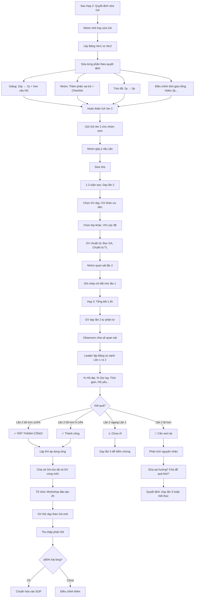

# SOP-05.4: CẢI TIẾN VÀ ÁP DỤNG

## 1. THÔNG TIN QUY TRÌNH

| **Thuộc tính** | **Nội dung** |
|---|---|
| Mã SOP | SOP-05.4 |
| Tên quy trình | Cải tiến và áp dụng |
| Quy trình cha | SOP-05: Lesson Study |
| Phiên bản | 1.0 |
| Tần suất | Sau Họp 2 (Thảo luận lần 1) |

## 2. MỤC ĐÍCH

- **Sửa giáo án dựa trên phản hồi**: Không giữ nguyên, Phải cải tiến!
- **Dạy lại để kiểm chứng**: Giáo án mới có tốt hơn không?
- **So sánh Lần 1 vs Lần 2**: Đo lường cải thiện cụ thể
- **Chuẩn hóa nếu thành công**: Áp dụng rộng cho tất cả GV

## 3. PHẠM VI ÁP DỤNG

Nhóm Lesson Study (5-6 GV) + Lan tỏa toàn tổ/Toàn trường

## 4. QUY TRÌNH CẢI TIẾN

### 4.1. Sửa giáo án (1 tuần sau Họp 2)

**Bước 1: Nhóm họp nhỏ (Hoặc Online - 1-2 giờ)**

**Thành phần:** Leader + 2-3 GV (Không cần cả nhóm)

**Mục đích:** Sửa giáo án theo quyết định từ Họp 2

**Bước 2: Lấy Bảng so sánh Ver 1 vs Ver 2 (Từ Họp 2 - QT05-D08)**

Ôn lại quyết định đã đồng thuận:

| **Phần GA** | **Ver 1** | **Ver 2** | **Lý do** |
|---|---|---|---|
| Giảng | 10 phút, GV nói suốt | 7 phút, Xen câu hỏi mỗi 2 phút | HS mất tập trung |
| Hoạt động nhóm | Không vai trò | Phân vai: Leader, Writer, Checker | 20% HS không làm gì |
| Tóm tắt | 2 phút | 5 phút | Quá vội, Cần đủ thời gian |

**Bước 3: Sửa từng phần cụ thể**

**A. Sửa phần Giảng (Ví dụ):**

**Ver 1 (Cũ):**
```
8:05-8:15: GV GIẢNG (10 phút)
• Giới thiệu phép nhân 2 chữ số
• Giải thích cách nhân từng bước
• Làm 1 ví dụ: 23 × 45
[GV nói suốt 10 phút]
```

**Ver 2 (Mới - Cải tiến):**
```
8:05-8:12: GV GIẢNG + TƯƠNG TÁC (7 phút)
• Giới thiệu phép nhân (1 phút)
• GV HỎI: "Các em nhớ lại, 23 × 5 = ?" [Wait 5 giây]
  → HS trả lời → GV khen
• GV giải thích bước 1: Nhân hàng đơn vị (2 phút)
• GV HỎI: "23 × 40 thì sao?" [Wait 5 giây]
  → HS trả lời → GV khen
• GV giải thích bước 2: Nhân hàng chục (2 phút)  
• GV làm ví dụ hoàn chỉnh: 23 × 45 (1 phút)
• GV HỎI: "Ai còn chưa hiểu?" [Kiểm tra]
[Xen kẽ 3 câu hỏi → HS tương tác → Không mất tập trung!]
```

**B. Sửa phần Hoạt động nhóm:**

**Ver 1 (Cũ):**
```
8:15-8:30: HOẠT ĐỘNG NHÓM (15 phút)
• Chia nhóm 4
• Làm bài tập nhóm
[Không hướng dẫn cụ thể → 20% HS không làm gì!]
```

**Ver 2 (Mới - Cải tiến):**
```
8:12-8:25: HOẠT ĐỘNG NHÓM (13 phút)
• Chia nhóm 4, PHÂN VAI TRÕ rõ:
  - Leader: Điều phối
  - Calculator: Tính toán
  - Writer: Ghi kết quả lên giấy A3
  - Checker: Kiểm tra lại
• Phát Worksheet + Giấy A3
• GV DEMO 1 bài mẫu trước (2 phút)
  "Nhóm của cô sẽ làm thế này: Leader đọc đề, 
   Calculator tính, Writer viết, Checker kiểm tra. Hiểu chưa?"
• HS làm (8 phút)
• GV đi quanh giám sát, Nhắc nhở nhóm chậm
• CHECKLIST cá nhân (QT05-CL18):
  □ Tôi đã đóng góp ý kiến
  □ Tôi đã làm việc được giao
  → Mọi HS phải tham gia!
```

**C. Sửa phần Tóm tắt:**

**Ver 1:** 2 phút (Vội!)  
**Ver 2:** 5 phút (Đủ thời gian)

**Điều chỉnh thời gian tổng:**
- Video: 5 phút → **3 phút** (Tìm video ngắn hơn)
- Giảng: 10 phút → **7 phút**
- Nhóm: 15 phút → **13 phút**
- Kahoot: 8 phút → **8 phút** (Giữ nguyên - Hiệu quả!)
- Tóm tắt: 2 phút → **5 phút**
- **Tổng:** 40 phút ✅

**Bước 4: Hoàn thiện Giáo án Ver 2**

- Sửa chi tiết từng phần
- Cập nhật tài liệu (Tìm video 3 phút, Làm Checklist cá nhân...)
- Kiểm tra lỗi chính tả
- Lưu file: `Giao_an_Phep_nhan_Ver2.docx`

**Bước 5: Gửi GA Ver 2 cho nhóm xem trước (3 ngày trước dạy lần 2)**

- Email/Zalo toàn nhóm
- Nhóm đọc, Góp ý nếu còn gì chưa ổn
- Sửa nhẹ nếu cần

### 4.2. Dạy lần 2 (1-2 tuần sau Họp 2)

**Bước 6: Chọn GV dạy lần 2**

**3 phương án:**

| **Phương án** | **Ưu điểm** | **Nhược điểm** |
|---|---|---|
| **GV cũ dạy lại** | Quen bài, Tự tin hơn | Ít "Mới mẻ" |
| **GV khác trong nhóm** | Góc nhìn mới, Test GA với GV khác | GV mới hơi lo |
| **Cả 2 GV (2 lớp)** | So sánh 2 phong cách GV | Tốn thời gian (2 tiết) |

**Khuyến nghị:** GV khác dạy (Để test GA có dễ dùng không)

**Bước 7: Chuẩn bị dạy lần 2**

- GV dạy lần 2 đọc kỹ GA Ver 2
- Chuẩn bị tài liệu (Video mới 3 phút, Checklist...)
- Chọn lớp khác (VD: Lớp 3B thay vì 3A)

**Lý do chọn lớp khác:**
- So sánh: GA này có hiệu quả với lớp khác không?
- Tránh "Teaching to the test" (Lớp 3A đã biết nội dung rồi)

**Bước 8: Nhóm quan sát lần 2 (Tương tự SOP-05.2)**

- Vào lớp, Ngồi yên
- Quan sát HS (Cùng kỹ thuật: Scripting, Seating chart...)
- Ghi chép chi tiết

**Bước 9: So sánh ngay sau tiết (10 phút - Không chính thức)**

"Ấn tượng đầu tiên: Lần 2 có tốt hơn Lần 1 không?"

### 4.3. Họp 3 - Tổng kết (Sau dạy lần 2)

**Bước 10: Họp 3 (1.5 giờ)**

**Cấu trúc:**

**A. GV dạy lần 2 tự phản tư (10 phút)**

**B. Observers chia sẻ quan sát lần 2 (30 phút)**

**C. SO SÁNH Lần 1 vs Lần 2 (40 phút - Phần QUAN TRỌNG NHẤT!)**

**Bước 11: Leader lập bảng so sánh (Trên Flipchart/Slide)**

**Bảng so sánh chi tiết:**

| **Chỉ tiêu** | **Lần 1** | **Lần 2** | **Thay đổi** | **Đánh giá** |
|---|---|---|---|---|
| **% HS đạt Exit ticket** | 67% (20/30) | 83% (25/30) | **+16%** ↗️ | ✅ Cải thiện rõ rệt! |
| **% HS giơ tay (TB)** | 40% (12/30) | 60% (18/30) | **+20%** ↗️ | ✅ Tương tác tăng! |
| **Thời gian mất do kỷ luật** | 3 phút | 1 phút | **-2 phút** ↗️ | ✅ Lớp tập trung hơn! |
| **% HS mất tập trung** | 40% (Phần giảng) | 15% | **-25%** ↗️ | ✅ Giảng ngắn hơn hiệu quả! |
| **Thời gian tóm tắt** | 2 phút (Vội!) | 5 phút (Đủ) | **+3 phút** ✅ | ✅ Đủ thời gian! |
| **HS yếu hiểu bài** | 2/5 (40%) | 4/5 (80%) | **+40%** ↗️ | ✅✅ Cải thiện MẠNH! |

**Kết luận:** Giáo án Ver 2 **TỐT HƠN RÕ RỆT!** 

**Bước 12: Phân tích SÂU từng cải tiến**

**Cải tiến 1: Rút ngắn giảng 10p → 7p**

```
Lần 1: HS mất tập trung 40% (12/30 HS nhìn ra ngoài, Vẽ nguệch...)
Lần 2: Chỉ 15% mất tập trung (5/30 HS)

→ Rút ngắn + Xen câu hỏi = HIỆU QUẢ! ✅

Bài học: "Giảng < 7 phút" nên áp dụng cho tất cả bài!
```

**Cải tiến 2: Phân vai trò nhóm**

```
Lần 1: 20% HS trong nhóm "Ẩn", Không làm gì
Lần 2: 95% HS tham gia (Chỉ 1-2 HS còn ít tham gia)

→ Phân vai trò RÕ RÀNG = Tất cả đều làm việc! ✅

Bài học: Hoạt động nhóm PHẢI có phân công cụ thể!
```

**Cải tiến 3: Tóm tắt 5 phút**

```
Lần 1: Vội vàng, Chỉ nhắc lại công thức (2 phút)
Lần 2: Đủ thời gian:
       - HS nhắc lại (2 phút)
       - Làm 1 bài tập tổng hợp (2 phút)
       - Dặn dò (1 phút)

→ Tóm tắt đầy đủ giúp HS nhớ lâu hơn! ✅

Bài học: Dành 5-8 phút cuối cho tóm tắt, Không bao giờ bỏ qua!
```

**Bước 13: Trả lời Research Question**

**RQ ban đầu:** "Làm sao để HS lớp 3 hiểu VÀ vận dụng đúng phép nhân 2 chữ số?"

**Câu trả lời (Sau 2 lần dạy):**

```
═══════════════════════════════════════════════════
  TRẢ LỜI RESEARCH QUESTION
═══════════════════════════════════════════════════

Dựa trên 2 lần dạy và Quan sát 60 HS (Lớp 3A + 3B),
Chúng tôi kết luận:

✅ PHƯƠNG PHÁP HIỆU QUẢ:

1. GIẢNG NGẮN (≤ 7 phút) + XEN CÂU HỎI (Mỗi 2 phút)
   → HS tập trung tốt hơn (85% vs 60%)

2. HỌC TỪ BẠN (Peer Teaching)
   → HS yếu hiểu tốt hơn khi bạn giải thích (80% vs 40%)

3. GAME TƯƠNG TÁC (Kahoot)
   → 90% HS tham gia, Học mà vui

4. TÓM TẮT ĐẦY ĐỦ (5 phút cuối)
   → HS nhớ lâu hơn

5. PHÂN VAI TRÕ RÕ trong nhóm
   → 95% HS tham gia (vs 80%)

⚠️ LƯU Ý:

• HS yếu cần hỗ trợ thêm (Dạy kèm 1-1)
• Video mở đầu nên ≤ 3 phút (5 phút quá dài)
• Worksheet nên có 3 mức độ: Dễ, TB, Khó (Phù hợp mọi HS)

═══════════════════════════════════════════════════
```

### 4.4. Quyết định áp dụng

**Bước 14: Đánh giá mức độ thành công**

| **Mức độ** | **Tiêu chí** | **Hành động** |
|---|---|---|
| **Rất thành công** | Lần 2 tốt hơn Lần 1 rõ rệt (≥ 15% HS đạt tăng) | **Áp dụng rộng ngay** |
| **Thành công** | Lần 2 tốt hơn Lần 1 (5-14% tăng) | Áp dụng rộng, Tiếp tục cải tiến nhẹ |
| **Chưa rõ** | Lần 2 ngang Lần 1 | Dạy lần 3 (Lớp khác) để kiểm chứng |
| **Thất bại** | Lần 2 tệ hơn Lần 1 | Phân tích lại, Thử cách khác |

**Ví dụ:** Lesson Study "Phép nhân" = **Rất thành công** → Áp dụng rộng!

**Bước 15: Lập kế hoạch áp dụng rộng (QT05-D09)**

**KẾ HOẠCH ÁP DỤNG:**

| **Hành động** | **Đối tượng** | **Thời gian** | **Trách nhiệm** |
|---|---|---|---|
| **1. Chia sẻ GA Ver 2** | Tất cả GV Toán lớp 3 (10 GV) | Ngay | Nhóm LS |
| **2. Workshop đào tạo** | 10 GV Toán lớp 3 | Tuần 15 (2 giờ) | Leader + GV dạy |
| **3. GV thử dạy theo GA mới** | 10 GV | Tuần 16-18 | Mỗi GV |
| **4. Thu thập phản hồi** | 10 GV | Tuần 19 | Tổ trưởng |
| **5. Điều chỉnh nhẹ (Nếu cần)** | Nhóm LS | Tuần 20 | Nhóm LS |
| **6. Chuẩn hóa vào SOP** | Tất cả | HK2 | Ban ISO |

**Bước 16: Tổ chức Workshop "Cách dạy Phép nhân 2 chữ số" (2 giờ)**

**Chương trình:**

| **Nội dung** | **Thời gian** | **Người dẫn** |
|---|---|---|
| Giới thiệu Lesson Study | 10 phút | Leader |
| Trình bày kết quả (Lần 1 vs Lần 2) | 20 phút | Leader + GV dạy |
| Chiếu video 2 lần dạy (Clips hay nhất) | 15 phút | Video |
| Giải thích chi tiết GA Ver 2 | 30 phút | GV dạy |
| Phát tài liệu (GA + Slide + Worksheet...) | 5 phút | Leader |
| Q&A | 20 phút | Tất cả |
| GV thử dạy (Role play) | 20 phút | 2-3 GV tự nguyện |

**Bước 17: GV áp dụng GA mới (Tuần 16-18)**

- Mỗi GV dạy bài "Phép nhân" theo GA Ver 2
- Tự đánh giá: "Có hiệu quả với lớp mình không?"
- Ghi nhận vào Sổ (QT05-S07)

**Bước 18: Thu thập phản hồi từ 10 GV**

**Form phản hồi (QT05-F28):**

| **Câu hỏi** | **Đánh giá** |
|---|---|
| GA Ver 2 có dễ sử dụng không? | 1 2 3 4 5 |
| HS lớp tôi có học tốt hơn không? | 1 2 3 4 5 |
| Tôi có khuyến nghị GV khác dùng không? | Có / Không |
| Gợi ý cải tiến thêm: | [Ô trống] |

**Bước 19: Phân tích phản hồi**

| **Kết quả** | **Số GV** | **%** |
|---|---|---|
| Rất hài lòng (5 sao) | 7 | 70% |
| Hài lòng (4 sao) | 2 | 20% |
| Bình thường (3 sao) | 1 | 10% |

**Điểm TB:** 4.6/5 = **Rất tốt!** ✅

**Bước 20: Chuẩn hóa vào SOP (Nếu ≥ 80% GV hài lòng)**

- Đưa GA Ver 2 vào "Giáo án mẫu chuẩn"
- Thêm vào SOP-01: "Khi dạy phép nhân 2 chữ số, Áp dụng GA mẫu [Link]"
- Đào tạo GV mới theo GA này

## 5. XỬ LÝ KHI CHƯA THÀNH CÔNG

**Tình huống: Lần 2 vẫn chưa tốt hơn Lần 1**

**Bước 21: Phân tích nguyên nhân**

| **Nguyên nhân có thể** | **Giải pháp** |
|---|---|---|
| Sửa sai hướng | Dạy lần 3 với cách sửa KHÁC |
| Chủ đề quá khó | Chấp nhận "Chưa tìm ra giải pháp", Nghiên cứu thêm |
| GV dạy lần 2 chưa quen | Cho GV đó dạy lại lần 3 |
| Lớp 2 yếu hơn Lớp 1 | Dạy lần 3 với lớp khác (Trình độ tương đương) |

**Bước 22: Quyết định:**
- Dạy lần 3? (Nếu còn thời gian, Ngân sách)
- Hoặc: Kết thúc, Viết BC: "Chưa thành công, Cần nghiên cứu thêm"

## 6. LƯU ĐỒ QUY TRÌNH



## 7. BIỂU MẪU LIÊN QUAN

| **Mã** | **Tên** |
|---|---|
| QT05-D08 | Bảng quyết định sửa GA (Ver 1 vs Ver 2) |
| QT05-D09 | Kế hoạch áp dụng rộng |
| QT05-CL18 | Checklist cá nhân (Hoạt động nhóm) |
| QT05-F28 | Form phản hồi GA mới (Từ GV áp dụng) |
| QT05-S07 | Sổ theo dõi áp dụng GA mới |

## 8. TIÊU CHUẨN VÀ CHỈ TIÊU

| **Chỉ tiêu** | **Mục tiêu** |
|---|---|
| GA Ver 2 tốt hơn Ver 1 | ≥ 80% Lesson Study |
| % HS đạt tăng (Lần 2 vs Lần 1) | ≥ 10% |
| GV hài lòng với GA mới (Khi áp dụng rộng) | ≥ 80% |
| GA được chuẩn hóa vào SOP | ≥ 50% Lesson Study thành công |

## 9. TRÁCH NHIỆM CỤ THỂ

| **Vai trò** | **Trách nhiệm** |
|---|---|
| **Nhóm LS** | Sửa GA, Dạy lần 2, So sánh, Chia sẻ |
| **Leader** | Tổ chức, Lập bảng so sánh, Viết KH áp dụng |
| **GV dạy lần 2** | Chuẩn bị kỹ, Dạy tốt nhất có thể |
| **Tổ trưởng** | Tổ chức Workshop, Thu thập phản hồi |
| **Ban ISO** | Chuẩn hóa GA vào SOP (Nếu thành công) |

## 10. LƯU Ý QUAN TRỌNG

- ⚠️ **Lần 2 PHẢI tốt hơn Lần 1**: Không sửa qua loa! Sửa dựa trên phân tích kỹ!
- ✅ **So sánh bằng SỐ LIỆU**: "Tốt hơn" phải đo được (%, Điểm...), Không cảm tính!
- ✅ **Dạy lại ở lớp KHÁC**: Không dạy lại lớp cũ (HS đã biết rồi!)
- ✅ **Áp dụng rộng cần đào tạo**: Đừng chỉ gửi GA rồi bỏ mặc!
- 🔥 **Thành công = Lan tỏa**: Lesson Study thành công → Nhiều GV/HS hưởng lợi!

## 11. PHỤ LỤC

### 11.1. Mẫu Bảng so sánh đầy đủ (QT05-D10)

```
═══════════════════════════════════════════════════
  BẢNG SO SÁNH LẦN 1 vs LẦN 2 - LESSON STUDY
      Chủ đề: Phép nhân 2 chữ số - Toán lớp 3
═══════════════════════════════════════════════════

I. THÔNG TIN:

Lần 1:
• Ngày: 18/11/2024
• GV: Nguyễn Văn A
• Lớp: 3A (30 HS: 10 Giỏi, 15 TB, 5 Yếu)

Lần 2:
• Ngày: 28/11/2024
• GV: Trần Thị B
• Lớp: 3B (30 HS: 8 Giỏi, 17 TB, 5 Yếu)

II. SO SÁNH SỐ LIỆU:

┌────────────────────┬─────────┬─────────┬──────────┐
│ Chỉ tiêu           │ Lần 1   │ Lần 2   │ Thay đổi │
├────────────────────┼─────────┼─────────┼──────────┤
│ % HS đạt Exit      │ 67%     │ 83%     │ +16% ↗️  │
│ ticket (≥8/10)     │ (20/30) │ (25/30) │          │
├────────────────────┼─────────┼─────────┼──────────┤
│ % HS giơ tay (TB)  │ 40%     │ 60%     │ +20% ↗️  │
├────────────────────┼─────────┼─────────┼──────────┤
│ % HS tập trung     │ 60%     │ 85%     │ +25% ↗️  │
│ (Phần giảng)       │         │         │          │
├────────────────────┼─────────┼─────────┼──────────┤
│ % HS tham gia      │ 80%     │ 95%     │ +15% ↗️  │
│ hoạt động nhóm     │         │         │          │
├────────────────────┼─────────┼─────────┼──────────┤
│ HS yếu hiểu bài    │ 2/5     │ 4/5     │ +2 HS ✅ │
│                    │ (40%)   │ (80%)   │          │
├────────────────────┼─────────┼─────────┼──────────┤
│ Thời gian tóm tắt  │ 2 phút  │ 5 phút  │ +3p ✅   │
└────────────────────┴─────────┴─────────┴──────────┘

III. PHÂN TÍCH ĐỊNH TÍNH:

A. ĐIỂM CẢI THIỆN RÕ RỆT:

1. Phần giảng (7 phút + Xen câu hỏi):
   Lần 1: 40% HS mất tập trung
   Lần 2: Chỉ 15% mất tập trung
   → Cải thiện 25%! ✅✅

2. Hoạt động nhóm (Có phân vai trò):
   Lần 1: 20% HS "Ẩn", Không làm gì
   Lần 2: 95% HS tham gia
   → Hầu như 100% tham gia! ✅✅

3. Tóm tắt cuối (5 phút):
   Lần 1: Vội, Không đầy đủ
   Lần 2: Đủ thời gian, HS nhắc lại + Làm BT tổng hợp
   → HS nhớ lâu hơn! ✅

B. ĐIỂM GIỮ NGUYÊN:

• Kahoot: Cả 2 lần đều rất hiệu quả (90%+ HS tham gia)
  → Giữ nguyên! ✅

IV. KẾT LUẬN:

✅ THÀNH CÔNG RÕ RÀNG!

GA Ver 2 tốt hơn Ver 1 ở:
• HS hiểu tốt hơn (+16% đạt)
• HS tham gia nhiều hơn (+20% giơ tay)
• HS yếu được hỗ trợ tốt hơn (+40% hiểu)

KHUYẾN NGHỊ:
→ ÁP DỤNG RỘNG cho tất cả GV Toán lớp 3!

═══════════════════════════════════════════════════
Nhóm LS ký: ___________  Tổ trưởng ký: ___________
```

### 11.2. Checklist áp dụng rộng

```
TRƯỚC KHI ÁP DỤNG RỘNG:

□ Lần 2 đã tốt hơn Lần 1? (≥ 10% HS đạt tăng)
□ Đã có Bảng so sánh chi tiết?
□ Đã viết "Bài học rút ra" rõ ràng?
□ GA Ver 2 đã hoàn thiện?
□ Tài liệu đầy đủ? (Slide, Worksheet, Video...)

TRONG QUÁ TRÌNH ÁP DỤNG:

□ Đã tổ chức Workshop đào tạo?
□ GA đã chia sẻ cho tất cả GV liên quan?
□ GV đã thử dạy theo GA mới?
□ Đã thu thập phản hồi từ GV?
□ ≥ 80% GV hài lòng?

SAU KHI ÁP DỤNG:

□ Đã chuẩn hóa vào SOP? (Nếu rất thành công)
□ Đã lưu trữ GA + Video vào Thư viện?
□ Đã chia sẻ với trường khác? (Nếu có mạng lưới)
```

## 12. FAQ

**Q1: Nếu chỉ tốt hơn 5% (Không rõ ràng)?**  
A: Dạy lần 3 để kiểm chứng. Nếu lần 3 vẫn chỉ +5% → Cải tiến nhỏ, Nhưng vẫn áp dụng được.

**Q2: Lần 2 tệ hơn Lần 1, Có phải sửa sai?**  
A: Không nhất thiết! Có thể do: GV lần 2 chưa quen, Lớp 2 yếu hơn. Phân tích kỹ nguyên nhân!

**Q3: Có bắt buộc phải dạy lần 2 không?**  
A: CÓ! Đó là đặc trưng của Lesson Study. Không dạy lần 2 = Không phải Lesson Study!

**Q4: Áp dụng rộng mà GV không làm theo thì sao?**  
A: Động viên, Không ép buộc. GA mẫu chỉ là "Gợi ý tốt", Không bắt buộc 100%.

---

**PHÊ DUYỆT**

| Leader | Tổ trưởng | Trưởng BP HT | Phó HT |
|---|---|---|---|
| [Họ tên] | [Họ tên] | [Họ tên] | [Họ tên] |
