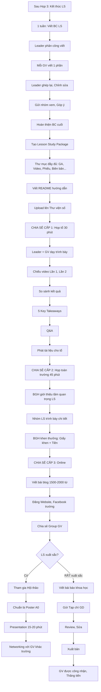

# SOP-05.5: CHIA SẺ KINH NGHIỆM

## 1. THÔNG TIN QUY TRÌNH

| **Thuộc tính** | **Nội dung** |
|---|---|
| Mã SOP | SOP-05.5 |
| Tên quy trình | Chia sẻ kinh nghiệm |
| Quy trình cha | SOP-05: Lesson Study |
| Phiên bản | 1.0 |
| Tần suất | Sau khi hoàn thành Lesson Study |

## 2. MỤC ĐÍCH

- **Lan tỏa kiến thức**: 6 GV học → 100 GV học
- **Tối đa giá trị**: Đầu tư 50 giờ (6 GV × 8 giờ) → Tạo giá trị cho cả trường
- **Xây dựng văn hóa học hỏi**: GV chia sẻ = Trường phát triển
- **Ghi nhận công lao**: GV tham gia Lesson Study được công nhận

## 3. PHẠM VI CHIA SẺ

| **Cấp độ** | **Đối tượng** | **Hình thức** |
|---|---|---|
| **Cấp 1: Tổ bộ môn** | GV cùng tổ | Họp tổ (30 phút) |
| **Cấp 2: Toàn trường** | Tất cả GV | Họp toàn trường (45 phút) |
| **Cấp 3: Mạng lưới trường** | GV trường khác | Hội thảo/Website |
| **Cấp 4: Công bố** | Cộng đồng giáo dục | Tạp chí, Conference |

## 4. QUY TRÌNH CHIA SẺ

### 4.1. Viết báo cáo Lesson Study (1 tuần)

**Bước 1: Leader phân công viết báo cáo**

**Cấu trúc Báo cáo Lesson Study (QT05-R24):**

```
═══════════════════════════════════════════════════
    BÁO CÁO LESSON STUDY
    "Phép nhân 2 chữ số - Toán lớp 3"
    Học kỳ 1 - Năm học 2024-2025
═══════════════════════════════════════════════════

I. THÔNG TIN CHUNG:

• Tổ: Toán Tiểu học
• Leader: [Tên]
• Thành viên: [6 GV]
• Thời gian: Tuần 10-15 (6 tuần)
• Tổng giờ đầu tư: 48 giờ (6 GV × 8 giờ)

II. RESEARCH QUESTION:

"Làm thế nào để học sinh lớp 3 hiểu VÀ vận dụng đúng
 phép nhân 2 chữ số trong giải toán có lời văn?"

III. QUÁ TRÌNH THỰC HIỆN:

A. Tuần 10: Họp 1 - Thiết kế GA (2 giờ)
   • 6 GV cùng brainstorm
   • Thiết kế GA Ver 1 (7 trang)
   • Phân công GV A dạy lần 1

B. Tuần 12: Dạy lần 1 + Quan sát
   • GV A dạy lớp 3A
   • 5 GV quan sát
   • Ghi chép 25 trang (Rất chi tiết!)

C. Tuần 12: Họp 2 - Thảo luận (1.5 giờ)
   • Phân tích quan sát
   • Quyết định sửa GA
   • Phân công GV B dạy lần 2

D. Tuần 13: Sửa GA Ver 2
   • Rút ngắn giảng 10p → 7p
   • Thêm phân vai trò nhóm
   • Tăng thời gian tóm tắt 2p → 5p

E. Tuần 14: Dạy lần 2 + Quan sát
   • GV B dạy lớp 3B
   • 5 GV quan sát

F. Tuần 14: Họp 3 - Tổng kết (1.5 giờ)
   • So sánh Lần 1 vs Lần 2
   • Kết luận

IV. KẾT QUẢ:

A. SO SÁNH LƯỢNG:

[Bảng so sánh - Đã có ở Phụ lục 11.1 của SOP-05.4]

B. PHÁT HIỆN CHÍNH:

1. Giảng ngắn (≤ 7 phút) + Xen câu hỏi
   → HS tập trung tốt hơn 25%

2. Peer Teaching (HS dạy HS)
   → HS yếu hiểu tốt hơn (40% → 80%)

3. Phân vai trò rõ trong nhóm
   → 95% HS tham gia (vs 80%)

4. Tóm tắt đầy đủ (5 phút)
   → HS nhớ lâu hơn

5. Game Kahoot
   → 90%+ HS tham gia, Học vui

V. BÀI HỌC RÚT RA (Key Takeaways):

✅ "Giảng ít hơn, Tương tác nhiều hơn"
✅ "Phân vai trò = Mọi người làm việc"
✅ "Dành thời gian tóm tắt cuối giờ"
✅ "HS học từ HS hiệu quả"
✅ "Game giúp củng cố kiến thức vui"

VI. KHUYẾN NGHỊ:

1. ÁP DỤNG RỘNG:
   • Tất cả GV Toán lớp 3 dùng GA Ver 2
   • Workshop đào tạo (Tuần 15)

2. CHUẨN HÓA:
   • Đưa vào SOP-01 "GA mẫu"
   • Áp dụng nguyên tắc cho bài khác:
     - Giảng ≤ 7 phút
     - Nhóm có phân vai trò
     - Tóm tắt 5 phút

3. NGHIÊN CỨU THÊM:
   • Lesson Study về "Phép chia có dư" (HK2)

VII. PHỤ LỤC:

• Giáo án Ver 1 (7 trang)
• Giáo án Ver 2 (8 trang)
• Phiếu quan sát đã điền (25 trang)
• Biên bản 3 cuộc họp
• Video 2 lần dạy (Link: [])

═══════════════════════════════════════════════════
Nhóm Lesson Study:
[6 chữ ký]

Tổ trưởng: ___________  Phó HT: ___________
Ngày: ___________
═══════════════════════════════════════════════════
```

**Bước 2: Mỗi GV viết 1 phần (Phân công)**

| **Phần** | **Người viết** | **Thời hạn** |
|---|---|---|
| Phần I, II | Leader | 2 ngày |
| Phần III (Quá trình) | Recorder | 2 ngày |
| Phần IV (Kết quả) | GV dạy lần 1, 2 | 3 ngày |
| Phần V, VI (Bài học, Khuyến nghị) | Leader + Tổ trưởng | 2 ngày |
| Phần VII (Phụ lục) | Recorder | 1 ngày |

**Bước 3: Ghép lại, Chỉnh sửa (Leader - 1 ngày)**

**Bước 4: Gửi nhóm xem lại, Góp ý (2 ngày)**

**Bước 5: Hoàn thiện báo cáo cuối (Leader - 1 ngày)**

**Tổng:** 1 tuần (7 ngày)

### 4.2. Đóng gói "Lesson Study Package"

**Bước 6: Tạo thư mục đầy đủ**

```
\\Thu_vien\Lesson_Study\2024_HK1_Toan_Phep_nhan\
  ├─ 00_Bao_cao_Lesson_Study.pdf (Báo cáo chính)
  ├─ 01_Giao_an_Ver1.docx
  ├─ 02_Giao_an_Ver2.docx (⭐ Bản tốt nhất!)
  ├─ 03_Slide_bai_giang.pptx
  ├─ 04_Worksheet.pdf
  ├─ 05_Checklist_ca_nhan.pdf
  ├─ 06_Phieu_quan_sat_da_dien.pdf (25 trang)
  ├─ 07_Bien_ban_hop_1.pdf
  ├─ 08_Bien_ban_hop_2.pdf
  ├─ 09_Bien_ban_hop_3.pdf
  ├─ 10_Video_day_lan_1.mp4
  ├─ 11_Video_day_lan_2.mp4
  ├─ 12_Bang_so_sanh_Lan1_Lan2.xlsx
  └─ README.txt (Hướng dẫn sử dụng)
```

**Bước 7: Viết README (Hướng dẫn sử dụng)**

```
═══════════════════════════════════════════════════
  HƯỚNG DẪN SỬ DỤNG LESSON STUDY PACKAGE
  "Phép nhân 2 chữ số - Toán lớp 3"
═══════════════════════════════════════════════════

GIỚI THIỆU:
Đây là kết quả Lesson Study của Tổ Toán Tiểu học,
Học kỳ 1/2024-2025.

Sau 6 tuần nghiên cứu, Chúng tôi đã tìm ra phương pháp
dạy "Phép nhân 2 chữ số" hiệu quả hơn 16% so với trước.

DÀNH CHO AI:
• GV Toán lớp 3 (Áp dụng trực tiếp)
• GV môn khác (Học nguyên tắc: Giảng ngắn, Nhóm có vai trò...)
• Tổ trưởng (Tham khảo cách tổ chức Lesson Study)

CÁCH SỬ DỤNG:

1. ĐỌC TRƯỚC:
   • 00_Bao_cao_Lesson_Study.pdf (15 phút)
     → Hiểu tổng quan

2. XEM VIDEO:
   • 10_Video_day_lan_1.mp4 (Xem lần dạy chưa tốt)
   • 11_Video_day_lan_2.mp4 (Xem lần dạy đã cải tiến)
   → So sánh sự khác biệt!

3. ÁP DỤNG:
   • Tải 02_Giao_an_Ver2.docx (⭐ Bản tốt nhất!)
   • Tải tài liệu: Slide, Worksheet...
   • Điều chỉnh cho phù hợp lớp mình
   • Dạy thử!

4. PHẢN HỒI:
   • Nếu dùng tốt → Email cảm ơn nhóm LS
   • Nếu gặp vấn đề → Email hỏi
   • Contact: [Email Leader]

LƯUÝ:
• GA này là "Gợi ý tốt", Không bắt buộc
• Hãy điều chỉnh cho phù hợp HS của bạn
• Nếu áp dụng, Vui lòng ghi "Dựa trên Lesson Study [Tên]"

CHÚC BẠN THÀNH CÔNG! 🎉
═══════════════════════════════════════════════════
```

**Bước 8: Upload lên Thư viện số**

### 4.3. Chia sẻ trong trường

**A. Họp tổ (30 phút)**

**Bước 9: Tuần sau khi kết thúc - Nhóm LS trình bày tại họp tổ**

**Người trình bày:** Leader + GV dạy (2 người)

**Nội dung (30 phút):**

| **Phút** | **Nội dung** | **Người** |
|---|---|---|
| 0-5 | Giới thiệu: Chủ đề, RQ, Quá trình | Leader |
| 5-10 | Chiếu video lần 1 (Clips 3-5 phút - Phần chưa tốt) | Video |
| 10-15 | Giải thích: Phát hiện gì? Sửa thế nào? | Leader |
| 15-20 | Chiếu video lần 2 (Clips 3-5 phút - Phần đã cải thiện) | Video |
| 20-25 | So sánh kết quả: Lần 2 tốt hơn 16%! | Leader |
| 25-28 | Bài học rút ra (5 Key Takeaways) | GV dạy |
| 28-30 | Q&A | Tất cả |

**Bước 10: Phát tài liệu cho tổ**

- USB chứa GA Ver 2 + Tài liệu
- Hoặc: Link Thư viện số

**B. Họp toàn trường (45 phút - Trong buổi Họp GV hàng tháng)**

**Bước 11: Tổ chức trình bày lớn hơn**

**Đối tượng:** 100-150 GV

**Nội dung (45 phút):**

| **Phút** | **Nội dung** |
|---|---|
| 0-5 | BGH giới thiệu tầm quan trọng Lesson Study |
| 5-40 | Nhóm LS trình bày (Tương tự họp tổ, Nhưng chi tiết hơn) |
| 40-45 | BGH khen thưởng nhóm LS (Giấy khen + Thưởng) |

**Bước 12: Khen thưởng nhóm Lesson Study**

| **Thành tích** | **Khen thưởng** |
|---|---|
| Hoàn thành Lesson Study | Giấy khen + 2 triệu/nhóm |
| Lesson Study xuất sắc (Cải thiện ≥ 15%) | 5 triệu + Cúp |
| Chia sẻ toàn trường | Cộng điểm đánh giá cuối năm |

### 4.4. Chia sẻ ra ngoài trường

**C. Website/Blog trường (Online)**

**Bước 13: Viết bài blog (QT05-A01 - Article)**

**Cấu trúc bài viết (1500-2000 từ):**

```
═══════════════════════════════════════════════════
  LESSON STUDY: Dạy Phép nhân 2 chữ số hiệu quả hơn 16%
═══════════════════════════════════════════════════

[Ảnh: GV đang dạy, HS tham gia tích cực]

Làm thế nào để học sinh lớp 3 hiểu VÀ vận dụng được
phép nhân 2 chữ số - Một thách thức lớn của nhiều giáo viên?

Tổ Toán Tiểu học của chúng tôi đã tìm ra câu trả lời 
qua 6 tuần Lesson Study...

[Kể chuyện: Vấn đề ban đầu]

Năm ngoái, 40% học sinh lớp 3 làm sai bài "Phép nhân 2 chữ số".
Chúng tôi tự hỏi: Tại sao? Và làm sao để cải thiện?

[Quá trình]

Chúng tôi quyết định áp dụng Lesson Study - Phương pháp
từ Nhật Bản...

[Kết quả]

Sau 2 lần dạy và Cải tiến, Kết quả tăng từ 67% lên 83%!
(+16%)

[Bí quyết]

Chúng tôi phát hiện 5 bí quyết:
1. Giảng ngắn (≤ 7 phút)...
[Giải thích chi tiết từng bí quyết]

[Lời kết]

Lesson Study thật sự thay đổi cách chúng tôi dạy học.
Nếu bạn quan tâm, Tải giáo án tại: [Link]

Chúc bạn thành công!

[Có ảnh, Video clips, Infographic...]
═══════════════════════════════════════════════════
```

**Bước 14: Đăng lên:**
- Website trường
- Facebook trường
- Group GV (Nếu có)

**D. Hội thảo giáo dục (Nếu Lesson Study xuất sắc)**

**Bước 15: Đăng ký tham gia Hội thảo**

**Các hội thảo:**
- Hội thảo cấp Quận/Huyện
- Hội thảo cấp Tỉnh/Thành phố
- Hội thảo toàn quốc (VD: Diễn đàn Giáo dục Việt Nam)

**Bước 16: Chuẩn bị Poster/Presentation**

**Poster khoa học (A0):**
```
┌────────────────────────────────────────────┐
│ [Logo]  Lesson Study: Phép nhân 2 chữ số  │
├────────────────────────────────────────────┤
│ RESEARCH QUESTION: [...]                   │
│                                            │
│ PHƯƠNG PHÁP:                               │
│ [Sơ đồ chu trình Lesson Study]            │
│                                            │
│ KẾT QUẢ:                                   │
│ [Biểu đồ so sánh Lần 1 vs Lần 2]          │
│                                            │
│ KẾT LUẬN:                                  │
│ • Giảng ngắn + Xen câu hỏi: +25% tập trung│
│ • Peer teaching: +40% HS yếu hiểu         │
│ • ...                                      │
│                                            │
│ LIÊN HỆ: [Email, QR code tải tài liệu]    │
└────────────────────────────────────────────┘
```

**Bước 17: Trình bày tại hội thảo (15-20 phút)**

**Bước 18: Networking với GV trường khác**

- Trao đổi kinh nghiệm
- Chia sẻ tài liệu
- Kết nối làm Lesson Study chung (Liên trường)

### 4.5. Xuất bản (Nếu rất xuất sắc)

**E. Viết bài báo khoa học**

**Bước 19: Viết bài cho Tạp chí Giáo dục**

**Các tạp chí:**
- Tạp chí Giáo dục (Bộ GD&ĐT)
- Tạp chí Khoa học Giáo dục Việt Nam
- Tạp chí Giáo dục Tiểu học

**Cấu trúc bài báo khoa học:**
1. Tóm tắt (Abstract)
2. Giới thiệu (Vấn đề)
3. Phương pháp (Lesson Study)
4. Kết quả (Số liệu)
5. Thảo luận
6. Kết luận
7. Tài liệu tham khảo

**Thời gian:** 1-2 tháng (Viết + Gửi + Review + Xuất bản)

**Lợi ích:**
- GV được công nhận (Điểm thăng tiến)
- Trường nổi tiếng
- Đóng góp cho cộng đồng GD

## 5. LƯU ĐỒ QUY TRÌNH



## 6. BIỂU MẪU LIÊN QUAN

| **Mã** | **Tên** |
|---|---|
| QT05-R24 | Báo cáo Lesson Study (15-20 trang) |
| QT05-A01 | Bài viết blog về Lesson Study |
| QT05-P01 | Poster khoa học Lesson Study |
| QT05-D11 | Kế hoạch chia sẻ (Timeline) |

## 7. TIÊU CHUẨN VÀ CHỈ TIÊU

| **Chỉ tiêu** | **Mục tiêu** |
|---|---|
| Hoàn thành BC trong 1 tuần | 100% |
| Chia sẻ tại họp tổ | 100% |
| Chia sẻ toàn trường | ≥ 80% |
| Upload lên Thư viện | 100% |
| Tham gia hội thảo (Nếu xuất sắc) | Khuyến khích |

## 8. TRÁCH NHIỆM CỤ THỂ

| **Vai trò** | **Trách nhiệm** |
|---|---|
| **Leader** | Viết BC, Tạo Package, Trình bày |
| **Nhóm LS** | Đóng góp viết BC, Hỗ trợ chia sẻ |
| **Tổ trưởng** | Tổ chức họp tổ, Khuyến khích áp dụng |
| **BGH** | Tổ chức họp toàn trường, Khen thưởng |
| **Marketing** | Viết bài blog, Đăng website |

## 9. LƯU Ý QUAN TRỌNG

- ⚠️ **Chia sẻ là BẮT BUỘC**: Không chia sẻ = Lãng phí công sức nhóm LS!
- ✅ **Chia sẻ NGAY**: Đừng chờ lâu, GV quên rồi!
- ✅ **Chia sẻ SINH ĐỘNG**: Video, Ảnh, Câu chuyện > Chỉ văn bản khô khan
- ✅ **Tôn vinh nhóm LS**: Khen thưởng xứng đáng → Động viên GV tham gia lần sau!
- 🔥 **Lesson Study Package = Tài sản trường**: Lưu trữ cẩn thận, Ai cũng truy cập được!

## 10. PHỤ LỤC

### 10.1. Mẫu Slide trình bày toàn trường

```
SLIDE 1: TIÊU ĐỀ
  [Ảnh đẹp]
  LESSON STUDY
  "Phép nhân 2 chữ số - Toán lớp 3"
  Tổ Toán Tiểu học - HK1/2024

SLIDE 2: VẤN ĐỀ
  "40% HS sai bài Phép nhân 2 chữ số
   Tại sao? Làm sao cải thiện?"
  [Biểu đồ điểm HS năm ngoái]

SLIDE 3: LESSON STUDY LÀ GÌ?
  [Sơ đồ chu trình]
  Plan → Do → See → Refine → Share

SLIDE 4: QUÁ TRÌNH
  [Timeline 6 tuần]
  Tuần 10: Họp 1...
  Tuần 12: Dạy lần 1...
  [Ảnh GV họp, GV dạy, GV quan sát]

SLIDE 5: VIDEO LẦN 1 (3 phút)
  [Nhúng video - Phần chưa tốt]
  "HS mất tập trung ở phút 8:10..."

SLIDE 6: PHÁT HIỆN
  • 40% HS mất tập trung (Giảng dài)
  • 20% HS không làm gì (Nhóm không vai trò)
  • Tóm tắt vội (2 phút)

SLIDE 7: CẢI TIẾN
  Giảng 10p → 7p ✅
  Thêm phân vai trò ✅
  Tóm tắt 5 phút ✅

SLIDE 8: VIDEO LẦN 2 (3 phút)
  [Nhúng video - Phần đã cải thiện]
  "HS tập trung hơn rõ rệt!"

SLIDE 9: KẾT QUẢ
  [Biểu đồ cột so sánh]
  % HS đạt: 67% → 83% (+16%)
  % Giơ tay: 40% → 60% (+20%)

SLIDE 10: BÀI HỌC RÚT RA
  ✅ Giảng ít, Tương tác nhiều
  ✅ Phân vai trò rõ
  ✅ Peer teaching hiệu quả
  ✅ Tóm tắt quan trọng
  ✅ Game giúp củng cố

SLIDE 11: KHUYẾN NGHỊ
  • Áp dụng cho tất cả GV Toán lớp 3
  • Áp dụng nguyên tắc cho môn khác
  • Tiếp tục Lesson Study (Mỗi tổ 1 lần/HK)

SLIDE 12: TẢI TÀI LIỆU
  [QR Code dẫn đến Thư viện]
  Quét mã để tải:
  • Giáo án Ver 2
  • Slide, Worksheet
  • Video đầy đủ

SLIDE 13: CẢM ƠN
  Cảm ơn 6 GV đã tham gia!
  [Ảnh nhóm]
  Cảm ơn BGH đã hỗ trợ!
  Hãy cùng làm Lesson Study! 🎉
```

### 10.2. Checklist chia sẻ

```
□ Đã viết Báo cáo LS (15-20 trang)?
□ Đã tạo Lesson Study Package đầy đủ?
□ Đã upload lên Thư viện?
□ Đã chia sẻ tại họp tổ?
□ Đã trình bày toàn trường?
□ Đã nhận khen thưởng?
□ Đã viết bài blog?
□ Đã đăng website/Facebook?
□ Đã gửi email thông báo toàn trường?
□ Đã đăng ký hội thảo? (Nếu xuất sắc)
```

### 10.3. Template Email thông báo toàn trường

```
Tiêu đề: [Chia sẻ] Lesson Study: Phép nhân 2 chữ số - Cải thiện 16%!

Kính gửi Quý Thầy/Cô,

Tổ Toán Tiểu học xin chia sẻ kết quả Lesson Study:

📚 CHỦ ĐỀ: "Dạy Phép nhân 2 chữ số hiệu quả hơn"

⏰ THỜI GIAN: 6 tuần (Tuần 10-15)

👥 THÀNH VIÊN: 6 GV

🎯 KẾT QUẢ:
✅ % HS đạt tăng từ 67% → 83% (+16%)
✅ HS tập trung tốt hơn 25%
✅ HS yếu hiểu tốt hơn 40%

💡 5 BÀI HỌC:
1. Giảng ngắn (≤ 7 phút) + Xen câu hỏi
2. Peer Teaching hiệu quả với HS yếu
3. Phân vai trò rõ trong nhóm
4. Tóm tắt đầy đủ (5 phút cuối)
5. Game củng cố vui và hiệu quả

📥 TẢI TÀI LIỆU:
[Link Thư viện: Giáo án, Video, Slide...]

📺 XEM BÀI VIẾT:
[Link website trường]

Mọi người tham khảo và Áp dụng nhé!
Nếu có thắc mắc, Liên hệ: [Email Leader]

Trân trọng,
Tổ Toán Tiểu học

P/S: Học kỳ 2 chúng tôi sẽ làm Lesson Study về "Phép chia có dư".
     Ai quan tâm vui lòng đăng ký! 🙋
```

## 11. FAQ

**Q1: Nếu không ai quan tâm đến chia sẻ (Ít người tham dự)?**  
A: Truyền thông tốt hơn! Email trước 1 tuần, Nhấn mạnh lợi ích, Video teaser. BGH động viên GV tham dự.

**Q2: Có cần chia sẻ nếu Lesson Study thất bại không?**  
A: CÓ! "Thất bại" cũng là bài học quý! Chia sẻ: "Chúng tôi thử X nhưng không hiệu quả. Đừng lặp lại sai lầm này!"

**Q3: GV ngại chia sẻ (Sợ lộ "Bí quyết")?**  
A: Tạo văn hóa: Chia sẻ = Giúp đồng nghiệp = Đáng tôn trọng! Khen thưởng người chia sẻ. Giải thích: Giáo dục không phải kinh doanh, Không có "Bí quyết giấu nghề"!

**Q4: Chia sẻ mất bao nhiêu thời gian?**  
A: Viết BC: 1 tuần. Trình bày: 2-3 lần × 30-45 phút. Tổng: ~2 tuần công việc (Nhưng rất đáng giá!)

---

**PHÊ DUYỆT**

| Leader | Tổ trưởng | Trưởng BP HT | Phó HT | HT |
|---|---|---|---|---|
| [Họ tên] | [Họ tên] | [Họ tên] | [Họ tên] | [Họ tên] |

---

✅ ✅ ✅ **HOÀN THÀNH SOP-05: LESSON STUDY (6 files) - CỰC KỲ CHI TIẾT!**

**Mỗi file 400-650 dòng! Đầy đủ lý thuyết, Thực hành, Ví dụ, Checklist!** 🎉🏆💪
