# SOP-06.1: XÂY DỰNG THƯ VIỆN SỐ

## 1. THÔNG TIN QUY TRÌNH

| **Thuộc tính** | **Nội dung** |
|---|---|
| Mã SOP | SOP-06.1 |
| Tên quy trình | Xây dựng thư viện số |
| Quy trình cha | SOP-06: Thư viện số |
| Phiên bản | 1.0 |
| Tần suất | 1 lần (Xây dựng ban đầu) + Mở rộng liên tục |

## 2. MỤC ĐÍCH

- **Truy cập 24/7**: GV, HS, PH truy cập học liệu mọi lúc, Mọi nơi
- **Tập trung hóa**: Tất cả học liệu ở 1 chỗ, Dễ quản lý
- **Chia sẻ dễ dàng**: Upload 1 lần, Tất cả dùng được
- **Tiết kiệm**: Không in ấn, Không mất giấy tờ
- **Hiện đại**: Trường học thế kỷ 21 phải có Thư viện số!

## 3. PHẠM VI ÁP DỤNG

Toàn trường (Mầm non - Tiểu học - THCS)

## 4. MÔ HÌNH THƯ VIỆN SỐ

### 4.1. Thư viện số là gì?

**Định nghĩa:** Hệ thống lưu trữ và Quản lý tài nguyên số (Sách điện tử, Video, Slide, Giáo án...) Truy cập qua Internet

**Thành phần:**
```
┌─────────────────────────────────────────┐
│       THƯ VIỆN SỐ                       │
├─────────────────────────────────────────┤
│ 1. NỀN TẢNG (Platform)                  │
│    • Google Drive / Moodle / Website    │
├─────────────────────────────────────────┤
│ 2. NỘI DUNG (Content)                   │
│    • Giáo án, Video, Sách, Game...      │
├─────────────────────────────────────────┤
│ 3. NGƯỜI DÙNG (Users)                   │
│    • GV, HS, PH                         │
├─────────────────────────────────────────┤
│ 4. QUY TRÌNH (Processes)                │
│    • Upload, Tìm kiếm, Tải về...        │
└─────────────────────────────────────────┘
```

### 4.2. Lựa chọn nền tảng

**So sánh 5 lựa chọn:**

| **Nền tảng** | **Ưu điểm** | **Nhược điểm** | **Giá** | **Phù hợp** |
|---|---|---|---|---|
| **Google Drive** | • Dễ dùng<br>• Phổ biến<br>• Tích hợp Google Classroom<br>• Backup tự động | • Tìm kiếm kém<br>• Phân quyền phức tạp hơi khó<br>• Giới hạn dung lượng | Free (15GB)<br>$2/tháng (100GB)<br>$10/tháng (2TB) | ⭐⭐⭐⭐⭐ Trường nhỏ-TB |
| **Microsoft OneDrive** | • Tích hợp Office<br>• Dễ dùng | • Tương tự Google Drive | $7/tháng (1TB) | ⭐⭐⭐⭐ Nếu dùng Office 365 |
| **Notion** | • Giao diện đẹp<br>• Linh hoạt<br>• Có Database | • Học hơi khó<br>• Chậm khi nhiều file | Free (Cá nhân)<br>$8/user/tháng | ⭐⭐⭐ Trường nhỏ, Sáng tạo |
| **Moodle** | • Chuyên cho GD<br>• LMS mạnh<br>• Free 100% | • Cài đặt khó<br>• Cần server riêng<br>• Giao diện lỗi thời | Free (Self-host)<br>Chi phí server: $50-200/tháng | ⭐⭐⭐⭐ Trường lớn, Kỹ thuật |
| **Website riêng** | • Tùy biến 100%<br>• Chuyên nghiệp<br>• Thương hiệu | • Đắt (Dev $5K-20K)<br>• Cần bảo trì | Dev: $5000-20000<br>Bảo trì: $200-500/tháng | ⭐⭐⭐⭐⭐ Trường lớn, Ngân sách cao |

**Lộ trình gợi ý:**

```
NĂM 1-2: Google Drive
   ↓ (Khi có ≥ 500 HL, 50GB dữ liệu)
NĂM 3: Moodle (Tự host)
   ↓ (Khi có ≥ 2000 HL, Ngân sách ổn định)
NĂM 5+: Website riêng (Chuyên nghiệp)
```

**Quyết định của trường:** __________________ (Chọn 1)

## 5. QUY TRÌNH XÂY DỰNG (Với Google Drive - Ví dụ)

### 5.1. Lập dự án (Tháng 6)

**Bước 1: BGH ra Quyết định thành lập Ban chỉ đạo Thư viện số**

**Thành phần:**

| **Vai trò** | **Người** | **Trách nhiệm** |
|---|---|---|
| **Trưởng ban** | Phó HT Học thuật | Tổng điều hành, Quyết định |
| **Phó ban** | Trưởng IT | Kỹ thuật, Hạ tầng |
| **Thủ thư** | Thủ thư | Nội dung, Phân loại |
| **Thành viên** | 3-5 GV đại diện | Góp ý, Đại diện GV |

**Bước 2: Họp kick-off (2 giờ)**

**Nội dung:**
- Tầm nhìn: "Thư viện số phục vụ 1000 GV-HS-PH"
- Mục tiêu: "Ra mắt tháng 9, ≥ 200 tài liệu"
- Ngân sách: 20-50 triệu
- Timeline: 3 tháng (T6-T8)
- Phân công nhiệm vụ

**Bước 3: Lập Kế hoạch dự án (QT05-D12)**

| **Tuần** | **Hoạt động** | **Trách nhiệm** | **Sản phẩm** |
|---|---|---|---|
| T1 | Chọn nền tảng, Thiết kế cấu trúc | Ban chỉ đạo | Quyết định nền tảng, Sơ đồ thư mục |
| T2-3 | Thiết lập kỹ thuật | IT | Tài khoản, Phân quyền, Test |
| T4-7 | Thu thập nội dung | Thủ thư + GV | ≥ 200 tài liệu |
| T8 | Đào tạo GV | IT + Thủ thư | Workshop 2 giờ |
| T9 | Pilot test | 10 GV tự nguyện | Phản hồi, Sửa lỗi |
| T10 | Ra mắt chính thức | Ban chỉ đạo | Thông báo toàn trường |
| T11-12 | Hỗ trợ, Thu thập phản hồi | Thủ thư + IT | Sửa lỗi, Cải tiến |

### 5.2. Thiết kế cấu trúc (Tuần 1)

**Bước 4: Thiết kế cấu trúc thư mục**

**Nguyên tắc:**
- Logic: Dễ tìm
- Không quá sâu: Tối đa 4 cấp
- Rõ ràng: Tên thư mục dễ hiểu

**Cấu trúc đề xuất (Google Drive):**

```
📁 THƯ VIỆN SỐ IQ SCHOOL
│
├─📁 01_GIÁO ÁN
│  ├─📁 Man_non
│  │  ├─📁 3_tuoi
│  │  ├─📁 4_tuoi
│  │  └─📁 5_tuoi
│  ├─📁 Tieu_hoc
│  │  ├─📁 Lop_1
│  │  │  ├─📁 Toan
│  │  │  ├─📁 Tieng_Viet
│  │  │  └─📁 Khac
│  │  ├─📁 Lop_2-5 (Tương tự)
│  └─📁 THCS
│     ├─📁 Lop_6-9 (Tương tự)
│
├─📁 02_HỌC LIỆU
│  ├─📁 Video
│  │  ├─📁 Toan
│  │  ├─📁 Tieng_Viet
│  │  └─📁 Khac
│  ├─📁 Slide
│  ├─📁 Worksheet
│  ├─📁 Game_tuong_tac (Link Kahoot, Quizizz...)
│  └─📁 Audio (Podcast, Nhạc...)
│
├─📁 03_SÁCH ĐIỆN TỬ
│  ├─📁 SGK_SGV (Sách giáo khoa, Sách GV)
│  ├─📁 Sach_tham_khao
│  ├─📁 Truyen_thieu_nhi
│  └─📁 Sach_danh_cho_GV
│
├─📁 04_LESSON STUDY
│  ├─📁 2024_HK1_Toan_Phep_nhan
│  └─📁 2024_HK2_... (Mỗi LS 1 thư mục)
│
├─📁 05_TÀI LIỆU GIÁO VIÊN
│  ├─📁 Dao_tao_GV (Slide khóa đào tạo)
│  ├─📁 Tai_lieu_chuyen_mon
│  └─📁 Mau_bieu_mau (Template)
│
├─📁 06_TÀI LIỆU PHỤ HUYNH
│  ├─📁 Huong_dan_ho_tro_con_hoc
│  ├─📁 Tai_lieu_giao_duc_gia_dinh
│  └─📁 Thong_bao_nha_truong
│
└─📁 07_QUẢN TRỊ (Chỉ BGH, Thủ thư xem)
   ├─📁 Bao_cao
   ├─📁 Thong_ke
   └─📁 Bien_ban
```

**Bước 5: Thiết kế quy tắc đặt tên file**

**Format chuẩn:**
`[Cap]_[Mon]_[Chu_de]_[Loai]_[Tac_gia]_[Nam].[Duoi]`

**Ví dụ:**
- `TH_Toan_L3_Phep_nhan_Video_KhanAcademy_2024.mp4`
- `THCS_Vat_ly_L8_Dong_dien_Slide_NguyenVanA_2024.pptx`

**Bước 6: Thiết kế metadata (Thông tin file)**

Mỗi file cần có:

| **Metadata** | **Ví dụ** |
|---|---|
| Tiêu đề | "Video: Phép nhân 2 chữ số" |
| Mô tả | "Video 5 phút giải thích cách nhân 23 × 45" |
| Loại | Video |
| Môn | Toán |
| Cấp | Tiểu học - Lớp 3 |
| Chủ đề/Tag | #Toán #Lớp3 #Phepnhan #Video |
| Tác giả | Khan Academy |
| Người upload | Nguyễn Văn A |
| Ngày upload | 15/11/2024 |
| Bản quyền | CC BY-NC-SA |
| Link gốc | https://... |
| Lượt xem | 125 |
| Đánh giá | ⭐⭐⭐⭐ (4.2/5 - 15 đánh giá) |

### 5.3. Thiết lập kỹ thuật (Tuần 2-3)

**A. Google Drive (Ví dụ)**

**Bước 7: Tạo tài khoản Google Workspace for Education**

- Đăng ký tại: workspace.google.com/education
- Miễn phí cho trường học!
- Dung lượng: Unlimited (Không giới hạn!)

**Bước 8: Tạo Shared Drive (Ổ đĩa chia sẻ)**

Tên: "THƯ VIỆN SỐ IQ SCHOOL"

**Bước 9: Thiết lập phân quyền**

| **Đối tượng** | **Quyền** | **Lý do** |
|---|---|---|
| **Thủ thư** | Manager (Toàn quyền) | Quản lý, Upload, Xóa |
| **IT** | Manager | Kỹ thuật, Backup |
| **Tổ trưởng** | Content Manager | Upload, Sửa (Thư mục tổ mình) |
| **GV** | Contributor | Xem, Upload (Không xóa) |
| **HS** | Viewer | Chỉ xem (Không tải về - Tùy chính sách) |
| **PH** | Viewer | Xem thư mục "Tài liệu PH" |

**Bước 10: Cài đặt Google Drive Desktop (Trên máy GV)**

- Tải: google.com/drive/download
- Cài đặt
- Đăng nhập
- → Thư viện xuất hiện như ổ đĩa (VD: G:\)
- → GV kéo thả file như USB!

**B. Website riêng (Nếu chọn - Phức tạp hơn)**

**Bước 11: Thuê công ty làm website**

**Yêu cầu kỹ thuật:**
- Responsive (Xem được trên điện thoại)
- Tìm kiếm nhanh (Elasticsearch)
- Phân quyền chi tiết (RBAC)
- Thống kê truy cập (Google Analytics)
- Bảo mật (HTTPS, Backup)

**Chi phí:**
- Thiết kế + Dev: $5,000-15,000
- Bảo trì: $200-500/tháng
- Hosting: $50-200/tháng

**Thời gian:** 3-6 tháng

### 5.4. Thu thập nội dung ban đầu (Tuần 4-7)

**Bước 12: Kêu gọi GV đóng góp (Email toàn trường)**

Mẫu email:
```
XÂY DỰNG THƯ VIỆN SỐ - KÊU GỌI ĐÓNG GÓP

Kính gửi Quý Thầy/Cô,

Nhà trường đang xây dựng THƯ VIỆN SỐ để phục vụ GV, HS, PH.

KÊU GỌI mọi người đóng góp:
• Giáo án hay
• Slide bài giảng
• Video tự quay
• Worksheet
• Bất kỳ tài liệu hữu ích nào!

CÁCH ĐÓNG GÓP:
1. Upload lên: [Link Google Drive]
2. Hoặc: Gửi USB cho Thủ thư

QUYỀN LỢI:
• Được ghi nhận tác giả
• Được khen thưởng (500K/10 tài liệu chất lượng)
• Được chia sẻ, Nhiều người dùng

HẠN: 31/7/2024

MỤC TIÊU: ≥ 200 tài liệu!

Trân trọng,
Ban chỉ đạo Thư viện số
```

**Bước 13: GV upload tài liệu**

**Bước 14: Thủ thư kiểm duyệt (Quality Control)**

**Checklist kiểm duyệt (QT05-CL19):**
- [ ] Chất lượng tốt? (Rõ nét, Không lỗi...)
- [ ] Bản quyền hợp pháp?
- [ ] Phù hợp lứa tuổi?
- [ ] Nội dung chính xác?
- [ ] Đặt tên đúng format?

**Quyết định:**
- ✅ Đạt → Duyệt, Chuyển vào thư mục chính thức
- ⚠️ Cần sửa → Góp ý, GV sửa lại
- ❌ Không đạt → Từ chối, Giải thích lý do

**Bước 15: Thủ thư phân loại, Gắn tag**

- Di chuyển vào đúng thư mục (Môn, Cấp, Loại)
- Đổi tên nếu chưa chuẩn
- Điền metadata (Mô tả, Tag...)

**Mục tiêu Tuần 7:** Có ≥ 200 tài liệu chất lượng!

### 5.5. Đào tạo người dùng (Tuần 8)

**Bước 16: Tổ chức Workshop "Cách sử dụng Thư viện số" (2 giờ)**

**Đối tượng:** Tất cả GV (100 người)

**Chương trình:**

| **Nội dung** | **Thời gian** | **Người dẫn** |
|---|---|---|
| Giới thiệu Thư viện số | 10 phút | Phó HT |
| Lợi ích: Tiết kiệm thời gian, Dễ truy cập... | 10 phút | Thủ thư |
| **DEMO: Cách truy cập** | 20 phút | IT |
| • Đăng nhập<br>• Duyệt thư mục<br>• Tìm kiếm<br>• Xem/Tải file | | |
| **DEMO: Cách upload** | 20 phút | Thủ thư |
| • Chọn file<br>• Đặt tên đúng<br>• Chọn thư mục<br>• Điền metadata | | |
| **THỰC HÀNH** | 40 phút | IT + Thủ thư |
| • GV tự tìm 1 tài liệu<br>• GV tự upload 1 tài liệu | | |
| Q&A | 20 phút | Tất cả |

**Bước 17: Phát Tài liệu hướng dẫn**

- **Sổ tay Thư viện số** (10 trang - QT05-H01)
- **Video hướng dẫn** (5 phút - Quay sẵn)
- **Infographic** (1 trang A4 - Các bước cơ bản)

### 5.6. Pilot test (Tuần 9)

**Bước 18: Mời 10 GV tự nguyện test trước**

**Yêu cầu:**
- Dùng thử Thư viện 1 tuần
- Tìm kiếm, Tải về, Upload
- Báo lỗi (Nếu có)
- Góp ý cải tiến

**Bước 19: Thu thập phản hồi (Form QT05-F29)**

| **Câu hỏi** | **Đánh giá** |
|---|---|---|
| Giao diện có dễ dùng không? | 1 2 3 4 5 |
| Tìm kiếm có nhanh không? | 1 2 3 4 5 |
| Chất lượng tài liệu? | 1 2 3 4 5 |
| Có gặp lỗi kỹ thuật không? | Có / Không (Nếu có: Mô tả) |
| Gợi ý cải tiến: | [Ô trống] |

**Bước 20: Phân tích phản hồi, Sửa lỗi**

- Lỗi kỹ thuật → IT sửa
- Khó dùng → Đơn giản hóa
- Thiếu tài liệu → Thu thập thêm

### 5.7. Ra mắt chính thức (Tuần 10 - Đầu năm học)

**Bước 21: Ngày ra mắt (Trong buổi họp GV đầu năm)**

**Chương trình (30 phút):**

1. **BGH phát biểu** (5 phút)
   "Thư viện số là bước tiến lớn của nhà trường..."

2. **Video giới thiệu** (3 phút)
   Clip ngắn: "Cách dùng Thư viện số trong 3 phút"

3. **Demo trực tiếp** (10 phút)
   IT + Thủ thư demo trên màn hình lớn

4. **Phát quà** (5 phút)
   10 GV đóng góp nhiều nhất → Giấy khen + Quà

5. **Thông báo chính thức** (2 phút)
   "Từ hôm nay, Thư viện số chính thức hoạt động!"

**Bước 22: Gửi Email hướng dẫn toàn trường**

**Kèm:**
- Link Thư viện
- Tài khoản/Mật khẩu
- Video hướng dẫn
- Sổ tay

## 6. LƯU ĐỒ QUY TRÌNH

```mermaid
graph TD
    A[T6: BGH ra QĐ thành lập Ban chỉ đạo] --> B[Phó HT + IT + Thủ thư + 3-5 GV]
    B --> C[Họp kick-off 2h]
    C --> D[Tầm nhìn, Mục tiêu, Ngân sách, Timeline]
    D --> E[Lập KH dự án 12 tuần]
    
    E --> F[Tuần 1: Chọn nền tảng]
    F --> G{So sánh: Google Drive, Moodle, Website?}
    G -->|Trường nhỏ-TB| H[Chọn Google Drive]
    G -->|Trường lớn, Kỹ thuật| I[Chọn Moodle]
    G -->|Trường lớn, Ngân sách cao| J[Chọn Website riêng]
    
    H --> K[Thiết kế cấu trúc thư mục]
    I --> K
    J --> K
    K --> L[Nguyên tắc: Logic, Không quá sâu, Rõ ràng]
    L --> M[Vẽ sơ đồ: 7 thư mục chính]
    M --> N[Thiết kế quy tắc đặt tên file]
    N --> O[Format: Cap_Mon_Chude_Loai_Tacgia_Nam]
    
    O --> P[Tuần 2-3: Thiết lập kỹ thuật]
    P --> Q[Tạo tài khoản Google Workspace]
    Q --> R[Tạo Shared Drive]
    R --> S[Thiết lập phân quyền: Thủ thư Manager, GV Contributor, HS Viewer]
    S --> T[Cài Google Drive Desktop cho GV]
    T --> U[Test: Upload, Tìm, Tải]
    
    U --> V[Tuần 4-7: Thu thập nội dung]
    V --> W[Email kêu gọi GV đóng góp]
    W --> X[GV upload GA, HL hiện có]
    X --> Y[Thủ thư kiểm duyệt: Checklist QC]
    Y --> Z{Đạt chuẩn?}
    Z -->|Không| AA[Từ chối hoặc Góp ý sửa]
    Z -->|Có| AB[Duyệt, Phân loại, Gắn tag]
    AB --> AC[Mục tiêu Tuần 7: >= 200 TL]
    
    AC --> AD[Tuần 8: Đào tạo GV]
    AD --> AE[Workshop 2h: Giới thiệu, Demo, Thực hành, Q&A]
    AE --> AF[Phát Sổ tay + Video HD]
    
    AF --> AG[Tuần 9: Pilot test]
    AG --> AH[10 GV tự nguyện test 1 tuần]
    AH --> AI[Thu thập phản hồi qua Form]
    AI --> AJ[Phân tích, Sửa lỗi]
    
    AJ --> AK[Tuần 10: Ra mắt chính thức]
    AK --> AL[Ngày ra mắt: Họp GV đầu năm]
    AL --> AM[BGH phát biểu + Video + Demo + Trao giải]
    AM --> AN[Email toàn trường: Link + TK/MK + HD]
    AN --> AO[Tuần 11-12: Hỗ trợ, Cải tiến]
```



## 7. BIỂU MẪU LIÊN QUAN

| **Mã** | **Tên** |
|---|---|
| QT05-D12 | Kế hoạch dự án Thư viện số (12 tuần) |
| QT05-CL19 | Checklist kiểm duyệt tài liệu |
| QT05-F29 | Form phản hồi Pilot test |
| QT05-H01 | Sổ tay Thư viện số (Hướng dẫn người dùng) |

## 8. TIÊU CHUẨN VÀ CHỈ TIÊU

| **Chỉ tiêu** | **Mục tiêu** |
|---|---|
| Số tài liệu ban đầu | ≥ 200 |
| % GV biết dùng Thư viện | 100% |
| Uptime (Thời gian hoạt động) | ≥ 99% |
| Tốc độ truy cập | ≤ 3 giây |

## 9. TRÁCH NHIỆM

| **Vai trò** | **Trách nhiệm** |
|---|---|
| **Ban chỉ đạo** | Tổng điều hành, Quyết định |
| **IT** | Kỹ thuật, Bảo trì, Đào tạo |
| **Thủ thư** | Nội dung, Kiểm duyệt, Phân loại |
| **GV** | Đóng góp tài liệu, Sử dụng |

## 10. LƯU Ý QUAN TRỌNG

- ⚠️ **Nội dung quan trọng hơn công nghệ**: Nền tảng đẹp nhưng không có tài liệu = Vô dụng!
- ✅ **Bắt đầu đơn giản**: Google Drive đủ cho năm đầu. Đừng làm phức tạp!
- ✅ **Đào tạo kỹ**: GV không biết dùng = Không dùng!
- 🔥 **Khuyến khích đóng góp**: Khen thưởng GV upload nhiều!

## 11. PHỤ LỤC

### 11.1. Ngân sách chi tiết

| **Khoản** | **Google Drive** | **Moodle** | **Website riêng** |
|---|---|---|---|
| Nền tảng | Free-$120/năm | Free | $5000-15000 (Dev) |
| Server/Hosting | $0 | $600-2400/năm | $600-2400/năm |
| Tên miền | $15/năm | $15/năm | $15/năm |
| Đào tạo | $2000 (Workshop) | $3000 | $5000 |
| Khen thưởng GV | $2000 | $2000 | $2000 |
| Dự phòng | $1000 | $2000 | $3000 |
| **TỔNG NĂM 1** | **$5135** | **$9615** | **$27615** |

### 11.2. Checklist sẵn sàng ra mắt

```
KỸ THUẬT:
□ Nền tảng hoạt động ổn định
□ Phân quyền đã thiết lập
□ Tốc độ truy cập < 3 giây
□ Đã test trên nhiều thiết bị (PC, Phone, Tablet)
□ Backup tự động hoạt động

NỘI DUNG:
□ Có ≥ 200 tài liệu
□ Phân loại đầy đủ (Môn, Cấp, Loại)
□ Tất cả file có metadata
□ Đã kiểm duyệt chất lượng

NGƯỜI DÙNG:
□ Tất cả GV có tài khoản
□ Đã đào tạo 100% GV (Workshop)
□ Có Sổ tay hướng dẫn
□ Có Video hướng dẫn
□ Đã pilot test (10 GV)

TRUYỀN THÔNG:
□ Email thông báo đã gửi
□ Poster dán ở phòng GV
□ Bài viết trên Website trường
□ Video teaser (30 giây)

SẴN SÀNG RA MẮT: □ Có  □ Chưa
```

## 12. FAQ

**Q1: Xây dựng Thư viện số mất bao lâu?**  
A: Google Drive: 2-3 tháng. Moodle: 4-6 tháng. Website: 6-12 tháng.

**Q2: Có cần thuê chuyên gia không?**  
A: Google Drive: Không cần. Moodle/Website: Nên thuê (Hoặc IT giỏi).

**Q3: Nếu không đủ 200 tài liệu?**  
A: Vẫn ra mắt! 50-100 tài liệu cũng OK. Quan trọng là CHẤT LƯỢNG, Rồi từ từ bổ sung.

---

**PHÊ DUYỆT**

| Thủ thư | IT | Trưởng BP HT | Phó HT | HT |
|---|---|---|---|---|
| [Họ tên] | [Họ tên] | [Họ tên] | [Họ tên] | [Họ tên] |
