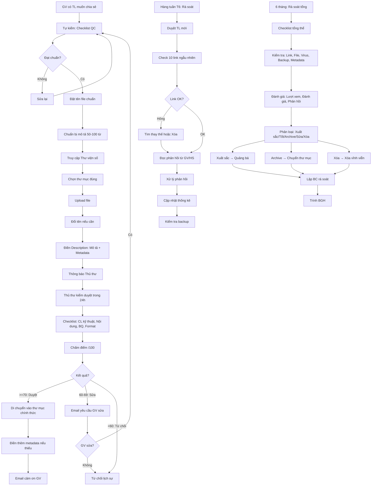

# SOP-06.2: QUẢN LÝ TÀI NGUYÊN SỐ

## 1. THÔNG TIN QUY TRÌNH

| **Thuộc tính** | **Nội dung** |
|---|---|
| Mã SOP | SOP-06.2 |
| Tên quy trình | Quản lý tài nguyên số |
| Quy trình cha | SOP-06: Thư viện số |
| Phiên bản | 1.0 |
| Tần suất | Liên tục (Upload) + Định kỳ (Rà soát) |

## 2. MỤC ĐÍCH

- **Tài nguyên chất lượng**: Chỉ tài liệu tốt mới vào Thư viện
- **Dễ tìm kiếm**: Phân loại khoa học, Tag đầy đủ
- **Cập nhật liên tục**: Thêm mới, Xóa cũ
- **Bảo mật**: Phân quyền hợp lý, Không lộ tài liệu ra ngoài

## 3. PHẠM VI ÁP DỤNG

Tất cả tài nguyên số trong Thư viện (Hiện có + Thêm mới)

## 4. QUY TRÌNH UPLOAD TÀI NGUYÊN MỚI

### 4.1. GV chuẩn bị (Trước khi upload)

**Bước 1: Kiểm tra chất lượng tài liệu**

**Checklist tự kiểm (QT05-CL20):**

```
═══════════════════════════════════════════════════
  CHECKLIST TỰ KIỂM TRƯỚC KHI UPLOAD
═══════════════════════════════════════════════════

Tài liệu: _________________  Loại: __________

1. CHẤT LƯỢNG KỸ THUẬT:
   □ File mở được (Không lỗi, Không virus)
   □ Hình ảnh rõ nét (Nếu PDF: ≥ 300 DPI)
   □ Âm thanh rõ ràng (Nếu Video/Audio)
   □ Kích thước hợp lý (≤ 100MB/file)

2. NỘI DUNG:
   □ Chính xác (Không sai kiến thức)
   □ Phù hợp lứa tuổi
   □ Không lỗi chính tả
   □ Đầy đủ (Không thiếu trang, Không cắt ngang)

3. BẢN QUYỀN:
   □ Hợp pháp (CC, Public Domain, Hoặc Tự làm)
   □ Đã ghi rõ nguồn (Nếu không phải tự làm)
   □ Được phép dùng giáo dục

4. CHUẨN BỊ:
   □ Đã đặt tên đúng format
   □ Đã chuẩn bị mô tả (50-100 từ)
   □ Đã nghĩ ra 5-8 tags

SẴN SÀNG UPLOAD: □ Có  □ Chưa
═══════════════════════════════════════════════════
```

**Bước 2: Đặt tên file chuẩn (Nếu chưa)**

**Format:** `[Cap]_[Mon]_[Chu_de]_[Loai]_[Tac_gia]_[Nam].[Duoi]`

**Ví dụ:**
- `TH_Toan_L3_Phep_nhan_Video_KhanAcademy_2024.mp4`
- `THCS_Ly_L8_Dong_dien_Slide_NguyenVanA_2024.pptx`
- `TH_Viet_L5_Ta_canh_Worksheet_TranThiB_2024.pdf`

**Bước 3: Chuẩn bị mô tả (50-100 từ)**

**Mô tả tốt:**
```
"Video 5 phút giải thích cách nhân 2 số có 2 chữ số.
 Sử dụng ví dụ cụ thể: 23 × 45.
 Chia nhỏ thành 3 bước dễ hiểu.
 Có animation minh họa.
 Phù hợp học sinh lớp 3.
 Nguồn: Khan Academy (CC BY-NC-SA)."
```

**Mô tả kém:**
```
"Video về phép nhân" (Quá chung chung!)
```

### 4.2. Upload lên Thư viện

**Bước 4: GV truy cập Thư viện số**

- Link: `https://drive.google.com/drive/folders/[ID]`
- Hoặc: Mở ổ đĩa G:\ (Nếu đã cài Google Drive Desktop)

**Bước 5: Chọn thư mục đúng**

**Dẫn đường:**
```
1. Mở "02_HỌC LIỆU"
2. Mở "Video"
3. Mở "Toan"
4. Upload vào đây!
```

**Nếu chưa có thư mục → Tạo mới (Hoặc Đề xuất Thủ thư tạo)**

**Bước 6: Upload file**

- Kéo thả file vào thư mục
- Hoặc: Click "New" → "File upload" → Chọn file

**Thời gian upload:** Tùy kích thước
- 10MB: ~30 giây
- 100MB: ~5 phút
- 1GB: ~30-60 phút (Tùy tốc độ mạng)

**Bước 7: Đổi tên file (Nếu cần)**

- Click phải file → "Rename"
- Sửa theo format chuẩn

**Bước 8: Điền mô tả và metadata**

**Trong Google Drive:**
- Click phải file → "View details" (Bên phải màn hình)
- Phần "Description": Điền mô tả 50-100 từ
- Không có trường metadata riêng → Ghi vào Description!

**Format Description đầy đủ:**
```
[MÔ TẢ NGẮN]
Video 5 phút giải thích phép nhân 2 chữ số...

[METADATA]
Môn: Toán
Cấp: Tiểu học - Lớp 3
Loại: Video
Thời lượng: 5:23
Tác giả: Khan Academy
Bản quyền: CC BY-NC-SA
Link gốc: https://khanacademy.org/...
Tags: #Toán #Lớp3 #Phepnhan #Video #KhanAcademy
Người upload: Nguyễn Văn A
Ngày: 15/11/2024
```

**Bước 9: Thông báo Thủ thư (Email/Zalo)**

"Em vừa upload 1 video Toán lớp 3 vào thư mục [Link]. Nhờ chị duyệt giúp em!"

### 4.3. Thủ thư kiểm duyệt

**Bước 10: Thủ thư nhận thông báo, Kiểm tra (Trong 24 giờ)**

**Checklist kiểm duyệt (QT05-CL19):**

```
TÀI LIỆU: _________________  Người upload: _______

1. CHẤT LƯỢNG (30đ):
   □ File mở được (10đ)
   □ Rõ nét/Rõ ràng (10đ)
   □ Không lỗi kỹ thuật (10đ)

2. NỘI DUNG (30đ):
   □ Chính xác (10đ)
   □ Phù hợp lứa tuổi (10đ)
   □ Có giá trị giáo dục (10đ)

3. BẢN QUYỀN (20đ):
   □ Hợp pháp (15đ)
   □ Ghi rõ nguồn (5đ)

4. FORMAT (20đ):
   □ Tên file đúng (10đ)
   □ Mô tả đầy đủ (10đ)

TỔNG: ___/100

QUYẾT ĐỊNH:
□ DUYỆT (≥ 70đ) → Xuất bản
□ SỬA (60-69đ) → Yêu cầu GV sửa
□ TỪ CHỐI (< 60đ) → Không duyệt, Giải thích

Thủ thư ký: ___________  Ngày: _______
```

**Bước 11: Nếu DUYỆT**

- Di chuyển vào thư mục chính thức (Nếu đang ở "Chờ duyệt")
- Điền thêm metadata (Nếu GV thiếu)
- Gửi email cảm ơn GV: "Cảm ơn cô đã đóng góp!"

**Bước 12: Nếu SỬA**

Email GV:
```
"Tài liệu của cô rất hay! Nhưng cần điều chỉnh nhỏ:
 • [Vấn đề 1]
 • [Vấn đề 2]
 Cô sửa lại giúp em nhé! Cảm ơn cô!"
```

**Bước 13: Nếu TỪ CHỐI**

Email lịch sự:
```
"Cảm ơn cô đã đóng góp!
 Tuy nhiên, Tài liệu này chưa phù hợp vì [Lý do].
 Cô có thể gửi tài liệu khác. Em rất mong nhận được!
 Trân trọng!"
```

## 5. PHÂN LOẠI VÀ GẮN TAG

**Bước 14: Thủ thư gắn tag cho tất cả tài liệu**

**Hệ thống tag 4 cấp:**

**Cấp 1: Môn học (Bắt buộc)**
`#Toán`, `#TiếngViệt`, `#TiếngAnh`, `#KhoaHọc`, `#LịchSử`, `#ĐịaLý`, `#GDCD`, `#ThểDục`, `#MỹThuật`, `#NhạcHọc`, `#TinHọc`

**Cấp 2: Cấp học (Bắt buộc)**
`#MN`, `#TH`, `#THCS`, `#Lớp1`, `#Lớp2`, ... `#Lớp9`

**Cấp 3: Loại tài liệu (Bắt buộc)**
`#Video`, `#Slide`, `#Worksheet`, `#Sách`, `#Audio`, `#Game`, `#Giáoán`, `#Đềthi`

**Cấp 4: Chủ đề (Khuyến khích - Dễ tìm hơn!)**
`#Phepnhan`, `#Phepchia`, `#Hinhvuong`, `#Dongtu`, `#Causohoc`, `#Quanghop`, `#Thídọc`, `#Viếtluận`...

**Ví dụ tag đầy đủ:**
```
File: TH_Toan_L3_Phep_nhan_Video_Khan_2024.mp4

Tags: #Toán #TH #Lớp3 #Video #Phepnhan #KhanAcademy #Cơbản
(7 tags)
```

## 6. QUẢN LÝ PHIÊN BẢN

**Nếu có file cũ, File mới (Cùng chủ đề):**

**Ví dụ:** 
- File cũ: `TH_Toan_L3_Phep_nhan_Video_2023.mp4`
- File mới: `TH_Toan_L3_Phep_nhan_Video_2024.mp4` (Chất lượng tốt hơn)

**Hành động:**
1. Upload file mới
2. Đánh giá: File nào tốt hơn?
3. Nếu file mới tốt hơn:
   - Giữ file mới
   - Di chuyển file cũ vào thư mục "Archive_Phien_ban_cu"
   - Ghi chú: "Đã thay thế bằng Ver 2024"
4. Nếu cả 2 đều tốt (Khác góc độ):
   - Giữ cả 2
   - Ghi chú phân biệt

## 7. BẢO MẬT VÀ PHÂN QUYỀN

**Ma trận phân quyền chi tiết:**

| **Thư mục** | **Thủ thư** | **IT** | **Tổ trưởng** | **GV** | **HS** | **PH** |
|---|---|---|---|---|---|---|
| 01_Giáo án | Manager | Manager | Editor (Tổ mình) | Viewer | ❌ | ❌ |
| 02_Học liệu | Manager | Manager | Editor | Contributor | Viewer | Viewer (Một số) |
| 03_Lesson Study | Manager | Manager | Viewer | Viewer | ❌ | ❌ |
| 04_Sách điện tử | Manager | Manager | Viewer | Viewer | Viewer | Viewer |
| 05_Tài liệu GV | Manager | Manager | Viewer | Viewer | ❌ | ❌ |
| 06_Tài liệu PH | Manager | Manager | Viewer | Viewer | ❌ | Viewer |
| 07_Quản trị | Manager | Manager | ❌ | ❌ | ❌ | ❌ |

**Quyền:**
- **Manager:** Toàn quyền (Xem, Upload, Sửa, Xóa, Phân quyền)
- **Editor:** Xem, Upload, Sửa (Không xóa)
- **Contributor:** Xem, Upload (Không sửa/xóa)
- **Viewer:** Chỉ xem (Có thể tải về tùy cài đặt)

## 8. RÀ SOÁT VÀ CẬP NHẬT

### 8.1. Rà soát hàng tuần (Thứ 6 - 1 giờ)

**Bước 15: Thủ thư kiểm tra**

**Checklist rà soát tuần (QT05-CL21):**
```
□ Duyệt tất cả tài liệu mới (Chờ duyệt)
□ Kiểm tra 10 link ngẫu nhiên (Còn hoạt động?)
□ Đọc 5 phản hồi/Khiếu nại từ GV/HS (Nếu có)
□ Cập nhật thống kê: Số TL mới, Lượt xem...
□ Backup (Kiểm tra backup tự động chạy chưa)
```

**Bước 16: Xử lý link hỏng**

- Tìm link thay thế
- Hoặc: Xóa file, Ghi chú "Link hỏng, Đã xóa [Ngày]"

**Bước 17: Xử lý phản hồi**

| **Phản hồi** | **Hành động** |
|---|---|
| "File này hay!" | Đánh dấu ⭐, Quảng bá |
| "Link hỏng" | Sửa trong 24h |
| "Nội dung sai" | Kiểm tra → Sửa/Xóa |
| "File virus" | Xóa NGAY, Quét virus toàn bộ |

### 8.2. Rà soát 6 tháng (Hè + Tết - Kỹ càng)

**Bước 18: Tháng 6 và Tháng 12 - Rà soát toàn bộ Thư viện**

**Checklist rà soát tổng thể (QT05-CL22):**

```
I. KIỂM TRA KỸ THUẬT:

□ Tất cả link còn hoạt động? (Test mẫu 20%)
□ File mở được? (Test mẫu 10%)
□ Không virus? (Quét toàn bộ)
□ Backup OK? (Test khôi phục 5 file)
□ Dung lượng còn bao nhiêu? (Cảnh báo < 20%)

II. KIỂM TRA NỘI DUNG:

□ Tài liệu có lỗi thời không? (VD: Sách cũ, Pháp luật cũ...)
□ Chất lượng còn tốt? (Đọc/Xem lại mẫu 5%)
□ Metadata đầy đủ? (100% file có mô tả + tags?)
□ Phân loại đúng? (File có đúng thư mục?)

III. ĐÁNH GIÁ HIỆU QUẢ:

□ Tài liệu nào được xem nhiều nhất? (TOP 10)
□ Tài liệu nào không ai xem? (Xóa?)
□ Môn/Loại nào thiếu? (Cần thu thập thêm)

IV. PHẢN HỒI NGƯỜI DÙNG:

□ Có khiếu nại gì? (Xử lý)
□ Có đề xuất cải tiến? (Xem xét)
```

**Bước 19: Phân loại tài liệu**

| **Loại** | **Tiêu chí** | **Hành động** |
|---|---|---|
| **⭐ Xuất sắc** | Lượt xem cao, Đánh giá 5 sao, Nhiều GV khen | Giữ lại, Quảng bá mạnh |
| **✅ Tốt** | Lượt xem TB, Không khiếu nại | Giữ lại |
| **📦 Archive** | Lỗi thời nhưng có giá trị lịch sử | Chuyển "Archive" |
| **⚠️ Cần sửa** | Có khiếu nại về chất lượng | Liên hệ tác giả sửa |
| **❌ Xóa** | Kém chất lượng, Không ai xem (6 tháng 0 lượt), Vi phạm BQ | Xóa vĩnh viễn |

**Bước 20: Lập Báo cáo rà soát (QT05-R26)**

| **Chỉ tiêu** | **Trước rà soát** | **Sau rà soát** |
|---|---|---|
| Tổng TL | 500 | 480 |
| TL giữ lại | - | 450 |
| TL archive | - | 20 |
| TL xóa | - | 30 |
| Link hỏng đã sửa | - | 15 |

**Bước 21: Trình BGH**

## 9. QUẢN LÝ DUNG LƯỢNG

**Bước 22: Theo dõi dung lượng (Hàng tháng)**

| **Loại file** | **Dung lượng TB** | **Số lượng** | **Tổng** |
|---|---|---|---|
| Video | 50MB | 100 | 5GB |
| Slide | 5MB | 200 | 1GB |
| PDF | 2MB | 300 | 600MB |
| **TỔNG** | | **600** | **6.6GB** |

**Dung lượng còn lại:** 100GB - 6.6GB = **93.4GB** ✅ (OK!)

**Nếu gần hết (< 20%):**
- Xóa file cũ/Kém
- Hoặc: Mua thêm dung lượng
- Hoặc: Chuyển video lớn lên YouTube (Embed link)

## 10. LƯU ĐỒ QUY TRÌNH



## 11. BIỂU MẪU LIÊN QUAN

| **Mã** | **Tên** |
|---|---|
| QT05-CL20 | Checklist tự kiểm (GV - Trước upload) |
| QT05-CL19 | Checklist kiểm duyệt (Thủ thư) |
| QT05-CL21 | Checklist rà soát tuần |
| QT05-CL22 | Checklist rà soát 6 tháng |
| QT05-R26 | Báo cáo rà soát Thư viện số |
| QT05-S08 | Sổ theo dõi upload (Ai upload gì, Khi nào) |

## 12. TIÊU CHUẨN VÀ CHỈ TIÊU

| **Chỉ tiêu** | **Mục tiêu** |
|---|---|
| Thời gian duyệt TL mới | ≤ 24 giờ |
| % TL có metadata đầy đủ | 100% |
| % Link hoạt động | ≥ 95% |
| Số TL tăng/tháng | ≥ 20 |
| Số TL trong Thư viện | Năm 1: ≥ 500, Năm 2: ≥ 1000 |

## 13. TRÁCH NHIỆM CỤ THỂ

| **Vai trò** | **Trách nhiệm** |
|---|---|
| **Thủ thư** | Kiểm duyệt, Phân loại, Gắn tag, Rà soát, Báo cáo |
| **IT** | Kỹ thuật, Phân quyền, Backup, Bảo mật |
| **GV** | Upload TL, Tuân thủ quy tắc, Phản hồi |
| **Tổ trưởng** | Khuyến khích GV đóng góp, Kiểm tra CL TL tổ mình |

## 14. LƯU Ý QUAN TRỌNG

- ⚠️ **Chất lượng > Số lượng**: 100 TL tốt > 1000 TL kém!
- ✅ **Kiểm duyệt nghiêm**: Tài liệu kém vào Thư viện = Mất uy tín!
- ✅ **Phản hồi nhanh**: GV upload → Duyệt trong 24h (Động viên!)
- ✅ **Backup thường xuyên**: Mất dữ liệu = Tai họa!
- 🔥 **Khuyến khích đóng góp**: Khen thưởng GV upload nhiều!

## 15. PHỤ LỤC

### 15.1. Hệ thống khen thưởng người đóng góp

| **Thành tích** | **Khen thưởng** |
|---|---|
| Upload ≥ 10 TL chất lượng/HK | 500K + Giấy khen |
| Upload ≥ 20 TL/HK | 1 triệu + Giấy khen |
| TL được xem nhiều nhất (TOP 1) | 2 triệu + Cúp "Tác giả xuất sắc" |
| TL được đánh giá 5 sao nhiều nhất | 1 triệu |

**Công bố:** Cuối HK, Trong họp GV

### 15.2. Email thông báo duyệt/Từ chối

**Mẫu Email DUYỆT:**
```
Tiêu đề: Tài liệu của cô đã được duyệt! 🎉

Kính gửi Cô [Tên],

Tài liệu "Video: Phép nhân 2 chữ số" của cô đã được duyệt
và Xuất bản lên Thư viện số!

Link: [Link trực tiếp đến file]

Cảm ơn cô đã đóng góp! Tài liệu của cô sẽ giúp ích
cho nhiều GV và HS.

Tiếp tục chia sẻ nhé! 🙏

Trân trọng,
Thủ thư - [Tên trường]
```

**Mẫu Email TỪ CHỐI:**
```
Tiêu đề: Về tài liệu cô gửi

Kính gửi Cô [Tên],

Cảm ơn cô đã đóng góp tài liệu "[Tên]"!

Tuy nhiên, Sau khi xem xét, Chúng em thấy tài liệu
này chưa phù hợp để đưa vào Thư viện vì:

• [Lý do 1: VD Chất lượng hình ảnh chưa tốt]
• [Lý do 2: VD Nội dung chưa chính xác ở phần...]

Cô có thể sửa lại và Gửi lại. Hoặc gửi tài liệu khác.
Chúng em rất mong nhận được đóng góp từ cô!

Nếu cô cần hỗ trợ, Vui lòng liên hệ: [SĐT/Email]

Trân trọng,
Thủ thư
```

### 15.3. TOP 10 tài liệu được xem nhiều nhất (Ví dụ)

| **STT** | **Tài liệu** | **Loại** | **Lượt xem** | **Tác giả** |
|---|---|---|---|---|
| 1 | Video: Phép nhân 2 chữ số | Video | 450 | Khan Academy |
| 2 | Giáo án: Tả con vật | Giáo án | 380 | Trần Thị B |
| 3 | Slide: Quang hợp | Slide | 320 | Nguyễn Văn C |
| 4 | Worksheet: Thì quá khứ | Worksheet | 280 | Lê Thị D |
| 5 | Game: Cửu chương | Kahoot | 250 | Phạm Văn E |

→ Quảng bá TOP 10 để GV khác biết!

## 16. FAQ

**Q1: GV upload tài liệu vi phạm bản quyền, Trách nhiệm của ai?**  
A: GV upload phải chịu trách nhiệm pháp lý. Nhưng Thủ thư có trách nhiệm kiểm duyệt. → Cả 2 đều cẩn thận!

**Q2: File quá lớn (VD: Video 2GB), Upload lâu?**  
A: Upload lên YouTube, Lưu link vào Thư viện (Thay vì file). Hoặc: Nén file (Giảm chất lượng xuống 720p).

**Q3: Có thể cho HS upload không?**  
A: Được! Nhưng phải kiểm duyệt kỹ hơn (HS có thể upload lung tung).

---

**PHÊ DUYỆT**

| Thủ thư | IT | Trưởng BP HT | Phó HT |
|---|---|---|---|
| [Họ tên] | [Họ tên] | [Họ tên] | [Họ tên] |
