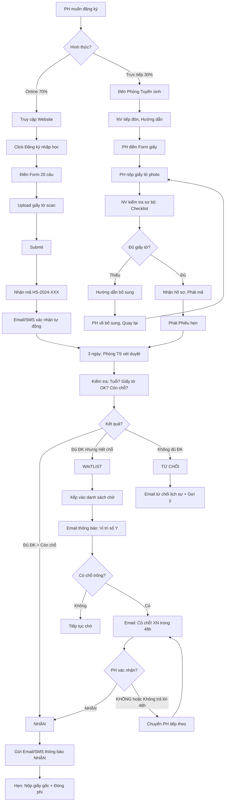

# SOP-01.1: ĐĂNG KÝ NHẬP HỌC

## 1. THÔNG TIN QUY TRÌNH

| **Thuộc tính** | **Nội dung** |
|---|---|
| Mã SOP | SOP-01.1 |
| Tên quy trình | Đăng ký nhập học |
| Quy trình cha | SOP-01: Tiếp nhận học sinh |
| Phiên bản | 1.0 |
| Tần suất | Liên tục (Tập trung tháng 3-7) |

## 2. MỤC ĐÍCH

- **Tiếp nhận đầy đủ**: Không bỏ sót HS muốn nhập học
- **Quy trình rõ ràng**: PH biết cần làm gì
- **Nhanh chóng**: PH không mất nhiều thời gian
- **Thu thập thông tin đầy đủ**: Để phân lớp, Hỗ trợ HS

## 3. PHẠM VI ÁP DỤNG

- HS mới (Chưa từng học trường)
- Tất cả cấp (MN, TH, THCS)

## 4. ĐIỀU KIỆN NHẬP HỌC

### 4.1. Theo cấp học

| **Cấp** | **Độ tuổi** | **Điều kiện khác** |
|---|---|---|
| **Mầm non 3 tuổi** | Đủ 3 tuổi (Tính đến 31/12) | Đã cai tã, Ăn uống tự lập |
| **Mầm non 4-5 tuổi** | Đủ 4-5 tuổi | Không |
| **Lớp 1** | Đủ 6 tuổi (Tính đến 31/5) | Hoàn thành MN 5 tuổi (Khuyến khích) |
| **Lớp 2-9** | Đủ tuổi theo quy định | Có học bạ lớp trước |

### 4.2. Giấy tờ bắt buộc

| **Loại giấy tờ** | **Ghi chú** |
|---|---|
| Giấy khai sinh (Bản sao công chứng) | Bắt buộc |
| Học bạ (Bản gốc - Nếu lớp 2 trở lên) | Bắt buộc |
| Giấy chứng nhận hoàn thành (MN, TH) | Nếu có |
| Phiếu sức khỏe (Trong 6 tháng) | Bắt buộc |
| Ảnh 3×4 (6 ảnh) | Bắt buộc |
| Giấy xác nhận chuyển trường (Nếu chuyển) | Nếu chuyển giữa năm |

## 5. QUY TRÌNH ĐĂNG KÝ

### 5.1. Hình thức đăng ký

| **Hình thức** | **Ưu** | **Nhược** | **% PH dùng** |
|---|---|---|---|
| **Online (Website/App)** | Nhanh, Tiện, 24/7 | Cần Internet, PH biết dùng | 70% |
| **Trực tiếp (Đến trường)** | PH được tư vấn trực tiếp | Mất thời gian đi lại | 30% |

**Khuyến khích:** Online trước → Đến trường nộp giấy tờ

### 5.2. Đăng ký Online (Ưu tiên)

**Bước 1: PH truy cập Website tuyển sinh**

Link: `https://[truong].edu.vn/tuyen-sinh`

**Bước 2: Click "Đăng ký nhập học"**

**Bước 3: Điền Form đăng ký (QT06-F01 - Online)**

**Nội dung form (20 câu hỏi - 10 phút):**

```
═══════════════════════════════════════════════════
      FORM ĐĂNG KÝ NHẬP HỌC ONLINE
═══════════════════════════════════════════════════

A. THÔNG TIN HỌC SINH:

1. Họ và tên: __________________ (Theo giấy khai sinh)
2. Giới tính: ☐ Nam  ☐ Nữ
3. Ngày sinh: __/__/____
4. Nơi sinh: __________________
5. Dân tộc: ________  Quốc tịch: ________
6. Đăng ký vào lớp: ☐ MN 3 tuổi  ☐ MN 4  ☐ MN 5  ☐ Lớp 1  ☐ Lớp 2-9
7. Năm học: 20__-20__

B. THÔNG TIN PHỤ HUYNH:

8. Họ tên Bố: ________________  SĐT: __________
9. Nghề nghiệp Bố: ____________
10. Họ tên Mẹ: ________________  SĐT: __________
11. Nghề nghiệp Mẹ: ____________
12. Email liên hệ (Chính): __________________
13. Địa chỉ: ________________________________

C. HỌC TẬP:

14. Trường cũ (Nếu có): __________________
15. Lớp đang học (Nếu chuyển giữa năm): ____
16. Học lực (TB, Khá, Giỏi): ____
17. Có học thêm gì không? (Anh văn, Toán...): ____

D. SỨC KHỎE:

18. Tình trạng sức khỏe: ☐ Tốt  ☐ TB  ☐ Yếu
19. Dị ứng (Nếu có): __________________
20. Bệnh mãn tính (Nếu có): __________________

E. KHÁC:

21. Đăng ký dịch vụ:
    ☐ Ăn bán trú  ☐ Xe đưa đón  ☐ Học thêm

22. Biết trường qua: ☐ Website  ☐ Facebook  ☐ Bạn bè  ☐ Khác

23. Câu hỏi/Yêu cầu đặc biệt: __________________

═══════════════════════════════════════════════════
```

**Bước 4: Upload giấy tờ (Scan - PDF)**

- Giấy khai sinh
- Học bạ (Nếu có)
- Phiếu sức khỏe

**Bước 5: Submit → Nhận mã hồ sơ**

VD: `HS-2024-001`

**Bước 6: Nhận Email/SMS xác nhận (Tự động)**

```
Cảm ơn Quý PH đã đăng ký!

Mã hồ sơ: HS-2024-001
Họ tên: Nguyễn Văn A
Lớp: Lớp 1

BƯỚC TIẾP THEO:
1. Chúng tôi sẽ xem xét hồ sơ trong 3 ngày làm việc
2. Quý PH sẽ nhận email thông báo kết quả
3. Nếu đạt, Vui lòng đến trường nộp giấy tờ gốc
   và Đóng học phí

Hotline: 1900-xxxx (Nếu cần hỗ trợ)

Trân trọng,
[Tên trường]
```

### 5.3. Đăng ký trực tiếp (30%)

**Bước 7: PH đến Phòng Tuyển sinh**

**Giờ làm việc:** 8h-17h (T2-T6), 8h-12h (T7)

**Bước 8: Nhân viên tiếp đón, Hướng dẫn**

- Mời PH ngồi
- Giải thích quy trình
- Hỏi: "Quý PH đăng ký cho con vào lớp nào?"

**Bước 9: PH điền Form giấy (Giống Online)**

**Bước 10: PH nộp giấy tờ (Bản photo)**

**Bước 11: NV kiểm tra sơ bộ**

Checklist (QT06-CL01):
- [ ] Đủ giấy tờ?
- [ ] Giấy tờ còn hạn?
- [ ] Ảnh đủ 6 tấm?
- [ ] Form điền đầy đủ?

**Bước 12: Nếu đủ → Nhận hồ sơ, Phát mã**

- Đóng dấu "Đã nhận ngày __/__"
- Ghi số: HS-2024-001
- Phát Phiếu hẹn (QT06-F08): "Ngày __ đến nhận kết quả"

**Bước 13: Nếu thiếu → Hướng dẫn bổ sung**

"Quý PH còn thiếu [Giấy X]. Vui lòng bổ sung trước ngày __."

### 5.4. Xét duyệt hồ sơ (Trong 3 ngày)

**Bước 14: Phòng Tuyển sinh xét duyệt**

**Tiêu chí:**
- Đủ điều kiện tuổi?
- Giấy tờ hợp lệ?
- Còn chỗ trong lớp đăng ký không?

**Bước 15: Quyết định**

| **Kết quả** | **Điều kiện** | **Hành động** |
|---|---|---|
| **Nhận** | Đủ điều kiện + Còn chỗ | Email/SMS thông báo nhận + Hẹn nộp giấy gốc |
| **Chờ (Waitlist)** | Đủ điều kiện nhưng Hết chỗ | Xếp hàng chờ, Nhận nếu có HS rút |
| **Từ chối** | Không đủ điều kiện | Email/SMS từ chối lịch sự, Giải thích |

**Bước 16: Gửi Email thông báo**

**Mẫu Email NHẬN:**
```
Chúc mừng! Con em đã được nhận vào [Tên trường]

Kính gửi Quý PH [Tên],

Con em [Tên HS] đã được nhận vào Lớp [X] 
Năm học 20__-20__.

BƯỚC TIẾP THEO:

1. ĐẾN TRƯỜNG NỘP GIẤY TỜ GỐC:
   • Thời gian: Trước __/__/20__
   • Mang theo: Giấy khai sinh, Học bạ, Phiếu SK (BẢN GỐC)

2. ĐÓNG HỌC PHÍ:
   • Phí đầu vào: __ triệu
   • Học phí tháng đầu: __ triệu
   • Hạn: __/__/20__
   • Hình thức: Chuyển khoản hoặc Tiền mặt

3. THAM DỰ ORIENTATION (Hướng dẫn nhập học):
   • Ngày: __/__/20__
   • Giờ: 9h-11h
   • Địa điểm: Hội trường

MÃ HỌC SINH: HS-2024-001 (Vui lòng nhớ mã này!)

Nếu có thắc mắc, Liên hệ: 1900-xxxx

Hẹn gặp Quý PH!

Trân trọng,
[Tên trường]
```

**Mẫu Email TỪ CHỐI (Lịch sự):**
```
Về đơn đăng ký nhập học

Kính gửi Quý PH [Tên],

Cảm ơn Quý PH đã quan tâm đến [Tên trường].

Sau khi xem xét, Chúng tôi rất tiếc thông báo:
Con em chưa đủ điều kiện nhập học vào Lớp [X]
vì [Lý do: VD "Chưa đủ 6 tuổi vào ngày 31/5"].

GỢI Ý:
Quý PH có thể đăng ký lại năm sau (20__-20__).

Hoặc: Đăng ký vào lớp thấp hơn (VD: MN 5 tuổi).

Xin lỗi vì sự bất tiện này. Chúng tôi luôn chào đón gia đình!

Trân trọng,
[Tên trường]
```

## 6. QUẢN LÝ DANH SÁCH CHỜ (Waitlist)

**Bước 17: Nếu hết chỗ → Xếp vào Waitlist**

**Nguyên tắc:**
- Ai đăng ký trước → Ưu tiên trước (First come, First served)
- Trừ khi: Con cán bộ, Con HS cũ... (Ưu tiên đặc biệt - Nếu có chính sách)

**Bước 18: Khi có chỗ trống (HS rút hồ sơ) → Gọi Waitlist**

Email:
```
TIN VUI! Có chỗ cho con em rồi!

Kính gửi Quý PH,

Chúng tôi vui mừng thông báo: Lớp [X] đã có chỗ trống!

Con em hiện ở vị trí số [Y] trong Waitlist.
Quý PH có muốn nhận chỗ này không?

VUI LÒNG XÁC NHẬN TRONG 48 GIỜ:
• Nhận: Reply "NHẬN" hoặc Gọi 1900-xxxx
• Không nhận: Reply "KHÔNG" (Chúng tôi sẽ chuyển cho PH khác)

Hạn trả lời: __/__/20__ 17h

Trân trọng!
```

**Nếu PH không trả lời sau 48h → Chuyển sang PH tiếp theo trong Waitlist**

## 7. LƯU ĐỒ QUY TRÌNH



## 8. BIỂU MẪU LIÊN QUAN

| **Mã** | **Tên** |
|---|---|
| QT06-F01 | Form đăng ký nhập học (Online + Giấy) |
| QT06-F08 | Phiếu hẹn (Nhận kết quả) |
| QT06-CL01 | Checklist kiểm tra giấy tờ |
| QT06-S03 | Sổ theo dõi đăng ký (Excel) |

## 9. TIÊU CHUẨN VÀ CHỈ TIÊU

| **Chỉ tiêu** | **Mục tiêu** |
|---|---|
| Thời gian xét duyệt hồ sơ | ≤ 3 ngày |
| % Đăng ký online | ≥ 70% |
| Thông báo kết quả | 100% |
| Khiếu nại về quy trình | 0 lần |

## 10. TRÁCH NHIỆM

| **Vai trò** | **Trách nhiệm** |
|---|---|
| **Phòng Tuyển sinh** | Tiếp nhận, Xét duyệt, Thông báo |
| **IT** | Quản lý Form online, Hỗ trợ kỹ thuật |
| **Marketing** | Truyền thông tuyển sinh |

## 11. LƯU Ý QUAN TRỌNG

- ⚠️ **Thông báo nhanh**: PH chờ lâu → Mất kiên nhẫn, Chọn trường khác!
- ✅ **Thân thiện**: Tiếp PH như "Khách hàng VIP"
- ✅ **Minh bạch**: Rõ ràng điều kiện, Không "Chỗ quen biết" (Trừ chính sách rõ)
- 🔥 **Ấn tượng đầu tiên quyết định**: PH hài lòng → Đăng ký → Giới thiệu người khác!

## 12. PHỤ LỤC

### 12.1. Chính sách ưu tiên (Nếu có)

| **Đối tượng** | **Mức ưu tiên** | **Điều kiện** |
|---|---|---|
| Con cán bộ trường | Cao | Đang làm việc tại trường |
| Anh/Chị đang học trường | Cao | Có anh/chị học lớp 2 trở lên |
| Con học sinh cũ | TB | HS đã tốt nghiệp trường |
| Giới thiệu từ PH cũ | Thấp | PH cũ giới thiệu |

### 12.2. Thời điểm đăng ký

| **Thời gian** | **Đối tượng** | **Ghi chú** |
|---|---|---|
| **Tháng 1-3** | Đăng ký sớm (Early bird) | Ưu tiên, Giảm phí (Nếu có) |
| **Tháng 4-7** | Đăng ký chính thức | Đông nhất |
| **Tháng 8** | Đăng ký muộn | Nếu còn chỗ |
| **Giữa năm** | Chuyển trường | Xét riêng |

## 13. FAQ

**Q1: Con chưa đủ tuổi 1 tháng, Có nhận không?**  
A: Tùy chính sách. Một số trường linh hoạt ±1 tháng. Cần xin phép BGH.

**Q2: Hồ sơ online và Giấy tờ gốc khác nhau (VD: Tên sai)?**  
A: Theo giấy tờ GỐC. Yêu cầu PH sửa online cho khớp.

**Q3: Đăng ký 2 trường cùng lúc?**  
A: PH được quyền! Nhưng khi nhận 1 trường → Rút hồ sơ trường kia (Nhường chỗ).

---

**PHÊ DUYỆT**

| Phòng TS | Trưởng BP HS | Phó HT |
|---|---|---|
| [Họ tên] | [Họ tên] | [Họ tên] |
