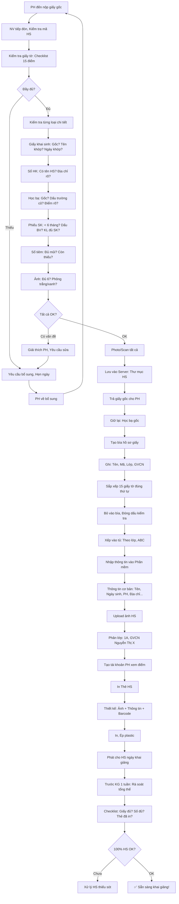

# SOP-01.2: HOÀN THIỆN HỒ SƠ HỌC SINH

## 1. THÔNG TIN QUY TRÌNH

| **Thuộc tính** | **Nội dung** |
|---|---|
| Mã SOP | SOP-01.2 |
| Tên quy trình | Hoàn thiện hồ sơ học sinh |
| Quy trình cha | SOP-01: Tiếp nhận học sinh |
| Phiên bản | 1.0 |
| Tần suất | Khi nhận HS mới |

## 2. MỤC ĐÍCH

- **Hồ sơ đầy đủ**: Đủ giấy tờ theo quy định
- **Hồ sơ chuẩn**: Theo mẫu thống nhất
- **Dễ quản lý**: Tìm kiếm, Truy xuất nhanh
- **Phục vụ lâu dài**: Hồ sơ dùng suốt quá trình học (6-12 năm!)

## 3. PHẠM VI ÁP DỤNG

Tất cả học sinh mới được nhận vào trường

## 4. CẤU TRÚC HỒ SƠ HỌC SINH

### 4.1. 3 phần chính

**Hồ sơ học sinh = 3 phần:**

```
┌─────────────────────────────────────────┐
│ PHẦN A: GIẤY TỜ CÁ NHÂN (Vĩnh viễn)    │
│ • Giấy khai sinh                        │
│ • Sổ hộ khẩu                            │
│ • Học bạ                                │
│ • Giấy chuyển trường (Nếu có)           │
│ → Lưu: Tủ hồ sơ (Giấy) + Scan (Số)     │
└─────────────────────────────────────────┘
           ↓
┌─────────────────────────────────────────┐
│ PHẦN B: HỒ SƠ HỌC TẬP (Cập nhật liên tục)│
│ • Điểm số                               │
│ • Nhận xét GVCN                         │
│ • Khen thưởng                           │
│ • Kỷ luật                               │
│ • Hoạt động ngoại khóa                  │
│ → Lưu: Phần mềm quản lý                 │
└─────────────────────────────────────────┘
           ↓
┌─────────────────────────────────────────┐
│ PHẦN C: HỒ SƠ SỨC KHỎE (Cập nhật định kỳ)│
│ • Phiếu sức khỏe                        │
│ • Sổ tiêm chủng                         │
│ • Bệnh sử                               │
│ • Dị ứng                                │
│ → Lưu: Phòng Y tế                       │
└─────────────────────────────────────────┘
```

### 4.2. Danh sách giấy tờ chi tiết

**PHẦN A: GIẤY TỜ CÁ NHÂN (15 loại)**

| **STT** | **Giấy tờ** | **Bắt buộc?** | **Ghi chú** |
|---|---|---|---|
| 1 | Giấy khai sinh | ✅ Có | Bản gốc hoặc Bản sao công chứng |
| 2 | Sổ hộ khẩu | ✅ Có | Bản sao (Có HS trong sổ) |
| 3 | Học bạ | ✅ Có (Lớp 2+) | Bản gốc (Trường giữ) |
| 4 | Giấy chứng nhận hoàn thành | ✅ Có (Lên cấp) | VD: Hoàn thành TH → Vào lớp 6 |
| 5 | Giấy chuyển trường | Nếu chuyển | Từ trường cũ |
| 6 | Phiếu sức khỏe | ✅ Có | Trong 6 tháng, Có dấu BV/Phòng khám |
| 7 | Sổ tiêm chủng | ✅ Có (MN, Lớp 1) | Đủ mũi theo tuổi |
| 8 | Ảnh 3×4 | ✅ Có | 6 ảnh (Phông nền trắng/Xanh) |
| 9 | Ảnh gia đình | Khuyến khích | 1 ảnh (Để GVCN biết PH) |
| 10 | Đơn xin học | ✅ Có | PH viết tay hoặc Đánh máy |
| 11 | Hợp đồng | ✅ Có | Ký với trường (2 bản) |
| 12 | Cam kết PH | ✅ Có | Cam kết hợp tác với trường |
| 13 | Biên nhận đóng phí | ✅ Có | Phí đầu vào + Tháng 1 |
| 14 | Phiếu đăng ký dịch vụ | Tùy chọn | Ăn, Xe, Học thêm... |
| 15 | Thông tin liên hệ khẩn cấp | ✅ Có | Người liên hệ khi PH không có mặt |

**PHẦN B: HỒ SƠ HỌC TẬP (Tạo sau - Cập nhật suốt quá trình học)**

Tạo trên Phần mềm quản lý:
- Mã HS: HS-2024-001
- Lớp: 1A
- GVCN: Nguyễn Thị X
- Điểm: (Cập nhật liên tục)
- Nhận xét: (Mỗi HK)
- Khen thưởng: (Khi có)
- Kỷ luật: (Khi có)
- Ngoại khóa, CLB: (Khi tham gia)

**PHẦN C: HỒ SƠ SỨC KHỎE**

Lưu riêng tại Phòng Y tế

## 5. QUY TRÌNH HOÀN THIỆN

### 5.1. Nhận giấy tờ gốc (Ngày hẹn - Sau khi HS được nhận)

**Bước 1: PH đến trường mang theo giấy tờ GỐC**

**Bước 2: NV Phòng HS tiếp đón**

- Kiểm tra mã hồ sơ: "Quý PH là PH của em [Tên], Mã HS-2024-001?"
- Mời PH ngồi
- Giải thích: "Hôm nay chúng ta sẽ hoàn thiện hồ sơ cho con"

**Bước 3: Kiểm tra giấy tờ GỐC (QT06-CL02 - Checklist 15 điểm)**

**Quy trình kiểm tra từng loại:**

**A. Giấy khai sinh:**
- [ ] Bản gốc (Màu hồng) hoặc Bản sao công chứng?
- [ ] Họ tên khớp với đơn đăng ký?
- [ ] Ngày sinh khớp?
- [ ] Còn nguyên vẹn (Không rách, Không phai mờ)?

**Nếu chỉ có bản PHOTO thường → Yêu cầu PH về lấy bản công chứng!**

**B. Sổ hộ khẩu:**
- [ ] Có tên HS trong sổ?
- [ ] Địa chỉ rõ ràng?
- [ ] Quan hệ với chủ hộ? (Con, Cháu...)

**C. Học bạ (Lớp 2 trở lên):**
- [ ] Bản gốc? (KHÔNG nhận bản photo!)
- [ ] Có dấu trường cũ?
- [ ] Điểm số rõ ràng?
- [ ] Xếp loại HK cuối: Giỏi/Khá/TB/Yếu?

**Lưu ý:** Học bạ GỐC trường GIỮ LẠI (Cho đến khi HS tốt nghiệp/Chuyển đi)

**D. Phiếu sức khỏe:**
- [ ] Trong 6 tháng?
- [ ] Có dấu BV/Phòng khám?
- [ ] Kết luận: "Đủ sức khỏe học tập"?
- [ ] Ghi rõ dị ứng, Bệnh mãn tính (Nếu có)?

**E. Sổ tiêm chủng (MN, Lớp 1):**
- [ ] Đủ mũi theo lịch?
- [ ] Còn thiếu mũi nào? (Nhắc PH tiêm bù)

**F. Ảnh:**
- [ ] Đủ 6 ảnh 3×4?
- [ ] Phông nền trắng/xanh (Không màu lòe loẹt)?
- [ ] Rõ mặt?

**Bước 4: Nếu đủ → Tiếp tục**

**Bước 5: Nếu thiếu/Sai → Yêu cầu bổ sung**

```
"Quý PH ạ, Hồ sơ con còn thiếu:
 • [Giấy X]
 • [Giấy Y chưa đúng: Lý do...]
 
 Quý PH vui lòng bổ sung trước ngày __/__/20__.
 Nếu không, Con chưa thể vào học được ạ.
 
 Xin lỗi vì bất tiện!"
```

### 5.2. Photo/Scan giấy tờ

**Bước 6: Photo/Scan tất cả giấy tờ**

**Yêu cầu scan:**
- Độ phân giải: 300 DPI
- Định dạng: PDF (Màu)
- Đặt tên: `[MaHS]_[LoaiGiayTo].[Duoi]`

VD: `HS2024001_GiayKhaiSinh.pdf`

**Bước 7: Lưu vào thư mục**

```
\\Server\Ho_so_HS\2024\
  ├─ HS2024001_Nguyen_Van_A\
  │  ├─ HS2024001_GiayKhaiSinh.pdf
  │  ├─ HS2024001_SoHoKhau.pdf
  │  ├─ HS2024001_HocBa.pdf
  │  ├─ HS2024001_PhieuSK.pdf
  │  ├─ HS2024001_Anh.jpg
  │  └─ HS2024001_HopDong.pdf
  └─ HS2024002_... (HS khác)
```

**Bước 8: Trả giấy gốc cho PH (Trừ Học bạ)**

- "Quý PH giữ giấy gốc. Chúng em đã photo/scan lưu trữ."
- "Riêng Học bạ, Trường sẽ giữ. Khi con tốt nghiệp/Chuyển trường, Chúng em sẽ trả lại."

### 5.3. Tạo hồ sơ số

**Bước 9: NV nhập thông tin HS vào Phần mềm quản lý**

**Thông tin nhập:**

```
═══════════════════════════════════════════════════
  THÔNG TIN HỌC SINH - PHẦN MỀM QUẢN LÝ
═══════════════════════════════════════════════════

I. THÔNG TIN CƠ BẢN:
• Mã HS: HS-2024-001 (Tự động)
• Họ và tên: Nguyễn Văn A
• Giới tính: Nam
• Ngày sinh: 15/03/2018
• Nơi sinh: Hà Nội
• Dân tộc: Kinh
• Quốc tịch: Việt Nam

II. HỌC TẬP:
• Năm học: 2024-2025
• Lớp: 1A
• GVCN: Nguyễn Thị X
• Ngày nhập học: 05/09/2024
• Trường cũ: Mầm non Hoa Hồng
• Xếp loại lớp trước: Tốt

III. GIA ĐÌNH:
• Họ tên Bố: Nguyễn Văn B
• SĐT Bố: 0912-xxx-xxx
• Email Bố: nguyenvanb@gmail.com
• Nghề nghiệp: Kỹ sư
• Họ tên Mẹ: Trần Thị C
• SĐT Mẹ: 0913-xxx-xxx
• Email Mẹ: tranthic@gmail.com
• Nghề nghiệp: Giáo viên
• Địa chỉ: 123 Đường X, Quận Y, Hà Nội
• Người liên hệ khẩn cấp: Ông nội (0914-xxx-xxx)

IV. SỨC KHỎE:
• Tình trạng: Tốt
• Chiều cao: 110cm
• Cân nặng: 20kg
• Nhóm máu: A
• Dị ứng: Hải sản
• Bệnh mãn tính: Không
• Ghi chú: Cần tránh đồ ăn có tôm, cua

V. DỊCH VỤ ĐĂNG KÝ:
• Ăn bán trú: Có
• Xe đưa đón: Có (Tuyến 3)
• Học thêm: Tiếng Anh, Toán

═══════════════════════════════════════════════════
```

**Bước 10: Upload ảnh HS vào hệ thống**

Ảnh 3×4 → Scan → Upload → Xuất hiện khi tra cứu (Dễ nhận diện!)

### 5.4. Tạo hồ sơ giấy (Bìa kẹp)

**Bước 11: Chuẩn bị bìa hồ sơ**

**Bìa cứng, Ghi rõ:**
```
┌────────────────────────────────────┐
│   [LOGO TRƯỜNG]                    │
│                                    │
│   HỒ SƠ HỌC SINH                  │
│                                    │
│   Họ tên: NGUYỄN VĂN A            │
│   Mã HS: HS-2024-001               │
│   Lớp: 1A                          │
│   Năm học: 2024-2025               │
│   GVCN: Nguyễn Thị X               │
│                                    │
│   [Dán ảnh 3×4]                    │
└────────────────────────────────────┘
```

**Bước 12: Sắp xếp giấy tờ theo thứ tự (Trong bìa)**

**Thứ tự chuẩn:**

```
1. Phiếu kiểm tra hồ sơ (QT06-CL02) [Ở đầu]
2. Đơn xin học
3. Hợp đồng (Bản trường giữ)
4. Cam kết PH
5. Giấy khai sinh (Bản sao công chứng)
6. Sổ hộ khẩu (Bản sao)
7. Học bạ (Bản gốc - Nếu lớp 2+)
8. Giấy chứng nhận hoàn thành (Nếu có)
9. Giấy chuyển trường (Nếu có)
10. Phiếu sức khỏe
11. Sổ tiêm chủng (Bản sao)
12. Biên nhận đóng phí
13. Phiếu đăng ký dịch vụ
14. Ảnh (5 ảnh còn lại - 1 ảnh đã dán bìa)
15. Thông tin liên hệ khẩn cấp
```

**Bước 13: Bỏ vào bìa, Đóng dấu "Đã kiểm tra ngày __/__"**

**Bước 14: Xếp vào tủ hồ sơ**

**Sắp xếp:**
- Theo lớp: Tủ A = Lớp 1, Tủ B = Lớp 2...
- Trong tủ: Xếp theo ABC (Họ tên)

### 5.5. In Thẻ học sinh

**Bước 15: In thẻ HS (QT06-C01)**

**Thông tin trên thẻ:**

```
┌─────────────────────────────────────┐
│ [LOGO]     IQ SCHOOL                │
│         THẺ HỌC SINH                │
├─────────────────────────────────────┤
│                                     │
│  [Ảnh 3×4]    Họ tên: Nguyễn Văn A │
│               Mã: HS-2024-001      │
│               Lớp: 1A               │
│               Năm: 2024-2025        │
│                                     │
│  GVCN: Nguyễn Thị X                │
│  SĐT PH: 0912-xxx-xxx              │
│                                     │
│  [Barcode/QR mã HS]                │
│                                     │
│  Hotline: 1900-xxxx                │
└─────────────────────────────────────┘

MẶT SAU:
┌─────────────────────────────────────┐
│ QUY ĐỊNH:                           │
│ • Luôn mang thẻ khi đến trường      │
│ • Mất thẻ → Báo ngay, Làm lại 50K  │
│ • Không cho mượn                    │
│                                     │
│ LIÊN HỆ KHẨN CẤP:                  │
│ Ông nội: 0914-xxx-xxx              │
└─────────────────────────────────────┘
```

**Bước 16: Ép plastic (Bảo vệ thẻ)**

**Bước 17: Phát thẻ cho HS (Ngày khai giảng)**

## 6. KIỂM TRA CUỐI CÙNG

**Bước 18: Trước khai giảng 1 tuần - Rà soát lại tất cả hồ sơ HS mới**

**Checklist tổng thể (QT06-CL04):**

```
HỒ SƠ: HS-2024-001 - Nguyễn Văn A - Lớp 1A

PHẦN A: GIẤY TỜ (Tủ hồ sơ)
□ Bìa hồ sơ đã làm, Ghi đầy đủ thông tin
□ 15 loại giấy tờ đã đủ và Sắp xếp đúng thứ tự
□ Đã đóng dấu "Đã kiểm tra"
□ Đã xếp vào tủ đúng vị trí

PHẦN B: HỒ SƠ SỐ (Phần mềm)
□ Đã tạo tài khoản HS trên phần mềm
□ Thông tin cơ bản đã nhập đầy đủ
□ Ảnh đã upload
□ Đã phân lớp (Lớp 1A, GVCN Nguyễn Thị X)
□ PH đã có tài khoản xem điểm (App/Web)

PHẦN C: THỰC THỂ
□ Thẻ HS đã in
□ Sổ liên lạc đã chuẩn bị
□ Đồng phục đã đặt (Nếu có)
□ Túi vải/Balo đã chuẩn bị

TỔNG KẾT:
□ Hồ sơ HOÀN THIỆN 100%
□ HS sẵn sàng nhập học!

NV kiểm tra ký: __________  Ngày: _______
```

**Bước 19: Nếu phát hiện thiếu sót → Liên hệ PH NGAY**

## 7. LƯU ĐỒ QUY TRÌNH



## 8. BIỂU MẪU LIÊN QUAN

| **Mã** | **Tên** |
|---|---|
| QT06-CL02 | Checklist kiểm tra giấy tờ gốc (15 điểm) |
| QT06-CL04 | Checklist rà soát tổng thể hồ sơ |
| QT06-C01 | Mẫu thẻ học sinh |
| QT06-F09 | Biên nhận giữ Học bạ (PH ký) |

## 9. TIÊU CHUẨN VÀ CHỈ TIÊU

| **Chỉ tiêu** | **Mục tiêu** |
|---|---|
| Hồ sơ HS đầy đủ trước khai giảng | 100% |
| Thời gian hoàn thiện hồ sơ (Từ nhận giấy đến xong) | ≤ 2 giờ |
| Scan/Photo rõ nét | 100% |
| Thẻ HS phát đúng hạn | 100% |

## 10. TRÁCH NHIỆM CỤ THỂ

| **Vai trò** | **Trách nhiệm** |
|---|---|
| **NV Phòng HS** | Tiếp PH, Kiểm tra giấy tờ, Photo/Scan, Nhập phần mềm |
| **IT** | Tạo tài khoản, Hỗ trợ phần mềm, In thẻ |
| **PH** | Cung cấp đầy đủ giấy tờ gốc |

## 11. LƯU Ý QUAN TRỌNG

- ⚠️ **Giấy tờ GỐC quan trọng**: Không nhận photo thường! Phải công chứng hoặc Đối chiếu gốc!
- ✅ **Kiểm tra kỹ**: Sai thông tin → Ảnh hưởng suốt quá trình học!
- ✅ **Bảo mật**: Hồ sơ HS = Thông tin cá nhân → Phân quyền chặt!
- 🔥 **Học bạ gốc PHẢI giữ**: Trả khi HS tốt nghiệp/Chuyển đi!

## 12. PHỤ LỤC

### 12.1. Mẫu Biên nhận giữ Học bạ (QT06-F09)

```
═══════════════════════════════════════════════════
         BIÊN NHẬN GIỮ HỌC BẠ
═══════════════════════════════════════════════════

Hôm nay, Ngày __/__/20__

Trường [Tên trường] nhận giữ Học bạ của em:
• Họ tên: Nguyễn Văn A
• Ngày sinh: 15/03/2018
• Học bạ số: __________
• Cấp: Tiểu học
• Do trường: Mầm non Hoa Hồng cấp

CAM KẾT:
• Trường sẽ bảo quản Học bạ cẩn thận
• Trường sẽ trả Học bạ khi:
  - Em tốt nghiệp
  - Em chuyển trường
  - PH yêu cầu (Có lý do chính đáng)

Phụ huynh ký nhận: __________
Trường (NV) ký: __________

═══════════════════════════════════════════════════
```

### 12.2. Xử lý hồ sơ đặc biệt

**A. HS chuyển từ nước ngoài:**

Cần thêm:
- Học bạ được dịch công chứng (Nếu tiếng nước ngoài)
- Giấy xác nhận học lực tương đương (Từ Sở GD)

**B. HS không có giấy khai sinh:**

- Trường hợp: Con nuôi, Mồ côi...
- Giải pháp: Nhận Giấy xác nhận từ UBND hoặc Viện bảo trợ

**C. HS khuyết tật:**

Cần thêm:
- Giấy xác nhận khuyết tật (Nếu có)
- Báo cáo đánh giá từ chuyên gia (Tâm lý, Phục hồi...)
- → Để lập IEP (Kế hoạch giáo dục cá nhân)

## 13. FAQ

**Q1: PH quên không mang đủ giấy tờ?**  
A: Liệt kê thiếu gì, Hẹn ngày khác (Trong tuần). Nhắc nhở nhẹ nhàng, Không mắng!

**Q2: Giấy khai sinh và Đơn đăng ký khác tên (VD: Thiếu chữ)?**  
A: Theo giấy khai sinh (Chính thức). Yêu cầu PH sửa đơn. Hoặc PH đi sửa giấy khai sinh (Nếu thật sự sai).

**Q3: Học bạ cũ bị rách, Mờ?**  
A: Nhận tạm, Yêu cầu trường cũ cấp lại. Hoặc Xin Sở GD cấp học bạ mới (Nếu trường cũ đã đóng cửa).

**Q4: Có cần giữ bản gốc tất cả giấy tờ không?**  
A: KHÔNG! Chỉ giữ Học bạ gốc. Các giấy khác: Photo/Scan là đủ, Trả gốc cho PH.

---

**PHÊ DUYỆT**

| NV Phòng HS | Trưởng BP HS | Phó HT |
|---|---|---|
| [Họ tên] | [Họ tên] | [Họ tên] |
