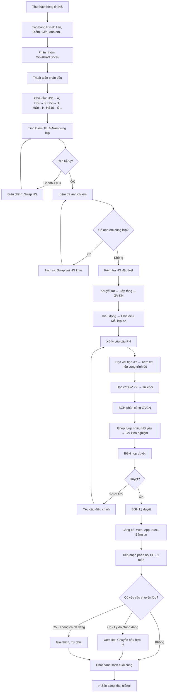

# SOP-01.3: PHÂN LỚP VÀ SẮP XẾP

## 1. THÔNG TIN QUY TRÌNH

| **Thuộc tính** | **Nội dung** |
|---|---|
| Mã SOP | SOP-01.3 |
| Tên quy trình | Phân lớp và sắp xếp |
| Quy trình cha | SOP-01: Tiếp nhận học sinh |
| Phiên bản | 1.0 |
| Tần suất | Đầu năm học (Tháng 7-8) |

## 2. MỤC ĐÍCH

- **Cân bằng lớp**: Mỗi lớp đều có HS giỏi-khá-TB-yếu
- **Công bằng**: Không có lớp "quá mạnh" hay "quá yếu"
- **Phát triển tối ưu**: HS học trong môi trường phù hợp
- **Dễ quản lý**: GV có lớp cân bằng, Dễ tổ chức

## 3. PHẠM VI ÁP DỤNG

- Tất cả HS mới (Lớp 1, Chuyển trường)
- Phân lớp lại (Nếu cần - Sau HK1)

## 4. NGUYÊN TẮC PHÂN LỚP

### 4.1. 8 Nguyên tắc vàng

```
╔═══════════════════════════════════════════════════════════════╗
║           8 NGUYÊN TẮC VÀNG PHÂN LỚP                          ║
╠═══════════════════════════════════════════════════════════════╣
║ 1. CÂN BẰNG HỌC LỰC                                           ║
║    • Mỗi lớp có: 20-25% Giỏi, 30-35% Khá,                     ║
║      30-35% TB, 10-15% Yếu                                    ║
║    • Điểm TB các lớp chênh lệch < 0.3                         ║
╠═══════════════════════════════════════════════════════════════╣
║ 2. CÂN BẰNG GIỚI TÍNH                                         ║
║    • Nam/Nữ mỗi lớp: 45-55%                                   ║
║    • Tránh lớp quá lệch (VD: 70% Nam)                         ║
╠═══════════════════════════════════════════════════════════════╣
║ 3. TÁCH ANH/CHỊ EM                                            ║
║    • Không cho anh/chị em cùng lớp                            ║
║    • Lý do: Tránh so sánh, Tạo độc lập                        ║
║    • Trừ khi: PH yêu cầu (Lý do đặc biệt)                     ║
╠═══════════════════════════════════════════════════════════════╣
║ 4. PHÙ HỢP TÍNH CÁCH                                          ║
║    • HS hiếu động → Lớp GV nghiêm, Kinh nghiệm                ║
║    • HS nhút nhát → Lớp GV nhiệt tình, Vui vẻ                 ║
║    • HS đặc biệt (Khuyết tật) → Lớp GV được đào tạo           ║
╠═══════════════════════════════════════════════════════════════╣
║ 5. TÁCH NHÓM HIẾU ĐỘNG                                        ║
║    • HS "Khó bảo" → Chia đều các lớp                          ║
║    • Tránh: 3-4 HS hiếu động cùng lớp → Khó kiểm soát!        ║
╠═══════════════════════════════════════════════════════════════╣
║ 6. CÂN BẰNG HS ĐẶC BIỆT                                       ║
║    • HS khuyết tật, Chậm phát triển: ≤2 HS/lớp                ║
║    • HS giỏi đặc biệt (IQ cao): Phân đều                      ║
╠═══════════════════════════════════════════════════════════════╣
║ 7. XEM XÉT YÊU CẦU PH                                         ║
║    • PH muốn con học với bạn X: Xem xét nếu hợp lý            ║
║    • PH muốn GV Y: KHÔNG chấp nhận (Không công bằng)          ║
╠═══════════════════════════════════════════════════════════════╣
║ 8. SỈ SỐ BẰNG NHAU                                            ║
║    • Mỗi lớp: 20-25 HS (TH), 28-32 HS (THCS)                  ║
║    • Chênh lệch giữa các lớp: ≤2 HS                           ║
╚═══════════════════════════════════════════════════════════════╝
```

### 4.2. Phân nhóm học lực

| **Nhóm** | **Tiêu chí** | **% Mỗi lớp** | **Đặc điểm** |
|---|---|---|---|
| **Giỏi** | Điểm TB ≥ 8.5 | 20-25% | Tự học tốt, Ham học, Giúp bạn |
| **Khá** | Điểm 7.0-8.4 | 30-35% | Chăm chỉ, Cần hướng dẫn |
| **Trung bình** | Điểm 5.5-6.9 | 30-35% | Cần theo dõi, Hỗ trợ thường xuyên |
| **Yếu** | Điểm < 5.5 | 10-15% | Cần hỗ trợ đặc biệt, Phụ đạo |

**Lưu ý:**  
- Lớp 1: Chưa có điểm → Dựa vào Test đầu vào, Nhận xét MN
- Lớp 2-5: Dựa vào Học bạ lớp trước
- Lớp 6: Dựa vào Học bạ lớp 5 + Test đầu vào (Nếu có)

## 5. QUY TRÌNH PHÂN LỚP

### 5.1. Giai đoạn chuẩn bị (Tháng 7)

**Bước 1: Thu thập thông tin HS**

**Nguồn thông tin:**

| **Thông tin** | **Nguồn** | **Người thu thập** |
|---|---|---|
| Học lực | Học bạ, Test đầu vào | NV Phòng HS |
| Hạnh kiểm | Nhận xét GV cũ, Hồ sơ | NV Phòng HS |
| Tính cách | Phỏng vấn PH, Form đăng ký | GVCN (Nếu có), Tâm lý |
| Sở thích | Form đăng ký | NV Phòng HS |
| Sức khỏe | Phiếu sức khỏe | Phòng Y tế |
| Đặc điểm | Anh/chị em, Khuyết tật... | NV Phòng HS |

**Bước 2: Tạo bảng tổng hợp (Excel)**

**Cột trong bảng:**

```excel
STT | Mã HS | Họ tên | Giới | Ngày sinh | Điểm TB | Xếp loại | Hạnh kiểm | 
Tính cách | Anh/Chị em | Đặc biệt | Ghi chú | Lớp phân |
```

**VD:**

```
1 | HS2024001 | Nguyễn Văn A | Nam | 15/03/2018 | 8.5 | Giỏi | Tốt | 
Vui vẻ | Có (HS2024025) | - | - | [Chưa phân] |

2 | HS2024002 | Trần Thị B | Nữ | 20/04/2018 | 7.2 | Khá | Khá | 
Nhút | - | - | - | [Chưa phân] |
```

**Bước 3: Phân nhóm HS theo học lực**

**Tạo 4 sheet:**
- Sheet "Giỏi": 50 HS (Giả sử tổng 200 HS, 25%)
- Sheet "Khá": 70 HS (35%)
- Sheet "TB": 60 HS (30%)
- Sheet "Yếu": 20 HS (10%)

### 5.2. Phân lớp bằng thuật toán (Tháng 7)

**Bước 4: Dùng thuật toán phân đều (Excel Macro hoặc Phần mềm)**

**Mục tiêu tối ưu:**

```python
# Giả sử: 200 HS → 8 lớp (25 HS/lớp)

MỤC TIÊU:
1. Điểm TB các lớp:
   Max(Điểm_TB_các_lớp) - Min(Điểm_TB_các_lớp) < 0.3
   
   VD: Lớp 1A: 7.2, Lớp 1B: 7.1, Lớp 1C: 7.3
       → Chênh lệch: 7.3 - 7.1 = 0.2 < 0.3 ✅

2. Nam/Nữ mỗi lớp:
   45% ≤ %_Nam ≤ 55%
   
   VD: Lớp 1A: 25 HS → 12 Nam (48%), 13 Nữ (52%) ✅

3. Sĩ số:
   Max(Sĩ_số) - Min(Sĩ_số) ≤ 2
   
   VD: 1A:25, 1B:24, 1C:25, 1D:26 → 26-24=2 ✅
```

**Thuật toán đơn giản (Excel):**

```
BƯỚC 1: Sắp xếp HS theo Điểm TB giảm dần
BƯỚC 2: Chia "Rắn" (Snake draft)
  • HS 1 → Lớp A
  • HS 2 → Lớp B
  • ...
  • HS 8 → Lớp H
  • HS 9 → Lớp H (Quay lại!)
  • HS 10 → Lớp G
  • ...
  • HS 16 → Lớp A
  • HS 17 → Lớp A (Vòng mới)
  • ...
  
→ Đảm bảo mỗi lớp có đều HS giỏi/yếu!
```

**Bước 5: Kiểm tra kết quả**

Chạy báo cáo:

| **Lớp** | **Sĩ số** | **Nam** | **Nữ** | **%Nam** | **Điểm TB** | **Giỏi** | **Khá** | **TB** | **Yếu** |
|---|---|---|---|---|---|---|---|---|---|
| 1A | 25 | 12 | 13 | 48% | 7.15 | 6 | 9 | 8 | 2 |
| 1B | 25 | 13 | 12 | 52% | 7.18 | 6 | 8 | 9 | 2 |
| 1C | 25 | 11 | 14 | 44% | 7.22 | 7 | 8 | 8 | 2 |
| ... | ... | ... | ... | ... | ... | ... | ... | ... | ... |

**Kiểm tra:**
- ✅ Sĩ số: Đều 25
- ✅ %Nam: 44-52% (OK!)
- ✅ Điểm TB: 7.15-7.22 (Chênh 0.07 < 0.3) ✅
- ✅ Phân bố Giỏi/Khá/TB/Yếu: Tương đối đều ✅

### 5.3. Điều chỉnh thủ công (Các trường hợp đặc biệt)

**Bước 6: Kiểm tra và điều chỉnh**

**A. Anh/Chị em:**

```
VD: HS A (Lớp 1A) và HS B (Lớp 1A) là anh em
→ Chuyển HS B sang lớp 1B
→ Swap với HS C (Lớp 1B, Cùng trình độ với B)
```

**B. HS hiếu động:**

```
Phát hiện: Lớp 1A có 4 HS "Khó bảo" (Theo nhận xét GV cũ)
→ Chuyển 2 HS sang lớp khác
→ Mỗi lớp chỉ ≤2 HS hiếu động
```

**C. HS đặc biệt:**

| **Đặc điểm** | **Xử lý** |
|---|---|
| Khuyết tật vận động | → Lớp tầng 1 (Dễ di chuyển) |
| Khuyết tật thị giác | → Lớp có bàn đầu (Gần bảng) + GV kinh nghiệm |
| Chậm phát triển | → Lớp GV kiên nhẫn, Sĩ số ít hơn (20-22 HS) |
| IQ cao (Gifted) | → Lớp có nhiều hoạt động phát triển tư duy |

**D. Yêu cầu PH:**

```
CASE 1: PH muốn con học với bạn X
→ Kiểm tra:
  • 2 con cùng trình độ? → OK, Sắp xếp cùng lớp
  • Chênh lệch lớn (1 Giỏi, 1 Yếu)? → Từ chối, Giải thích:
    "Chúng em hiểu mong muốn của PH, Nhưng 2 con khác 
     trình độ, Học cùng lớp sẽ không tốt cho cả 2 ạ."

CASE 2: PH muốn con học với GV Y
→ TỪ CHỐI! Không công bằng với PH khác!
```

**Bước 7: Lưu kết quả điều chỉnh**

### 5.4. Phân công GVCN và duyệt (Cuối tháng 7)

**Bước 8: BGH phân công GVCN cho từng lớp**

**Tiêu chí phân công:**

| **Lớp** | **GV phù hợp** |
|---|---|
| Lớp có nhiều HS yếu | GV kinh nghiệm, Kiên nhẫn |
| Lớp có nhiều HS hiếu động | GV nghiêm, Quản lý tốt |
| Lớp có HS đặc biệt | GV được đào tạo Giáo dục hòa nhập |
| Lớp có nhiều HS giỏi | GV năng động, Nhiều phương pháp mới |

**Bước 9: Ghép GVCN với danh sách lớp**

```
Lớp 1A → GVCN: Nguyễn Thị X
Lớp 1B → GVCN: Trần Văn Y
...
```

**Bước 10: BGH họp duyệt danh sách**

**Nội dung họp:**
- Xem danh sách từng lớp
- Kiểm tra các chỉ số: Sĩ số, Điểm TB, %Nam...
- Thảo luận trường hợp đặc biệt
- Phê duyệt hoặc Yêu cầu điều chỉnh

**Bước 11: BGH ký duyệt (QT06-F10)**

### 5.5. Công bố (Đầu tháng 8)

**Bước 12: Công bố danh sách lớp (1 tuần trước khai giảng)**

**Hình thức công bố:**

```
1. Website trường:
   → Tra cứu theo Mã HS hoặc Tên
   
2. App trường (Nếu có):
   → Thông báo Push đến PH
   
3. Bảng tin tại trường:
   → In danh sách, Dán tại Cổng/Sảnh
   
4. Gửi SMS/Email:
   "Kính gửi PH em Nguyễn Văn A,
    Em được xếp vào lớp 1A, GVCN: Nguyễn Thị X.
    Khai giảng: 05/09, 8h00.
    Trân trọng!"
```

**Bước 13: Tiếp nhận phản hồi PH (1 tuần)**

**PH có thể phản hồi:**
- Muốn chuyển lớp (Vì lý do X)
- Thắc mắc về GVCN
- ...

**Xử lý:**
- Lắng nghe
- Giải thích nguyên tắc
- Chỉ chuyển nếu: Lý do CHÍNH ĐÁNG (VD: Anh em cùng lớp - Sai sót)

**Bước 14: Hoàn thiện cuối cùng → Chốt danh sách**

## 6. LƯU ĐỒ QUY TRÌNH



## 7. BIỂU MẪU LIÊN QUAN

| **Mã** | **Tên** |
|---|---|
| QT06-F10 | Biên bản phân lớp (BGH ký) |
| QT06-F11 | Danh sách lớp (Mẫu công bố) |
| QT06-F12 | Đơn xin chuyển lớp (PH) |

## 8. TIÊU CHUẨN VÀ CHỈ TIÊU

| **Chỉ tiêu** | **Mục tiêu** |
|---|---|
| Điểm TB các lớp chênh lệch | < 0.3 điểm |
| %Nam mỗi lớp | 45-55% |
| Sĩ số chênh lệch | ≤ 2 HS |
| Anh/Chị em cùng lớp | 0% (Trừ yêu cầu PH) |
| HS đặc biệt được sắp xếp phù hợp | 100% |
| PH hài lòng với phân lớp | ≥ 90% |

## 9. TRÁCH NHIỆM CỤ THỂ

| **Vai trò** | **Trách nhiệm** |
|---|---|
| **NV Phòng HS** | Thu thập thông tin, Tạo bảng Excel, Chạy thuật toán |
| **Tâm lý học đường** | Tư vấn trường hợp HS đặc biệt |
| **BGH** | Phân công GVCN, Duyệt danh sách, Quyết định cuối cùng |
| **IT** | Cập nhật danh sách lên phần mềm, Gửi thông báo |

## 10. LƯU Ý QUAN TRỌNG

- ⚠️ **Bảo mật**: Danh sách chưa duyệt → KHÔNG công bố! (Tránh PH can thiệp)
- ✅ **Công bằng**: Không ưu ái con GV, Con BGH, Con PH quen!
- 🔥 **Giải thích rõ**: Khi PH thắc mắc → Giải thích nguyên tắc, Không nói "Do BGH quyết định"!
- ✅ **Linh hoạt**: Nếu phát hiện sai sót (VD: Anh em cùng lớp) → Sửa NGAY, Không cứng nhắc!

## 11. PHỤ LỤC

### 11.1. Công thức tính độ cân bằng

**A. Độ lệch chuẩn điểm TB:**

```
σ = √[Σ(Điểm_TB_lớp_i - Điểm_TB_toàn_khối)² / Số_lớp]

Mục tiêu: σ < 0.15

VD: 
Lớp 1A: 7.15, 1B: 7.18, 1C: 7.22, 1D: 7.10
TB toàn khối: 7.16

σ = √[(7.15-7.16)² + (7.18-7.16)² + (7.22-7.16)² + (7.10-7.16)²] / 4
  = √[0.0001 + 0.0004 + 0.0036 + 0.0036] / 4
  = √0.0077 / 4 = 0.044

→ 0.044 < 0.15 ✅ Rất tốt!
```

**B. Chỉ số cân bằng giới tính:**

```
Chỉ số = |%Nam - 50%|

Mục tiêu: ≤ 5%

VD: Lớp 1A có 12 Nam/25 HS = 48%
→ |48% - 50%| = 2% ≤ 5% ✅
```

### 11.2. Xử lý tình huống đặc biệt

**A. HS chuyển đến giữa năm:**

```
Tháng 11: Có 2 HS mới chuyển đến lớp 3

BƯỚC 1: Test đầu vào → Xếp loại
BƯỚC 2: Xem lớp nào đang thiếu HS loại này
BƯỚC 3: Xếp vào lớp thiếu

VD: HS mới xếp "Giỏi"
    → Lớp 3A: 5 Giỏi, 3B: 6 Giỏi, 3C: 4 Giỏi
    → Xếp vào 3C (Đang ít Giỏi nhất)
```

**B. PH đòi đổi lớp (Không lý do chính đáng):**

```
PH: "Con tôi phải học lớp A! Tôi nghe nói cô X dạy giỏi!"

TRƯỜNG:
"Chúng em hiểu mong muốn của PH. Tuy nhiên:
 • Tất cả GVCN đều là GV giỏi, Được tuyển chọn kỹ.
 • Việc phân lớp theo nguyên tắc chung, Công bằng cho tất cả HS.
 • Nếu cho PH đổi lớp tùy ý → Không công bằng với các PH khác.
 
 Xin PH thông cảm và Tin tưởng trường ạ!"

→ Nếu PH vẫn đòi → Báo BGH, BGH gặp PH!
```

**C. Lớp có quá nhiều HS đặc biệt (Do ngẫu nhiên):**

```
VD: Sau khi phân, Lớp 1B có:
 • 2 HS khuyết tật
 • 3 HS chậm phát triển
 • 4 HS hiếu động
 
→ Quá tải! GV không xoay sở nổi!

XỬ LÝ:
• Chuyển 1 HS khuyết tật sang lớp A
• Chuyển 2 HS hiếu động sang lớp C, D
• Bổ sung GV hỗ trợ cho lớp B
```

## 12. FAQ

**Q1: PH hỏi "Sao con tôi không được học lớp A?"**  
A: "Em [Tên con] được xếp lớp [X] theo nguyên tắc cân bằng, Phù hợp với năng lực của em. Lớp [X] có GVCN [Tên], Là GV giỏi, PH yên tâm ạ!"

**Q2: PH yêu cầu chuyển lớp để con học với bạn thân?**  
A: Xem xét. Nếu 2 con:
- Cùng trình độ → OK
- Khác trình độ → Giải thích không nên, Vì sẽ tạo áp lực cho con yếu hơn

**Q3: GV phàn nàn lớp mình yếu hơn lớp khác?**  
A: Kiểm tra lại số liệu. Nếu đúng là yếu hơn → Điều chỉnh. Nếu cân bằng → Giải thích và Khuyến khích GV!

**Q4: Có nên tạo "Lớp chọn" (Toàn HS giỏi) không?**  
A: **KHÔNG**! Lý do:
- Không công bằng
- HS yếu/TB không có HS giỏi làm gương
- Tạo áp lực cho HS trong lớp chọn

---

**PHÊ DUYỆT**

| NV Phòng HS | Tâm lý học đường | BGH |
|---|---|---|
| [Họ tên] | [Họ tên] | [Họ tên] |
